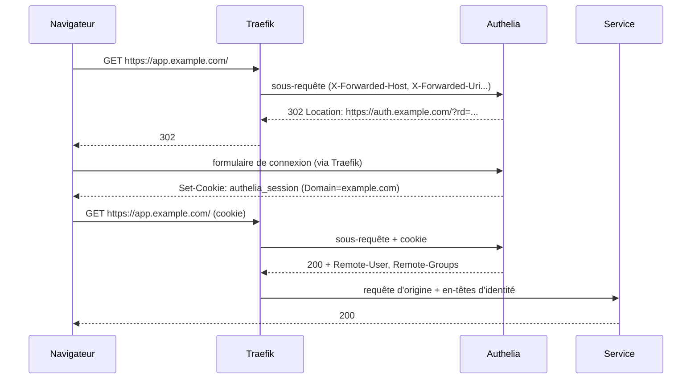

Chaque application web auto-hébergée embarque sa propre gestion des comptes, ou n'en embarque aucune : un tableau de bord d'administration, une interface de supervision ou un outil interne se retrouvent exposés avec autant de formulaires de connexion, de politiques de mot de passe et de bases d'utilisateurs que de services. Le forward-auth déplace cette décision au niveau du reverse proxy : avant de transmettre une requête à l'application, le proxy interroge un service d'authentification central et ne laisse passer que les requêtes que ce dernier valide. Authelia implémente ce rôle, et Traefik le consomme via son middleware `forwardAuth`.

<!--truncate-->

## Principe du forward-auth

Le reverse proxy (voir [proxy et reverse proxy](./2024-12-20-proxy-vs-reverse-proxy.md)) reçoit la requête du client. Au lieu de la router directement vers le backend, il émet une **sous-requête** vers l'endpoint de vérification d'Authelia, en décrivant la requête d'origine dans des en-têtes `X-Forwarded-*` : `X-Forwarded-Method`, `X-Forwarded-Proto`, `X-Forwarded-Host`, `X-Forwarded-Uri`, `X-Forwarded-For`. Authelia évalue ses règles d'accès contre ces valeurs et contre le cookie de session éventuellement présent, puis répond par un code HTTP que le proxy interprète :

| Réponse d'Authelia | Situation | Comportement de Traefik |
|---|---|---|
| `200 OK` | Utilisateur authentifié et autorisé, ou ressource en `bypass` | Transmet la requête d'origine au backend |
| `302 Found` | Non authentifié, requête `GET` ou `OPTIONS` | Renvoie la redirection au client, vers le portail |
| `303 See Other` | Non authentifié, autre méthode | Idem |
| `401 Unauthorized` | Non authentifié, requête détectée comme `XMLHttpRequest` | Renvoie le `401` au client |
| `403 Forbidden` | Authentifié mais refusé par la politique | Renvoie le `403` au client |

La règle côté Traefik est binaire : toute réponse `2XX` laisse passer la requête, toute autre réponse est retournée telle quelle au client.



Le cookie de session est posé sur le **domaine parent** (`example.com`) : le navigateur le renvoie donc à tous les sous-domaines. Une connexion unique sur le portail ouvre l'accès à `app.example.com`, `grafana.example.com` et à tout autre service protégé du même domaine, sans nouvelle saisie : c'est le mécanisme de SSO du forward-auth.

## Mise en place avec Traefik

### Le middleware forwardAuth

Le middleware se déclare une seule fois dans la configuration dynamique de Traefik (provider `file`, voir l'article [Traefik](./2025-06-09-traefik.md)), puis se référence depuis n'importe quel router.

```yaml
# /etc/traefik/dynamic/middlewares.yml
http:
  middlewares:
    authelia:
      forwardAuth:
        address: "http://authelia:9091/api/authz/forward-auth"
        trustForwardHeader: true
        authResponseHeaders:
          - Remote-User
          - Remote-Groups
          - Remote-Email
          - Remote-Name
```

- `address` pointe vers l'endpoint `/api/authz/forward-auth`, joint par le nom du service sur le réseau Docker partagé. Les configurations antérieures à Authelia 4.38 utilisent l'endpoint legacy `/api/verify?rd=https://auth.example.com` ; l'URL du portail se déclare désormais côté Authelia (`session.cookies[].authelia_url`) et non plus dans le paramètre `rd`.
- `authResponseHeaders` liste les en-têtes de la réponse d'Authelia recopiés dans la requête transmise au backend : une application qui lit `Remote-User` et `Remote-Groups` connaît l'identité sans gérer d'authentification.
- `trustForwardHeader: true` fait transmettre à Authelia les en-têtes `X-Forwarded-*` reçus. La documentation d'Authelia l'associe à une restriction `forwardedHeaders.trustedIPs` sur l'entrypoint, limitée aux adresses des proxys amont réels : sans cette restriction, un client peut forger `X-Forwarded-Uri` et faire évaluer par Authelia un chemin différent de celui réellement servi, par exemple un chemin en `bypass`. Les versions récentes de la documentation Traefik marquent cette option comme dépréciée au profit de la gestion au niveau de l'entrypoint.

Depuis les labels Docker d'un service, le middleware se référence avec le suffixe de son provider : `traefik.http.routers.app.middlewares=authelia@file`.

### Le portail n'est pas protégé

Le router d'Authelia ne porte pas le middleware : le portail doit rester joignable sans session, sous peine de boucle de redirection.

```yaml
labels:
  - traefik.http.routers.authelia.rule=Host(`auth.example.com`)
  # pas de label middlewares : point d'entrée public
  - traefik.http.services.authelia.loadbalancer.server.port=9091
```

### Session et cookies

```yaml
session:
  name: authelia_session
  cookies:
    - domain: example.com
      authelia_url: https://auth.example.com
      default_redirection_url: https://www.example.com
```

`authelia_url` doit être le domaine du cookie ou l'un de ses sous-domaines, en HTTPS. `domain` ne peut pas être un suffixe public (`co.uk`, `github.io`). Les durées par défaut (`inactivity: 5m`, `expiration: 1h`, `remember_me: 1M`) se surchargent par cookie. `session.secret` se fournit de préférence par fichier (`AUTHELIA_SESSION_SECRET_FILE`).

### Backend utilisateurs en fichier

Pour un nombre réduit de comptes, un fichier YAML remplace un annuaire LDAP :

```yaml
# configuration.yml
authentication_backend:
  file:
    path: /config/users_database.yml
    watch: true   # recharge le fichier à chaud à chaque modification

# users_database.yml
users:
  alice:
    displayname: "Alice"
    password: "$argon2id$v=19$m=65536,t=3,p=4$..."
    email: alice@example.com
    groups:
      - admins
```

Le mot de passe n'est stocké que sous forme de hash. L'algorithme par défaut est argon2 en variante `argon2id` ; le hash se génère avec le binaire d'Authelia :

```bash
# Génère un hash argon2id (le mot de passe est demandé de façon interactive)
docker run --rm -it authelia/authelia:4.39 authelia crypto hash generate argon2
```

## Contrôle d'accès

### Évaluation ordonnée

Les règles `access_control.rules` sont évaluées **dans l'ordre** : la première règle dont tous les critères correspondent s'applique, les suivantes sont ignorées. `default_policy` s'applique quand aucune règle ne correspond ; la valeur `deny` en fait un filet de sécurité, et impose que chaque accès soit explicitement prévu.

```yaml
access_control:
  default_policy: deny
  rules:
    # 1. exception ciblée : API consommée par des clients non-navigateur
    - domain: "photos.example.com"
      resources:
        - "^/api([/?].*)?$"
      policy: bypass
    # 2. accès web au même service, ouvert à deux groupes
    - domain: "photos.example.com"
      policy: one_factor
      subject:
        - "group:admins"
        - "group:users"
    # 3. règle de repli : tout le reste du domaine, administrateurs seulement
    - domain: "*.example.com"
      policy: two_factor
      subject:
        - "group:admins"
```

Placée en tête, la règle 3 capterait `photos.example.com` et rendrait les deux premières inopérantes : toute règle spécifique s'insère avant la règle de repli. Le motif `*.example.com` couvre les sous-domaines mais pas `example.com` lui-même.

### Policies et subjects

| Policy | Effet |
|---|---|
| `deny` | Refuse l'accès (`403` si authentifié) |
| `bypass` | Aucune authentification : Authelia répond `200` sans session |
| `one_factor` | Identifiant et mot de passe |
| `two_factor` | Second facteur requis (TOTP, WebAuthn, Duo) |

`subject` restreint une règle à des utilisateurs (`user:alice`), des groupes (`group:admins`) ou des clients OAuth2 (`oauth2:client:<id>`). Le premier niveau de la liste exprime un **OU**, un second niveau imbriqué un **ET**. Une règle `bypass` ne peut pas porter de `subject` : sans authentification, aucune identité n'est connue.

### Resources : chemin et query string

`resources` filtre par expressions régulières. Point déterminant pour la suite : ces regex s'évaluent contre le **chemin et la query string** de la requête, et le chemin est sensible à la casse. `^/api$` ne correspond donc pas à `/api?limit=10`.

## Clients non-navigateur

Le forward-auth suppose un navigateur, capable de suivre un `302` vers une page HTML et de conserver un cookie. Une application mobile, un client API à jeton ou une connexion WebSocket reçoivent une redirection là où ils attendent du JSON, et échouent : `401`, erreur de parsing, déconnexion immédiate. Symptôme typique : le service fonctionne dans un navigateur déjà connecté au portail et échoue systématiquement depuis l'application mobile, qui n'a jamais de session Authelia.

Effet moins visible : l'endpoint `forward-auth` essaie par défaut, avant le cookie, une stratégie `HeaderAuthorization` qui valide `Authorization: Basic` contre les comptes d'Authelia. Des identifiants applicatifs envoyés dans cet en-tête sont donc interprétés par Authelia avant d'atteindre l'application.

Deux solutions existent, toutes deux valables uniquement si **l'application possède sa propre authentification** sur ces chemins (jeton de session, clé d'API, mot de passe applicatif).

### Bypass ciblé sur les chemins d'API

```yaml
- domain: "vault.example.com"
  resources:
    - "^/api([/?].*)?$"
    - "^/identity([/?].*)?$"
    - "^/notifications([/?].*)?$"   # WebSocket de synchronisation
  policy: bypass
```

L'interface web reste protégée par la règle suivante ; seuls les chemins consommés par les clients natifs échappent au forward-auth. Ces chemins doivent être inventoriés précisément : certaines applications mobiles interrogent au démarrage un endpoint de découverte (par exemple `/.well-known/<app>`) avant toute authentification, et un bypass limité à `/api` laisse ce premier appel recevoir une page HTML.

### Sous-domaine dédié sans middleware

```yaml
labels:
  # domaine navigateur, protégé
  - traefik.http.routers.docs.rule=Host(`docs.example.com`)
  - traefik.http.routers.docs.middlewares=authelia@file
  # domaine des clients natifs, sans forward-auth
  - traefik.http.routers.docs-app.rule=Host(`app.docs.example.com`)
  - traefik.http.routers.docs-app.service=docs
```

Le domaine navigateur reste alors protégé sans exception et aucune regex n'est à maintenir, au prix d'un service entièrement exposé sans Authelia sur le second domaine, et d'un client à reconfigurer.

## Pièges des regex de bypass

Les regex de `resources` échouent rarement de façon bruyante : une requête non couverte tombe dans la règle suivante, reçoit une redirection, et le client remonte une erreur d'authentification qui oriente le diagnostic vers les identifiants.

**Frontière de segment.** `^/api([/?].*)?$` exige un `/`, un `?` ou la fin de chaîne après `/api`. Elle couvre `/api`, `/api/v1/x` et `/api?x=1`, mais pas `/apis/dashboard.grafana.app/...`, préfixe d'une API plus récente de Grafana distincte de `/api/`. La forme `^/api(s)?([/?].*)?$` couvre les deux. À l'inverse, `^/api` sans frontière couvre aussi `/api-docs` ou `/apikey`.

**Listes dans un segment.** Un client de notifications publish/subscribe de type ntfy regroupe ses abonnements en une seule connexion : `/alerts,backup,deploy/json`. `^/[-\w]+/(json|sse|ws)(\?.*)?$` n'accepte qu'un nom par segment ; la forme `^/[-\w]+(,[-\w]+)*/(json|sse|ws)(\?.*)?$` accepte la liste.

**Query string sur un chemin nu.** Une publication `PUT /alerts?priority=3` ne correspond pas à `^/[-\w]+$`. Le suffixe `(\?.*)?` l'autorise, alors que `([/?].*)?` ouvrirait aussi tout sous-chemin (`/static/app.css`). Même ainsi, `^/[-\w]+(\?.*)?$` couvre toute page de premier niveau (`/login`, `/settings`) : la forme de l'URL ne distingue pas toujours l'API de l'interface.

Ces cas se vérifient avant déploiement sur une liste d'URL réelles, relevées dans les logs du client, et d'URL pièges :

```bash
# RE2 (Go) et re (Python) se comportent de la même façon sur ces motifs
python3 -c 'import re; [print(p, bool(re.search(r"^/api(s)?([/?].*)?$", p))) for p in ["/api?x=1", "/apis/d", "/api-docs"]]'
```

**Bypass larges.** Un bypass sur `^/api([/?].*)?$` couvre toutes les routes que l'application ajoutera sous ce préfixe lors de ses futures versions, sans revue. Le bypass délègue la sécurité de ces chemins à l'application : il se justifie par un besoin client identifié, et se réexamine lors des montées de version majeures.

## Contournements côté infrastructure

### Ports publiés sur l'hôte

Le forward-auth n'existe que sur le chemin qui traverse Traefik. Un conteneur qui publie aussi un port (`ports: - "8080:8080"`) reste joignable sur `http://hôte:8080` sans vérification, et un client peut y forger `Remote-User` : une application qui s'y fie accorde l'identité demandée. Un service placé derrière le forward-auth ne publie donc aucun port, ou le restreint par pare-feu.

### Services hors du réseau Docker

Un service qui tourne directement sur l'hôte, ou en `network_mode: host`, ne peut pas être découvert par labels. Le provider `file` le route explicitement, avec le même middleware :

```yaml
http:
  routers:
    hass:
      rule: "Host(`hass.example.com`)"
      entryPoints: [websecure]
      tls:
        certResolver: letsencrypt
      service: hass
      middlewares: [authelia]   # même fichier : pas de suffixe @file
  services:
    hass:
      loadBalancer:
        servers:
          - url: "http://host.docker.internal:8123"
```

Sous Linux, `host.docker.internal` n'est pas résolu par défaut dans un conteneur : Traefik doit déclarer `extra_hosts: ["host.docker.internal:host-gateway"]` dans son service Compose.

### Ordre des middlewares

Traefik applique les middlewares dans l'ordre de la liste. Un middleware à effet de bord, comme le réveil d'un conteneur arrêté par [Sablier](../06-orchestration/2026-08-30-traefik-sablier.md), se place **après** le forward-auth (`middlewares=authelia@file,wake-up`) ; placé avant, il s'exécuterait pour des requêtes anonymes. Les filtres sans effet de bord, comme une limitation de débit, peuvent précéder l'authentification et protéger Authelia lui-même.

## Limites

Le forward-auth contrôle l'**accès** au service, pas l'**identité** dans le service : une application qui ne lit pas `Remote-User` affiche son propre formulaire après le portail et ignore les groupes Authelia. Pour les applications qui implémentent OpenID Connect, Authelia peut agir comme fournisseur d'identité et leur transmettre identité et groupes : c'est l'objet de l'article [Authelia : fournisseur OpenID Connect](./2026-08-09-authelia-oidc.md). Le chiffrement des échanges entre client et proxy, prérequis à tout cookie de session, est détaillé dans l'article [SSL/TLS](./2026-02-21-ssl-tls.md).

## Application / Projet lié

### [HomeLab](/docs/projects/personnel/homelab)
**Utilisation** : Authelia en forward-auth devant l'ensemble des services web exposés par Traefik, avec une règle de repli `default_policy: deny`, des bypass ciblés sur les chemins d'API des applications mobiles et des sous-domaines dédiés pour les clients natifs.

Le forward-auth centralise la décision d'accès au niveau du proxy avec une configuration réduite : un middleware, un cookie de domaine et une liste ordonnée de règles. Sa fiabilité dépend surtout de la précision des exceptions, c'est-à-dire des regex `resources` et des chemins réseau qui ne traversent pas le proxy.
