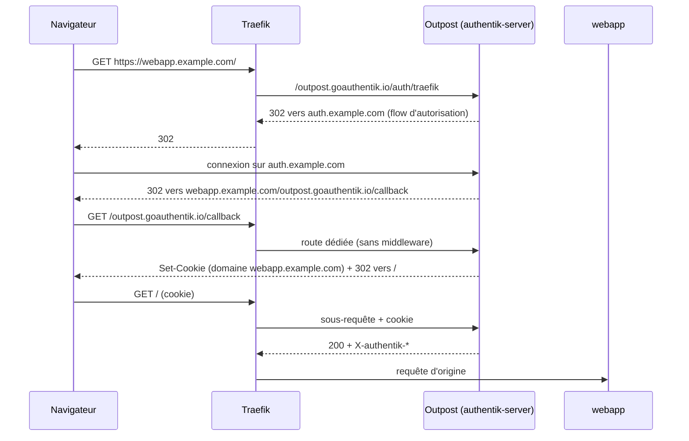

Sur un cluster Kubernetes, chaque application exposée par l'ingress controller pose la même question d'authentification : certaines n'en ont aucune (tableau de bord, interface de supervision, outil interne), d'autres gèrent leurs propres comptes et ignorent ceux des autres. Un fournisseur d'identité unique, interrogé par Traefik en forward-auth pour les premières et en OpenID Connect par les secondes, ramène ces décisions à un seul annuaire. Authentik remplit ce rôle avec deux capacités absentes d'une configuration minimale : l'inscription en libre-service et les connexions par fournisseur externe (GitHub, LDAP, SAML). Son déploiement sur Kubernetes ajoute des pièges propres à Traefik en mode CRD : priorité des routers, références entre namespaces et route de callback de l'outpost.

<!--truncate-->

## Authentik face à Authelia

Les mécanismes de base, sous-requête de forward-auth et flux authorization code d'OIDC, sont décrits dans les articles [Authelia : forward-auth](./2026-08-02-authelia-forward-auth.md) et [Authelia : fournisseur OpenID Connect](./2026-08-09-authelia-oidc.md). Ils sont identiques avec Authentik ; seuls le modèle de configuration et l'exploitation changent.

| Critère | Authelia | Authentik |
|---|---|---|
| Configuration | Fichier YAML unique | Base de données, interface d'administration, blueprints YAML |
| Comptes | Fichier ou LDAP, créés par l'administrateur | Base interne, inscription en libre-service, sources externes |
| Connexion par GitHub, Google... | Non | Sources OAuth, SAML, LDAP |
| Logique de connexion | Fixe (un ou deux facteurs) | Flows composés d'étapes, policies en Python |
| Dépendances | Binaire unique, stockage SQLite ou SQL | Serveur, worker, PostgreSQL |
| Empreinte | Quelques dizaines de Mo de RAM | Plusieurs centaines de Mo |

Authelia convient à un nombre réduit de comptes gérés par l'administrateur. Authentik se justifie quand les utilisateurs doivent créer leur compte eux-mêmes, ou se connecter avec une identité existante, sans intervention manuelle. Depuis la version 2025.10, Authentik ne dépend plus de Redis : cache, tâches, sessions de l'outpost embarqué et WebSockets reposent sur PostgreSQL, seul composant à état.

## Modèle de configuration

Authentik sépare **comment** un utilisateur s'authentifie de **ce à quoi** il accède.

- Un **flow** est une séquence d'étapes (**stages**) : identification, mot de passe, formulaire (prompt), écriture du compte, envoi d'un email, ouverture de session. Chaque flow a une désignation : authentification, inscription, autorisation, invalidation (déconnexion), récupération.
- Une **policy** est une condition, le plus souvent une expression Python, liée à un flow, à un stage ou à une application. Elle renvoie `True` ou `False` et peut afficher un message à l'utilisateur.
- Un **provider** décrit le protocole par lequel une application consomme l'identité : proxy (forward-auth), OAuth2/OpenID Connect, SAML, LDAP.
- Une **application** associe un provider, un lien de lancement et des droits d'accès (policy bindings vers des groupes ou des utilisateurs).
- Un **outpost** est le composant qui exécute les providers non HTTP natifs : le provider proxy en fait partie. Le serveur d'Authentik embarque un outpost, joint sur les mêmes ports que le serveur, qui traite toutes les requêtes dont le chemin commence par `/outpost.goauthentik.io`.
- Une **source** est un annuaire ou un fournisseur externe d'où proviennent des utilisateurs : GitHub, LDAP, un autre fournisseur OIDC.

```text
Source GitHub ──► Flow d'authentification ──► Utilisateur + groupes
                                                     │
Application "webapp" ── policy binding (groupe) ─────┘
      │
      └── Provider proxy (forward_single) ──► Outpost embarqué ◄── Middleware Traefik
```

Une application sans aucun policy binding est accessible à tout utilisateur connecté : la restriction par groupe se déclare explicitement, application par application.

## Déploiement avec Helm

### Chart et secrets

Le chart officiel (`authentik/authentik`, dépôt `https://charts.goauthentik.io`) déploie le serveur, le worker et un PostgreSQL embarqué. Les valeurs sensibles ne figurent pas dans le `values.yaml` versionné : la CI les injecte au moment du `helm upgrade`.

```yaml
# values.yaml (extrait)
authentik:
  error_reporting:
    enabled: false
  email:
    host: smtp.example.com
    port: 587
    use_tls: true
    from: "Auth <no-reply@example.com>"

postgresql:
  enabled: true
  primary:
    persistence:
      enabled: true
      size: 8Gi

blueprints:
  configMaps:
    - authentik-blueprints-apps
  secrets:
    - authentik-blueprints-oidc   # contient des client secrets
```

```bash
# Version du chart figée : sans --version, chaque déploiement prend la dernière publiée
helm upgrade --install authentik authentik/authentik -n auth --version 2026.8.3 -f values.yaml \
  --set-literal "authentik.secret_key=$AUTHENTIK_SECRET_KEY" \
  --set-literal "authentik.postgresql.password=$PG_PASSWORD" \
  --set-literal "postgresql.auth.password=$PG_PASSWORD" \
  --set-literal "authentik.bootstrap_password=$BOOTSTRAP_PASSWORD"
```

`--set-literal` transmet la valeur telle quelle, là où `--set` découpe sur les virgules et interprète barres obliques inverses et accolades : un secret aléatoire qui en contient serait altéré. `authentik.secret_key` signe les cookies et sert à dériver des identifiants internes : la documentation interdit de la changer après la première installation. `bootstrap_password` (et `bootstrap_email`) ne sont lus qu'au tout premier démarrage, pour créer le compte `akadmin`.

### Blueprints : la configuration métier en YAML

Tout ce qui se crée dans l'interface (flows, providers, applications, groupes) peut aussi se déclarer dans des **blueprints**, fichiers YAML qu'Authentik applique de façon idempotente. Le chart monte les ConfigMaps et Secrets listés dans `blueprints` sous `/blueprints/mounted/`, et le worker applique chaque fichier à chaque modification de son contenu. Quelques balises YAML propres aux blueprints relient les objets entre eux : `!KeyOf` référence un objet du même fichier, `!Find` cherche un objet existant, `!Env` lit une variable d'environnement.

Le chart passe `additionalObjects` dans la fonction `tpl` de Helm : un blueprint placé dans une ConfigMap de cette liste peut donc être **généré** à partir d'une liste d'applications. Protéger une application revient alors à ajouter une ligne dans les values :

```yaml
apps:
  authHost: auth.example.com
  forwardAuth:
    - {slug: dashboard, host: dashboard.example.com, groups: [users]}
    - {slug: prometheus, host: prometheus.example.com}   # admins seulement

additionalObjects:
  - apiVersion: v1
    kind: ConfigMap
    metadata:
      name: authentik-blueprints-apps
    data:
      forward-auth.yaml: |
        version: 1
        metadata:
          name: Forward-auth Traefik
        entries:
          {{- range .Values.apps.forwardAuth }}
          - model: authentik_providers_proxy.proxyprovider
            id: provider-{{ .slug }}
            identifiers:
              name: {{ .slug }}
            attrs:
              mode: forward_single
              external_host: https://{{ .host }}
              authorization_flow: !Find [authentik_flows.flow, [slug, default-provider-authorization-implicit-consent]]
              invalidation_flow: !Find [authentik_flows.flow, [slug, default-provider-invalidation-flow]]
          - model: authentik_core.application
            id: app-{{ .slug }}
            identifiers:
              slug: {{ .slug }}
            attrs:
              name: {{ .slug }}
              provider: !KeyOf provider-{{ .slug }}
          {{- $slug := .slug }}
          {{- range $i, $g := prepend (.groups | default list) "admins" }}
          - model: authentik_policies.policybinding
            identifiers:
              group: !Find [authentik_core.group, [name, {{ $g }}]]
              target: !KeyOf app-{{ $slug }}
            attrs:
              order: {{ $i }}
          {{- end }}
          {{- end }}
          # Rattache tous les providers proxy à l'outpost embarqué
          - model: authentik_outposts.outpost
            identifiers:
              managed: goauthentik.io/outposts/embedded
            attrs:
              providers:
                {{- range .Values.apps.forwardAuth }}
                - !KeyOf provider-{{ .slug }}
                {{- end }}
              config:
                authentik_host: https://{{ .Values.apps.authHost }}
```

Le groupe `admins` est ajouté en tête de chaque application ; les bindings de groupe s'évaluent en OU (mode `any` par défaut). Supprimer une ligne de la liste ne supprime pas les objets déjà créés : le blueprint doit les déclarer avec `state: absent` le temps d'un déploiement.

Les hôtes étant des values, un `values-minikube.yaml` qui les remplace par `auth.localhost` permet de tester flows et blueprints sur un cluster local, derrière un `kubectl port-forward` vers Traefik.

## Forward-auth avec Traefik

### Le middleware

L'outpost embarqué expose l'endpoint de vérification propre à Traefik. Le middleware le joint par le nom DNS interne du Service, sans repasser par l'ingress :

```yaml
apiVersion: traefik.io/v1alpha1
kind: Middleware
metadata:
  name: authentik
  namespace: auth
spec:
  forwardAuth:
    address: http://authentik-server.auth.svc.cluster.local/outpost.goauthentik.io/auth/traefik
    trustForwardHeader: true
    authResponseHeaders:
      - X-authentik-username
      - X-authentik-groups     # groupes séparés par des barres verticales : admins|users
      - X-authentik-email
      - X-authentik-name
      - X-authentik-uid
      - X-authentik-jwt
```

Comme pour Authelia, `authResponseHeaders` liste les en-têtes recopiés de la réponse d'Authentik vers la requête transmise au backend. Une application qui lit `X-authentik-username` obtient l'identité ; un middleware copié sans cette liste laisse passer les requêtes authentifiées, mais sans aucune identité.

### L'IngressRoute de l'application

En mode `forward_single`, la session est portée par un cookie posé sur le domaine de l'application elle-même. Après la connexion sur le portail, Authentik redirige vers `https://webapp.example.com/outpost.goauthentik.io/callback?...` : ce chemin doit être routé vers Authentik, et non vers l'application. Chaque IngressRoute protégée contient donc deux routes :

```yaml
apiVersion: traefik.io/v1alpha1
kind: IngressRoute
metadata:
  name: webapp
  namespace: auth
spec:
  entryPoints: [websecure]
  routes:
    # Callback de l'outpost, servi par Authentik sur le domaine de l'application.
    # Pas de priorité explicite : règle plus longue que la route principale.
    - match: Host(`webapp.example.com`) && PathPrefix(`/outpost.goauthentik.io/`)
      kind: Rule
      services:
        - name: authentik-server
          port: 80
    - match: Host(`webapp.example.com`)
      kind: Rule
      middlewares:
        - name: authentik
      services:
        - name: webapp
          port: 80
```



Sans la route de callback, la requête vers `/outpost.goauthentik.io/callback` traverse le middleware, ne porte pas encore de cookie, est renvoyée vers le portail, qui renvoie au callback : le navigateur tourne en boucle de redirection.

Le mode `forward_domain` pose au contraire un seul cookie sur le domaine parent (`example.com`), comme Authelia : un seul provider couvre tous les sous-domaines, mais toutes les applications partagent les mêmes droits d'accès. Le mode `forward_single`, un provider par application, est celui qui permet une restriction par groupe différente pour chaque service.

## OIDC pour les applications qui le supportent

Une application qui gère ses propres comptes (Grafana, Portainer, un ERP) affiche son formulaire de connexion même derrière le forward-auth. Elle se raccorde plutôt en OIDC natif, sans middleware, avec un provider OAuth2 :

```yaml
- model: authentik_providers_oauth2.oauth2provider
  id: provider-grafana
  identifiers:
    name: grafana
  attrs:
    client_type: confidential
    client_id: grafana
    client_secret: "..."            # injecté par la CI, d'où un Secret plutôt qu'une ConfigMap
    grant_types: [authorization_code, refresh_token]
    redirect_uris:
      - matching_mode: strict
        url: https://grafana.example.com/login/generic_oauth
    authorization_flow: !Find [authentik_flows.flow, [slug, default-provider-authorization-implicit-consent]]
    invalidation_flow: !Find [authentik_flows.flow, [slug, default-provider-invalidation-flow]]
    signing_key: !Find [authentik_crypto.certificatekeypair, [name, authentik Self-signed Certificate]]
    property_mappings:
      - !Find [authentik_providers_oauth2.scopemapping, [managed, goauthentik.io/providers/oauth2/scope-openid]]
      - !Find [authentik_providers_oauth2.scopemapping, [managed, goauthentik.io/providers/oauth2/scope-email]]
      - !Find [authentik_providers_oauth2.scopemapping, [managed, goauthentik.io/providers/oauth2/scope-profile]]
```

Deux différences avec Authelia :

- **Un issuer par application.** Les endpoints d'autorisation, de token et userinfo sont communs (`/application/o/authorize/`, `/application/o/token/`, `/application/o/userinfo/`), mais l'issuer et le document de découverte sont propres à chaque application : `https://auth.example.com/application/o/grafana/.well-known/openid-configuration`. La déconnexion passe par `/application/o/<slug>/end-session/`.
- **Les groupes dans le scope `profile`.** Le mapping `profile` fournit nom, identifiant et appartenance aux groupes : le claim `groups` ne demande pas de scope supplémentaire.

**`grant_types` explicite.** L'interface coche par défaut tous les types de grant d'un nouveau provider. Un provider créé par blueprint sans ce champ reçoit en revanche, sur Authentik 2026.8, une liste vide : l'endpoint d'autorisation répond `error=invalid_request` et le journal du serveur mentionne `Invalid grant_type for provider`. Un blueprint écrit pour une version antérieure produit ce symptôme sans aucune modification.

### Mapping des groupes en rôles Grafana

```ini
[server]
root_url = https://grafana.example.com

[auth]
oauth_auto_login = true
signout_redirect_url = https://auth.example.com/application/o/grafana/end-session/
# Rattache la connexion OIDC à un compte local existant de même email
oauth_allow_insecure_email_lookup = true

[auth.generic_oauth]
enabled = true
client_id = grafana
scopes = openid profile email
# Navigateur : URL publique. Token et userinfo : appel serveur, par le Service interne
auth_url = https://auth.example.com/application/o/authorize/
token_url = http://authentik-server.auth.svc.cluster.local/application/o/token/
api_url = http://authentik-server.auth.svc.cluster.local/application/o/userinfo/
role_attribute_path = contains(groups, 'admins') && 'GrafanaAdmin' || contains(groups, 'users') && 'Editor' || contains(groups, 'kiosk') && 'Viewer'
role_attribute_strict = true
allow_assign_grafana_admin = true
```

- `auth_url` est ouverte par le navigateur et doit être publique ; `token_url` et `api_url` sont appelées par le pod Grafana, qui passe directement par le Service sans ressortir par l'ingress.
- `role_attribute_strict = true` refuse la connexion d'un utilisateur dont aucun groupe ne correspond, au lieu de lui attribuer le rôle par défaut. Un groupe `kiosk`, réservé à un compte d'affichage non nominatif, obtient la lecture seule.
- `GrafanaAdmin` (super-administrateur du serveur) n'est attribuable que si `allow_assign_grafana_admin` est activé.
- `oauth_allow_insecure_email_lookup` rattache la première connexion OIDC à un compte local existant, au lieu de créer un doublon. L'option n'est sûre que si le fournisseur vérifie les adresses : un utilisateur libre de choisir son email prendrait possession du compte local correspondant.

Certaines applications exigent HTTPS pour ces appels serveur. Le Service d'Authentik expose aussi un port HTTPS, mais avec un certificat auto-signé : l'application doit alors désactiver la vérification TLS, parfois pour tous ses appels sortants, compromis à documenter.

## Comptes, sources et groupes

### Inscription limitée à un domaine

Le flow d'inscription enchaîne un formulaire (prompt stage), l'écriture du compte (user write stage), un email de vérification et l'ouverture de session. Une policy de validation, attachée au prompt stage, refuse les adresses hors domaine :

```python
# Expression policy, liée au prompt stage du flow d'inscription
email = request.context.get("prompt_data", {}).get("email", "")
if not email.lower().endswith("@example.com"):
    ak_message("Inscription réservée aux adresses @example.com.")
    return False
return True
```

Le user write stage crée le compte inactif (`create_users_as_inactive: true`) ; le stage email l'active au clic sur le lien (`activate_user_on_success: true`). Une adresse non vérifiée ne donne donc jamais accès aux applications.

### Source GitHub et synchronisation des équipes

Une source OAuth de type GitHub ajoute un bouton de connexion. Deux expressions Python complètent la configuration, toutes deux appelant l'API GitHub avec le jeton OAuth de l'utilisateur (scope `read:org` requis) :

- une **policy** liée aux flows d'authentification et d'inscription de la source, qui refuse tout compte GitHub non membre de l'organisation (`GET /user/orgs`) ;
- un **property mapping** de source, évalué à chaque connexion, qui traduit les équipes en groupes Authentik :

```python
resp = requests.get(
    "https://api.github.com/user/teams",
    headers={"Authorization": f"Bearer {token['access_token']}",
             "Accept": "application/vnd.github+json"},
    params={"per_page": 100},
    timeout=10,
)
resp.raise_for_status()
teams = {(t["organization"]["login"].lower(), t["slug"]) for t in resp.json()}
groups = ["users" if ("example-org", "team-all") in teams else "staff"]
if ("example-org", "infra-admin") in teams:
    groups.append("admins")
return {"groups": groups}
```

Avec `group_matching_mode: name_link`, les noms renvoyés sont liés aux groupes Authentik existants de même nom, ceux qui portent les policy bindings des applications. La gestion des droits se fait alors dans GitHub : un changement d'équipe se répercute à la connexion suivante.

### Comptes internes et durée de session

Le user write stage crée par défaut des comptes de type `external`. Authentik réserve ce type aux utilisateurs d'une application unique, sans accès au tableau de bord des applications (`/if/user/`) : un utilisateur inscrit ou arrivé par GitHub se connecte, puis se voit refuser le portail. `user_type: internal` doit être positionné sur **chaque** user write stage concerné, celui du flow d'inscription par email comme celui du flow d'inscription par source (`default-source-enrollment-write`).

La même remarque vaut pour la durée de session. Le user login stage vaut par défaut `seconds=0` : la session se termine à la fermeture du navigateur, et chaque application forward-auth redemande une connexion le lendemain. `session_duration: weeks=4` se pose sur tous les user login stages utilisés (connexion par mot de passe, par source, après inscription), sous peine d'une durée différente selon le chemin de connexion.

## Pièges

### Priorité des routers Traefik

Traefik trie les routers par priorité décroissante, et la priorité par défaut d'un router **est la longueur de sa règle**, en caractères. ``Host(`webapp.example.com`)`` vaut ainsi 26, et la route de callback, qui ajoute un `PathPrefix`, atteint 68 : sans aucune priorité explicite, le callback passe naturellement avant la route protégée.

L'exemple Kubernetes de la documentation d'Authentik fixe pourtant `priority: 15` sur la route de l'outpost, en supposant une priorité par défaut de 10 pour la route de l'application. Avec Traefik, 15 est **inférieur** à la longueur de pratiquement toute règle `Host()` réelle : la route de callback perd, la requête traverse le middleware, et la boucle de redirection décrite plus haut apparaît. Le même raisonnement s'applique à une route publique qui doit échapper au forward-auth, par exemple les webhooks d'un outil d'automatisation :

```yaml
routes:
  # Webhooks appelés par des services externes : pas d'authentification
  - match: Host(`automation.example.com`) && (PathPrefix(`/webhook/`) || PathPrefix(`/form/`))
    kind: Rule
    priority: 1000    # 20 serait inférieur à la longueur de la route principale
    services:
      - name: automation
        port: 80
  - match: Host(`automation.example.com`)
    kind: Rule
    middlewares:
      - name: authentik
    services:
      - name: automation
        port: 80
```

Règle pratique : soit aucune priorité explicite, en s'appuyant sur une règle plus spécifique donc plus longue, soit une valeur nettement supérieure à la longueur des règles concurrentes. Une petite valeur explicite fait l'inverse de l'intention.

### Références entre namespaces

Le middleware `authentik` vit dans le namespace d'Authentik. Une IngressRoute d'un autre namespace qui le référence (`middlewares: [{name: authentik, namespace: auth}]`), ou qui route vers le Service `authentik-server`, fait une référence cross-namespace. L'option `allowCrossNamespace` du provider `kubernetesCRD` de Traefik vaut `false` par défaut : la référence est refusée, la route n'est pas créée, et l'erreur n'apparaît que dans les journaux de Traefik.

Deux solutions :

- activer l'option dans les values du chart Traefik (`providers.kubernetesCRD.allowCrossNamespace: true`), au prix d'une isolation moindre : toute IngressRoute peut alors référencer les middlewares et Services de tous les namespaces ;
- conserver la valeur par défaut, **copier** le middleware dans le namespace de l'application (son `address` est un nom DNS complet, valable depuis n'importe où) et placer la route de callback dans une IngressRoute du namespace d'Authentik. Les routers Traefik sont globaux : deux IngressRoute de namespaces différents peuvent servir le même hôte sur des chemins différents.

```yaml
# namespace de l'application : route principale + copie du middleware
apiVersion: traefik.io/v1alpha1
kind: Middleware
metadata: {name: authentik, namespace: storage-system}
spec:
  forwardAuth:
    address: http://authentik-server.auth.svc.cluster.local/outpost.goauthentik.io/auth/traefik
    trustForwardHeader: true
---
# namespace d'Authentik : callback de l'outpost pour cet hôte
apiVersion: traefik.io/v1alpha1
kind: IngressRoute
metadata: {name: storage-ui-outpost, namespace: auth}
spec:
  entryPoints: [websecure]
  routes:
    - match: Host(`storage.example.com`) && PathPrefix(`/outpost.goauthentik.io/`)
      kind: Rule
      services:
        - name: authentik-server
          port: 80
```

### Retour à la ligne final dans un secret

Un client secret écrit avec `echo` dans un fichier, puis chargé par `kubectl create secret generic --from-file`, contient un `\n` final : l'application envoie `secret\n`, et le fournisseur répond `invalid_client` alors que la valeur affichée semble correcte. `printf '%s'` ou `--from-literal` évitent ce caractère.

Le cas inverse touche les scripts qui lisent un secret sur l'entrée standard. Sur un flux sans retour à la ligne final, `read -r secret` affecte bien la variable mais renvoie un code de sortie non nul, puisqu'il atteint la fin du fichier avant le séparateur : sous `set -e`, le script s'arrête sans message. `secret=$(cat)` lit tout le flux et retire les retours à la ligne finaux dans les deux cas.

### Noms de secrets GitHub Actions

Les identifiants de l'application OAuth GitHub se nomment naturellement `GITHUB_OAUTH_CLIENT_ID`. GitHub Actions interdit pourtant tout nom de secret commençant par `GITHUB_`, préfixe réservé à ses propres variables : le secret se nomme `GH_OAUTH_CLIENT_ID` côté dépôt. Le nom de la variable d'environnement dans le pod, lue par le blueprint avec `!Env`, n'est pas soumis à cette contrainte et peut rester `GITHUB_OAUTH_CLIENT_ID`.

### Blueprint non rejoué après un changement de secret

Le worker rejoue un blueprint quand le **contenu du fichier** change. Un blueprint qui lit une valeur par `!Env` reste identique quand seul le Secret change : la nouvelle valeur n'est pas appliquée. Les pods doivent redémarrer pour relire leur environnement, puis le blueprint se rejoue à la main :

```bash
kubectl -n auth rollout restart deploy/authentik-server deploy/authentik-worker
kubectl -n auth exec deploy/authentik-worker -- \
  ak apply_blueprint /blueprints/mounted/cm-authentik-blueprints-apps/forward-auth.yaml
```

Après l'ajout d'une application, le délai de propagation de la ConfigMap dans le pod puis du rechargement de l'outpost se compte en minutes ; pendant ce temps, l'hôte répond par une page "Not Found" d'Authentik.

## Point de défaillance unique

Une fois toutes les applications raccordées, Authentik conditionne l'accès à l'ensemble du cluster : s'il ne répond plus, les applications en forward-auth renvoient une erreur 5xx, les applications OIDC refusent les nouvelles connexions. Trois mesures limitent l'impact :

- **Accès d'urgence hors ingress.** `kubectl port-forward` vers le Service d'une application contourne Traefik et Authentik ; les applications OIDC gardent un compte local (`/login?disableAutoLogin=true` pour Grafana). `ak create_recovery_key <minutes> akadmin`, exécuté dans le worker, produit un lien de connexion à usage unique si plus aucun administrateur ne peut se connecter.
- **Sauvegarde de PostgreSQL.** Les blueprints recréent flows, providers, applications et groupes, mais pas les comptes ni les appartenances saisies à la main. Un snapshot quotidien du volume, restauration testée sur un clone, couvre la panne de la base, pas la perte du cluster qui l'héberge.
- **Clé de l'instance.** `authentik.secret_key` se conserve en dehors du cluster (secret de CI) et ne change jamais : une reconstruction avec une autre clé ne relit pas correctement la base existante.

## Conclusion

Authentik apporte, par rapport à Authelia, l'inscription en libre-service, les sources externes et une logique de connexion programmable, au prix d'une base PostgreSQL et d'un modèle plus riche. Déclaré en blueprints générés par Helm, il se gère comme le reste du cluster : une ligne de values par application. Les difficultés d'intégration se situent surtout côté Traefik, où la priorité par défaut fondée sur la longueur de la règle et le refus des références cross-namespace changent le comportement des exemples de la documentation. Les mécanismes de Traefik en Kubernetes sont détaillés dans l'article [Traefik](./2025-06-09-traefik.md), la gestion des Secrets dans [Kubernetes : Secrets et ConfigMaps](../06-orchestration/2025-01-12-k8s-secrets-configmaps.md).

## Application / Projet lié

<ProjectLinks>
  <ProjectLink to="/docs/projects/professionnel/sonu-k8s-cluster" title="Cluster Kubernetes interne SONU">Authentik déployé par Helm comme fournisseur d'identité du cluster : forward-auth Traefik devant les applications sans authentification propre, clients OIDC pour Grafana, Portainer et l'ERP, inscription limitée au domaine de l'entreprise, groupes alimentés par les équipes GitHub, configuration entièrement déclarée en blueprints et snapshot quotidien de la base.</ProjectLink>
</ProjectLinks>
