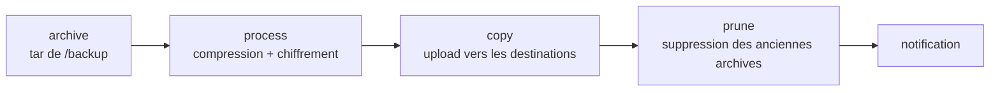

Dans un déploiement Docker Compose, l'état persistant des services (bases de données, fichiers utilisateurs, configuration générée) vit dans des volumes nommés, sous `/var/lib/docker/volumes`. La commande `docker volume` sait créer, inspecter, lister et supprimer ces volumes, mais n'offre aucune fonction d'export ni de sauvegarde. Sans mécanisme dédié, la perte du disque hôte, une suppression accidentelle (`docker compose down -v`) ou une migration applicative ratée emportent les données. `offen/docker-volume-backup` comble ce manque avec un conteneur qui archive, chiffre et expédie périodiquement le contenu des volumes vers un stockage distant.

<!--truncate-->

## Principe

L'outil est un conteneur Go léger, configuré entièrement par variables d'environnement. Les volumes à sauvegarder y sont montés en **lecture seule** sous `/backup`. Un cron interne (`BACKUP_CRON_EXPRESSION`, `@daily` par défaut) déclenche à chaque échéance le cycle suivant :



- **Archive** : un `tar` de `/backup`, compressé selon `BACKUP_COMPRESSION` (`gz` par défaut, `zst`, ou `none`).
- **Chiffrement** côté client, avant tout envoi : GPG symétrique (`GPG_PASSPHRASE`), GPG asymétrique (`GPG_PUBLIC_KEY_RING`) ou age (`AGE_PASSPHRASE`, `AGE_PUBLIC_KEYS`). Les options sont mutuellement exclusives. L'archive sort du conteneur déjà chiffrée, suffixée `.gpg` ou `.age`.
- **Destinations** : S3 et compatibles, WebDAV, SSH, Azure Blob, Dropbox, Google Drive, et copie locale si un répertoire est monté sur `/archive`.
- **Rétention** : `BACKUP_RETENTION_DAYS` supprime les archives plus anciennes que N **jours** (et non les N dernières archives). `BACKUP_PRUNING_PREFIX` restreint la suppression aux objets portant ce préfixe : sans lui, le pruning s'applique à **tout** le contenu de la destination.
- **Notifications** : `NOTIFICATION_URLS` accepte des URLs [shoutrrr](https://shoutrrr.nickfedor.com/) (SMTP, ntfy, Gotify, Slack...). Par défaut seuls les échecs sont notifiés ; `NOTIFICATION_LEVEL=info` notifie chaque exécution.

Une sauvegarde hors planning se déclenche par `docker exec <conteneur> backup`.

## Sauvegarder les volumes d'autres projets Compose

Le service de sauvegarde vit en général dans son propre projet Compose, alors que les volumes appartiennent à d'autres projets. Compose préfixe les volumes par le nom du projet : le volume `db_data` du projet `app` s'appelle en réalité `app_db_data` (`docker volume ls` donne les noms réels). Le projet de sauvegarde le référence en volume externe :

```yaml
volumes:
  app_db_dumps:
    external: true
    name: app_app_db_dumps   # <projet>_<volume>
```

`external: true` signifie que Compose ne crée pas le volume et échoue au démarrage s'il n'existe pas. Conséquence sur l'ordre de déploiement : les projets propriétaires doivent avoir été démarrés au moins une fois avant le projet de sauvegarde. Un pipeline qui déploie plusieurs projets place donc la sauvegarde **en dernier**. Les volumes Docker eux-mêmes sont présentés dans [Docker : conteneurs et images](2024-12-20-docker-containers.md) et la notion de projet dans [Docker Compose](../06-orchestration/2024-12-20-docker-compose.md).

## Plusieurs destinations S3

Le jeu de variables `AWS_*` décrit **une seule** destination S3 par configuration. Des backends de types différents (S3 + WebDAV + SSH) peuvent coexister dans un même run, mais deux buckets S3 distincts, par exemple un fournisseur cloud et une instance [Garage](../05-cloud/2026-09-06-s3-garage.md) locale, demandent deux configurations. Deux approches :

- **Deux services** qui montent les mêmes volumes avec des variables différentes. Leurs crons sont décalés pour ne pas archiver simultanément, et leurs préfixes distincts (`BACKUP_FILENAME`, `BACKUP_PRUNING_PREFIX`) évitent qu'un pruning touche les archives de l'autre si les destinations se recoupent.
- **Un service, plusieurs fichiers** `.env` montés dans `/etc/dockervolumebackup/conf.d` : un cron par fichier, exécutions sérialisées par un verrou exclusif.

Avec plusieurs instances, les labels de la section suivante sont vus par **toutes** : sans `EXEC_LABEL` distinct par instance, chaque hook s'exécute autant de fois qu'il y a d'instances, et un conteneur marqué `stop-during-backup=true` est arrêté par chacune.

## Cohérence des bases de données

Archiver le datadir d'un PostgreSQL ou d'un MariaDB en cours d'écriture produit une copie de fichiers pris à des instants différents. La base de production n'est pas affectée, mais l'**archive** peut être incohérente et la base restaurée refuser de démarrer ou contenir des pages corrompues. Deux mécanismes, pilotés par labels posés sur le conteneur de la base, l'évitent. Tous deux exigent que le conteneur de sauvegarde accède à l'API Docker (socket monté ou `DOCKER_HOST`).

**Arrêt pendant la sauvegarde.** Le label `docker-volume-backup.stop-during-backup=true` arrête le conteneur avant l'archivage et le redémarre ensuite. La copie est cohérente, au prix d'une interruption de service pendant la durée du `tar`.

**Dump avant archivage.** Les labels `docker-volume-backup.<étape>-pre` / `-post` (étapes `archive`, `process`, `copy`, `prune`) exécutent une commande dans le conteneur ciblé. Un `pg_dump` en `archive-pre` écrit un dump cohérent dans un volume dédié, et c'est ce volume qui est sauvegardé à la place du datadir :

```yaml
services:
  db:
    image: postgres:17
    volumes:
      - db_data:/var/lib/postgresql/data
      - db_dumps:/dumps
    labels:
      # Redirection : la commande doit passer par un shell
      - docker-volume-backup.archive-pre=/bin/sh -c 'pg_dump -U app -Fc app > /dumps/app.dump'
      - docker-volume-backup.exec-label=offsite
```

L'équivalent MariaDB utilise `mariadb-dump --single-transaction`. Le dump ne bloque pas l'application et reste portable entre versions majeures, contrairement à un datadir.

Monter `/var/run/docker.sock` donne au conteneur un contrôle équivalent à root sur l'hôte. Un proxy de socket (`tecnativa/docker-socket-proxy` ou équivalent) limite l'exposition aux permissions requises : `INFO` et `CONTAINERS`, plus `POST` pour arrêter des conteneurs ou lancer des commandes, et `EXEC` pour les hooks.

## Piège : bucket versionné et rétention

Le pruning applicatif émet des `DeleteObject`. Sur un bucket où le versioning est actif, une suppression ne détruit rien : elle pose un *delete marker* (AWS) ou un *hide marker* (Backblaze B2) et la version précédente reste stockée. La liste des objets affiche bien N jours d'archives, pendant que l'espace facturé croît sans limite.

Le cas se présente notamment sur Backblaze B2, dont les buckets sont créés en « Keep all versions ». La correction consiste à passer la lifecycle du bucket en « Keep only the last version », qui supprime les versions masquées après un court délai (`daysFromHidingToDeleting`). Sur AWS S3, l'équivalent est une règle lifecycle `NoncurrentVersionExpiration`. Garage n'implémente pas le versioning : une suppression y libère directement l'espace.

La rétention doit donc être gérée à **un seul** endroit : soit par l'outil (`BACKUP_RETENTION_DAYS`, bucket non versionné), soit par le fournisseur (versioning + lifecycle, pruning applicatif désactivé).

## Chiffrement : ce que protège chaque couche

| Couche | Protège contre | Ne protège pas contre |
|---|---|---|
| SSE fournisseur | Vol de disques ou accès physique dans le datacenter | Fuite de la clé d'API, accès du fournisseur, compromission du compte |
| GPG / age côté client | Tout accès au bucket : clé d'API fuitée, fournisseur, hôte d'une copie hors site | Compromission de l'hôte source, où la passphrase est présente |

Les deux se cumulent sans conflit. Le chiffrement client est indispensable dès que la destination est administrée par un tiers.

Corollaire : **perdre la passphrase revient à perdre toutes les archives**. Le chiffrement symétrique GPG ne prévoit aucune récupération. La passphrase doit être conservée hors de l'infrastructure qu'elle protège (gestionnaire de mots de passe externe, copie papier) : si elle n'existe que dans un fichier `.env` sur l'hôte sauvegardé, ou dans un coffre dont la seule copie se trouve dans ces mêmes archives, la panne de l'hôte la fait disparaître avec les données. Le stockage des secrets dans le dépôt est traité dans l'article [git-crypt](../08-iac/2026-07-26-git-crypt.md).

## Stratégie : quoi sauvegarder, et combien de fois

La règle 3-2-1 (3 copies, 2 supports, 1 hors site) se généralise en profil **X-Y-Z** : X copies vivantes, sur Y supports différents, dont Z hors site. Chaque volume reçoit un profil selon sa valeur et sa taille :

| Classe | Exemples | Profil | Mécanisme |
|---|---|---|---|
| Irremplaçable et petit | Bases applicatives, coffre de mots de passe, documents, configuration | 3-2-1 | Sauvegarde vers une copie locale sur un autre support + une copie hors site |
| Volumineux et régénérable | Médiathèque re-téléchargeable, enregistrements vidéo | 1-1-0 sur RAID | Aucune sauvegarde |
| Transitoire | Caches, métriques, certificats réémis automatiquement | 1-1-0 | Rien |

Le RAID protège contre la panne d'un disque, pas contre une suppression, un rançongiciel, une corruption logique répliquée instantanément, un incendie ou un vol. **Un RAID n'est pas une sauvegarde** : il ne réduit que la probabilité d'avoir à restaurer. Classer explicitement chaque volume permet aussi de détecter les oublis. Un volume de configuration non monté dans le service de sauvegarde passe inaperçu jusqu'au jour de la restauration.

## Exemple Compose complet

```yaml title="backup/compose.yml"
name: backup

x-common: &common
  image: offen/docker-volume-backup:v2.49.1
  restart: unless-stopped
  volumes:
    - app_db_dumps:/backup/app_db_dumps:ro
    - app_uploads:/backup/app_uploads:ro
    - /var/run/docker.sock:/var/run/docker.sock:ro

services:
  backup-offsite:          # copie hors site : fournisseur S3
    <<: *common
    environment:
      BACKUP_CRON_EXPRESSION: "0 3 * * *"
      BACKUP_COMPRESSION: zst
      BACKUP_FILENAME: offsite-%Y-%m-%dT%H-%M-%S.{{ .Extension }}
      BACKUP_PRUNING_PREFIX: offsite-
      BACKUP_RETENTION_DAYS: "7"
      EXEC_LABEL: offsite  # seule cette instance lance le pg_dump
      GPG_PASSPHRASE: ${GPG_PASSPHRASE}
      AWS_ENDPOINT: s3.eu-central-003.backblazeb2.com
      AWS_S3_BUCKET_NAME: ${OFFSITE_BUCKET}
      AWS_ACCESS_KEY_ID: ${OFFSITE_KEY_ID}
      AWS_SECRET_ACCESS_KEY: ${OFFSITE_KEY_SECRET}
      NOTIFICATION_URLS: ntfy://ntfy.example.com/backup
      NOTIFICATION_LEVEL: info

  backup-local:            # copie locale : Garage sur un autre support
    <<: *common
    environment:
      BACKUP_CRON_EXPRESSION: "0 4 * * *"    # décalé d'une heure
      BACKUP_COMPRESSION: zst
      BACKUP_FILENAME: local-%Y-%m-%dT%H-%M-%S.{{ .Extension }}
      BACKUP_PRUNING_PREFIX: local-
      BACKUP_RETENTION_DAYS: "7"
      EXEC_LABEL: local    # aucun conteneur ne porte ce label : pas de hook
      GPG_PASSPHRASE: ${GPG_PASSPHRASE}
      AWS_ENDPOINT: garage:3900
      AWS_ENDPOINT_PROTO: http             # trafic interne au réseau Docker
      AWS_S3_BUCKET_LOOKUP: path           # pas de DNS wildcard en interne
      AWS_S3_BUCKET_NAME: app-backup
      AWS_ACCESS_KEY_ID: ${GARAGE_KEY_ID}
      AWS_SECRET_ACCESS_KEY: ${GARAGE_KEY_SECRET}
      NOTIFICATION_URLS: ntfy://ntfy.example.com/backup
    networks: [default, garage]

volumes:
  app_db_dumps: { external: true, name: app_app_db_dumps }
  app_uploads:  { external: true, name: app_app_uploads }

networks:
  garage: { external: true, name: garage_default }
```

La copie locale sauvegarde un dump produit une heure plus tôt par l'instance hors site, ce qui reste acceptable pour une copie quotidienne. `AWS_S3_BUCKET_LOOKUP: path` force l'adressage path-style : en mode `auto`, le style virtual-host n'est utilisé que pour AWS, GCS et Aliyun, mais l'expliciter documente la contrainte. `{{ .Extension }}` devient `tar.zst`, suivi de `.gpg` après chiffrement.

## Restauration pas à pas

```bash
# 1. Récupérer l'archive
aws --endpoint-url https://s3.eu-central-003.backblazeb2.com \
  s3 cp s3://<bucket>/offsite-2026-09-13T03-00-00.tar.zst.gpg .

# 2. Déchiffrer (passphrase lue depuis un fichier, pas sur la ligne de commande)
gpg --batch --pinentry-mode loopback --passphrase-file ./passphrase \
  -o archive.tar.zst -d offsite-2026-09-13T03-00-00.tar.zst.gpg

# 3. Extraire en root pour conserver les uid/gid (ex. 999 pour postgres)
sudo tar --use-compress-program=unzstd -xf archive.tar.zst
# L'arborescence reprend les points de montage : backup/app_uploads/...

# 4. Arrêter le service qui utilise le volume
docker compose -p app stop web

# 5. Remplacer le contenu du volume depuis un conteneur jetable
docker run --rm \
  -v app_app_uploads:/target \
  -v "$(pwd)/backup/app_uploads":/source:ro \
  alpine sh -c "find /target -mindepth 1 -delete && cp -a /source/. /target/"

# 6. Redémarrer et vérifier le fonctionnement applicatif
docker compose -p app start web
```

Pour une base sauvegardée par dump, l'étape 5 devient un `pg_restore` dans une base vide :

```bash
docker compose -p app exec -T db pg_restore -U app -d app --clean --if-exists < backup/app_db_dumps/app.dump
```

Vider la cible avant la copie évite de mélanger d'anciens fichiers avec ceux de l'archive, ce qui est critique pour un datadir. Une extraction sans `sudo` attribue les fichiers à l'utilisateur courant : la base restaurée refuse alors de démarrer faute de droits.

## Tester la restauration

Une sauvegarde jamais restaurée n'est qu'une hypothèse. Passphrase erronée, volume oublié, archive tronquée, dump vide parce que le hook a échoué en silence (sa sortie est masquée sauf avec `EXEC_FORWARD_OUTPUT=true`) : ces défauts n'apparaissent qu'à la restauration. Un test périodique restaure une archive récente dans un volume temporaire, démarre le service dessus et vérifie une donnée connue. Les notifications `info` confirment l'exécution des runs, pas la validité des archives.

## Application / Projet lié

<ProjectLinks>
  <ProjectLink to="/docs/projects/personnel/homelab" title="HomeLab">Sauvegarde quotidienne chiffrée des volumes critiques d'une vingtaine de projets Compose vers deux destinations (fournisseur S3 hors site et instance Garage locale sur un autre support), avec classification explicite des volumes par profil de protection.</ProjectLink>
</ProjectLinks>

docker-volume-backup couvre l'archivage, le chiffrement, l'expédition et la rotation. La cohérence des bases, le choix des volumes, la conservation de la passphrase et les tests de restauration restent à la charge de l'exploitant, et déterminent si les archives sont réellement exploitables.
