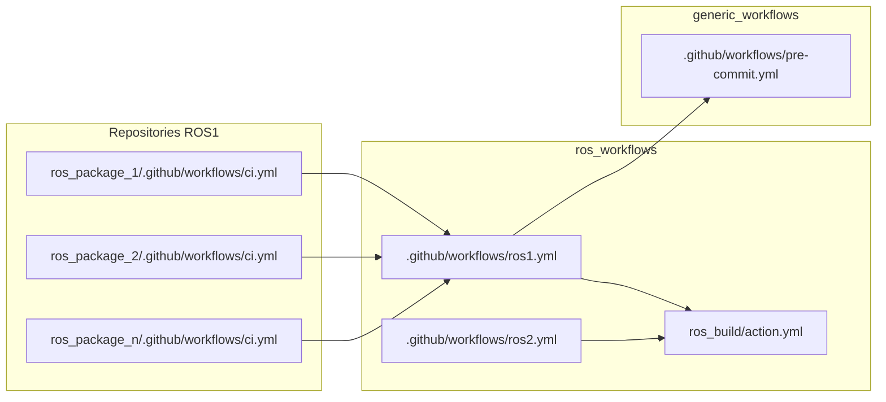

L'objectif est de créer une architecture CI/CD complète pour un projet de développement adressant une technologie (par exemple ROS). Cette architecture doit être :

- facilement réutilisable dans d'autres projets
- éviter la duplication de code
- maintenable et évolutive aisément
- applicable à d'autres projets

<!--truncate-->

## Création d'une architecture CI/CD

L'idée de l'architecture est de créer un dépôt contenant tous les workflows et les actions propres à une technologie / projet (par exemple ROS). Ce dépôt sera ensuite utilisé comme cible pour les workflows des projets utilisant cette technologie.



Dans cet exemple, nous avons un dépôt `ros_workflows` contenant les workflows et les actions propres à la technologie ROS. Ce dépôt est ensuite utilisé par les dépôts `ros_package_1`, `ros_package_2`, `ros_package_n` pour exécuter les workflows. Les différents workflows présents dans `ros_workflows` sont les **uniques** points d'entrée pour les workflows des dépôts `ros_package_1`, `ros_package_2`, `ros_package_n`. Ainsi s'il est nécessaire de modifier un workflow, il suffit de le faire dans le dépôt `ros_workflows` et tous les dépôts utilisant ce workflow seront mis à jour.

De plus le dépôt `ros_workflows` peut définir des `actions-composites` pour éviter la duplication de code entre leurs propres workflows. Ces actions sont utilisées par les workflows du dépôt `ros_workflows` et par conséquent des dépôts `ros_package_1`, `ros_package_2`, `ros_package_n`. Elles peuvent aussi être appelées directement au besoin.

Finalemet, le dépôt `ros_workflows` peut aussi utiliser des workflows génériques (par exemple `pre-commit.yml`) pour automatiser des tâches communes à toutes les technologies.

### Exemple de workflow `ros1.yml`

```yaml
name: Build & Test ROS Packages

on:
  workflow_call:
    inputs:
      package-name:
        description: 'The name of the ROS package to build and test.'
        required: true
        type: string
    secrets:
      PAT:
        required: false
        description: 'A GitHub Personal Access Token (PAT) used to import the private repository into the container.'


jobs:
  pre-commit:
    uses: catie-aq/generic_workflows/.github/workflows/pre-commit.yaml@main
  build_and_test_ros_package:
    runs-on: self-hosted # Use self-hosted runner
    strategy: # Define a matrix of ROS distributions and Docker images
      matrix:
        include:
          - docker_image: osrf/ros:noetic-desktop-full
            ros_distribution: noetic
    container: # Use the Docker image defined in the matrix
      image: ${{ matrix.docker_image }}
    steps:
      - name: Setup ROS environment
        uses: ros-tooling/setup-ros@v0.7
        with:
          required-ros-distributions: ${{ matrix.ros_distribution }}

      - name: Build and test ROS
        uses: ros-tooling/action-ros-ci@v0.2
        with:
          package-name: ${{ inputs.package-name }}
          target-ros1-distro: ${{ matrix.ros_distribution }}
          import-token: ${{ secrets.PAT }}
```

### Exemple de workflow `ci.yml`

```yaml
name: "ROS CI/CD"

on:
  push:

jobs:
  ros:
    uses: {user}/ros_workflows/.github/workflows/ros.yml@main
```

### Exemple d'action composite `ros_build/action.yml`

```yaml
name: 'Build and Test ROS'
description: 'Build and test a ROS package'

inputs:
  package-name:
    description: 'The name of the ROS package to build and test.'
    required: true
    type: string
  ros-distribution:
    description: 'The ROS distribution to use for building and testing.'
    required: true
    type: string
  import-token:
    description: 'A GitHub Personal Access Token (PAT) used to import the private repository into the container.'
    required: false
    type: string

runs:
    using: "composite"
    steps:
        - run: echo "Building and testing ROS package ${{ inputs.package-name }} for ROS ${{ inputs.ros-distribution }}."
        shell: bash
```
