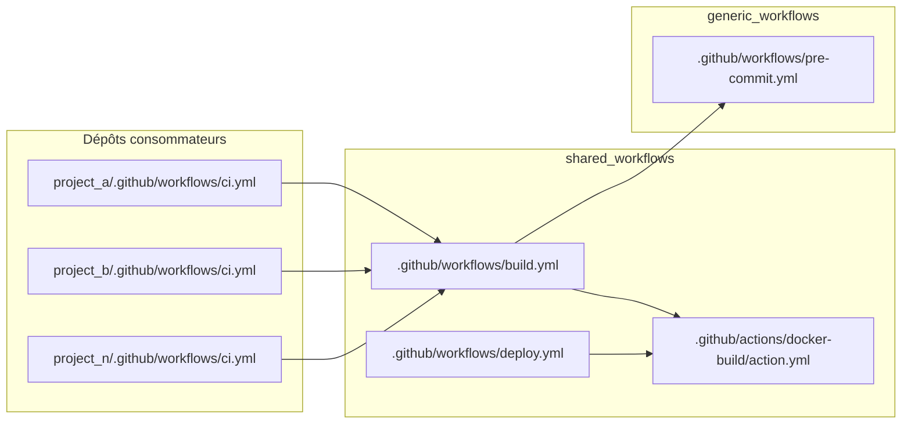

Quand plusieurs dépôts partagent la même stack technique, chacun maintient souvent une copie quasi-identique de ses workflows CI/CD. Une modification — nouvelle version d'un outil, changement de runner, ajout d'une étape de sécurité — doit être répercutée manuellement dans chaque dépôt. Un dépôt centralisé de workflows mutualisés résout ce problème : les dépôts consommateurs appellent les workflows du dépôt central, qui devient le seul point de maintenance.

<!--truncate-->

## Architecture


```mermaid
graph LR
    subgraph Dépôts consommateurs
        repo1[project_a/.github/workflows/ci.yml]
        repo2[project_b/.github/workflows/ci.yml]
        repo3[project_n/.github/workflows/ci.yml]
    end
    subgraph shared_workflows
        wf1[.github/workflows/build.yml]
        wf2[.github/workflows/deploy.yml]
        action1[.github/actions/docker-build/action.yml]
        wf1 --> action1
        wf2 --> action1
    end
    subgraph generic_workflows
        pre-commit[.github/workflows/pre-commit.yml]
    end

    wf1 --> pre-commit
    repo1 --> wf1
    repo2 --> wf1
    repo3 --> wf1
```

Le dépôt `shared_workflows` contient :
- des **workflows réutilisables** (`workflow_call`) qui constituent les points d'entrée pour les dépôts consommateurs
- des **actions composites** qui factorisent la logique commune entre ces workflows
- des appels à des **workflows génériques** (pre-commit, lint) partagés entre toutes les stacks

Les dépôts consommateurs ont un workflow minimal qui délègue tout au dépôt central.

## Workflow réutilisable dans le dépôt central

Un workflow réutilisable se déclare avec `on: workflow_call`. Il expose des `inputs` et des `secrets` que les appelants doivent fournir :

```yaml
# shared_workflows/.github/workflows/build.yml
name: Build and Test

on:
  workflow_call:
    inputs:
      image-name:
        description: "Docker image name"
        required: true
        type: string
      python-version:
        description: "Python version"
        required: false
        type: string
        default: "3.12"
    secrets:
      registry-token:
        required: true
        description: "Token for container registry"

jobs:
  pre-commit:
    uses: org/generic_workflows/.github/workflows/pre-commit.yml@main

  build:
    runs-on: ubuntu-latest
    strategy:
      matrix:
        python-version: ["3.11", "3.12"]
    container:
      image: python:${{ matrix.python-version }}-slim
    steps:
      - uses: actions/checkout@v4

      - name: Build and push image
        uses: org/shared_workflows/.github/actions/docker-build@main
        with:
          image: ${{ inputs.image-name }}
          tag: ${{ github.sha }}
          registry-token: ${{ secrets.registry-token }}
```

## Workflow consommateur dans chaque dépôt

Le workflow de chaque dépôt consommateur devient minimal — il se contente d'appeler le workflow central :

```yaml
# project_a/.github/workflows/ci.yml
name: CI

on:
  push:

jobs:
  build:
    uses: org/shared_workflows/.github/workflows/build.yml@main
    with:
      image-name: ghcr.io/org/project-a
    secrets:
      registry-token: ${{ secrets.GITHUB_TOKEN }}
```

Un changement dans `shared_workflows/build.yml` s'applique immédiatement à tous les dépôts sans aucune modification de leur côté.

## Action composite dans le dépôt central

Les actions composites factorisent la logique commune entre les workflows du dépôt central lui-même :

```yaml
# shared_workflows/.github/actions/docker-build/action.yml
name: "Docker Build and Push"
description: "Build a Docker image and push it to GHCR"

inputs:
  image:
    required: true
  tag:
    required: true
  registry-token:
    required: true

runs:
  using: "composite"
  steps:
    - uses: docker/setup-buildx-action@v3

    - uses: docker/login-action@v3
      with:
        registry: ghcr.io
        username: ${{ github.actor }}
        password: ${{ inputs.registry-token }}

    - uses: docker/build-push-action@v5
      with:
        push: true
        tags: ${{ inputs.image }}:${{ inputs.tag }}
        cache-from: type=gha
        cache-to: type=gha,mode=max
```

## Différence entre action et workflow réutilisable

Les deux mécanismes se complètent mais ont des périmètres différents :

| | Action composite | Workflow réutilisable |
|---|---|---|
| Appelé depuis | Une step (`uses`) | Un job (`uses`) |
| Environnement | Hérite du job appelant | Définit ses propres runners |
| Secrets | Via `inputs` | Via `secrets` dédié |
| Usage | Factoriser des steps | Encapsuler un pipeline complet |

Un workflow réutilisable définit `on: workflow_call` et ne peut pas être utilisé dans une step — il est un job à part entière avec ses propres runners. Une action composite s'exécute dans l'environnement du job qui l'appelle et peut être insérée n'importe où dans une liste de steps.
