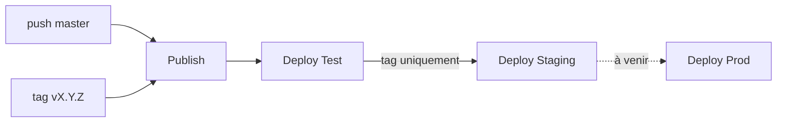

Déployer une application web — un frontend, un backend, une base de données — enchaîne toujours les mêmes étapes : construire les images, les publier, provisionner l'infrastructure, déployer sur le cluster. Automatiser cet enchaînement du `git push` à l'application en ligne est l'objet d'un pipeline CI/CD. Cet article décrit une telle chaîne, bâtie avec GitHub Actions, Terraform et Helm sur AWS EKS.

<!--truncate-->

Cette première partie couvre le build, la publication des images et le déploiement automatique sur l'environnement de **test**. Le **staging** et la **production** — déclenchement par tag, base RDS, injection de secrets, approbation manuelle — feront l'objet d'une suite.

## Vue d'ensemble

Le pipeline est découpé en workflows GitHub Actions distincts, chaînés l'un à l'autre. Chaque maillon se déclenche à la fin du précédent, ce qui isole les responsabilités : un workflow construit, un autre déploie sur test, un autre sur staging.



Deux événements alimentent la chaîne :

- un **push sur `master`** produit des images `:main` et déploie sur test uniquement ;
- un **tag `vX.Y.Z`** produit des images versionnées et parcourt la chaîne jusqu'au staging, la production étant l'objet de la suite.

## Étape 1 — Publish : construire et publier les images

Le workflow `publish.yaml` construit les images du backend et du frontend et les pousse sur GitHub Container Registry (GHCR). Il se déclenche sur les push `master` et les tags `v*.*.*`.

Le tag appliqué aux images dépend du déclencheur — un tag mobile `main` pour une branche, un tag figé pour une version :

```yaml
- name: Compute image tag
  id: tag
  run: |
    if [ "${{ github.ref_type }}" = "tag" ]; then
      echo "value=${{ github.ref_name }}" >> $GITHUB_OUTPUT
    else
      echo "value=main" >> $GITHUB_OUTPUT
    fi
```

Cette distinction est structurante : `:main` est réécrit à chaque push et sert le test, tandis que `:vX.Y.Z` est immuable et sert staging et prod — une version déployée en production correspond ainsi toujours à un artefact figé.

Un tag mobile a toutefois une conséquence sur le déploiement : si le chart référence `image: ghcr.io/...:main` et que ce tag est seulement réécrit dans le registry, un `helm upgrade` produit un manifeste de Deployment identique au précédent. Kubernetes ne détecte aucun changement dans le template de pod et ne déclenche **aucun rollout** : les pods existants continuent d'exécuter l'ancienne image, même avec `imagePullPolicy: Always` (qui ne s'applique qu'à la création d'un pod). Pour que chaque push produise un déploiement effectif, l'image est également taguée avec le SHA du commit (`:sha-<commit>` ou `:${{ github.sha }}`), et c'est ce tag unique qui est transmis au chart ; `:main` ne reste qu'un alias pratique pour un usage manuel.

Le build lui-même utilise `docker/build-push-action`, avec `cache-from`/`cache-to` en `type=gha` : le cache de Buildx est branché sur celui de GitHub Actions, et les couches inchangées ne sont pas reconstruites. L'authentification à GHCR passe par le `GITHUB_TOKEN` du workflow, sans secret à gérer, dès lors que le job a la permission `packages: write`.

## Étape 2 — Deploy Test : provisionner et déployer

Le workflow `deploy-test.yaml` se déclenche à la fin de `Publish` via l'événement `workflow_run`, et ne s'exécute que si le build a réussi :

```yaml
on:
  workflow_run:
    workflows: [Publish]
    types: [completed]

jobs:
  deploy:
    if: ${{ github.event.workflow_run.conclusion == 'success' }}
```

`workflow_run` déclenche le déploiement quel que soit le résultat du build ; le filtre `conclusion == 'success'` évite de déployer sur un build échoué. Dans un workflow déclenché par `workflow_run`, le contexte `github.sha` désigne le dernier commit de la branche par défaut, et non le commit qui a déclenché `Publish` : le SHA de l'image à déployer se lit dans `github.event.workflow_run.head_sha` (et la branche ou le tag dans `github.event.workflow_run.head_branch`). Le fonctionnement de ce déclencheur est détaillé dans l'article [GitHub Actions](./2024-12-20-github-actions.md). Ce workflow ne filtre pas le type de référence : il déploie sur test aussi bien pour un push que pour un tag, si bien que l'environnement de test reflète en continu la dernière version construite.

Le job enchaîne ensuite trois temps.

**Terraform** provisionne l'infrastructure de l'environnement. Le backend S3 est en configuration partielle : le code déclare `backend "s3" {}` et les valeurs sont injectées à l'init, distinctes par environnement.

```yaml
- run: terraform init -backend-config=envs/test/backend.hcl
- run: terraform apply -auto-approve -var-file=envs/test/terraform.tfvars
```

Chaque environnement a sa clé de state (`envs/test/backend.hcl`) et ses variables (`envs/test/terraform.tfvars`, avec `enable_rds = false` en test — une base éphémère suffit). Une seule configuration racine sert ainsi tous les environnements, le fichier passé à `-backend-config` sélectionnant le state : ce mécanisme de configuration partielle est détaillé dans l'article [Terraform remote state](../08-iac/2026-07-11-terraform-remote-state.md#configuration-partielle-avec--backend-config). L'article [multi-environnements Terraform](../08-iac/2026-07-19-terraform-multi-environnements.md) compare cette approche aux workspaces et aux répertoires séparés par environnement.

**La connexion au cluster** se fait avec `aws eks update-kubeconfig --name task-horizon-eks --region eu-west-3`, à partir des credentials AWS configurés en amont — les mêmes qui ont autorisé le `terraform apply`.

**Helm** déploie enfin l'application. `upgrade --install` installe la release ou la met à jour : l'opération est idempotente et rejouable.

```yaml
- env:
    AUTH_JWT_SECRET: ${{ secrets.AUTH_JWT_SECRET }}
    IMAGE_TAG: ${{ github.event.workflow_run.head_sha }}
  run: |
    helm upgrade --install taskhorizon-test ./helm/taskhorizon \
      -f helm/taskhorizon/values-test.yaml \
      --set image.tag="$IMAGE_TAG" \
      --set auth.jwtSecret="$AUTH_JWT_SECRET" \
      --namespace taskhorizon --create-namespace --wait
```

`--set image.tag` transmet le tag unique de l'image construite, ce qui modifie le template de pod à chaque commit et déclenche le rollout. Les secrets applicatifs sont injectés par `--set` depuis les secrets GitHub Actions, via des variables d'environnement plutôt que par interpolation directe dans le script : ils ne passent jamais par le dépôt. Ils ne restent pas pour autant confinés au runner : Helm enregistre les valeurs de chaque révision dans un Secret Kubernetes de release (`sh.helm.release.v1.<release>.v<révision>`), où elles sont lisibles par quiconque peut lire les Secrets du namespace, notamment via `helm get values taskhorizon-test`. L'accès RBAC aux Secrets du namespace délimite donc l'exposition réelle de ces valeurs. `--wait` bloque jusqu'à ce que les pods soient réellement prêts, sans quoi le workflow réussirait avant que le déploiement n'aboutisse. En amont, un secret Kubernetes `docker-registry` autorise le cluster à tirer les images depuis GHCR, registre privé.

## Ce que couvre la suite

À ce stade, chaque push sur `master` déclenche la chaîne jusqu'au test : build, publication, `terraform apply`, déploiement Helm. La suite introduira le **staging** (déclenché par tag, base RDS provisionnée par Terraform, endpoint récupéré via `terraform output`) et la **production** (approbation manuelle, secrets de base de données ne transitant jamais par la CI).

## Application / Projet lié

<ProjectLinks>
  <ProjectLink to="/docs/projects/personnel/task-horizon" title="TaskHorizon">Chaîne `Publish` puis `Deploy Test` : images de l'API et du frontend publiées sur GHCR, puis `terraform apply` et déploiement Helm sur l'environnement de test à chaque push sur `master`.</ProjectLink>
</ProjectLinks>
