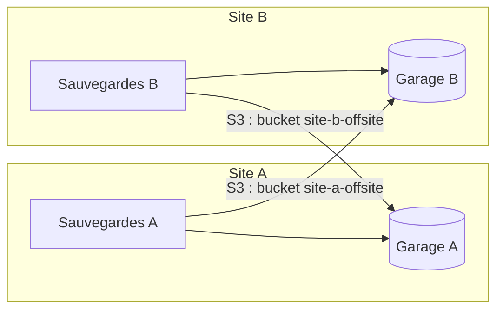

Outils de sauvegarde, backends de state Terraform, applications qui stockent des fichiers : une part croissante des logiciels d'infrastructure parle l'API S3. Hors d'un cloud public, il faut donc un serveur qui expose cette API sur du matériel maîtrisé. Ceph RGW suppose un cluster Ceph complet, et l'édition communautaire de MinIO a été restreinte. Garage, développé par l'association Deuxfleurs, se situe à l'autre extrémité : un binaire Rust unique, conçu pour des machines modestes réparties sur plusieurs sites, qui implémente le sous-ensemble de S3 utilisé par la majorité des clients.

<!--truncate-->

## Positionnement

Garage vise le stockage objet **géo-distribué à petite échelle** : quelques nœuds hétérogènes reliés par des liens Internet ordinaires. Chaque objet est découpé en blocs répliqués sur `replication_factor` nœuds, placés de préférence dans des **zones** distinctes (une zone correspond typiquement à un site physique).

La compatibilité S3 est partielle. D'après la page de compatibilité officielle :

| Fonctionnalité S3 | Support |
|---|---|
| CRUD d'objets, multipart, listing, presigned URLs | Oui |
| Adressage path-style et virtual-host | Oui |
| Versioning, Object Lock | Non |
| ACL, bucket policies | Non, remplacées par des permissions clé × bucket |
| Chiffrement côté serveur (SSE) | Non : chiffrer la partition ou côté client |
| Réplication, notifications, tagging | Non |
| Lifecycle | Partiel : `Expiration` et `AbortIncompleteMultipartUpload` |

Sans versioning, une suppression libère réellement l'espace, sans marqueur résiduel (le piège inverse, sur un fournisseur versionné, est décrit dans l'article [Docker : sauvegarde des volumes](../03-containerization/2026-09-13-docker-volume-backup.md)). Les notions S3 génériques sont présentées dans [AWS : RDS, S3 et EBS](2026-03-28-aws-storage.md).

## Architecture d'un nœud

Un nœud sépare deux stockages :

- **`metadata_dir`** : base de métadonnées (index des objets, buckets, clés). Accès aléatoires et petits : la documentation recommande un SSD.
- **`data_dir`** : blocs de données (1 Mio par défaut). Accès séquentiels et volumineux : un disque dur convient.

L'index peut ainsi vivre sur le NVMe système et les données sur une grappe de disques lents, sans que les listings ne subissent la latence mécanique. `db_engine` choisit le moteur (`lmdb` par défaut, `sqlite` plus lent mais sans les contraintes de LMDB) ; `metadata_auto_snapshot_interval` active des snapshots périodiques de la base, utiles après un arrêt brutal.

| Port | Rôle | Exposition |
|---|---|---|
| 3900 | API S3 | Clients |
| 3901 | RPC inter-nœuds | Nœuds du cluster uniquement |
| 3902 | Hébergement web de buckets | Optionnel |
| 3903 | API admin, `/metrics`, `/health` | Administration, Prometheus |

Seul le 3900 a vocation à être joignable par les clients : l'API admin donne un contrôle total sur les données.

## Configuration

```toml title="garage.toml.tpl"
metadata_dir = "/var/lib/garage/meta"
data_dir = "/var/lib/garage/data"
db_engine = "lmdb"
metadata_auto_snapshot_interval = "6h"
replication_factor = 1                     # 1 = aucune redondance

rpc_bind_addr = "[::]:3901"
rpc_public_addr = "__RPC_PUBLIC_ADDR__"    # rendu par le conteneur init

[s3_api]
api_bind_addr = "[::]:3900"
s3_region = "garage"
root_domain = ".s3.example.com"

[admin]
api_bind_addr = "[::]:3903"
metrics_require_token = true
```

- `replication_factor` doit être identique sur tous les nœuds. Depuis Garage v2, `replication_mode` est supprimé au profit de `replication_factor` et `consistency_mode`.
- `s3_region` est la région que les clients doivent signer ; une autre valeur produit une erreur d'authentification.
- `root_domain` active l'adressage virtual-host en plus du path-style.
- `rpc_secret` (`openssl rand -hex 32`), `admin_token` et `metrics_token` peuvent figurer dans le fichier, mais Garage lit aussi `GARAGE_RPC_SECRET`, `GARAGE_ADMIN_TOKEN`, `GARAGE_METRICS_TOKEN` et leurs variantes `_FILE`, ce qui évite d'écrire les secrets sur disque.

Les autres valeurs propres à un déploiement (adresse RPC publique, domaine) se rendent depuis un template versionné par un conteneur d'initialisation. L'image officielle ne contient que le binaire, sans shell : le rendu se fait dans un conteneur `alpine`, qui écrit dans un volume monté en lecture seule par Garage. Le chemin du fichier se passe par `GARAGE_CONFIG_FILE` (défaut `/etc/garage.toml`).

## Le layout, obligatoire même sur un nœud

Au premier démarrage, un nœud n'a **aucun rôle** : il ignore quelle part des partitions stocker. Tant qu'un layout n'est pas assigné et appliqué, toute opération sur les buckets échoue avec `Layout not ready` (HTTP 500), y compris sur une instance unique.

```bash
# Identifiant du nœud
docker compose exec garage /garage status
# Zone et capacité (unités SI : 1 GB = 10^9 octets)
docker compose exec garage /garage layout assign -z dc1 -c 200G <node_id>
# Revue puis application ; --version doit valoir version courante + 1
docker compose exec garage /garage layout show
docker compose exec garage /garage layout apply --version 1
```

Depuis la v2.3.0, `garage server --single-node` crée ce layout automatiquement, mais déclare comme capacité **la taille totale du disque** et refuse de démarrer une fois le layout au-delà de la version 1. Sur un disque partagé ou une capacité appelée à évoluer, le layout explicite reste nécessaire.

**Capacité et quota sont distincts.** La capacité d'un nœud sert à répartir les partitions ; elle ne borne pas l'espace consommé. Le **quota** (`maxSize`, `maxObjects`) est une limite par bucket appliquée par l'API S3. Sur un disque partagé, la limite effective se pose donc par quota, et une capacité égale à la somme des quotas garde le layout cohérent avec l'espace réservé.

## Buckets, clés et permissions

Une clé est indépendante des buckets ; les droits `read`, `write`, `owner` se posent sur chaque couple clé × bucket.

```bash
garage bucket create app-backup
garage bucket set-quotas app-backup --max-size 100GiB
garage key create app-backup-key
garage bucket allow app-backup --read --write --key app-backup-key
```

L'API admin v2 (`Authorization: Bearer <admin_token>`) expose les mêmes opérations ; les endpoints v1 ne sont plus garantis depuis Garage v2 :

| Opération | Endpoint v2 |
|---|---|
| État, ID des nœuds | `GET /v2/GetClusterStatus` |
| Layout | `GET /v2/GetClusterLayout`, `POST /v2/UpdateClusterLayout`, `POST /v2/ApplyClusterLayout` |
| Buckets | `GET /v2/GetBucketInfo?globalAlias=`, `POST /v2/CreateBucket`, `POST /v2/UpdateBucket?id=` |
| Clés | `GET /v2/GetKeyInfo?id=`, `POST /v2/ImportKey` |
| Permissions | `POST /v2/AllowBucketKey`, `POST /v2/DenyBucketKey` |

`AllowBucketKey` n'active que les drapeaux à `true` et ne retire jamais un droit : le retrait passe par `DenyBucketKey`. Dans `UpdateBucket`, `maxSize` et `maxObjects` se fournissent ensemble (`null` pour lever la limite).

## Provisioning idempotent

L'état voulu (layout, buckets, quotas, clés, droits) s'applique par un conteneur éphémère à chaque `docker compose up`, rejouable sans effet de bord. Deux pièges conditionnent son écriture.

**`key create` n'est pas idempotent.** Chaque appel génère un identifiant aléatoire ; le nom n'est qu'une étiquette. Rejouer le script crée une nouvelle clé homonyme à chaque déploiement. Le secret n'apparaît en clair qu'à la création, ensuite il faut un accès administrateur (`garage key info --show-secret`) pour le relire. La solution : **générer les identifiants à l'avance**, les stocker chiffrés avec les autres secrets du dépôt (par exemple avec [git-crypt](../08-iac/2026-07-26-git-crypt.md)), puis les **importer**.

```bash
echo "GK$(openssl rand -hex 12)"   # format natif : GK + 24 caractères hexadécimaux
openssl rand -hex 32               # secret
garage key import <key_id> <secret> -n app-backup-key --yes
```

L'import est idempotent par identifiant : `GetKeyInfo?id=` renvoie 200 si la clé existe, 404 sinon. La documentation réserve `ImportKey` aux migrations et restaurations et met en garde contre des identifiants non standard ; respecter le format natif écarte ce risque. Garage applique ce même schéma à la clé par défaut du mode `--single-node` (`GARAGE_DEFAULT_ACCESS_KEY`).

**`curl` sans `-f` avale les erreurs.** Sans `-f`, `curl` sort en 0 sur une réponse 500. Un `Layout not ready` passe alors dans `jq`, qui extrait `null` du corps d'erreur, et le script continue avec des identifiants invalides. Les appels qui doivent réussir utilisent `curl -sSf` ; les tests d'existence lisent explicitement le code HTTP.

```sh title="provision.sh"
#!/bin/sh
set -eu
apk add --no-cache curl jq >/dev/null
API="http://garage:3903"; AUTH="Authorization: Bearer ${GARAGE_ADMIN_TOKEN}"

api() {    # appel strict : échec sur tout code HTTP >= 400
  m="$1"; p="$2"; shift 2
  curl -sSf -X "$m" -H "$AUTH" -H "Content-Type: application/json" "$@" "$API$p"
}
code() {   # code HTTP seul, pour les tests d'existence
  curl -sS -o /dev/null -w "%{http_code}" -H "$AUTH" "$API$1"
}

until [ "$(code /v2/GetClusterStatus)" = "200" ]; do sleep 2; done

# Layout : n'agit que si la capacité du nœud diffère de la valeur voulue
layout=$(api GET /v2/GetClusterLayout)
node=$(api GET /v2/GetClusterStatus | jq -r '.nodes[0].id')
cap=$(echo "$layout" | jq -r --arg id "$node" '.roles[] | select(.id == $id) | .capacity')
if [ "$cap" != "$CAPACITY_BYTES" ]; then
  api POST /v2/UpdateClusterLayout -d "$(jq -n --arg id "$node" --argjson c "$CAPACITY_BYTES" \
    '{roles: [{id: $id, zone: "dc1", capacity: $c, tags: []}]}')" >/dev/null
  api POST /v2/ApplyClusterLayout \
    -d "{\"version\": $(( $(echo "$layout" | jq .version) + 1 ))}" >/dev/null
fi

# Bucket + quota
[ "$(code '/v2/GetBucketInfo?globalAlias=app-backup')" = "404" ] &&
  api POST /v2/CreateBucket -d '{"globalAlias": "app-backup"}' >/dev/null
bucket=$(api GET '/v2/GetBucketInfo?globalAlias=app-backup' | jq -r .id)
api POST "/v2/UpdateBucket?id=$bucket" \
  -d '{"quotas": {"maxSize": 100000000000, "maxObjects": null}}' >/dev/null

# Clé importée + droits
[ "$(code "/v2/GetKeyInfo?id=$APP_KEY_ID")" = "404" ] &&
  api POST /v2/ImportKey -d "$(jq -n --arg i "$APP_KEY_ID" --arg s "$APP_KEY_SECRET" \
    '{name: "app-backup-key", accessKeyId: $i, secretAccessKey: $s}')" >/dev/null
api POST /v2/AllowBucketKey -d "$(jq -n --arg b "$bucket" --arg k "$APP_KEY_ID" \
  '{bucketId: $b, accessKeyId: $k, permissions: {read: true, write: true, owner: false}}')" >/dev/null
echo "Provisioning terminé"
```

## Exemple Compose complet

```yaml title="compose.yml"
name: garage

services:
  garage-init:
    image: alpine:3.22
    environment:
      RPC_PUBLIC_ADDR: ${GARAGE_RPC_PUBLIC_ADDR}
    volumes:
      - ./garage.toml.tpl:/template/garage.toml.tpl:ro
      - garage_config:/config
    entrypoint: ["/bin/sh", "-c"]
    command:
      - sed "s|__RPC_PUBLIC_ADDR__|$$RPC_PUBLIC_ADDR|" /template/garage.toml.tpl > /config/garage.toml
    restart: "no"

  garage:
    image: dxflrs/garage:v2.4.1
    depends_on:
      garage-init:
        condition: service_completed_successfully
    environment:
      GARAGE_CONFIG_FILE: /etc/garage/garage.toml
      GARAGE_RPC_SECRET: ${GARAGE_RPC_SECRET}
      GARAGE_ADMIN_TOKEN: ${GARAGE_ADMIN_TOKEN}
      GARAGE_METRICS_TOKEN: ${GARAGE_METRICS_TOKEN}
    command: ["/garage", "server"]
    volumes:
      - garage_config:/etc/garage:ro
      - garage_meta:/var/lib/garage/meta   # disque système (SSD)
      - garage_data:/var/lib/garage/data   # disques de données
    ports:
      - "3900:3900"                        # API S3 uniquement
    restart: unless-stopped

  garage-provision:
    image: alpine:3.22
    depends_on: [garage]
    environment:
      GARAGE_ADMIN_TOKEN: ${GARAGE_ADMIN_TOKEN}
      CAPACITY_BYTES: ${GARAGE_CAPACITY_BYTES}
      APP_KEY_ID: ${GARAGE_APP_KEY_ID}
      APP_KEY_SECRET: ${GARAGE_APP_KEY_SECRET}
    volumes:
      - ./provision.sh:/provision.sh:ro
    entrypoint: ["/bin/sh", "/provision.sh"]
    restart: "no"

volumes:
  garage_config:
  garage_meta:
  garage_data:
    driver_opts: { type: none, o: bind, device: /mnt/data/garage }
```

`service_completed_successfully` garantit que la configuration est rendue avant le démarrage du serveur. Après une modification, `docker compose up -d garage-provision` rejoue le provisioning. Le fonctionnement de Compose est détaillé dans l'article [Docker Compose](../06-orchestration/2024-12-20-docker-compose.md).

## Côté client : path-style

```text
path-style    : http://garage:3900/app-backup/archive.tar.zst
virtual-host  : http://app-backup.s3.example.com/archive.tar.zst
```

Le virtual-host exige un DNS wildcard (`*.s3.example.com`) et le certificat correspondant. Sur un endpoint interne (nom de service Docker, IP de VPN), cette résolution n'existe pas : le client doit être forcé en path-style, sinon il tente de joindre `app-backup.garage`.

```ini title="~/.aws/config"
[profile garage]
region = garage
endpoint_url = http://garage.example.com:3900
s3 =
    addressing_style = path
```

```bash
# awscli >= 2.13 lit endpoint_url dans le profil
aws --profile garage s3 cp ./archive.tar.zst s3://app-backup/
# Versions antérieures : endpoint explicite
aws --endpoint-url http://garage.example.com:3900 s3 ls s3://app-backup/
```

Avec rclone : `provider = Other`, `region = garage`, `force_path_style = true`. Les autres consommateurs S3 (backend de [state Terraform](../08-iac/2026-07-11-terraform-remote-state.md), outils de sauvegarde) exposent une option équivalente.

## Copie hors site entre deux sites

Deux sites équipés chacun d'une instance Garage peuvent s'héberger mutuellement leur copie hors site **sans former de cluster** :



Chaque instance reste un cluster d'un nœud ; chaque site crée pour l'autre un bucket, un quota et une clé dédiés, et n'en est qu'un client S3. Aucun `rpc_secret` partagé, aucun port 3901 exposé, aucune dépendance de quorum sur des liens domestiques. Le quota protège l'hôte contre une croissance incontrôlée. Un cluster à deux zones répliquerait automatiquement, mais lierait l'administration des deux sites et propagerait instantanément une suppression logique. Le chiffrement côté client reste nécessaire, l'hôte distant ayant un accès physique aux disques, et le port 3900 se publie derrière un VPN ou un reverse proxy TLS.

## Supervision

- `GET /health` : sans authentification, 200 si le quorum est atteint, 503 sinon.
- `GET /metrics` : format Prometheus, protégé par `metrics_token`.

```yaml title="prometheus.yml"
scrape_configs:
  - job_name: garage
    static_configs:
      - targets: ["garage:3903"]
    authorization:
      type: Bearer
      credentials_file: /etc/prometheus/garage_metrics_token
```

Voir [l'introduction à Prometheus](../07-monitoring/2025-11-21-prometheus-introduction.md) et [Alertmanager](../07-monitoring/2026-09-20-prometheus-alertmanager.md) pour la chaîne d'alerte.

## Limites

- **Un seul nœud, aucune redondance** : `replication_factor = 1` ne protège d'aucune panne disque ; la redondance vient du RAID sous-jacent, et l'instance reste une destination de sauvegarde, pas une sauvegarde.
- **Métadonnées critiques** : perdre `metadata_dir` rend les blocs inexploitables ; snapshots et support fiable s'imposent.
- **Ni versioning ni Object Lock** : une clé compromise peut tout supprimer. L'immuabilité s'obtient ailleurs (copies multiples, une clé par client, jamais `owner`).
- **Capacité non bornante** : sans quota, un bucket peut remplir le disque.

## Application / Projet lié

### [HomeLab](/docs/projects/personnel/homelab)
**Utilisation** : Instance Garage à nœud unique (métadonnées sur NVMe, données sur une baie RAID) servant de seconde copie locale des sauvegardes de volumes, provisionnée par l'API admin v2, avec un bucket sous quota réservé à la copie hors site d'un site partenaire.

Garage fournit une API S3 auto-hébergée aux contraintes explicites : layout obligatoire, sous-ensemble d'API documenté, clés à traiter comme des secrets déterministes. Une fois ces points intégrés à un provisioning rejouable, l'instance se comporte comme n'importe quelle destination S3.
