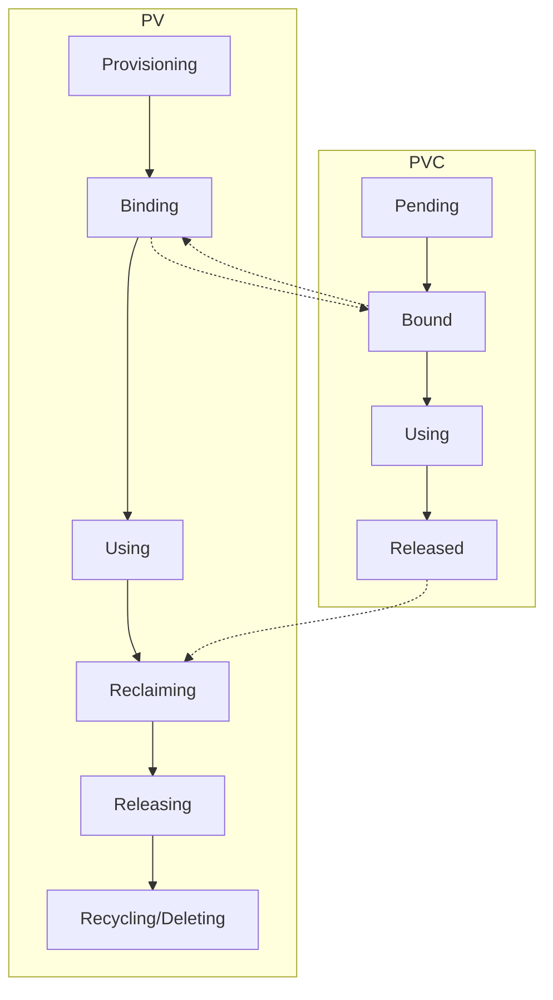

Kubernetes offre des mécanismes pour monter et utiliser du stockage dans les pods, mais la gestion des données, y compris la provision, la sauvegarde et la réplication, est une tâche qui incombe aux administrateurs du cluster. Dans cet article, les concepts de stockage dans Kubernetes, notamment PersistentVolume, PersistentVolumeClaim, StorageClass et Volume, seront explorés. 📦

<!--truncate-->

## PersistentVolume (PV)

Un PersistentVolume (PV) est une ressource Kubernetes qui représente un volume de stockage dans le cluster. Il peut être provisionné dynamiquement ou statiquement et est utilisé pour stocker des données de manière persistante. Les PVs sont indépendants des pods et peuvent être réclamés par des PersistentVolumeClaims (PVCs).

### Exemple de PersistentVolume

```yaml
apiVersion: v1
kind: PersistentVolume
metadata:
  name: my-pv
spec:
  capacity:
    storage: 1Gi
  accessModes:
    - ReadWriteOnce
  persistentVolumeReclaimPolicy: Retain
  storageClassName: my-storage-class
  hostPath:
    path: /mnt/data
```

## PersistentVolumeClaim (PVC)

Un PersistentVolumeClaim (PVC) est une ressource Kubernetes utilisée par les pods pour demander un certain type et une certaine quantité de stockage persistant. Les PVCs sont liés aux PVs disponibles dans le cluster.

### Exemple de PersistentVolumeClaim

```yaml
apiVersion: v1
kind: PersistentVolumeClaim
metadata:
  name: my-pvc
spec:
  accessModes:
    - ReadWriteOnce
  resources:
    requests:
      storage: 1Gi
  storageClassName: my-storage-class
```

## Cycle de vie des PersistentVolumes (PV) et PersistentVolumeClaims (PVC)

Le cycle de vie des PersistentVolumes (PV) et PersistentVolumeClaims (PVC) dans Kubernetes suit plusieurs étapes, de la création à la suppression.

### Cycle de vie des PV

1. **Provisioning**: Le PV est créé soit statiquement par un administrateur, soit dynamiquement par le contrôleur de stockage.
2. **Binding**: Le PV est lié à un PVC lorsqu'un PVC correspondant est créé.
3. **Using**: Le PV est utilisé par un pod via le PVC.
4. **Reclaiming**: Lorsque le PVC est supprimé, le PV entre dans une phase de récupération selon sa politique de récupération (Retain, Recycle, Delete).
5. **Releasing**: Le PV est libéré mais reste associé au PVC jusqu'à ce que la politique de récupération soit appliquée.
6. **Recycling/Deleting**: Le PV est soit recyclé pour être réutilisé, soit supprimé.

### Cycle de vie des PVC

1. **Pending**: Le PVC est créé et attend qu'un PV correspondant soit disponible.
2. **Bound**: Le PVC est lié à un PV disponible.
3. **Using**: Le PVC est utilisé par un pod pour accéder au stockage.
4. **Released**: Le PVC est supprimé et le PV entre dans la phase de récupération.

### Diagramme Mermaid



## StorageClass

Une StorageClass est une ressource Kubernetes utilisée pour définir les types de stockage disponibles dans le cluster. Elle permet de provisionner dynamiquement des PersistentVolumes en fonction des besoins spécifiques des applications.

### Provisionnement dynamique

Le provisionnement dynamique permet de créer automatiquement des PersistentVolumes (PVs) lorsque des PersistentVolumeClaims (PVCs) sont demandés par les pods. Cela simplifie la gestion du stockage en éliminant la nécessité de créer manuellement des PVs. Pour utiliser le provisionnement dynamique, les administrateurs du cluster doivent définir des StorageClasses qui spécifient les types de stockage disponibles et les paramètres de provisionnement.

### Exemple de StorageClass

```yaml
apiVersion: storage.k8s.io/v1
kind: StorageClass
metadata:
  name: my-storage-class
provisioner: kubernetes.io/no-provisioner
volumeBindingMode: WaitForFirstConsumer
```

### Exemple de PersistentVolumeClaim utilisant une StorageClass

```yaml
apiVersion: v1
kind: PersistentVolumeClaim
metadata:
  name: my-pvc
spec:
  accessModes:
    - ReadWriteOnce
  resources:
    requests:
      storage: 1Gi
  storageClassName: my-storage-class
```

En utilisant une StorageClass avec le provisionnement dynamique, Kubernetes créera automatiquement un PV correspondant aux spécifications du PVC lorsque celui-ci sera créé. Cela est également possible on-premise, à condition que le cluster Kubernetes soit configuré avec un provisionneur de stockage compatible. Les administrateurs du cluster doivent s'assurer que les StorageClasses sont correctement définies pour le stockage on-premise.

## Volume

Un Volume Kubernetes est un répertoire, potentiellement monté à partir du stockage du nœud, partagé entre les conteneurs d'un pod. Les volumes sont utilisés pour stocker des données de manière temporaire ou persistante.

### Exemple de Volume

```yaml
apiVersion: v1
kind: Pod
metadata:
  name: my-pod
spec:
  containers:
    - name: my-container
      image: nginx:alpine
      volumeMounts:
        - mountPath: /usr/share/nginx/html
          name: my-volume
  volumes:
    - name: my-volume
      persistentVolumeClaim:
        claimName: my-pvc
```

## Stockage statique et dynamique

Le stockage dans Kubernetes peut être provisionné de manière statique ou dynamique.

### Stockage statique

Le stockage statique implique la création manuelle de PersistentVolumes (PVs) par les administrateurs du cluster. Les PVs sont définis à l'avance et sont disponibles pour être réclamés par les PersistentVolumeClaims (PVCs). Cette méthode est utile lorsque des exigences spécifiques de stockage doivent être respectées.

### Stockage dynamique

Le stockage dynamique permet de provisionner automatiquement des PersistentVolumes (PVs) en fonction des besoins des applications. Les administrateurs du cluster définissent des StorageClasses qui spécifient les types de stockage disponibles. Lorsqu'un PersistentVolumeClaim (PVC) est créé, Kubernetes utilise la StorageClass pour provisionner dynamiquement un PV correspondant aux spécifications du PVC. Cette méthode simplifie la gestion du stockage et permet une allocation plus flexible des ressources.

## Conclusion

Les concepts de stockage dans Kubernetes, tels que PersistentVolume, PersistentVolumeClaim, StorageClass et Volume, permettent de gérer efficacement le stockage des données dans les applications conteneurisées. En comprenant ces concepts, il est possible de tirer parti de la puissance de Kubernetes pour gérer le stockage des applications. 📊

Pour en savoir plus sur Kubernetes, consulter la [documentation officielle](https://kubernetes.io/fr/docs/concepts/).
