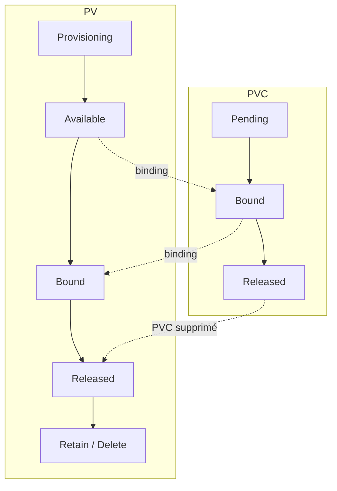

Les pods sont éphémères. Quand un pod est supprimé ou recréé, son système de fichiers disparaît avec lui. Pour les workloads qui ont besoin de conserver des données — bases de données, systèmes de fichiers partagés, queues persistantes — Kubernetes fournit un système de stockage découplé du cycle de vie des pods.

<!--truncate-->

## Le problème du stockage éphémère

Un conteneur démarre avec un système de fichiers vide issu de son image. Tout ce qu'il écrit existe uniquement dans la couche container — si le pod crashe et est recréé, ces données sont perdues. C'est le comportement attendu pour un frontend ou une API stateless, mais pas pour une base de données.

Kubernetes résout ce problème avec trois ressources qui séparent les responsabilités : PersistentVolume (le stockage réel), PersistentVolumeClaim (la demande de stockage par un pod), et StorageClass (la politique de provisionnement).

## PersistentVolume

Un PersistentVolume (PV) est une ressource cluster qui représente une unité de stockage physique — un disque NFS, un volume EBS, un répertoire local. Il est provisionné par un administrateur ou automatiquement, et existe indépendamment des pods qui l'utilisent.

```yaml
apiVersion: v1
kind: PersistentVolume
metadata:
  name: postgres-pv
spec:
  capacity:
    storage: 10Gi
  accessModes:
    - ReadWriteOnce
  persistentVolumeReclaimPolicy: Retain
  storageClassName: standard
  hostPath:
    path: /mnt/data
```

`accessModes` définit comment le volume peut être monté :

| Mode | Signification |
|------|---------------|
| `ReadWriteOnce` | Un seul nœud en lecture/écriture |
| `ReadOnlyMany` | Plusieurs nœuds en lecture seule |
| `ReadWriteMany` | Plusieurs nœuds en lecture/écriture (NFS, CephFS) |

`persistentVolumeReclaimPolicy` contrôle ce qui arrive au PV quand le PVC associé est supprimé : `Retain` conserve les données, `Delete` supprime le volume sous-jacent.

## PersistentVolumeClaim

Un PersistentVolumeClaim (PVC) est une demande de stockage émise par un pod. Il décrit les besoins — capacité, mode d'accès, classe de stockage — et Kubernetes lui associe un PV compatible.

```yaml
apiVersion: v1
kind: PersistentVolumeClaim
metadata:
  name: postgres-pvc
spec:
  accessModes:
    - ReadWriteOnce
  resources:
    requests:
      storage: 10Gi
  storageClassName: standard
```

Le pod monte ensuite le PVC comme un volume :

```yaml
spec:
  containers:
    - name: postgres
      image: postgres:16-alpine
      volumeMounts:
        - name: data
          mountPath: /var/lib/postgresql/data
  volumes:
    - name: data
      persistentVolumeClaim:
        claimName: postgres-pvc
```

## Cycle de vie


```mermaid
graph TD
  subgraph PV
    A[Provisioning] --> B[Available]
    B --> C[Bound]
    C --> D[Released]
    D --> E[Retain / Delete]
  end

  subgraph PVC
    F[Pending] --> G[Bound]
    G --> H[Released]
  end

  B -.->|binding| G
  G -.->|binding| C
  H -.->|PVC supprimé| D
```

Un PVC en état `Pending` signifie qu'aucun PV compatible n'est disponible — soit il n'existe pas, soit la StorageClass ne peut pas en provisionner un dynamiquement.

## StorageClass

Créer des PVs manuellement pour chaque application n'est pas scalable. Les StorageClasses permettent le provisionnement dynamique : quand un PVC est créé avec une `storageClassName`, Kubernetes appelle le provisioner associé pour créer le PV automatiquement.

```yaml
apiVersion: storage.k8s.io/v1
kind: StorageClass
metadata:
  name: fast
provisioner: kubernetes.io/aws-ebs
parameters:
  type: gp3
  encrypted: "true"
volumeBindingMode: WaitForFirstConsumer
```

`volumeBindingMode: WaitForFirstConsumer` retarde la création du PV jusqu'à ce qu'un pod soit schedulé — le volume est alors créé dans la même zone de disponibilité que le pod, évitant les problèmes de topologie.

En production cloud (EKS, GKE, AKS), une StorageClass par défaut est fournie automatiquement. Sur un cluster on-premise avec kubeadm, il faut configurer un provisioner comme `local-path-provisioner` ou utiliser un système de stockage distribué (Ceph, Longhorn).

## Stockage statique vs dynamique

| | Statique | Dynamique |
|---|---|---|
| Provisionnement | Administrateur crée le PV manuellement | StorageClass crée le PV automatiquement |
| Flexibilité | Faible — taille fixée à l'avance | Élevée — chaque PVC obtient exactement ce qu'il demande |
| Usage | On-premise sans provisioner, stockage spécialisé | Cloud, clusters avec provisioner configuré |

Le provisionnement dynamique est la norme en production. Le statique reste utile pour des volumes pré-existants — un disque NAS déjà monté, un snapshot récupéré — que Kubernetes doit adopter sans recréer.
