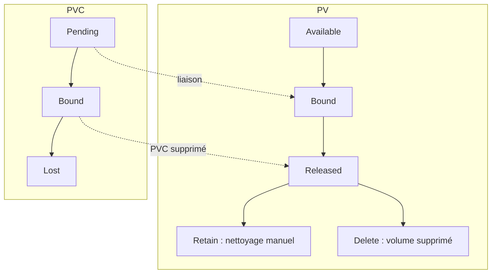

Les pods sont éphémères. Quand un pod est supprimé ou recréé, son système de fichiers disparaît avec lui. Pour les workloads qui ont besoin de conserver des données (bases de données, systèmes de fichiers partagés, queues persistantes), Kubernetes fournit un système de stockage découplé du cycle de vie des pods.

<!--truncate-->

## Le problème du stockage éphémère

Un conteneur démarre avec le système de fichiers de son image. Tout ce qu'il écrit existe uniquement dans sa couche d'écriture : si le conteneur redémarre, et a fortiori si le pod est recréé, ces données sont perdues. C'est le comportement attendu pour un frontend ou une API stateless, mais pas pour une base de données.

Un volume `emptyDir` constitue un premier niveau : ce répertoire partagé entre les conteneurs d'un pod survit aux redémarrages de conteneurs, mais disparaît avec le pod. Il sert de cache ou d'espace d'échange, pas de stockage durable.

Kubernetes résout ce problème avec trois ressources qui séparent les responsabilités : PersistentVolume (le stockage réel), PersistentVolumeClaim (la demande de stockage par un pod), et StorageClass (la politique de provisionnement).

## PersistentVolume

Un PersistentVolume (PV) est une ressource cluster qui représente une unité de stockage physique : un disque NFS, un volume EBS, un répertoire local. Il est provisionné par un administrateur ou automatiquement, et existe indépendamment des pods qui l'utilisent.

```yaml
apiVersion: v1
kind: PersistentVolume
metadata:
  name: postgres-pv
spec:
  capacity:
    storage: 10Gi
  accessModes:
    - ReadWriteOnce
  persistentVolumeReclaimPolicy: Retain
  storageClassName: standard
  hostPath:              # répertoire d'un nœud : réservé aux clusters de test à un seul nœud
    path: /mnt/data
```

`accessModes` définit comment le volume peut être monté :

| Mode | Signification |
|------|---------------|
| `ReadWriteOnce` | Un seul nœud en lecture/écriture (plusieurs pods du même nœud peuvent le monter) |
| `ReadWriteOncePod` | Un seul pod en lecture/écriture, dans tout le cluster |
| `ReadOnlyMany` | Plusieurs nœuds en lecture seule |
| `ReadWriteMany` | Plusieurs nœuds en lecture/écriture (NFS, CephFS, EFS) |

Les modes disponibles dépendent du type de stockage : un disque bloc (EBS, disque persistant GCE) n'offre que `ReadWriteOnce` et `ReadWriteOncePod`, un système de fichiers réseau offre aussi `ReadWriteMany`.

`persistentVolumeReclaimPolicy` contrôle ce qui arrive au PV quand le PVC associé est supprimé : `Retain` conserve le volume et ses données (le PV passe à l'état `Released` et doit être nettoyé manuellement avant réutilisation), `Delete` supprime le volume sous-jacent. Un PV provisionné dynamiquement hérite de la politique de sa StorageClass, `Delete` par défaut : supprimer le PVC d'une base de données supprime alors ses données.

## PersistentVolumeClaim

Un PersistentVolumeClaim (PVC) est une demande de stockage émise par un pod. Il décrit les besoins (capacité, mode d'accès, classe de stockage) et Kubernetes lui associe un PV compatible.

```yaml
apiVersion: v1
kind: PersistentVolumeClaim
metadata:
  name: postgres-pvc
spec:
  accessModes:
    - ReadWriteOnce
  resources:
    requests:
      storage: 10Gi
  storageClassName: standard
```

Le pod monte ensuite le PVC comme un volume :

```yaml
spec:
  containers:
    - name: postgres
      image: postgres:16-alpine
      volumeMounts:
        - name: data
          mountPath: /var/lib/postgresql/data
  volumes:
    - name: data
      persistentVolumeClaim:
        claimName: postgres-pvc
```

## Cycle de vie


```mermaid
graph TD
  subgraph PV
    A[Available] --> B[Bound]
    B --> C[Released]
    C --> D[Retain : nettoyage manuel]
    C --> E[Delete : volume supprimé]
  end

  subgraph PVC
    F[Pending] --> G[Bound]
    G --> H[Lost]
  end

  F -.->|liaison| B
  G -.->|PVC supprimé| C
```

Un PV disponible (`Available`) est lié (`Bound`) à un PVC compatible ; la liaison est exclusive. À la suppression du PVC, le PV passe à `Released` puis suit sa politique de récupération. Côté PVC, l'état `Lost` signale que le PV lié a disparu.

Un PVC en état `Pending` signifie qu'aucun PV compatible n'est disponible : soit il n'existe pas, soit la StorageClass ne peut pas en provisionner un dynamiquement, soit, en mode `WaitForFirstConsumer`, aucun pod ne l'utilise encore. `kubectl describe pvc` en indique la raison dans ses événements.

## StorageClass

Créer des PVs manuellement pour chaque application n'est pas scalable. Les StorageClasses permettent le provisionnement dynamique : quand un PVC est créé avec une `storageClassName`, Kubernetes appelle le provisioner associé pour créer le PV automatiquement.

```yaml
apiVersion: storage.k8s.io/v1
kind: StorageClass
metadata:
  name: fast
provisioner: ebs.csi.aws.com       # driver CSI EBS (le provisioner intégré kubernetes.io/aws-ebs est retiré)
parameters:
  type: gp3
  encrypted: "true"
reclaimPolicy: Delete
allowVolumeExpansion: true         # autorise l'agrandissement d'un PVC existant
volumeBindingMode: WaitForFirstConsumer
```

Le provisioner est un driver CSI (Container Storage Interface), déployé dans le cluster, qui traduit les PVC en appels à l'API du système de stockage. Les provisioners intégrés au code de Kubernetes (`kubernetes.io/aws-ebs`, `kubernetes.io/gce-pd`) ont été retirés au profit des drivers CSI de chaque fournisseur. Avec `allowVolumeExpansion`, augmenter `spec.resources.requests.storage` d'un PVC agrandit le volume et son système de fichiers ; la réduction n'est pas possible.

`volumeBindingMode: WaitForFirstConsumer` retarde la création du PV jusqu'à ce qu'un pod soit schedulé ; le volume est alors créé dans la même zone de disponibilité que le pod, évitant les problèmes de topologie.

Sur les offres managées, une StorageClass par défaut (annotation `storageclass.kubernetes.io/is-default-class: "true"`) est généralement fournie, utilisée par tout PVC sans `storageClassName`. Ce n'est pas systématique : EKS en mode Auto n'en crée aucune (voir l'article [EKS](../05-cloud/2026-06-28-eks.md)). Sur un cluster on-premise avec kubeadm, il faut configurer un provisioner comme `local-path-provisioner` ou utiliser un système de stockage distribué (Ceph via Rook, Longhorn).

## Stockage statique vs dynamique

| | Statique | Dynamique |
|---|---|---|
| Provisionnement | Administrateur crée le PV manuellement | StorageClass crée le PV automatiquement |
| Flexibilité | Faible : taille fixée à l'avance | Élevée : chaque PVC obtient exactement ce qu'il demande |
| Usage | On-premise sans provisioner, stockage spécialisé | Cloud, clusters avec provisioner configuré |

Le provisionnement dynamique est la norme en production. Le statique reste utile pour des volumes pré-existants (un disque NAS déjà monté, un snapshot récupéré) que Kubernetes doit adopter sans recréer.

## Application / Projet lié

<ProjectLinks>
  <ProjectLink to="/docs/projects/professionnel/sonu-k8s-cluster" title="Cluster Kubernetes interne SONU">Stockage statique sans provisionneur dynamique : chaque PersistentVolume est créé à la main, lié à un nœud et à un chemin local, et le volume de Grafana est en politique `Retain`.</ProjectLink>
</ProjectLinks>
