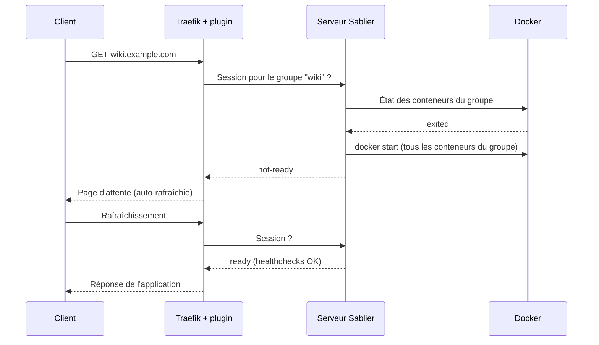

Sur un hôte Docker, certains services consomment des ressources en permanence pour un usage de quelques minutes par semaine : une application JVM embarquant un moteur de conversion bureautique occupe environ 1 Go de RAM au repos, une application web accompagnée de sa base PostgreSQL et de son cache Redis mobilise trois conteneurs pour une consultation mensuelle. Kubernetes traite ce cas par le scale-to-zero ; avec Docker seul, aucun mécanisme natif n'arrête un conteneur inactif ni ne le redémarre à la requête suivante. Sablier comble ce manque : il arrête un groupe de conteneurs après une période sans trafic et le redémarre à la première requête entrante, en s'intégrant au reverse proxy.

<!--truncate-->

## Le scale-to-zero

### Principe

Le scale-to-zero ramène à zéro le nombre d'instances d'un service inactif, puis le relance à la demande. Deux mécanismes sont nécessaires : un **compteur d'activité** qui décide de l'arrêt, et un **point d'interception** des requêtes qui déclenche le réveil et fait patienter le client pendant le démarrage (le « cold start »).

En Kubernetes, **Knative Serving** place un activator devant les services réduits à zéro, qui met les requêtes en tampon pendant le démarrage des pods ; **KEDA** ramène un Deployment à zéro selon des sources d'événements, et son add-on HTTP ajoute un intercepteur équivalent.

Sablier transpose ce modèle à Docker. Le reverse proxy intercepte les requêtes, le serveur Sablier tient les sessions d'activité et pilote les conteneurs via l'API Docker. Là où Kubernetes ajuste un nombre de réplicas, Sablier exécute `docker stop` et `docker start` sur des conteneurs existants.

### Architecture



Trois éléments coopèrent :

- **Le serveur Sablier** (image `sablierapp/sablier`, port 10000 par défaut) : tient une session par groupe, prolongée à chaque requête, et arrête les conteneurs du groupe à son expiration. Le provider `docker` lui donne accès aux conteneurs via le socket Docker.
- **Le plugin Traefik** (`sablierapp/sablier-traefik-plugin`) : un middleware qui, à chaque requête, interroge le serveur Sablier et laisse passer la requête, sert une page d'attente ou la retient selon la stratégie.
- **Les labels** sur les conteneurs gérés : ils désignent les conteneurs concernés et leur groupe.

Le serveur Sablier doit être joignable par Traefik (même réseau Docker), mais n'a pas besoin d'être exposé publiquement : aucun label `traefik.enable` ne lui est attribué.

## Mise en place

### Traefik : déclarer le plugin

Les plugins Traefik se déclarent en **configuration statique** (voir la distinction statique/dynamique dans l'article [Traefik](../02-network/2025-06-09-traefik.md)) : Traefik télécharge le module au démarrage. Un ajout ou un changement de version impose donc un redémarrage de Traefik.

```yaml
command:
  - --experimental.plugins.sablier.modulename=github.com/sablierapp/sablier-traefik-plugin
  - --experimental.plugins.sablier.version=v1.3.1
```

Par défaut, le provider Docker de Traefik ignore les conteneurs qui ne sont pas à l'état `running` : dès qu'un conteneur s'arrête, son routeur disparaît et Traefik répond 404, sans jamais exécuter le middleware Sablier. Le label `traefik.docker.allownonrunning=true`, disponible à partir de **Traefik v3.6.0**, conserve la configuration d'un conteneur arrêté : le service existe avec une liste de serveurs vide et la chaîne de middlewares s'exécute. Avant cette version, la configuration du middleware devait être portée ailleurs que sur le conteneur endormi (provider File, par exemple).

### Le serveur Sablier et le socket Docker

Sablier monte le socket Docker en **lecture-écriture**, là où Traefik se contente de la lecture seule : arrêter et démarrer des conteneurs sont des écritures sur l'API. Cet accès équivaut à root sur l'hôte, puisqu'il permet de lancer un conteneur privilégié. La documentation de Sablier décrit l'usage d'un proxy de socket (`linuxserver/socket-proxy` avec `CONTAINERS=1`, `EVENTS=1`, `POST=1`) qui restreint l'API exposée, Sablier s'y connectant via `DOCKER_HOST=tcp://socket-proxy:2375`.

### Les labels de groupe

Un groupe rassemble les conteneurs qui dorment et se réveillent ensemble. Le label `sablier.enable=true` place le conteneur sous gestion, `sablier.group=<nom>` l'affecte à un groupe (plusieurs groupes possibles, séparés par des virgules).

Le label doit figurer sur **tous** les conteneurs du groupe, pas uniquement sur celui qui reçoit le trafic HTTP. Endormir l'application en laissant tourner sa base PostgreSQL et son cache ne libère qu'une partie des ressources.

Sablier démarre les conteneurs par l'API Docker, sans passer par Compose : les conditions `depends_on` ne sont pas évaluées au réveil. L'application doit tolérer une base de données pas encore prête au moment de son démarrage (reconnexion ou politique de redémarrage).

### Le middleware sur le routeur

Le middleware se configure par labels sur le conteneur exposé :

| Option | Rôle |
|---|---|
| `sablierUrl` | URL du serveur Sablier vue depuis Traefik (`http://sablier:10000`) |
| `group` | Groupe à réveiller |
| `sessionDuration` | Durée d'inactivité avant arrêt, prolongée à chaque requête |
| `dynamic.*` | Stratégie avec page d'attente : `displayName`, `showDetails`, `theme`, `refreshFrequency` |
| `blocking.timeout` | Stratégie bloquante : durée maximale de rétention de la requête |

Les deux stratégies sont exclusives :

- **`dynamic`** renvoie une page HTML d'attente qui se rafraîchit (toutes les 5 s par défaut) jusqu'à ce que le groupe soit prêt. Thèmes intégrés : `hacker-terminal` (défaut), `ghost`, `matrix`, `shuffle`. Adaptée à un accès depuis un navigateur.
- **`blocking`** retient la requête jusqu'à ce que le groupe soit prêt ou que le délai expire, puis la transmet. Adaptée aux appels serveur-à-serveur (API, webhook, contenu chargé en iframe), pour lesquels une page HTML d'attente serait une réponse erronée.

Les labels Docker lus par Traefik sont insensibles à la casse : `sablierUrl` et `sablierurl` sont équivalents.

### Ordre des middlewares

Traefik exécute les middlewares dans l'ordre de la liste. Placer le middleware d'authentification **avant** Sablier (`middlewares=auth@file,wiki-sablier`) garantit qu'une requête anonyme est rejetée avant d'atteindre Sablier : un robot qui parcourt les sous-domaines ne réveille rien. Dans l'ordre inverse, chaque requête non authentifiée démarre le groupe et prolonge sa session. Le middleware de forward-auth est décrit dans l'article [Authelia : forward auth](../02-network/2026-08-02-authelia-forward-auth.md).

## Healthcheck : distinguer démarré et prêt

Sablier déclare un conteneur prêt selon son healthcheck : sans healthcheck, il le considère prêt dès l'état `running`, alors que l'application n'écoute pas encore. La première requête transmise aboutit alors à une erreur 502. Avec un healthcheck, l'état `ready` n'est atteint qu'une fois le conteneur `healthy`.

La difficulté vient des images minimalistes, sans `curl` ni `wget`, parfois sans shell. Trois approches :

```yaml
# Outil présent dans l'image
healthcheck:
  test: ["CMD", "curl", "-f", "http://localhost:3000/api/health"]

# Image Python sans curl : sonde via la bibliothèque standard
healthcheck:
  test: ["CMD", "python", "-c", "import urllib.request; urllib.request.urlopen('http://localhost:8000/health', timeout=3)"]

# Bases de données : outil client fourni par l'image
healthcheck:
  test: ["CMD-SHELL", "pg_isready -U $${POSTGRES_USER}"]
```

Une image distroless expose parfois une sous-commande de sonde dans son propre binaire (`traefik healthcheck --ping` en est un exemple) : la documentation de l'image est à consulter avant de conclure qu'aucun healthcheck n'est possible. Pour un conteneur sans service réseau, le label `sablier.ready-on-start=true` déclare le conteneur prêt dès son démarrage.

## Exemple complet

```yaml
name: platform

services:
  traefik:
    image: traefik:v3.7
    command:
      - --providers.docker.exposedByDefault=false
      - --providers.docker.network=proxy
      - --entrypoints.websecure.address=:443
      - --experimental.plugins.sablier.modulename=github.com/sablierapp/sablier-traefik-plugin
      - --experimental.plugins.sablier.version=v1.3.1
    ports:
      - "443:443"
    volumes:
      - /var/run/docker.sock:/var/run/docker.sock:ro
    networks: [proxy]
    restart: unless-stopped

  sablier:
    image: sablierapp/sablier:1.18.0
    command:
      - start
      - --provider.name=docker
      - --server.metrics.enabled=true # expose /metrics pour Prometheus
    volumes:
      - /var/run/docker.sock:/var/run/docker.sock # lecture-écriture
    networks: [proxy]
    restart: unless-stopped

  wiki:
    image: example/wiki:2.5
    environment:
      DATABASE_URL: postgresql://wiki:${DB_PASSWORD}@db:5432/wiki
    healthcheck:
      test: ["CMD", "curl", "-f", "http://localhost:3000/health"]
      interval: 10s
      retries: 5
    labels:
      - traefik.enable=true
      - traefik.http.routers.wiki.rule=Host(`wiki.example.com`)
      - traefik.http.routers.wiki.entrypoints=websecure
      - traefik.http.routers.wiki.middlewares=auth@file,wiki-sablier
      - traefik.http.services.wiki.loadbalancer.server.port=3000
      - traefik.docker.allownonrunning=true # routeur conservé à l'arrêt
      - sablier.enable=true
      - sablier.group=wiki
      - traefik.http.middlewares.wiki-sablier.plugin.sablier.sablierUrl=http://sablier:10000
      - traefik.http.middlewares.wiki-sablier.plugin.sablier.group=wiki
      - traefik.http.middlewares.wiki-sablier.plugin.sablier.sessionDuration=30m
      - traefik.http.middlewares.wiki-sablier.plugin.sablier.dynamic.displayName=Wiki
    networks: [proxy, internal]
    restart: unless-stopped

  db:
    image: postgres:17-alpine
    environment:
      POSTGRES_USER: wiki
      POSTGRES_PASSWORD: ${DB_PASSWORD}
    healthcheck:
      test: ["CMD-SHELL", "pg_isready -U wiki"]
      interval: 10s
      retries: 5
    labels: # même groupe : la base dort avec l'application
      - sablier.enable=true
      - sablier.group=wiki
    volumes:
      - wiki_db:/var/lib/postgresql/data
    networks: [internal]
    restart: unless-stopped

volumes:
  wiki_db:

networks:
  proxy:
    name: proxy
  internal:
```

En pratique, Traefik, Sablier et chaque application vivent dans des stacks distinctes reliées par le réseau externe `proxy`. `restart: unless-stopped` a son importance : un conteneur arrêté par `docker stop` reste arrêté au redémarrage du démon Docker, alors qu'avec `restart: always` tous les services endormis se réveilleraient au redémarrage de l'hôte.

## Choisir les candidats

Deux critères cumulatifs :

1. **Un poids réel au repos.** Le gain se mesure (`docker stats`) : une JVM, un moteur OCR ou de conversion, une pile de plusieurs conteneurs justifient la mise en place ; un binaire Go de 20 Mo ne la justifie pas, et le cold start dégrade l'expérience pour un gain nul.
2. **Un usage réellement sporadique**, au sens du trafic et pas de l'humain. Une application de synchronisation (client desktop ou mobile qui interroge le serveur toutes les minutes), un onglet laissé ouvert qui maintient une websocket ou fait du polling : chaque requête prolonge la session, et le service ne s'endort jamais.

Un troisième critère élimine les services qui travaillent en arrière-plan : tâches planifiées, évaluation d'alertes, synchronisation périodique. Un outil de dashboards peut dormir si l'alerting est porté par un autre composant (Prometheus et Alertmanager) ; s'il évalue lui-même les règles d'alerte, l'endormir suspend la détection des pannes.

## Pièges

### Les prunes suppriment les conteneurs endormis

Pour Docker, un conteneur endormi par Sablier est un conteneur `exited` comme un autre. `docker container prune` et `docker system prune` suppriment tous les conteneurs arrêtés : après un nettoyage, `docker start` échoue sur un conteneur qui n'existe plus et le service ne peut plus se réveiller. Le symptôme apparaît de façon différée et sans lien apparent, par exemple après le déploiement d'une autre stack qui se termine par un prune.

`docker network prune` produit le même effet par un autre chemin : un réseau dont tous les conteneurs sont arrêtés est considéré comme inutilisé et supprimé, et le conteneur endormi, qui référence l'identifiant de ce réseau, refuse ensuite de démarrer. Seuls `docker image prune -a` (une image utilisée par un conteneur, même arrêté, est conservée) et `docker builder prune` restent compatibles avec le scale-to-zero. Le détail figure dans l'article sur le [déploiement continu de stacks Compose](../04-ci-cd/2026-08-23-github-actions-deploiement-compose.md).

### Les conteneurs démarrés hors de Sablier

Un `docker compose up -d` lancé par un déploiement démarre aussi les conteneurs endormis du groupe. Au démarrage de Sablier, `--provider.auto-stop-on-startup` (activé par défaut) arrête les conteneurs gérés qu'il n'a pas lui-même démarrés. En fonctionnement, `--provider.auto-stop-externally-started` les arrête immédiatement, et `--provider.auto-warm-externally-started` leur attribue à la place une session de durée par défaut.

### Plusieurs conteneurs arrêtés pour un même routeur

La documentation de Traefik précise que, lorsque plusieurs conteneurs arrêtés déclarent le même routeur avec des configurations divergentes, ce routeur est abandonné. Les labels de routage doivent donc être portés par un seul conteneur du groupe.

### Le monitoring d'uptime voit un service endormi comme en panne

Un check HTTP classique sur un service géré par Sablier échoue à chaque mise en veille : faux positif garanti. À l'inverse, un check qui passe par Traefik réveille le service et prolonge sa session : le service ne dort plus jamais. L'option `ignoreUserAgent` du plugin répond 200 sans réveil aux requêtes d'un User-Agent donné, mais le check ne mesure alors plus rien.

La condition correcte s'exprime ainsi : **alerter si le groupe est censé être actif et que le service ne répond pas**. Elle combine deux informations, ce que la plupart des outils d'uptime aux conditions binaires ne savent pas faire. Prometheus le sait, à partir de deux métriques :

- `sablier_group_active_instances{group="wiki"}`, exposée par Sablier avec `--server.metrics.enabled=true` : nombre d'instances actives du groupe ;
- `probe_success{instance="http://wiki:3000/health"}`, produite par [blackbox_exporter](../07-monitoring/2025-11-21-prometheus-introduction.md) : 1 si la sonde HTTP réussit, 0 sinon.

```promql
sum(sablier_group_active_instances{group="wiki"} or vector(0))
  * (1 - sum(probe_success{instance="http://wiki:3000/health"}))
```

Lecture terme à terme :

- `sablier_group_active_instances{...} or vector(0)` : si la série est absente, `or` lui substitue la valeur 0. Quand elle existe, `vector(0)`, sans label, s'ajoute quand même au résultat car son ensemble de labels diffère : le `sum` externe agrège le tout en une valeur unique.
- `1 - sum(probe_success{...})` vaut 0 si le service répond, 1 sinon.
- Le produit vaut **0** si le groupe dort (premier facteur nul, quel que soit le résultat de la sonde) ou s'il est actif et répond ; il vaut **1** uniquement si le groupe est actif et que la sonde échoue.

La sonde doit viser l'URL **interne** du conteneur (nom de service sur le réseau Docker), jamais l'URL publique : passer par Traefik réveillerait le service à chaque scrape. Côté Prometheus, le job blackbox suit le schéma de relabeling standard :

```yaml
- job_name: blackbox
  metrics_path: /probe
  params:
    module: [http_2xx]
  static_configs:
    - targets: ["http://wiki:3000/health"]
  relabel_configs:
    - source_labels: [__address__]
      target_label: __param_target   # URL sondée
    - source_labels: [__param_target]
      target_label: instance         # label utilisé dans la requête PromQL
    - target_label: __address__
      replacement: blackbox-exporter:9115
```

L'expression sert ensuite de règle d'alerte (`expr: ... > 0` avec un `for:` de quelques minutes, qui absorbe la fenêtre de démarrage pendant laquelle le groupe peut être compté actif sans que l'application réponde encore ; voir l'article [Alertmanager](../07-monitoring/2026-09-20-prometheus-alertmanager.md)), ou d'endpoint pour un outil d'uptime qui compare le résultat de l'API Prometheus à 0. Limite : si la série `probe_success` disparaît (exporter arrêté, cible retirée), le produit est vide et aucune alerte ne se déclenche. Sablier lui-même doit rester surveillé par un check classique : s'il tombe, plus aucun service ne se réveille.

## Application / Projet lié

<ProjectLinks>
  <ProjectLink to="/docs/projects/personnel/homelab" title="HomeLab">Scale-to-zero de plusieurs stacks à usage sporadique (application web avec base de données, stockage objet et cache, outil de dashboards, boîte à outils PDF sur JVM), derrière un middleware d'authentification, avec détection des pannes réelles par Prometheus et blackbox_exporter.</ProjectLink>
</ProjectLinks>

## Conclusion

Sablier apporte à Docker le scale-to-zero que Knative et KEDA fournissent à Kubernetes, au prix de quatre prérequis : Traefik v3.6 ou plus récent avec `allownonrunning`, un healthcheck sur chaque conteneur du groupe, un middleware d'authentification placé avant lui, et un monitoring qui tient compte de l'état de sommeil. Le risque principal ne vient pas de Sablier mais de l'hôte : tout outil qui considère un conteneur arrêté ou un réseau sans conteneur actif comme un déchet rend le réveil impossible.
