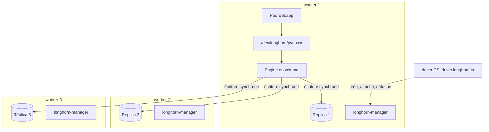

Sur un cluster on-premise sans provisionneur dynamique, le stockage persistant repose souvent sur des PersistentVolumes `local` ou `hostPath` : un répertoire d'un nœud précis, déclaré à la main. Le pod qui consomme le volume est épinglé à ce nœud ; si celui-ci tombe, aucun pod ne peut être replanifié ailleurs, puisque les données n'existent nulle part ailleurs. Longhorn, projet de la CNCF, fournit à la place des volumes bloc répliqués de façon synchrone sur plusieurs nœuds, exposés à Kubernetes par un driver CSI.

<!--truncate-->

## Le stockage local lié au nœud

L'article [Kubernetes : stockage](./2025-01-12-k8s-storage.md) présente PV, PVC et StorageClass. Un PV de type `local` porte obligatoirement une `nodeAffinity` sur `kubernetes.io/hostname` : le scheduler ne place le pod consommateur que sur ce nœud, ici `worker-1`. La panne de ce nœud rend indisponibles toutes les applications dont les données y résident, quel que soit le nombre de nœuds sains ; réplication des pods, [PodDisruptionBudget et répartition topologique](./2026-04-03-kubernetes-haute-disponibilite-pdb.md) n'y changent rien. Par commodité, les PV finissent en outre souvent tous sur le même nœud, qui devient le plus critique du cluster.

Parmi les alternatives, `local-path-provisioner` automatise la création des PV mais chaque volume reste attaché au nœud où il a été créé. Un serveur NFS déplace le point unique de défaillance sur ce serveur. Ceph (via Rook) réplique les données mais son exploitation vise des clusters plus grands. Longhorn occupe l'espace intermédiaire : un stockage répliqué installé par un chart Helm sur les disques des nœuds existants.

## Architecture



- **Longhorn Manager** : un DaemonSet qui crée les volumes, place les réplicas et pilote attachements, snapshots et reconstructions. L'état vit dans des ressources personnalisées (`volumes.longhorn.io`, `replicas.longhorn.io`...) du namespace `longhorn-system`.
- **Engine** : un contrôleur par volume, lancé sur le nœud du pod consommateur. Il expose un périphérique bloc local (`/dev/longhorn/<volume>`, via iSCSI pour le moteur v1) et réplique chaque écriture de façon synchrone vers tous les réplicas.
- **Réplicas** : des copies complètes du volume, stockées en fichiers sous `/var/lib/longhorn` sur des nœuds distincts. Avec N réplicas, le volume tolère N-1 pertes.
- **Driver CSI** : le provisioner `driver.longhorn.io`, qui traduit PVC et attachements Kubernetes en opérations Longhorn. Une UI web (`longhorn-frontend`) complète l'ensemble.

Le volume Longhorn porte le même nom que le PV Kubernetes (`pvc-<uuid>`) :

```bash
kubectl -n apps get pvc webapp-data -o jsonpath='{.spec.volumeName}'   # pvc-<uuid>
kubectl -n longhorn-system get volumes.longhorn.io pvc-<uuid> \
  -o custom-columns=STATE:.status.state,ROBUSTNESS:.status.robustness,NODE:.status.currentNodeID
```

`ROBUSTNESS` vaut `healthy`, `degraded` (au moins un réplica sain, reconstruction possible) ou `faulted` (aucun réplica sain). Après la perte d'un nœud, Longhorn attend `replica-replenishment-wait-interval` (600 s par défaut) avant de reconstruire ailleurs, pour réutiliser les données si le nœud revient.

Un nœud sans disque Longhorn, comme un control-plane exclu du stockage, peut tout de même attacher un volume : l'engine y tourne et joint les réplicas par le réseau. Côté prérequis, chaque nœud doit disposer d'`open-iscsi` avec le démon `iscsid` actif, de la propagation de montage et d'un système de fichiers ext4 ou XFS pour le chemin de données ; les volumes `ReadWriteMany` et les backups NFS demandent un client NFSv4. `longhornctl check preflight` vérifie ces conditions sur tout le cluster.

## Installation et choix de configuration

Le chart officiel `longhorn/longhorn` s'installe dans `longhorn-system`. Plusieurs valeurs par défaut méritent d'être revues :

```yaml
# values.yaml
defaultSettings:
  defaultDataPath: /var/lib/longhorn
  defaultReplicaCount: 3
  # Espace libre minimal sous lequel un disque n'accepte plus de réplica
  storageMinimalAvailablePercentage: 25
  # Disque par défaut créé uniquement sur les nœuds labellisés
  createDefaultDiskLabeledNodes: true

persistence:
  defaultClass: false          # défaut du chart : true
  defaultClassReplicaCount: 3
  reclaimPolicy: Retain        # défaut du chart : Delete
```

```bash
helm repo add longhorn https://charts.longhorn.io && helm repo update longhorn
helm upgrade longhorn longhorn/longhorn --version 1.12.1 --install --wait --atomic \
  -n longhorn-system --create-namespace --values values.yaml

# Disque par défaut sur les workers uniquement
kubectl label node worker-1 worker-2 worker-3 node.longhorn.io/create-default-disk=true
```

| Valeur | Effet | Motivation |
|---|---|---|
| `defaultClass: false` | La StorageClass `longhorn` n'est pas la classe par défaut du cluster | Pendant la migration, un PVC sans classe ne part pas sur Longhorn par accident |
| `reclaimPolicy: Retain` | Supprimer un PVC laisse le PV en `Released` et le volume intact | Un `helm upgrade` dont le template de PVC a disparu supprime le PVC ; en `Delete`, les données suivent |
| `defaultReplicaCount` / `defaultClassReplicaCount: 3` | Trois copies par volume | Tolère deux pertes ; exige trois nœuds avec disque (pas deux réplicas d'un volume sur un même nœud par défaut) |
| `storageMinimalAvailablePercentage: 25` | Un disque sous 25 % d'espace libre ne reçoit plus de réplica | Valeur par défaut, à ne pas abaisser sur un nœud dont le disque système porte aussi les données |
| `createDefaultDiskLabeledNodes: true` | Pas de disque créé automatiquement sur les nœuds non labellisés | Exclut le control-plane du pool de réplicas |

La capacité utile se calcule en divisant la capacité brute par le nombre de réplicas : 3 To de disques en 3 réplicas offrent environ 1 To de volumes.

L'UI n'a aucune authentification propre alors qu'elle permet de supprimer un volume : elle ne s'expose que derrière une authentification, par exemple un middleware [forward-auth](../02-network/2026-08-02-authelia-forward-auth.md) sur la route du reverse proxy, ou se consulte par `kubectl -n longhorn-system port-forward svc/longhorn-frontend 8080:80`.

Avant toute donnée réelle, un PVC de test valide la répartition des réplicas sur trois nœuds, puis un `kubectl drain` d'un nœud porteur simule une panne : le volume passe en `degraded` puis redevient `healthy`.

## Volumes RWO et stratégie de déploiement

Un volume Longhorn `ReadWriteOnce` ne s'attache qu'à un seul nœud à la fois. Cette contrainte interagit mal avec la stratégie `RollingUpdate` par défaut des Deployments, décrite dans [Kubernetes : déploiements sans interruption](./2026-04-04-kubernetes-rolling-update-ressources.md) : le nouveau pod est créé avant que l'ancien ne soit arrêté. S'il est planifié sur un autre nœud, l'attachement échoue :

```text
Warning  FailedAttachVolume  Multi-Attach error for volume "pvc-<uuid>"
         Volume is already used by pod(s) webapp-7d9c...
```

Le nouveau pod reste en `ContainerCreating` et le rollout se bloque. Le blocage est aléatoire, puisqu'il dépend du nœud choisi par le scheduler ; avec un stockage `local`, il n'apparaissait jamais, le PV forçant les deux pods sur le même nœud.

La correction consiste à passer les Deployments qui montent un volume RWO en `Recreate` :

```yaml
apiVersion: apps/v1
kind: Deployment
metadata:
  name: webapp
spec:
  replicas: 1
  strategy:
    type: Recreate     # l'ancien pod libère le volume avant la création du nouveau
```

La courte interruption est inhérente à une instance unique sur volume RWO. Pour une base SQLite, `Recreate` garantit en plus que deux instances n'écrivent jamais en même temps. Les StatefulSets ne sont pas concernés : leur mise à jour supprime un pod avant de le recréer.

La panne d'un nœud produit le même blocage : l'ancien pod reste en `Terminating` sur le nœud injoignable et le volume y reste attaché. Le réglage `node-down-pod-deletion-policy` (`do-nothing` par défaut, ou `delete-deployment-pod`, `delete-statefulset-pod`, `delete-both-statefulset-and-deployment-pod`) autorise Longhorn à forcer la suppression du pod bloqué ; sinon, l'intervention est manuelle :

```bash
kubectl -n apps delete pod webapp-7d9c... --grace-period=0 --force
```

## Migrer un volume existant

Le champ `storageClassName` d'un PVC est immuable : modifier la classe dans un chart Helm ne migre rien, `helm upgrade` échoue. La migration passe par un nouveau PVC et une copie des données application par application, des plus reconstructibles (cache) aux plus sensibles.

```text
1. créer le PVC Longhorn       webapp-data-longhorn (même taille ou plus)
2. arrêter l'application      kubectl scale deploy/webapp --replicas=0
3. copier                      Job rsync : ancien PVC -> nouveau PVC
4. basculer                    template Helm : le Deployment monte le nouveau PVC
5. redémarrer et vérifier      contrôle applicatif
6. conserver l'ancien PV       filet de sécurité quelques jours, puis purge
```

Le Job de copie n'a besoin d'aucune affinité : la `nodeAffinity` de l'ancien PV le place sur le bon nœud, où le volume Longhorn s'attache sans contrainte.

```yaml
apiVersion: batch/v1
kind: Job
metadata:
  name: webapp-migrate
  namespace: apps
spec:
  backoffLimit: 0
  template:
    spec:
      restartPolicy: Never
      containers:
        - name: rsync
          image: alpine:3.20
          command: ["/bin/sh", "-c"]
          args:
            - apk add --no-cache rsync && rsync -aHAX --numeric-ids --info=progress2 /old/ /new/
          volumeMounts:
            - { name: old, mountPath: /old, readOnly: true }
            - { name: new, mountPath: /new }
      volumes:
        - name: old
          persistentVolumeClaim: { claimName: webapp-data }
        - name: new
          persistentVolumeClaim: { claimName: webapp-data-longhorn }
```

`-aHAX --numeric-ids` conserve propriétaires numériques, liens physiques, ACL et attributs étendus : une base dont le répertoire change de propriétaire refuse de démarrer. Tant que l'ancien PV existe, le retour arrière consiste à repointer le Deployment sur l'ancien PVC.

### Pièges de la bascule

- **Ancien PVC dans le chart** : retirer son template fait supprimer le PVC au prochain `helm upgrade`. Le conserver un temps avec `storageClassName: local-storage` écrit en dur, et non plus lu dans `values.yaml`, évite toute tentative de modifier ce champ immuable.
- **PVC hors release** : un PVC créé à la main puis repris dans le chart provoque un conflit au premier `helm upgrade` (`invalid ownership metadata`). L'adoption passe par le label `app.kubernetes.io/managed-by: Helm` et les annotations `meta.helm.sh/release-name` et `meta.helm.sh/release-namespace`.
- **Épinglage résiduel** : un `nodeSelector` ou une `affinity` sur le nom d'hôte hérités du stockage local annulent le bénéfice de la migration s'ils restent en place.
- **StatefulSet** : les `volumeClaimTemplates` sont immuables et le nom du PVC est déterministe (`<template>-<statefulset>-<ordinal>`). Changer la classe impose de supprimer le StatefulSet sans ses pods ni ses PVC (`kubectl delete statefulset <nom> --cascade=orphan`), de créer le nouveau PVC Longhorn sous **le même nom** une fois les données copiées, puis de laisser Helm recréer le StatefulSet, qui adopte le PVC existant. Un StatefulSet supprimé puis oublié ne déclenche aucune alerte par lui-même.
- **Données restées éphémères** : une TSDB Prometheus en `emptyDir` perd son historique à chaque redémarrage. Un PVC dimensionné sur la volumétrie observée (20 Gi pour environ 5 Go sur 15 jours) et `--storage.tsdb.retention.size` à environ 80 % du volume évitent la perte comme la saturation.

## Snapshots, RecurringJob et backups

### Snapshot

Un snapshot Longhorn est un disque différentiel : le volume est une chaîne de couches dont chaque snapshot fige l'état à un instant. Il est stocké **sur les mêmes réplicas que le volume** et sa création n'interrompt pas l'application.

Il est *crash-consistent* : il équivaut à l'état du disque après une coupure de courant, dont PostgreSQL ou MariaDB se remettent en rejouant leur journal au démarrage.

Un snapshot ponctuel (bouton **Take Snapshot** de l'UI, ou ressource `Snapshot` avec `spec.volume` et `createSnapshot: true`) échappe à toute rétention et se supprime à la main ; il s'impose avant toute migration ou mise à jour risquée.

### RecurringJob

Une `RecurringJob` planifie un snapshot ou un backup pour un ensemble de volumes :

```yaml
apiVersion: longhorn.io/v1beta2
kind: RecurringJob
metadata:
  name: webapp-snapshot
  namespace: longhorn-system
spec:
  task: snapshot       # snapshot, backup, snapshot-cleanup, snapshot-delete, filesystem-trim...
  cron: "0 3 * * *"
  retain: 7            # nombre de snapshots conservés par volume
  concurrency: 1       # volumes traités en parallèle
  groups:
    - webapp
  labels: {}           # labels posés sur les snapshots créés
```

Un volume rejoint un job ou un groupe par un label **sur le volume Longhorn** :

```text
recurring-job.longhorn.io/<nom-du-job>=enabled
recurring-job-group.longhorn.io/<nom-du-groupe>=enabled
```

Ces labels se posent naturellement sur le PVC, géré par le chart. Longhorn ne les recopie vers le volume que si le PVC porte aussi `recurring-job.longhorn.io/source: enabled` ; la synchronisation du PVC vers le volume est alors périodique et couvre les ajouts comme les retraits de labels.

```yaml
apiVersion: v1
kind: PersistentVolumeClaim
metadata:
  name: webapp-data
  labels:
    recurring-job.longhorn.io/source: enabled
    recurring-job-group.longhorn.io/webapp: enabled
spec:
  storageClassName: longhorn
  accessModes: [ReadWriteOnce]
  resources:
    requests:
      storage: 10Gi
```

Trois pièges en découlent :

- **Valeur exacte** : seule la valeur `enabled` est reconnue. `source: enable` est ignoré sans erreur ni événement ; le volume ne reçoit jamais le label de groupe, et le seul symptôme est l'absence de snapshots.
- **PVC issu d'un `volumeClaimTemplate`** : immuable, et pas toujours exposé par un chart tiers. Le label de groupe se pose alors sur le volume (`kubectl -n longhorn-system label volumes.longhorn.io pvc-<uuid> recurring-job-group.longhorn.io/webapp=enabled`), et doit être reposé si le PVC est recréé.
- **Groupe `default`** : un volume sans aucun job y est placé automatiquement. Une RecurringJob qui cible `default` couvre donc tous les volumes non configurés.

Le contrôle se fait sur le volume, pas sur le PVC :

```bash
kubectl -n longhorn-system get volumes.longhorn.io pvc-<uuid> --show-labels
kubectl -n longhorn-system get snapshots.longhorn.io | grep pvc-<uuid>
```

### Snapshot n'est pas backup

Les snapshots vivent dans le cluster, sur les réplicas du volume. Ils protègent contre une erreur applicative, pas contre la perte du cluster ni la suppression du volume. La réplication protège contre la panne d'un nœud mais propage instantanément une corruption à toutes les copies.

Le backup Longhorn est une version aplatie d'un snapshot, envoyée vers une **cible externe** (S3 ou compatible, NFS, SMB/CIFS, Azure Blob) de façon incrémentale par blocs de 2 Mo : seuls les blocs modifiés depuis le backup précédent sont transférés. La cible se déclare dans les valeurs du chart :

```yaml
defaultBackupStore:
  backupTarget: s3://longhorn-backups@us-east-1/cluster-a/
  backupTargetCredentialSecret: longhorn-s3   # AWS_ACCESS_KEY_ID, AWS_SECRET_ACCESS_KEY, AWS_ENDPOINTS
```

`AWS_ENDPOINTS` permet de viser un stockage objet compatible S3 auto-hébergé, comme [Garage](../05-cloud/2026-09-06-s3-garage.md), à condition qu'il soit hors du cluster sauvegardé. Une RecurringJob de `task: backup` planifie ensuite les envois. La logique 3-2-1 de [Docker : sauvegarde des volumes](../03-containerization/2026-09-13-docker-volume-backup.md) s'applique à l'identique, et un dump SQL reste complémentaire : il permet une restauration partielle sans dépendre de Longhorn.

## Restauration testée

Une sauvegarde jamais restaurée n'a qu'une valeur supposée. Deux opérations se distinguent.

**Revenir à un snapshot** (revert) remplace le contenu du volume par celui du snapshot et efface toutes les écritures postérieures. Longhorn l'exige en *mode maintenance*, attaché sans périphérique bloc exposé : arrêter l'application, attendre `detached`, attacher en mode maintenance depuis l'UI, **Revert**, détacher, redémarrer. Un snapshot pris juste avant le revert permet de l'annuler.

**Cloner un snapshot** dans un volume neuf permet de vérifier son contenu sans toucher la production. Sans contrôleur `VolumeSnapshot` CSI installé, le clone se fait au niveau Longhorn :

```yaml
apiVersion: longhorn.io/v1beta2
kind: Volume
metadata:
  name: webapp-restoretest
  namespace: longhorn-system
spec:
  size: "10737418240"                 # taille du volume source, en octets
  numberOfReplicas: 1                 # suffisant pour un test
  dataSource: "snap://pvc-<uuid>/<nom-du-snapshot>"
  frontend: blockdev
  dataEngine: v1
  accessMode: rwo
```

Une fois `.status.cloneStatus.state` du volume à `completed`, un PV statique le référence (`csi.driver: driver.longhorn.io`, `volumeHandle: webapp-restoretest`, `fsType: ext4`) avec `storageClassName: longhorn-static`, simple étiquette de correspondance sans provisionnement, et un PVC le réclame explicitement par `volumeName`. Un pod jetable de la même version majeure que la base monte ce PVC, démarre sur une configuration minimale (socket local, authentification `trust`, aucune écoute réseau) et répond à une requête de contrôle comparée à la production. Deux détails font échouer le premier essai : le pod doit tourner avec l'UID propriétaire des fichiers, et un `fsGroup` élargit les permissions du répertoire de données, que PostgreSQL exige en `0700`.

Le nettoyage supprime pod, PVC, PV puis volume Longhorn. La restauration réelle suit le même chemin et gagne à être rédigée pendant ce test plutôt que le jour de l'incident.

## Limites

- **Performances** : chaque écriture traverse le réseau vers N réplicas avant d'être acquittée ; un réseau 1 Gbit/s et des disques mécaniques limitent vite les bases à forte charge d'écriture.
- **Ressources** : manager, engines et driver CSI consomment CPU et mémoire sur chaque nœud.
- **Capacité** : la réplication triple l'espace consommé et un disque plein met les réplicas en erreur ; une alerte sur l'espace libre des disques s'impose.
- **Pas une sauvegarde** : sans cible de backup externe, toutes les copies et tous les snapshots disparaissent avec le cluster.

## Conclusion

Longhorn transforme des disques locaux en volumes répliqués et détache les applications à état de leur nœud : la perte d'un nœud se résume à une reconstruction de réplicas. Le gain impose quelques contraintes dans les manifests : `strategy: Recreate` pour les Deployments sur volume RWO, migration explicite par copie puisque la classe d'un PVC est immuable, retrait des épinglages hérités du stockage local. Côté protection des données, la réplication couvre la panne matérielle, les snapshots planifiés par RecurringJob couvrent l'erreur applicative à condition que les labels atteignent bien les volumes, et seule une cible de backup externe, avec une restauration effectivement testée, couvre la perte du cluster.

## Application / Projet lié

<ProjectLinks>
  <ProjectLink to="/docs/projects/professionnel/sonu-k8s-cluster" title="Cluster Kubernetes interne SONU">Remplacement du stockage local épinglé à un nœud par Longhorn (3 réplicas, StorageClass en `Retain`), migration une à une des applications par copie rsync, Deployments passés en `Recreate`, snapshots quotidiens par RecurringJob des bases critiques et restauration testée sur un volume clone.</ProjectLink>
</ProjectLinks>
