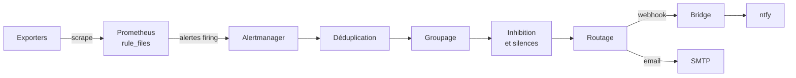

Collecter des métriques ne suffit pas : un disque saturé ou un conteneur qui redémarre en boucle n'est découvert qu'au prochain coup d'œil sur un dashboard. Une chaîne d'alerting mal conçue produit cependant l'effet inverse : cinq messages pour un seul incident, des déclenchements sur des pics légitimes, un canal si bruyant qu'il finit ignoré. Cet article fait suite à l'[introduction à Prometheus](./2025-11-21-prometheus-introduction.md) et décrit la chaîne complète : règles d'alerte, traitement par Alertmanager, conception de règles robustes et notifications push.

<!--truncate-->

## Deux composants, deux rôles

- **Prometheus** évalue périodiquement des expressions PromQL. Quand une expression renvoie des séries, il crée des alertes et les pousse vers Alertmanager. Il ne sait ni grouper, ni notifier.
- **Alertmanager** reçoit ces alertes, les **déduplique** (plusieurs serveurs Prometheus peuvent envoyer la même), les **groupe**, les **route**, applique **inhibitions** et **silences**, puis **notifie** (email, webhook, Slack, PagerDuty...).



## Règles d'alerte côté Prometheus

Les règles sont déclarées dans les fichiers listés sous `rule_files` et évaluées toutes les `evaluation_interval` ; les alertes partent vers les instances déclarées sous `alerting.alertmanagers`. Une règle combine une expression, une durée de maintien, des labels et des annotations :

```yaml
groups:
  - name: host
    rules:
      - alert: HostOutOfMemory
        expr: (node_memory_MemAvailable_bytes / node_memory_MemTotal_bytes) * 100 < 10
        for: 5m
        labels:
          severity: warning
        annotations:
          summary: "RAM disponible sur {{ $labels.instance }} : {{ printf \"%.0f\" $value }}%"
```

- **`labels`** s'ajoutent aux labels de la série et servent au routage (`severity` est la convention usuelle).
- **`annotations`** portent le texte destiné aux humains, avec le templating Go : `{{ $labels.<nom> }}`, `{{ $value }}`, et des fonctions comme `humanize1024` ou `humanizeDuration`.

Une alerte passe par trois états : `inactive`, `pending`, `firing`. Elle reste `pending` tant que l'expression n'est pas vraie depuis au moins `for` ; sans `for`, elle passe `firing` dès la première évaluation vraie. Seules les alertes `firing` sont envoyées. Le `for` agit comme un filtre anti-rebond : un pic de trente secondes ne déclenche rien avec `for: 10m`.

## Configuration d'Alertmanager

### Arbre de routage

`alertmanager.yml` décrit un arbre de routes : la racine s'applique à toutes les alertes, les routes enfants affinent selon des `matchers`.

```yaml
route:
  receiver: ntfy                 # destinataire par défaut
  group_by: ['alertname', 'instance']
  group_wait: 30s
  group_interval: 5m
  repeat_interval: 4h
  routes:
    - receiver: email-ops
      matchers:
        - severity="critical"
      continue: true             # poursuit l'évaluation : critical part aussi vers ntfy
    - receiver: ntfy
      matchers:
        - severity=~"warning|critical"
```

- **`group_by`** : les alertes partageant ces labels sont regroupées dans une même notification.
- **`group_wait`** (30 s par défaut) : attente avant la première notification d'un groupe, pour agréger les alertes liées. Une alerte résolue avant ce délai ne produit aucune notification.
- **`group_interval`** (5 min) : délai entre deux notifications d'un groupe dont le contenu change.
- **`repeat_interval`** (4 h) : rappel d'un groupe inchangé, arrondi au multiple supérieur de `group_interval`.

`resolve_timeout` (section `global`) est souvent mal interprété : il ne concerne que les alertes reçues sans date de fin (`EndsAt`). Prometheus renseignant toujours ce champ, il n'a aucun effet sur ses alertes.

### Destinataires et inhibitions

```yaml
receivers:
  - name: ntfy
    webhook_configs:
      - url: http://ntfy-alertmanager:8080
        send_resolved: true
  - name: email-ops
    email_configs:
      - to: ops@example.com
        smarthost: smtp.example.com:587

inhibit_rules:
  # L'alerte critique d'inodes masque l'alerte warning du même point de montage
  - source_matchers: [alertname="HostFilesystemInodesCritical"]
    target_matchers: [alertname="HostFilesystemInodesLow"]
    equal: [instance, mountpoint]
```

Une inhibition masque les alertes cibles tant qu'une alerte source est active avec les mêmes valeurs pour les labels de `equal`. `source_match` et `target_match` sont dépréciés au profit de `source_matchers` et `target_matchers`.

### Silences

Un silence masque temporairement les notifications correspondant à des matchers, typiquement pendant une maintenance. Il se crée depuis l'interface web (port 9093) ou avec `amtool` :

```bash
# Rendre muettes les alertes d'une instance pendant 2 h
amtool silence add instance="server-01" --duration=2h \
  --comment="Maintenance disque" --alertmanager.url=http://localhost:9093

# Valider les fichiers avant déploiement
amtool check-config alertmanager.yml
promtool check rules rules.yml
```

Les silences sont persistés sous `--storage.path` : sans volume, un redémarrage du conteneur les efface.

## Concevoir des règles utiles

### Hôte et conteneurs

```yaml
- alert: HostOOMKill
  expr: increase(node_vmstat_oom_kill[5m]) > 0
  labels:
    severity: critical

- alert: HostFilesystemInodesLow
  expr: (node_filesystem_files_free{fstype=~"ext4|xfs|btrfs"} / node_filesystem_files{fstype=~"ext4|xfs|btrfs"}) * 100 < 10
  for: 5m
  labels:
    severity: warning

- alert: ContainerRestartingLoop
  expr: changes(container_start_time_seconds{name!=""}[30m]) > 3
  labels:
    severity: warning
```

`node_vmstat_oom_kill` est un compteur du kernel : toute hausse signifie qu'un processus a été tué faute de mémoire, d'où l'absence de `for`. Les inodes justifient une règle distincte de l'espace disque, car de nombreux petits fichiers les épuisent bien avant l'espace. `container_start_time_seconds` (cAdvisor) change à chaque démarrage du conteneur et `changes()` compte ces transitions.

### Détecter un redémarrage

```yaml
- alert: HostRebooted
  expr: (time() - node_boot_time_seconds) < 900
  labels:
    severity: warning
  annotations:
    summary: "{{ $labels.instance }} a redémarré il y a {{ humanizeDuration $value }}"
```

L'alternative `changes(node_boot_time_seconds[15m]) > 0` exige un échantillon antérieur au redémarrage dans la fenêtre : après une coupure plus longue, elle reste muette. Comparer l'heure de boot à `time()` ne dépend d'aucun historique ; l'alerte se résout seule au bout de 15 minutes. Sur un hôte qui redémarre seul après un kernel panic, c'est souvent le seul signal de l'incident.

### Paliers d'usage disque : borner chaque tranche

Des paliers (5 %, 10 %... 95 %) suivent la progression d'un disque avec une sévérité croissante. Avec une borne basse seule (`> 25`), à 27 % d'usage, les règles 5 à 25 sont vraies simultanément : cinq notifications pour un seul événement, que `group_by: ['alertname']` ne regroupe pas puisque chaque palier porte un nom différent. Chaque tranche doit être bornée des deux côtés, le dernier palier excepté :

```yaml
- alert: HostDiskUsageAbove25
  expr: |
    (1 - node_filesystem_avail_bytes{fstype=~"ext4|xfs|btrfs"} / node_filesystem_size_bytes{fstype=~"ext4|xfs|btrfs"}) * 100 > 25
    and
    (1 - node_filesystem_avail_bytes{fstype=~"ext4|xfs|btrfs"} / node_filesystem_size_bytes{fstype=~"ext4|xfs|btrfs"}) * 100 <= 30
  for: 5m
  labels:
    severity: info
```

Les tranches deviennent mutuellement exclusives : une seule règle vraie par point de montage. Le filtre `fstype` écarte `tmpfs`, `vfat` et les pseudo-systèmes de fichiers.

### Calibrer les seuils et alerter sur les symptômes

Un seuil fixé a priori (« un conteneur ne dépasse pas 1,5 cœur ») se déclenche sur des charges légitimes : transcodage, inférence, compilation. Les maxima réels relevés sur plusieurs semaines (`max_over_time(...[30d])`) fixent le seuil au-dessus des pics normaux, et un `for` plus long ne retient que les charges soutenues, par exemple `sum by (name, image) (rate(container_cpu_usage_seconds_total{name!=""}[5m])) > 4` avec `for: 15m`.

Une alerte utile décrit un effet observable plutôt qu'une cause supposée. Deux absences volontaires en découlent :

- **Pas de règle `up == 0`** lorsqu'un outil d'uptime externe sonde déjà les services : la détection dupliquée produit deux notifications par panne sans information supplémentaire.
- **Pas d'alerte « canal de notification en panne »** acheminée par ce même canal : elle ne serait jamais délivrée. Cette surveillance exige un canal secondaire indépendant (email, service de type dead man's switch).

## Notification unique ou rappels

Un `repeat_interval` très long (`8760h`) vise une notification unique au déclenchement. Une alerte oubliée ne se rappelle alors plus : le suivi repose sur la sévérité du message initial. La documentation d'Alertmanager précise en outre que si `repeat_interval` dépasse la rétention (`--data.retention`, 120 h par défaut), la notification est répétée à la fin de cette période : un rappel tous les cinq jours subsiste sans augmenter la rétention.

`send_resolved: true` (défaut du receiver webhook) complète ce schéma : la résolution produit un second message qui clôt l'incident, seul moyen de savoir qu'un problème a disparu sans consulter l'interface.

## Exporters complémentaires

### cAdvisor et le containerd snapshotter

cAdvisor expose les métriques par conteneur (`container_cpu_usage_seconds_total`, `container_memory_usage_bytes`, `container_oom_events_total`). Lorsque Docker utilise le containerd image store (par défaut sur les installations neuves de Docker Engine 29), les couches ne sont plus rangées sous `/var/lib/docker/image/<driver>/layerdb/` et le handler Docker de cAdvisor échoue pour chaque conteneur :

```text
failed to identify the read-write layer ID for container "<id>" - open .../layerdb/mounts/<id>/mount-id: no such file or directory
```

Le cas est suivi dans les issues cAdvisor [#3643](https://github.com/google/cadvisor/issues/3643) (correctif fusionné fin 2025) et [#3860](https://github.com/google/cadvisor/issues/3860) (ouverte pour Docker 29). Si la version déployée est concernée, le contournement consiste à écarter le handler Docker et à lire les conteneurs via containerd :

```yaml
cadvisor:
  image: gcr.io/cadvisor/cadvisor:v0.55.1
  privileged: true
  command:
    - --docker=""                       # endpoint inutilisable : la factory Docker ne s'enregistre pas
    - --containerd=/var/run/containerd/containerd.sock
    - --containerd-namespace=moby       # namespace de Docker dans containerd (défaut : k8s.io)
    - --housekeeping_interval=15s
  volumes:
    - /var/run:/var/run:ro              # contient le socket containerd
    # ... montages habituels : /, /sys, /var/lib/docker, /dev/disk en lecture seule
```

Le handler containerd ignore les noms Docker : le label `name` contient l'identifiant brut du conteneur. Les annotations s'appuient donc sur `{{ $labels.image }}`, `name` servant à retrouver le conteneur avec `docker inspect`. Par ailleurs, `--housekeeping_interval` vaut 1 s par défaut : cAdvisor relit les cgroups chaque seconde alors que Prometheus ne collecte qu'à chaque `scrape_interval`. L'aligner sur ce dernier supprime une consommation CPU en dents de scie sans perte de résolution exploitée.

### blackbox_exporter

blackbox_exporter sonde des cibles (HTTP, TCP, ICMP, DNS) et expose `probe_success` (1 ou 0), combinable avec d'autres métriques. Pour un service mis en veille à la demande, une sonde en échec est normale quand il dort ; l'expression suivante ne vaut 1 que si le service est censé tourner et ne répond pas :

```promql
sum(sablier_group_active_instances{group="app"} or vector(0))
  * (1 - sum(probe_success{instance="http://app:8080/health"}))
```

Ce patron est détaillé dans l'article sur [Sablier](../06-orchestration/2026-08-30-traefik-sablier.md).

### smartctl_exporter

smartctl_exporter expose les attributs S.M.A.R.T. (`smartctl_device_smart_status`, `smartctl_device_temperature`, `smartctl_device_media_errors`). `smartctl` émet des commandes ATA/SCSI bas niveau réservées à root (ou `CAP_SYS_RAWIO`) : le conteneur requiert `privileged: true` et `user: root`, le groupe `disk` ne suffisant pas. `smartctl_device_smart_status == 0` signale un disque dont l'autotest global échoue.

## Notifications push avec ntfy

### Un bridge entre deux formats

ntfy est un service de notifications push en pub/sub HTTP, auto-hébergeable. Alertmanager n'a pas de receiver ntfy : son webhook envoie un JSON structuré (alertes, labels, annotations), alors que ntfy attend le message dans le corps et les métadonnées (titre, priorité, tags, actions) dans des en-têtes HTTP. Un bridge comme [ntfy-alertmanager](https://codeberg.org/xenrox/ntfy-alertmanager) assure la traduction :

```text
# ntfy-alertmanager.scfg
http-address :8080
alert-mode single            # une notification par alerte (requis pour le bouton d'action)

labels {
    order "severity"
    severity "critical" {
        priority 5
        tags "rotating_light"
    }
    severity "warning" {
        priority 4
    }
}

resolved {
    update-notification true  # la résolution remplace la notification initiale
}

ntfy {
    server http://ntfy
    topic alertmanager
    generator-url-label "View in Prometheus"
}
```

Le label `severity` devient la priorité ntfy, et `generator-url-label` ajoute un bouton ouvrant l'URL Prometheus de l'expression déclenchante. En mode `single`, l'option `cache` du bridge évite aussi de renvoyer une alerte déjà notifiée.

### En-têtes HTTP et caractères non ASCII

Le bridge place titre, tags et boutons d'action dans des en-têtes (`X-Title`, `X-Tags`, `Actions`) et le texte de l'alerte dans le corps. Un label de bouton accentué (`"Voir dans Prometheus"`) a pour effet observé l'échec de toute la publication, en `403`. La RFC 7230 (§3.2.4) rappelle que les valeurs d'en-têtes étaient historiquement en ISO-8859-1, que les nouveaux champs devraient se limiter à l'US-ASCII et que les autres octets sont opaques : un caractère UTF-8 multi-octet n'a pas d'interprétation garantie. Trois options fiables :

- des valeurs ASCII pour tout ce qui part en en-tête (titres, tags, labels d'action) ;
- l'encodage RFC 2047 (`=?UTF-8?B?...?=`), que ntfy décode depuis la version 2.4.0 ;
- la publication en JSON, où tous les champs sont dans le corps.

Le corps accepte l'UTF-8 sans restriction : accents et symboles des annotations y arrivent intacts.

## Recharger la configuration

```bash
# Alertmanager : endpoint actif par défaut
curl -X POST http://localhost:9093/-/reload
# Prometheus : nécessite --web.enable-lifecycle
curl -X POST http://localhost:9090/-/reload
# Alternative commune aux deux : SIGHUP
docker kill --signal=HUP alertmanager
```

Une configuration invalide n'est pas appliquée et l'erreur est journalisée. Tous les composants n'offrent pas ce mécanisme : ntfy-alertmanager ne traite que `SIGINT` et `SIGTERM` et lit son fichier une seule fois au démarrage. Modifier le fichier monté ne change rien au processus ; seule la recréation du conteneur applique la nouvelle configuration. Avec Docker Compose, une variable d'environnement contenant un hash des fichiers de configuration (`CONF_HASH=<sha256>`) modifie la définition du service à chaque changement, ce qui suffit à ce que `docker compose up -d` le recrée. D'autres producteurs peuvent partager le même serveur ntfy, comme les rapports de [docker-volume-backup](../03-containerization/2026-09-13-docker-volume-backup.md).

## Application / Projet lié

### [HomeLab](/docs/projects/personnel/homelab)

**Utilisation** : Prometheus, Alertmanager et ntfy-alertmanager surveillent l'hôte et ses conteneurs (node_exporter, cAdvisor via containerd, smartctl_exporter, blackbox_exporter), avec paliers disque bornés, détection de redémarrage et notification push unique.

## Conclusion

Prometheus décide *quand* une situation est anormale ; Alertmanager décide *qui* prévenir, *combien de fois* et *par quel canal*. La qualité de la chaîne tient surtout à la conception des règles : tranches exclusives, expressions indépendantes de l'historique, seuils calibrés sur l'observé, absence délibérée des alertes redondantes. Le reste relève de l'intégration : un bridge pour les canaux non supportés, des en-têtes en ASCII et un rechargement vérifié pour chaque composant.
