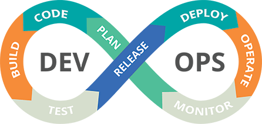

Ingénieur en informatique au [CATIE](http://catie.fr/) spécialisé en Robotique je suis amené à travailler sur des projets de développement logiciel et d'intégration sur différentes plateformes. Intrigué et passioné par l'intégration et l'automatisation des tâches, j'ai décidé d'approfondir mes connaissances en DevOps.

<!--truncate-->

Voici un résumé de ma roadmap DevOps personnelle pour 2024. Cette roadmap est basée sur mes expériences et mes objectifs personnels. Elle est sujette à des changements et des mises à jour régulières. N'hésitez pas à me contacter si vous avez des suggestions ou des commentaires.

# DevOps Roadmap

import IconTitle from '@site/src/components/IconTitle';

Légende :

- [ ] À apprendre
- [x] En cours d'apprentissage
- [x] ~~Maîtrisé~~

## <IconTitle logo="mdi:code-braces" name="Concepts du développement logiciel"/>

En tant qu'ingénieur DevOps, vous ne programmerez pas l'application, mais comme vous travaillez en étroite collaboration avec l'équipe de développement pour améliorer et automatiser les tâches pour eux, vous devez comprendre les concepts de :

- [x] Collaboration des développeurs (Agile, Jira)
- [x] ~~Utilisation de Git~~
- [x] Configuration des applications (Outils de build)
- [x] ~~Compréhension du cycle de vie du développement logiciel~~
- [x] Tests automatisés

## <IconTitle logo="skill-icons:linux-light" name="OS & Linux"/>

En tant qu'ingénieur DevOps, vous êtes responsable de la préparation et de la maintenance de l'infrastructure (serveurs) sur laquelle l'application est déployée. Vous devez donc connaître les bases de l'administration d'un serveur et de l'installation de différents outils sur celui-ci. Voici les concepts de base des systèmes d'exploitation que vous devez comprendre :

- [x] ~~Commandes Shell~~
- [x] ~~Système de fichiers Linux & Permissions~~
- [x] ~~Gestion des clés SSH~~
- [x] Notions de base de la mise en réseau et de la sécurité
- [x] Configuration des pare-feu pour sécuriser l'accès
- [x] ~~Comprendre comment fonctionnent les adresses IP, les ports et le DNS~~
- [ ] Équilibreurs de charge
- [x] Proxies
- [x] ~~HTTP/HTTPS~~
- [x] Virtualisation

## <IconTitle logo="skill-icons:docker" name="Contenérisation - Docker"/>

Les conteneurs sont devenus le nouveau standard de l'emballage logiciel, vous exécuterez probablement votre application en tant que conteneur. Cela signifie que vous devez généralement comprendre :

- [ ] Concepts de virtualisation
- [x] ~~Concepts de conteneurisation~~
- [x] Comment gérer les applications conteneurisées sur un serveur.

Docker est de loin la technologie de conteneur la plus populaire ! Voici quelques points que vous devriez connaître :

- [x] ~~Exécuter des conteneurs~~
- [x] ~~Inspecter les conteneurs actifs~~
- [x] ~~Réseau Docker~~
- [x] ~~Persister les données avec les volumes Docker~~
- [x] ~~Dockeriser les applications en utilisant Dockerfiles~~
- [x] ~~Exécuter plusieurs conteneurs en utilisant Docker-Compose~~
- [x] ~~Travailler avec le dépôt Docker~~

Les conteneurs et les machines virtuelles ont des avantages similaires en termes d'isolation et d'allocation des ressources, mais fonctionnent différemment. Les VMs virtualisent tout le système d'exploitation. Les conteneurs virtualisent uniquement le niveau d'application du système d'exploitation. Par conséquent, les conteneurs sont plus légers et plus rapides.

## <IconTitle logo="skill-icons:githubactions-light" name="CI/CD Pipeline"/>

[CI/CD Pipelines](ci_cd_pipelines/)

CI/CD est en quelque sorte le cœur de DevOps. En DevOps, toutes les modifications de code, comme les nouvelles fonctionnalités ou les corrections de bugs, doivent être intégrées dans l'application existante et déployées pour l'utilisateur final de manière continue et automatisée. D'où le terme :
Intégration Continue et Déploiement Continu (CI/CD)

Compétences que vous devez apprendre ici :

- [x] ~~Configuration du serveur CI/CD~~
- [x] ~~Intégration du dépôt de code pour déclencher le pipeline automatiquement~~
- [x] Outils de construction et de gestion de packages pour exécuter les tests et emballer l'application
- [x] Configuration des dépôts d'artefacts (comme Nexus) et intégration avec le pipeline

## <IconTitle logo="skill-icons:aws-light" name="Apprendre un fournisseur de Cloud"/>

De nos jours, de nombreuses entreprises utilisent une infrastructure virtuelle sur le cloud, au lieu de gérer leur propre infrastructure. Ce sont des plateformes Infrastructure as a Service (IaaS), qui offrent une gamme de services supplémentaires, comme la sauvegarde, la sécurité, l'équilibrage de charge, etc.

AWS est la plateforme IaaS la plus puissante et la plus largement utilisée, mais aussi une des plus difficiles. D'autres populaires : Microsoft Azure, Google Cloud.

Ces services sont spécifiques à la plateforme. Vous devez donc apprendre les services de cette plateforme spécifique et apprendre à gérer toute l'infrastructure de déploiement sur celle-ci. Par exemple, pour AWS, vous devez connaître les bases de :

- [ ] Service IAM - gestion des utilisateurs et des permissions
- [ ] Service VPC - votre réseau privé
- [ ] Service EC2 - serveurs virtuels

## <IconTitle logo="skill-icons:kubernetes" name="Orchestration de conteneurs - Kubernetes & Docker Swarm"/>

Comme les conteneurs sont populaires et faciles à utiliser, de nombreuses entreprises exécutent des centaines ou des milliers de conteneurs sur plusieurs serveurs. Cela signifie que ces conteneurs doivent être gérés d'une manière ou d'une autre.

À cette fin, il existe des outils d'orchestration de conteneurs. Kubernetes (également connu sous le nom de K8s) est l'outil d'orchestration de conteneurs le plus populaire.

Vous devez donc apprendre :

- [x] ~~Apprendre les composants de base comme, Deployment, Service, ConfigMap, Secret, StatefulSet,~~ Ingress
- [x] CLI Kubernetes (Kubectl)
- [x] Persistance des données avec les volumes K8s
- [x] Namespaces
- [ ] Docker Swarm

## <IconTitle logo="skill-icons:prometheus" name="Monitoring & Observabilité"/>

Une fois que le logiciel est en production, il est important de le surveiller pour suivre les performances, découvrir les problèmes dans votre infrastructure et l'application. Donc, l'une de vos responsabilités en tant qu'ingénieur DevOps est de :

- [ ] Prometheus : Un outil de surveillance et d'alerte populaire
- [x] Grafana : Outil d'analyse et de visualisation interactive
- [ ] ELK Stack : Une pile de gestion de logs populaire

## <IconTitle logo="skill-icons:terraform-light" name="Infrastructure as Code"/>

Créer et maintenir manuellement une infrastructure est chronophage et sujet à erreurs. Surtout lorsque vous devez répliquer l'infrastructure, par exemple pour un environnement de développement, de test et de production.

En DevOps, nous voulons automatiser autant que possible et c'est là qu'intervient l'Infrastructure as Code.

- [ ] Terraform est l'outil de provisionnement d'infrastructure le plus populaire
- [ ] Ansible est l'outil de gestion de configuration le plus populaire

## <IconTitle logo="skill-icons:python-light" name="Langages de script - Python"/>

En travaillant étroitement avec les développeurs et les administrateurs système pour automatiser les tâches de développement et d'opérations, vous aurez besoin d'écrire des scripts et de petites applications. Pour cela, vous aurez besoin de compétences en scripting ou en programmation de base. Python est un langage largement utilisé, facile à apprendre et utilisé pour de nombreux cas d'utilisation différents, en particulier en DevOps.

- [x] ~~Apprendre les bases de Python~~
- [x] ~~Écrire des scripts utilitaires, par exemple pour vider le cache, démarrer les builds et les déploiements~~
- [x] ~~Comprendre les concepts de programmation de base~~

<IconTitle logo="skill-icons:git" name="Contrôle de version - Git"/>

Toute la logique d'automatisation est écrite sous forme de code. Tout comme le code d'application, le code d'automatisation doit également être géré et hébergé sur un outil de contrôle de version, comme Git. Git est l'outil de contrôle de version le plus populaire et le plus largement utilisé. Vos fichiers sont stockés de manière centralisée dans un dépôt Git distant sur le web. Les dépôts Git les plus populaires sont GitHub et GitLab. Git est un outil CLI, que vous installez localement. Il permet de suivre les modifications du code source et facilite la collaboration sur le code.

- [x] ~~Apprendre à utiliser un dépôt Git~~
- [x] ~~Maîtriser les commandes de base de Git, comme git clone, git branch, git pull/push, git merge, etc.~~
- [x] ~~Apprendre à collaborer sur un projet, comme créer des pull requests, faire des revues de code, gérer les branches~~
