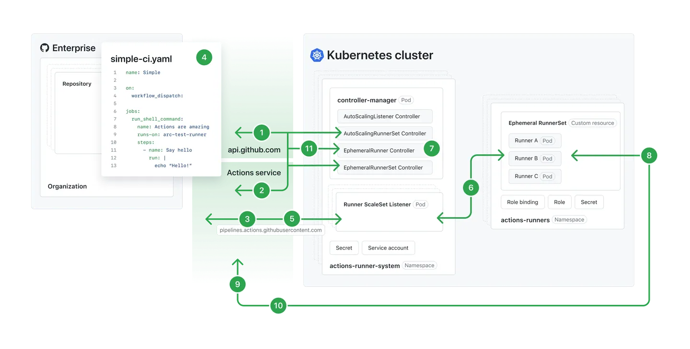

Actions Runner Controller (ARC) est un opérateur de Kubernetes qui orchestre et gère les runners auto-hébergés pour les actions GitHub.

<!--truncate-->

Avec ARC, il est possible de créer des ensembles de runners qui évoluent automatiquement en fonction du nombre de workflows exécutés dans votre dépôt, organisation ou entreprise.

Le diagramme suivant illustre l'architecture du mode Scaleset Runner Autoscaling d'Arc.

[Documentation complète](https://docs.github.com/en/actions/hosting-your-own-runners/managing-self-hosted-runners-with-actions-runner-controller/quickstart-for-actions-runner-controller)



:::danger
Sur GitHub les ARC sont identifiés par leur nom d'installation. Il est important de choisir un nom unique pour chaque installation. De plus pour simplifier l'écriture des workflows il est consillé de gérer les runners par des groupes de runners. La clé `runs-on` des jobs des workflows doit être égale à un groupe de runners.
:::

## Prérequis

Pour utiliser l'ARC, il est nécessaire de disposer des éléments suivants :

- Un cluster Kubernetes
- Helm 3.0 ou version ultérieure

## Installation rapide

:::warning
La suite du guide permet de rapidement installer ARC. Les différents concepts et la configuration avancée ne sont pas abordés. Pour une installation plus complète, regarder la [documentation officielle](https://docs.github.com/en/actions/hosting-your-own-runners/managing-self-hosted-runners-with-actions-runner-controller/quickstart-for-actions-runner-controller).
:::

- Le pod de contrôle est en charge de la gestion des pods de runner. Il s'occupe de la création, de la mise à l'échelle et de la suppression des pods de runner.
- Le pod de runner est dédié à l'exécution des workflows GitHub Actions. Il se compose de deux conteneurs : un conteneur DinD et un conteneur runner. Le conteneur DinD fournit un environnement d'exécution Docker pour le conteneur runner. Le conteneur runner est utilisé pour exécuter les workflows GitHub Actions.

## Usage

Pour lancer le pod de contrôle :

```shell
NAMESPACE="arc-systems"
helm install arc \
    --namespace "${NAMESPACE}" \
    --create-namespace \
    oci://ghcr.io/actions/actions-runner-controller-charts/gha-runner-scale-set-controller
```

Pour lancer le pod de runner :

```shell
INSTALLATION_NAME="elegantencoder"
NAMESPACE="arc-runners"
helm install "${INSTALLATION_NAME}" \
    --namespace "${NAMESPACE}" \
    --create-namespace \
    -f value.yaml \
    oci://ghcr.io/actions/actions-runner-controller-charts/gha-runner-scale-set;
```

## Authentification

Pour que le pod de contrôle puisse créer des pods de runner, il faut lui donner les droits nécessaires. Pour cela, il faut créer un secret contenant un token d'authentification. Les différents éléments proviennent de l'enregistrement d'une application GitHub au niveau de l'organisation concernée.

```shell
kubectl create secret generic pre-defined-secret \
   --namespace=arc-runners \
   --from-literal=github_app_id=xxx \
   --from-literal=github_app_installation_id=xxx \
   --from-literal=github_app_private_key='xxx'
```

## Monitoring

Dashboard Helm

```shell
helm dashboard --bind 0.0.0.0
```

Portainer

## Docker cache

Nous avons rencontré un problème de lenteur lors de la construction des images Docker. Pour y remédier, nous avons mis en place la mutualisation des couches des images Docker entre les différents pods et l'hôte. Cela implique la création d'un volume partagé entre les différents pods et l'hôte. Ces volumes sont montés dans le conteneur DinD du pod qui les utilise pour fournir les images Docker au conteneur du runner. Chaque pod de runner contient un conteneur DinD qui est utilisé pour construire les images Docker.

```yaml
- name: overlay2
    hostPath:
    path: /var/lib/docker/overlay2
- name: image-overlay2
    hostPath:
    path: /var/lib/docker/image/overlay2
```
