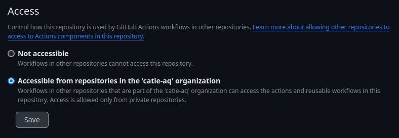

Les actions GitHub permettent d'automatiser, personnaliser et exécuter un flux de travail directement depuis votre dépôt. Avec les actions GitHub, il est possible de créer des tâches personnalisées pour automatiser un flux de travail, partager et découvrir des actions pour effectuer des tâches spécifiques.

<!--truncate-->

## Comment créer ses propres actions

Documentation complète : [https://docs.github.com/fr/actions/creating-actions](https://docs.github.com/fr/actions/creating-actions)

Prérequis : [Workflow](./2024-02-13-ci-cd-workflow.md)

La création d'actions personnalisées offre la possibilité de concevoir du code spécifique qui interagit avec le dépôt selon les besoins. Ces actions peuvent s'intégrer aux API de GitHub ou à toute API tierce accessible publiquement. Par exemple, une action pourrait être configurée pour publier des modules npm, envoyer des alertes par SMS en cas de création de problèmes urgents, ou encore déployer du code prêt pour la production.
Ce guide expose les éléments fondamentaux requis pour la création et l'utilisation d'une action composite empaquetée.

:::warning
Lors de la création de flux de travail et d'actions, il est impératif d'évaluer constamment la possibilité d'exécution d'une entrée non fiable provenant de sources potentiellement malveillantes. Certains contextes doivent être traités comme des entrées non fiables, car un attaquant pourrait insérer son propre contenu malveillant. Pour de plus amples informations, veuillez consulter la section « [Durcissement de la sécurité pour GitHub Actions](https://docs.github.com/fr/actions/security-guides/security-hardening-for-github-actions#understanding-the-risk-of-script-injections) ».
:::

## Création d’une action

Un dépôt doit être créé sur [GitHub.com](http://GitHub.com).

- Créez un nouveau dépôt sur [GitHub](http://GitHub.com), en choisissant n'importe quel nom de dépôt ou en utilisant l'exemple suivant : `hello-world-composite-action`. Les fichiers peuvent être ajoutés une fois que le projet est poussé sur GitHub. Pour plus d'informations, veuillez vous référer à la section [Création d'un dépôt](https://docs.github.com/fr/repositories/creating-and-managing-repositories/creating-a-new-repository).
- Dans le dépôt `hello-world-composite-action`, créez un fichier nommé `goodbye.sh` et ajoutez le code `echo "Goodbye`
- Rendez `goodbye.sh` exécutable depuis votre terminal.
- Dans le dépôt `hello-world-composite-action`, créez un fichier nommé `action.yml` et ajoutez le code suivant en exemple. Pour plus d'informations sur cette syntaxe, consultez la section [Syntaxe des métadonnées pour les actions GitHub](https://docs.github.com/fr/actions/creating-actions/metadata-syntax-for-github-actions#runs-for-composite-actions) .

```yaml
    name: 'Hello World'
    description: 'Greet someone'
    inputs:
      who-to-greet:  # id of input
        description: 'Who to greet'
        required: true
        default: 'World'
    outputs:
      random-number:
        description: "Random number"
        value: ${{ steps.random-number-generator.outputs.random-number }}
    runs:
      using: "composite"
      steps:
        - run: echo Hello ${{ inputs.who-to-greet }}.
          shell: bash
        - id: random-number-generator
          run: echo "random-number=$(echo $RANDOM)" >> $GITHUB_OUTPUT
          shell: bash
        - run: echo "${{ github.action_path }}" >> $GITHUB_PATH
          shell: bash
        - run: goodbye.sh
          shell: bash
```

- Ce fichier définit l'entrée `who-to-greet`, mappe le nombre généré aléatoirement à la variable de sortie `random-number`, ajoute le chemin d'accès de l'action au chemin d'accès du système de l'exécuteur (pour localiser le script `goodbye.sh` lors de l'exécution) et exécute le script .
- Effectuez le commit de votre fichier `action.yml` depuis votre terminal.

```shell
    git add action.yml
    git commit -m "Add action"
    git push
```

- Ajoutez une étiquette depuis votre terminal. Cet exemple utilise une étiquette nommée `v1`.

```shell
    git tag -a -m "Description of this release" v1
    git push --follow-tags
```

## Tester l’action dans un workflow

Copiez le code de workflow dans un fichier `.github/workflows/main.yml` d'un autre dépôt

```yaml
    on: [push]

    jobs:
      hello_world_job:
        runs-on: ubuntu-latest
        name: A job to say hello
        steps:
          - uses: actions/checkout@v4
          - id: foo
            uses: actions/hello-world-composite-action@v1
            with:
              who-to-greet: 'Mona the Octocat'
          - run: echo random-number ${{ steps.foo.outputs.random-number }}
            shell: bash
```

## Action dans un workflow privé

Dans les paramètres des actions, il est nécessaire de la partager à l’organisation


