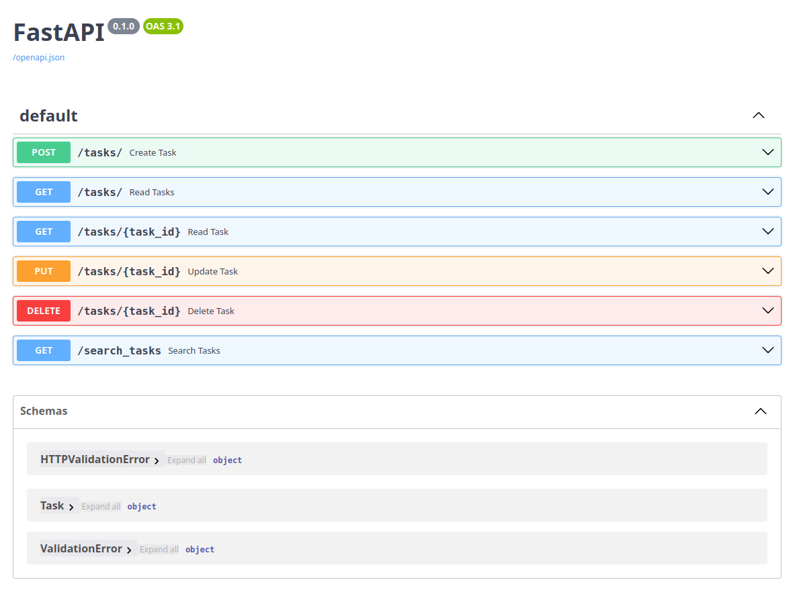

FastAPI est un framework web moderne et rapide (hautes performances) pour la création d'API avec Python, basé sur les annotations de types standard de Python.

<!--truncate-->

## Aperçu

FastAPI est un framework web moderne et rapide (hautes performances) pour la création d'API avec Python, basé sur les annotations de types standard de Python. Il offre des performances élevées, comparables à celles de NodeJS et Go, grâce à Starlette et Pydantic, ce qui en fait l'un des frameworks Python les plus rapides disponibles. FastAPI permet d'augmenter la vitesse de développement des fonctionnalités de 200% à 300%, de réduire d'environ 40% les erreurs humaines des développeurs, et propose un excellent support des éditeurs avec des complétions.

|                         |                                 |
| ----------------------- | ------------------------------- |
| Site Web                | [https://fastapi.tiangolo.com/](https://fastapi.tiangolo.com/) |
| GitHub Stars            | > 75k ⭐                         |
| Nombre de contributeurs | 700                             |
| Licence                 | MIT                             |

- Finalité : Création des API web avec Python
- Intérêt : FastAPI est facile à utiliser et à apprendre, réduit la duplication de code, et produit du code prêt pour la production avec une documentation interactive basée sur les standards OpenAPI et JSON Schema.
- Gouvernance : Assurée par une équipe de mainteneurs dont [tiangolo](https://github.com/tiangolo) est le créateur et mainteneurs principal. A cela s'ajoute des contributeurs individuels, le projet est soutenu par la communauté.

### FastAPI vs Flask

**FastAPI** est reconnu pour sa rapidité et ses performances élevées, grâce à Starlette et Pydantic. Il utilise les annotations de types standard de Python, ce qui améliore la validation et la sérialisation des données. FastAPI génère automatiquement une documentation interactive et est basé sur les standards OpenAPI et JSON Schema. Il est idéal pour les projets nécessitant des performances élevées et une validation stricte des données.

**Flask**, en revanche, est un micro-framework léger et flexible, facile à apprendre et à utiliser. Il offre une grande liberté aux développeurs pour structurer leurs applications comme ils le souhaitent. Flask est extensible via de nombreuses extensions tierces, ce qui le rend adapté aux projets de toutes tailles. Cependant, il ne fournit pas de validation de données intégrée ni de documentation automatique comme FastAPI.

En résumé, FastAPI est plus adapté pour les projets nécessitant des performances élevées et une validation stricte des données, tandis que Flask est conçu pour les projets nécessitant flexibilité et simplicité.

## Utilisation

Pour installer FastAPI, vous pouvez utiliser pip :

```bash
pip install "fastapi[standard]"
```

L'exemple ci dessous est une API simpliste de gestion des To-Do List permettant aux utilisateurs de créér, lire, mettre à jour et supprimer des tâches. Les spécifications sont les suivantes :

1. Créer une tâche : Permettre aux utilisateurs de créer une nouvelle tâche avec un titre et une description.
2. Lire les tâches : Récupérer la liste de toutes les tâches ou une tâche spécifique par son identifiant.
3. Mettre à jour une tâche : Modifier les détails d'une tâche existante.
4. Supprimer une tâche : Supprimer une tâche par son identifiant.

L'exemple ci dessous mélange plusieurs fonctionnalités de FastAPI.

```python
from datetime import date
from typing import Optional
from fastapi import FastAPI, Query
from pydantic import BaseModel
import uvicorn

app = FastAPI()


class Task(BaseModel):
    id: int
    title: str
    description: str
    date: date


tasks: list[Task] = []


@app.post("/tasks/", response_model=Task)
def create_task(task: Task):
    tasks.append(task)
    return task


@app.get("/tasks/", response_model=list[Task])
def read_tasks(skip: int = 0, limit: int = 10):
    return tasks[skip : skip + limit]


@app.get("/tasks/{task_id}", response_model=Task)
def read_task(task_id: int):
    for task in tasks:
        if task.id == task_id:
            return task
    return {"error": "Task not found"}


@app.put("/tasks/{task_id}", response_model=Task)
def update_task(task_id: int, updated_task: Task):
    for task in tasks:
        if task.id == task_id:
            task.title = updated_task.title
            task.description = updated_task.description
            task.date = updated_task.date
            return task
    return {"error": "Task not found"}


@app.delete("/tasks/{task_id}")
def delete_task(task_id: int):
    global tasks
    tasks = [task for task in tasks if task.id != task_id]
    return {"message": "Task deleted"}


@app.get("/search_tasks", response_model=list[Task])
def search_tasks(
    title: Optional[str] = Query(None), date: Optional[date] = Query(None)
):
    results = tasks
    if title:
        results = [task for task in results if title.lower() in task.title.lower()]
    if date:
        results = [task for task in results if task.date == date]
    return results
```

Pour lancer l'application :

```bash
fastapi run /path/to/file.py # production mode
fastapi dev /path/to/file.py # development mode
```

En plus de l'API, FastAPI génère automatiquement une documentation interactive accessible à l'adresse `http://127.0.0.1:8000/docs`


