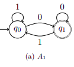

Un algorithme est réalisé dans le but de résoudre un problème. Nous commençons
donc logiquement par introduire une formalisation des problèmes en terme de
langages, puis nous formalisons la notion d'algorithme par les automates finis.

## <i class="fas fa-robot"></i> Formalisation de la notion de problème

Les seuls problèmes abordés ici seront les `problèmes de décision`. Ceux ci
admettent uniquement 2 réponses : oui noté $E_\text{oui}$ ou non noté
$E_\text{non}$.

Nous définissons alors une `instance` d'un problème de décision qui pose la
question pour un élément particulier $x$ de $E$. Tout instance admet une
réponse, qui est positive lorsque $x \in E_\text{oui}$ et négative lorsque
$x \in E_\text{non}$.

En informatique, il existe d'autres problèmes d'intérêt que les problèmes de
décision. Cependant, tout problème peut s'exprimer sous la forme d'un problème
de décision. Cette approche permet de définir une théorie du calcul dans un cadre
simple et unique. C'est pourquoi nous nous plaçons dans ce cadre.

La notion de problèmes est indépendante de la notion d'algorithme. Un
algorithme peut résoudre un problème, mais il ne le définit pas. Par ailleurs,
un problème solvable l'est généralement par plusieurs algorithmes.

### Les langages

Un algorithme est déterminé pour résoudre un problème donné. Cependant, tout
question qui lui est soumise est une instance de ce problème. Il est donc
nécessaire de disposer d'un encodage des instances de problèmes afin de les
fourni aux algorithmes. D'une façon générale, une instance d'un problème est
représentée par une séquence de symboles.

Un `alphabet` est un ensemble **fini** et **non vide** de symboles, un alphabet
est généralement désigné par $\Sigma$

Un `mot` sur un alphabet $\Sigma$ est une séquence finie de symboles de
$\Sigma$

La `longueur` d'un mot $\omega = \omega_1 ... \omega_n$ avec $\omega_i \in
\Sigma$ est définie par $|\omega|=n$.

Le `mot vide` noté $\epsilon$ est le mot de longueur nulle $\epsilon=0$

La `concaténation` de deux mots $\omega = \omega_1 ... \omega_n$ sur
$\Sigma$, et $\omega'=\omega'_1 ... \omega'_k$ sur $\Sigma'$, est définie
par le mot $\omega . \omega'=\omega_1 ... \omega_n \omega'_1 ... \omega'_k$
sur $\Sigma \cup \Sigma'$. La longueur de $\omega . \omega'$ est donnée par
$|\omega . \omega'|=|\omega|+|\omega'| = n+k$

Un mot $\omega'$ est un `sous facteur` de $\omega$ s'il existe deux mots
$u$ et $v$ tels que $\omega=u.\omega'.v$. Un sous facteur $\omega'$ est
propre si $\omega' \neq \epsilon$. Nous appelons `prefixe` de $\omega$ tout
sous facteur $\omega'$ tel que $u=\epsilon$, ie. $\omega=\omega'.v$.
Symétriquement, un `suffixe` de $\omega$ est un sous facteur $\omega'$ tel
que $v=\epsilon$, ie $\omega = u . \omega'$.

Un `langage` sur un alphabet $\Sigma$ est un ensemble fini ou infini de mots
sur $\Sigma$

Attention à ne pas confondre le langage vide $\emptyset$, et le langage
contenant uniquement le mode vide $\{\epsilon\}$

### Représentation d'un problème par un langage

Chaque instance $x$ est modélisée par un mot $\omega$. Le problème est alors
le langage $L$ formé par l'ensemble $E$ de ses instances. Notons que la
**description, et non pas sa définition**, de l'ensemble $E_\text{oui}$ des
instances positives et la description $E_\text{non}$ de l'ensemble des
instances négatives, dépendant de l'encodage choisi.

## <i class="fas fa-robot"></i> Automates finis

Nous savons maintenant comment représenter un problème de décision par un
langage sur un alphabet choisi : l'ensemble $E$ de ses instances $x$,
chacune d'elle représentée par un mot $\omega$ sur cet alphabet. L'ensemble
des instances positives $E_\text{oui}$ est lui aussi représenté pas un langage
$L$, tout comme l'ensemble des instances négatives $E_\text{non}$ qui est
représenté par la complémentarité de $L$. Un algorithme qui résout un problème
donné prend en entrée une instance particulière $x$ et doit décider si $x \in
E_\text{oui}$, c'est à dire si $\omega \in L$. Pour cela, l'algorithme doit
lire certains symboles du mot $\omega$ qui lui permettent de prendre sa
décision. Un **modèle d'algorithme** ou **modèle de calcul** doit donc permettre
de lire un mot $\omega$ en entrée, de mémoriser certaines informations et et
de prendre des décisions pour in fine décider si $\omega \in L$.

Nous introduisons maintenant les automates finis comme modèle de calcul. Un
automate fini lit le mot d'entrée $\omega$, symbole par symbole, de gauche à
droite et sans pouvoir revenir en arrière. L'automate est une machine à états
qui en représentent la mémoire. l'état de l'automate change pour refléter
l'information qu'il mémorise en fonction des symboles de $\omega$ qu'il lit.
Il possède certains états particuliers. Les états **initiaux** correspondent aux
connaissances élémentaires qu'il possède avant de lire $\omega$. Les états
**accepteurs** correspondent aux connaissances permettant de décider si $\omega
\in L$ C'est à dire, si après avoir lu $\omega$ l'automate se trouve dans un
état accepteur alors $\omega$ est accepté, c'est à dire $\omega \in L$

![exemple-automates-finis] Un `automate fini` $A=(Q,\Sigma,\delta,I,F)$ est défini par

+ $Q$ est un ensemble fini d'états
+ $\Sigma$ est l'alphabet de $A$
+ $delta \subseteq Q \times (\Sigma \cup \{\epsilon \}) \times Q$ est la
  relation de transition
+ $I \subseteq Q$ est l'ensemble des états initiaux
+ $F \subseteq Q$ est l'ensemble des états accepteurs

Notons qu'en présence d'une transition étiquetée $\epsilon$ l'automate
change d'état sans lire aucun symbole du mot d'entrée. Nous en verrons les
conséquences au [chapitre 5](cours5.md)

Un automate fini $A=(Q,\Sigma,\delta,I,F)$ est `complet` si pour tout $q \in
Q$ et pour tout $s \in \Sigma$ il existe $q' \in Q$ tel que $(q,s,q') \in
\delta$

Un automate fini complet possède une transition pour chaque lettre de l'alphabet
depuis tout état. Il peut donc traiter tout mot d'entrée entièrement, sans
jamais être bloqué avant d'avoir lu l'intégralité du mot d'entrée. Cependant,
cela ne suffit pas pour pouvoir programmer l'automate. Il faut de plus que
celui-ci soit déterministe. C'est à dire que connaissant l'état de l'automate et
la lettre lu, il doit être possible de déterminer l'état suivant de manière
unique.

Un automate fini $A=(Q,\Sigma,\delta,I,F)$ est `déterministe` si et seulement
si

+ il possède un unique état initial : $I=\{q_0\}$
+ il n'existe pas de transition étiquetée $\epsilon : (Q \times \{\epsilon\}
  \times Q) \cap \delta = \emptyset$
+ et pour tout état $q \in Q$, pour tout $s \in \Sigma$, il existe au plus
  un état $q' \in Q$ tel que $(q,s,q') \in \delta$

### Langage accepté

Un automate fini est appliqué à un mot d'entrée donné, encodé dans l'alphabet de
l'automate. C'est à dire que l'automate, à partir d'un état initial, lit le mot
d'entrée lettre à lettre et il franchit, pour chacune d'elles, une transition de
même étiquette. Cela définit une exécution de l'automate fini.

Une `exécution` d'un automate fini $A=(Q,\Sigma,\delta,I,F)$ sur un mot
d'entrée $\omega \in \Sigma*$ est une séquence finie de transitions $q_0
\stackrel{a_0}{\rightarrow} q_1 \stackrel{a_1}{\rightarrow} ... q_n
\stackrel{a_n}{\rightarrow} q_{n+1}$

Un automate fini déterministe admet donc au plus une exécution pour tout mot
d'entrée. A contrario, un automate fini complet admet au moins une exéution
pour tout mot d'entrée. Finalement, un automate fini déterministe et complet
admet exactement une exécution pour tout mot d'entrée

Une exécution d'un automate fini pour un mot d'entrée $\omega$ aboutit dans un
état donné, ici $q_{n+1}$. C'est alors que l'automate rend une décision : soit
$q_{n+1} \in F$ est accepteur et alors $\omega$ est accepté. Soit au
contraire $q_{n+1} \notin F$ n'est pas accepteur, et le mot $\omega$ est
rejeté.

Le `langage accepté` par un automate fini $A=(Q,\Sigma,\delta, I,F)$ est
l'ensemble des mots $\omega$ pour lesquels il existe une exécution de $A$
qui aboutit dans un état accepteur : $\mathcal{L}(A)=\{\omega \in \Sigma* | g_0
\stackrel{\omega}{\rightarrow}\ q_F}$