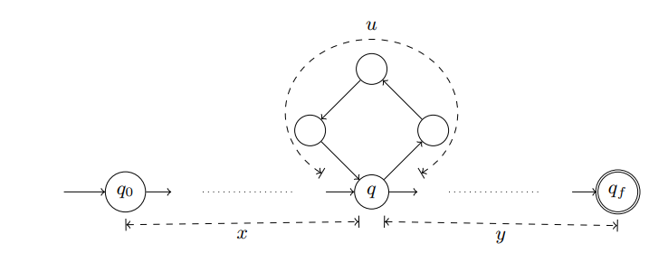

Au chapitre précédent, nous avons étudié les langages réguliers. Nous avons particulièrement montré que les langages réguliers. Ainsi donc, le problème de décision $\omega \in L$ peut être résolu par un automate fini uniquement si $L$ est un langage régulier. Il se pose donc la question de l'existence de langages non réguliers. Nous allons tout d'abord montrer l'existence de tels langages, puis nous donnons une condition nécessaire pour qu'un langage soit régulier. La négation de cette condition nécessaire donne une condition suffisante pour qu'un langage ne soit pas régulier, et donc pour prouver l'irrégularité.

## <i class="fas fa-robot"></i> Existence de langages non réguliers

Nous montrons maintenant qu'il existe strictement plus de langages qu'il n'existe de langages réguliers. L'ensemble des langages et l'ensemble des langages réguliers sont tous deux infinis. Nous introduisons donc dans un premier temps les outils permettant de comparer la taille de deux ensembles infinis.

Soit deux ensemble $A$ et $B$ et $f:A \rightarrow B$ une fonction de $A$ dans $B$. La fonction $f$ est une **bijection** si et seulement si

* quels que soient $a,a' \in A$ avec $a\neq a', f(a) \neq f(a')$ (injection)
* que que soit $b \in B$, il existe $a \in A$ tel que $b=f(a)$ (surjection)

Une bijection définit une correspondance (association) entre les éléments de $A$ et de $B$, de telle façon que chaque élément de $A$ identifie un unique élément de $B$, et vice versa

Un ensemble $A$ est **dénombrable** si et seulement s'il existe une bijection $f:A\rightarrow \mathbb{N}$ entre $A$ et l'ensemble des entiers naturels $\mathbb{N}$

Un ensemble est donc dénombrable s'il est possible d'attribuer un numéro à chacun de ses éléments. Intuitivement on peut énumérer les éléments d'un ensemble dénombrable, bien qu'il soit infini. Il y a donc un premier élément, et tout élément admet un élément suivant. Ainsi ces ensemble peuvent être définis par des fonctions récursives.

#### Lemme

L'ensemble $\Sigma^\ast$ des mots sur un alphabet $\Sigma$ est dénombrable. Preuve page 33

Puisque l'ensemble des mots sur un alphabet fixé $\Sigma$ est dénombrable, l'ensemble des expressions régulières sur $\Sigma$ est lui aussi dénombrable. En effet une expression régulière sur $\Sigma$ est un mot sur $\Sigma \cup \{\varnothing, \epsilon,+,\star,(,)\}$.

#### Lemme

L'ensemble des parties d'un ensemble dénombrable n'est pas dénombrable

Nous déduisons alors des deux lemmes précédent qu'il existe des langages non réguliers. Ils ne sont donc pas acceptés par des automates finis, mais par des machines plus complexes. Ils ne sont pas non plus représentables par des expressions régulières.

#### Théorème

Il existe des langages qui ne sont pas réguliers

Par le premier lemme, nous savons qu'il existe un nombre dénombrable d'expressions régulières puisqu'une expression régulière peut être vue comme un mot sur l'alphabet $\Sigma \cup \{\varnothing,\epsilon,+,\star\}$ où $\Sigma$ est un alphabet de symboles. De plus nous savons qu'il y a autant de langages réguliers que d'expressions régulières, et donc que l'ensemble des langages réguliers est dénombrable. Par le deuxième lemme, l'ensemble des langages étant l'ensemble des ensembles de mots, nous savons que l'ensemble des langages est non dénombrable. Par conséquent, certains langages ne sont pas réguliers.

## <i class="fas fa-robot"></i> Lemme de l'étoile

Il existe donc des langages qui ne sont pas réguliers. Il n'est pas possible de déterminer si un langage est régulier. Cependant, nous exhibons maintenant une condition suffisante pour qu'un langage ne soit pas régulier

1. Remarquons tout d'abord qu'un langage non régulier est nécessairement infini
2. Puisqu'un alphabet est fini, un langage infini contient des mots de longueur non bornée.
3. Tout langage régulier est accepté par un automate fini $A$. Soit $N$ le nombre d'états de $A$.
4. Tout mot $\omega$ appartenant à $\mathcal{L}(A)$, et tel que $\omega>N$, est reconnu par une exécution de $A$ qui passe au moins deux fois par le même état ![etoile]
5. Par conséquent, le langage $x.u^\ast.y$ est inclus dans $\mathcal{L}(A)$: il est possible de boucler autant de fois que souhaité sur l'état $q$ avec de se diriger vers $q_F$

Ceci nous donne donc une condition nécessaire pour qu'un langage soit régulier : tout mot suffisamment long doit contenir un sous mot qui peut être répété un nombre arbitrairement grand de fois. Ceci n'est pas un moyen de prouver qu'un langage est régulier : il faudrait considérer un nombre infini de mots (cette condition est nécessaire mais non suffisante). Par contre cette méthode permet de prouver qu'un langage n'est pas régulier en montrant qu'il comporte (au moins) un mot qui ne respecte pas ce principe.

### Théorème (Lemme de l'étoile / Pumping lemma)

Soient $L$ un langage régulier infini, et $A=(Q,\Sigma,\delta,q_0,F)$ un automate fini déterministe tel que $L=\mathcal{L}(A)$. Pour tout mot $\omega \in L$ tel que $\omega \geq card(Q)$, il existe $x,u,y \in \Sigma^\ast$, tels que $u \neq \epsilon$ et $|x.u| \leq card(Q)$, vérifiant : $x.u.y=\omega$ et $\forall k \geq 0 , x.u^k.y \in L$.

#### Contraposé du théorème

Si pour tout entier $N>0$ il existe un mot $\omega \in L$ de longueur $|\omega| \geq N$ tel que pour toute décomposition $\omega = x u y$ avec $|xu| \leq N$ et $u \neq \epsilon$, il existe $i \geq 0$ tel que $xu^iy \in L$, alors $L$ n'est pas régulier

Afin de prouver qu’un langage n’est pas régulier nous falsifions le lemme de l’étoile. Intuitivement, il s’agit de prouver que quel que soit l’automate fini A considéré, celui-ci ne peut
pas accepter L. Il n’est bien entendu pas possible d’examiner tous les automates finis, mais
nous quantifions de la façon suivante :

* La taille de l’automate A devient un paramètre de la preuve, et nous choisissons $\omega$ de
tel sorte à ce qu’il soit plus grand que ce nombre d’états afin de faire apparaître un
cycle sur tout chemin acceptant $\omega$ dans $A$.
* D’autre part, la décomposition $w = x.u.y$ devient le second paramètre de la
preuve. Nous considérons donc toutes les décompositions satisfaisant les
contraintes sur $x, u$ et $y$, et nous fixons une $k$ telle que $x . u k
. y \notin L$.

Le lemme de l'étoile permet de montrer qu'il n'existe pas d'automate fini déterministe qui accepte un langage $L$ donné. Ceci ne suffit pas à prouver que $L$ n'est pas régulier. En effet, il pourrait exister un automate **non déterministe** qui accepte $L$. Nous verons au chapitre 5 que ce n'est pas le cas : à tout automate non déterministe correspond un automate déterministe qui accepte le même langage
