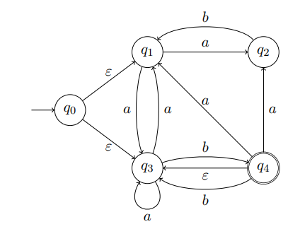
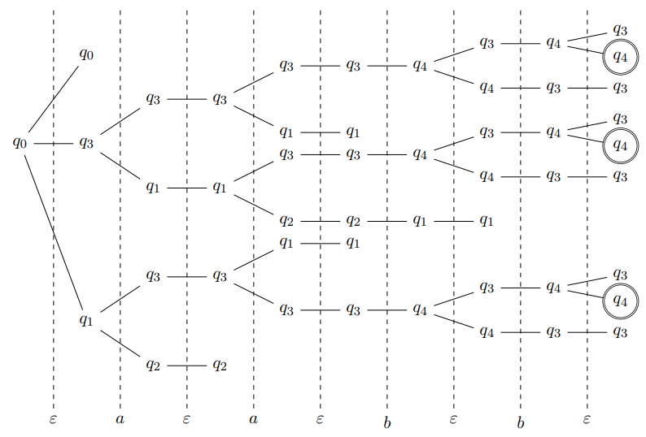

Nous avons introduit au chapitre 1 une distinction entre automates finis
déterministes et automates finis non-déterministes. La notion de non
déterministe provient de l'impossiblité de déterminer l'état courant de
l'automate, à partir de son état initial et les symboles lus.

Nous avons vu au chapitre 2 l'intérêt des transition instantanées (étiquetées
$\varepsilon$) pour la construction de Kleene qui construit, pour toute
expression régulière, un automate fini non-déterministe qui accepte le même
langage. Il se pose alors la question de l'expressivité du non-déterminisme :
existe-t-il des langages réguliers qui sont acceptés par des AFN, mais par aucun
AFD ? Nous avons en effet montré que tout problème de décision décrit par un
langage régulier est décidé par un automate fini non déterministe. Existe-t-il
donc des problèmes de décision "réguliers" qui ne peuvent pas être décidées par
un automate fini déterministe ?

## <i class="fas fa-robot"></i> Élimination du non-déterminisme

Considérons l'automate fini non déterministe $A_N$ suivant.

$A_N$ accepte en particulier le mot $aabb$, notamment sur l'execution
suivante

$ q_0 \stackrel{\epsilon}{\rightarrow} q_3 \stackrel{a}{\rightarrow} q_3
\stackrel{a}{\rightarrow} q_3 \stackrel{b}{\rightarrow} q_4
\stackrel{\epsilon}{\rightarrow} q_3 \stackrel{b}{\rightarrow} q_4$

Nous remarquons que cette exécution contient deux transitions instantanées qui
sont toutes les deux indispensables à $A_N$ pour accepter $aabb$ (sur cette
exécution) puisque d'une part depuis $q_0$ il n'y a aucune transition
d'étiquette $a$, et d'autre part sans la transition $q_4
\stackrel{\epsilon}{\rightarrow} q_3$, l'exécution se terminerait en $q_3$
qui n'est pas accepteur. En toute généralité, il peut être nécessaire qu'un
automate fini non-déterministe franchisse une ou plusieurs transition
instantanées avant et après avoir lu chaque symbole du mot d'entrée afin de
l'accepter. La figure suivante présente l'arbre des exécutions de $A_N$ sur le
mot $aabb$ où nous avons donné l'occasion à $A_N$ de franchir autant de
transitions instantanées que possible (les symboles de $aabb$ sont séparés par
des $\epsilon$). Nous voyons en particulier que pour toutes les exécutions
acceptantes de $A_N$ sur $aabb$, il est nécessaire de commencer par une
transition instantanée : soit $q_0 \stackrel{\epsilon}{\rightarrow} q_1$ soit
$q_0 \stackrel{\epsilon}{\rightarrow} q_3$. Rappelons également que
$\epsilon$ permet de boucler sur tout état. Nous construisons la séquence de
transitions d'ensemble d'états en ensemble d'états de $A_N$ en regroupant les
états suivant leur distance à la racine $q_0$ dans l'arbre

$ \{ q_0\} \stackrel{\epsilon}{\rightarrow} \{q_1, q_2, q_3\}
\stackrel{\epsilon}{\rightarrow} \{ q_1,q_2,q_3\} \stackrel{a}{\rightarrow} \{
q_1, q_2, q_3\} \stackrel{\epsilon}{\rightarrow}$ $ \{q_1,q_2,q_3\}
\stackrel{b}{\rightarrow} \{q_1,q_4\} \stackrel{\epsilon}{\rightarrow}
\{q_1,q_3,q_4\} \stackrel{b}{\rightarrow} \{q_3,q_4\}
\stackrel{\epsilon}{\rightarrow} \{q_3,q_4\}$

Dans cette séquence, transition $\{q_0\} \stackrel{\epsilon}{\rightarrow}
\{q_0,q_1,q_3\}$ signifie que sans avoir lu aucune lettre du mot $aabb$,
$A_N$ peut se déplacer de l'état $q_0$ à l'un des états $q_0,q_1$ ou
$q_3$. Puis les deux transitions $\{q_0,q_1,q_3\} \stackrel{a}{\rightarrow}
\{q_1,q_2,q_3\} \stackrel{\epsilon}{\rightarrow} \{q_1,q_2,q_3\}$ indiquent que
depuis un état parmi $\{q_0,q_1,q_3\}$, en lisant le symbole $a$, $A_N$
atteint un état parmi $\{q_1,q_2,q_3\}$, puis $A_N$ peut se déplacer suivant
des transitions instantanées (si possible) pour se trouver dans un état parmi
$\{q_1,q_2,q_3\}$. Les transitions de la séquence peuvent donc être regroupées
de la façon suivante

$\{q_0\} \stackrel{\epsilon}{\rightarrow} \{q_0,q_1,q_3\} \stackrel{a.
\epsilon}{\rightarrow} \{q_1,q_2,q_3\} \stackrel{a,\epsilon}{\rightarrow}
\{q_1,q_2,q_3\} \stackrel{b, \epsilon}{\rightarrow}\{q_1,q_3,q_4\} \stackrel{b,
\epsilon}{\rightarrow} \{q_3,q_4\}$

L'ensemble des exécutions d'un automate fini non-déterministe $A$ sur un mot
$\omega=\omega_1 ... \omega_n$ peut donc être vue comme suit.

1. $A$ dbéute dans l'ensemble $X_0 = \{q \in Q | \exists q_0 \in I, q_0
   \stackrel{\epsilon}{\rightarrow} q\} des états $q$ pour lesquels il existe
   une séquence (éventuellement vide) de transitions $\epsilon$ d'un état
   initial à $q$
2. Puis $A$ lit le premier symbole $\omega_1$ et atteint l'ensemble $X_1 =
   \{q' \in Q | \exists q \in X_0 , q \stackrel{\omega_1, \epsilon}{\rightarrow}
   q'\}$ des états $q'$ pour lesquels il existe une séquence de transition issue d'un état $q \in X_0$, débutant par $w_1$ et suivie d'une séquence (éventullement vide) de transistions $\epsilon$
    3. Puis $A$ lit le second symbole $w_2$ et atteint l'ensemble d'états $X_2 = \{ q' \in Q | \exists q \in X_1, q \stackrel{w_2, \epsilon} q'\}$
    4. et ainsi de suite

Nous pouvons in fine éliminer les $\epsilon$ pour obtenir la séquence de transitions qui suit

$ \{q_0,q_1,q_3\} \stackrel{a}{\rightarrow} \{q_1,q_2,q_3\} \stackrel{a}{\rightarrow}\{q_1,q_2,q_3\} \stackrel{b}{\rightarrow}\{q_1,q_3,q_4\} \stackrel{b}{\rightarrow} \{q_3,q_4\}$

Nous présentons maintenant, une construction de déterminisation des automates finis non déterministe qui généralise le principe exposé ci-dessus. Celle-ci requiert donc deux phases

1. L'élimination des transitions instantanées
2. Et l'élimination des choix non déterministes

### Clôture instantanée

Reprenons la séquence des transitions de l'équation. La première transition $\{q_0\} \stackrel{\epsilon}{\rightarrow} \{q_0,q_1,q_3\}$ définit l'ensemble des états accessibles depuis $\{q_0\}$.

Soit un automate fini $A=(Q,\Sigma,\delta,I,F)$ et $q$ un état de $A$. La `cloture instantanée` de $q$ notée $cl_{\epsilon}(q)$ est l'ensemble des états de $A$ accessibles depuis $q$ par une séquence (éventuellement vide) de transitions instantanées

$cl_\epsilon(q)=\{q' \in Q | q \stackrel{\epsilon}{\rightarrow} q'\}$

La cloture instantanée se généralise à un ensemble d'états $X \subseteq Q$

$cl_\epsilon(X)= \bigcup \limits_{q \in X} cl_\epsilon(q)$
