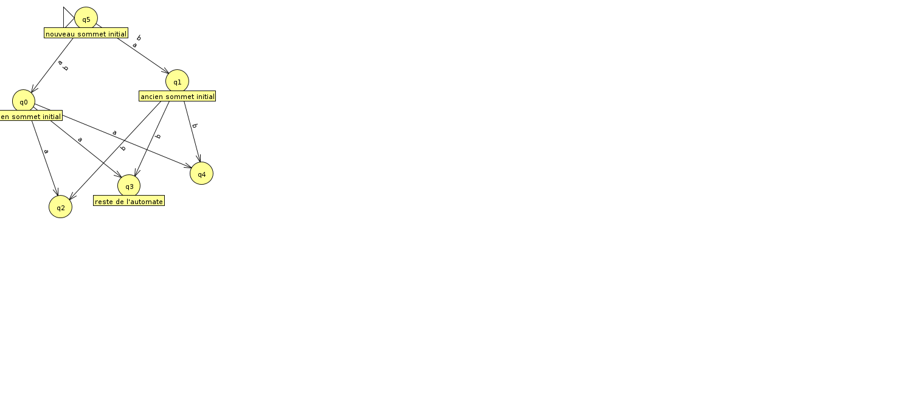
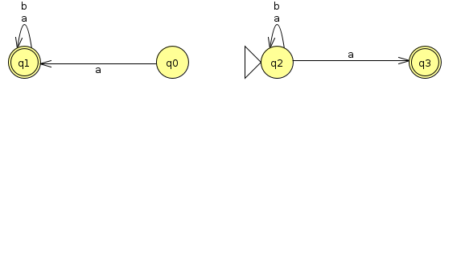
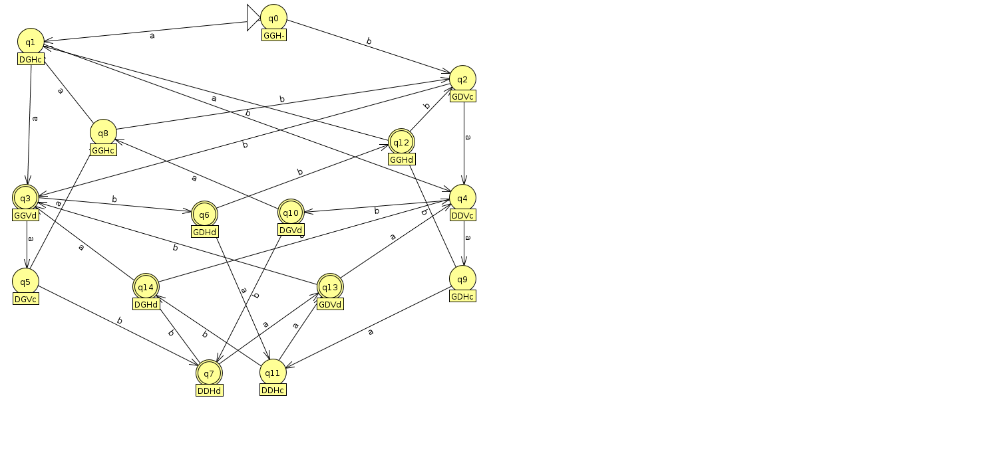
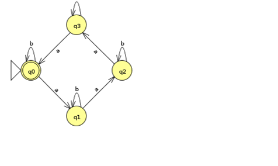
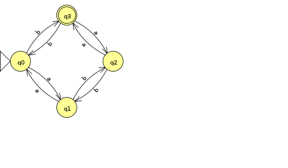
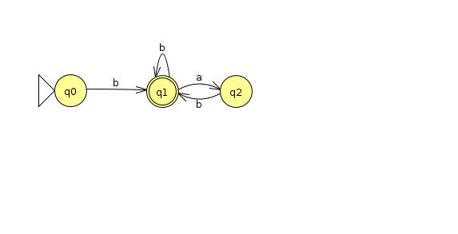
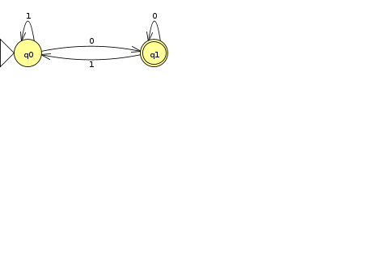
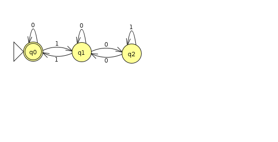
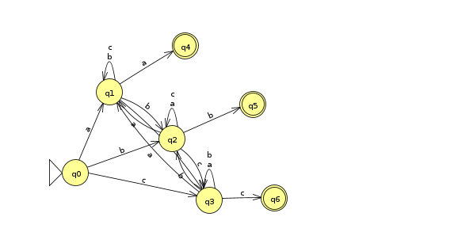

## <i class="fas fa-robot"></i> Langages et automates finis

## Exercie 1

> Pour chaque langage ci dessous sur l'alphabet $\{a,b\}$ donnez un automate
> fini déterministe qui l'accepte.

Le nombre de $a$ est un multiple de 4.

![1.1]

Un nombre pair de $a$ et impair de $b$.

![1.2]

Tout symbole $a$ est précédé et suivi d'au moins un symbole $b$

![1.3]

## Exercice 2

Pour chaque langage ci dessous sur l'alphabet binaire $\{0,1\}$, donnez un
automate fini déterministe qui l'accepte :

Les entiers pairs

![2.1]

Les entiers multiples de 3

![2.2]

## Exercice 3

Pour chaque langage ci-dessous sur l'alphabet $\{a,b,c\}$, donnez un automate
fini non déterministe qui l'accepte

Les mots qui se terminent par $aa$

![3.1]

Les mots dont la dernière lettre apparait précédemment dans le mot

![3.2]

Les mots dont la dernière lettre n'apparait pas précédemment dans le mot

![3.3]

### Exercice 4

Ecrire un algorithme qui indique si un automate fini détermininste et complet
$A=(Q,\Sigma,\delta,q_0,F)$ accepte un mot $\omega \in \Sigma*$

Formellement soit $\omega = \omega_1 , ... , \omega_k$ un mot ($\omega_i$
est la ième lettre du mot) et $A=(Q,\Sigma,\delta,q_0,F)$ un automate, on veut
décider si $\omega$ est accepté par $A$. Soit $X_i$ l'ensemble des états
que l'on peut atteindre en ayant lu $\omega_1,\omega_2,...,\omega_i$

```
X_0 = q_0
pour i de 1 à k
    X_i != 0
    pour tout p dans X_{i-1}
        pour tout q tel que (p,w_i,q) est dans E
            X_i=X_i u {q}
pour tout p dans X_k
    si p est dans F
        retourner Vrai
retourner Faux
```

### Exercice 5

L'idée est de supprimer les deux états initiaux et d'en créer un nouveau qui
mêne aux deux anciens


### Exercice 6

Démonstration par l'exemple


## <i class="fas fa-robot"></i> Jeu des portes bascules

Les parties gagnantes avec trois billes AAB, ABB, BAB, BBB.

Table de transition de l'automates

|      |  A   |  B   |
|:----:|:----:|:----:|
| 000a | 100r | 011r |
| 000a | 100r | 011r |
| 001a | 101r | 011r |
| 010r | 110r | 000a |
| 010a | 110r | 001a |
| 100r | 010r | 111r |
| 100a | 010r | 111r |
| 101r | 011r | 100a |
| 101a | 011r | 100a |
| 110r | 000a | 101a |
| 110a | 000a | 101a |
| 111r | 001a | 110a |










