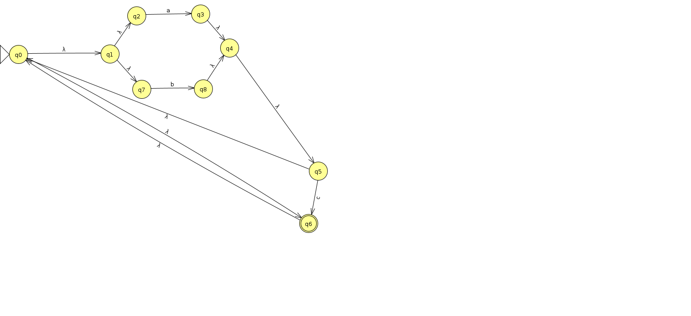

## <i class="fas fa-robot"></i> Expression régulières

### Exercice 1 (Syntaxe des expressions régulières)

`Définition:` L'ensemble des expression régulières sur un alphabet $\Sigma$
est défini par

1. $\varnothing, \epsilon, s$ quel que soit $s \in \Sigma$ sont des
   expressions régulières
2. Si $\alpha$ et $\beta$ sont deux expressions régulières, alors
   $(\alpha+\beta)$, $\alpha\beta$ et $(\alpha)^\ast$ sont des expressions
   régulières

Identification des expressions régulières

1. $a$ est une expression régulière car membre de l'alphabet
2. $c$ n'est pas une expression régulière car non membre de l'alphabet
3. $a$ est une expression régulière et $b$ aussi donc $(a+b)$ est une
   expression régulière et aussi $(b)^\ast$ donc $(a+b^\ast)$ est une
   expression régulière
4.
5. $a^\ast b$ est une expression régulière puisque $(a)^\ast$ et $b$ le
   sont
6. $(abba+baba)^\ast=bababa$ est une expression régulière

### Exercice 2 (Langage défini par une expression régulière)

1. Le seul mot accepté est $a$ , exemple $a$
2. Toute combinaison de un $a$ suivi d'un nombre de $b$ quelconque, exemple
   $abbbb$
3. Toute combinaison commençant par un $a$ et suivi de $a$ ou de $b$,
   exemple $aababa$
4. Toute combinaison de $abba$ et $baba$, exemple $abbababa$

### Exercice 3 (Construction de Kleene)

Tentative :

### Exercice 4 (Simplifier la concaténation)

### Exercice 5 (Utilisation de grep)

1. `grep -e PATH .bash_export`
2. `last | grep -e sedelpeuch`
3. `grep -e .c`
