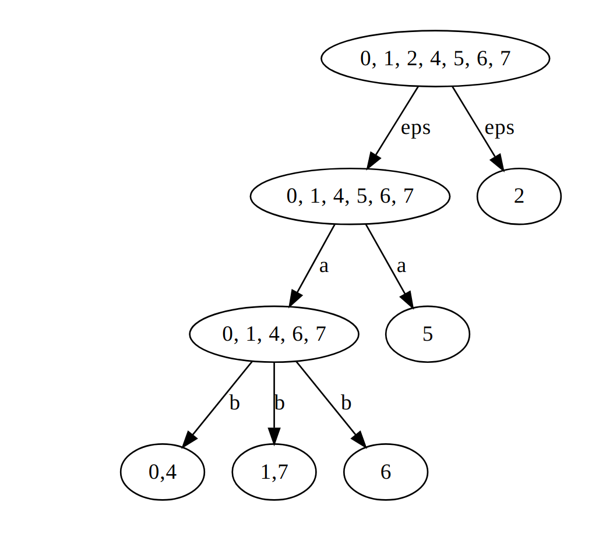

Merci à Aurélien et Fabien pour la [prise de note](https://demo.codimd.org/mCDeG-IDS66jlUCOTACutw?view) durant les séances de questions réponses.

Pour transformer un automate fini déterministe et complet en automate minimal équivalent :

1. éliminer les états inaccessibles
2. fusionner les états qui acceptent le même langage

On obtient finalement le plus petit automate déterministe et complet qui accepte le même langage que l'automate de départ.

## Exercice 1 : Calcul d'automate minimal

### Calcul de la partie accessible :

| Itération |                   Acc                   |
|:---------:|:---------------------------------------:|
|     0     |                $\{q_0\}$                |
|     1     |           $\{q_0, q_1, q_5\}$           |
|     2     |      $\{q_0, q_1, q_5, q_2, q_6\}$      |
|     3     |   $\{q_0, q_1, q_5, q_2, q_6, q_4\}$    |
|     4     | $\{q_0, q_1, q_5, q_2, q_6, q_4, q_7\}$ |

$q_3$ est un état inacessible.

### Calcul des classes d'équivalence $\equiv_Q$ :

On considère au départ que tous les états sont équivalents, puis on enlève ceux qui ne le sont pas. On commence par retirer les couples contenant un état final et un état non-final

|       |       |       |       |       |       |       |       |
|:-----:|:-----:|:-----:|:-----:|:-----:|:-----:|:-----:|:-----:|
| $q_0$ |       |       |       |       |       |       |       |
| $q_1$ |   x   |       |       |       |       |       |       |
| $q_2$ |       |       |       |       |       |       |       |
| $q_4$ |       |   x   |       |       |       |       |       |
| $q_5$ |   x   |   x   |       |   x   |       |       |       |
| $q_6$ |   x   |   x   |       |   x   |   x   |       |       |
| $q_7$ |   x   |   x   |       |   x   |   x   |   x   |       |
|       | $q_0$ | $q_1$ | $q_2$ | $q_4$ | $q_5$ | $q_6$ | $q_7$ |

On fait ensuite la deuxième étape (pour chaque couple, s'il existe une transition vers un couple non-équivalent, on a trouvé un couple non-équivalent).

|       |       |       |       |       |       |       |       |
|:-----:|:-----:|:-----:|:-----:|:-----:|:-----:|:-----:|:-----:|
| $q_0$ |       |       |       |       |       |       |       |
| $q_1$ |       |       |       |       |       |       |       |
| $q_2$ |       |       |       |       |       |       |       |
| $q_4$ |   x   |       |       |       |       |       |       |
| $q_5$ |       |       |       |       |       |       |       |
| $q_6$ |       |       |       |       |       |       |       |
| $q_7$ |       |   x   |       |       |       |       |       |
|       | $q_0$ | $q_1$ | $q_2$ | $q_4$ | $q_5$ | $q_6$ | $q_7$ |

Autre présentation/méthode pour trouver les états équivalents :

### Dessin de l'automate minimal

## Exercice 2 : Calcul de l'automate minimal

### Calcul de la partie accessible :

| Itération |                     Acc                      |
|:---------:|:--------------------------------------------:|
|     0     |                  $\{q_0\}$                   |
|     1     |             $\{q_0, q_1, q_4\}$              |
|     2     |        $\{q_0, q_1, q_4, q_5, q_2\}$         |
|     3     |   $\{q_0, q_1, q_4, q_5, q_2, q_3, q_6\}$    |
|     4     | $\{q_0, q_1, q_4, q_5, q_2, q_3, q_6, q_7\}$ |

### Calcul des classes d'équivalence $\equiv_Q$ :

On commence par retirer les couples contenant un état final et un état non-final

|       |       |       |       |       |       |       |       |       |
|:-----:|:-----:|:-----:|:-----:|:-----:|:-----:|:-----:|:-----:|:-----:|
| $q_0$ |       |       |       |       |       |       |       |       |
| $q_1$ |   x   |       |       |       |       |       |       |       |
| $q_2$ |       |       |       |       |       |       |       |       |
| $q_3$ |   x   |   x   |       |       |       |       |       |       |
| $q_4$ |   x   |   x   |       |   x   |       |       |       |       |
| $q_5$ |   x   |   x   |       |   x   |   x   |       |       |       |
| $q_6$ |   x   |   x   |       |   x   |   x   |   x   |       |       |
| $q_7$ |       |       |   x   |       |       |       |       |       |
|       | $q_0$ | $q_1$ | $q_2$ | $q_3$ | $q_4$ | $q_5$ | $q_6$ | $q_7$ |

On fait ensuite la deuxième étape (pour chaque couple, s'il existe une transition vers un couple non-équivalent, on a trouvé un couple non-équivalent).

|       |       |       |       |       |       |       |       |       |
|:-----:|:-----:|:-----:|:-----:|:-----:|:-----:|:-----:|:-----:|:-----:|
| $q_0$ |       |       |       |       |       |       |       |       |
| $q_1$ |       |       |       |       |       |       |       |       |
| $q_2$ |       |       |       |       |       |       |       |       |
| $q_3$ |   x   |       |       |       |       |       |       |       |
| $q_4$ |   x   |       |       |   x   |       |       |       |       |
| $q_5$ |   x   |       |       |   x   |   x   |       |       |       |
| $q_6$ |       |   x   |       |       |       |       |       |       |
| $q_7$ |       |       |   x   |       |       |       |       |       |
|       | $q_0$ | $q_1$ | $q_2$ | $q_3$ | $q_4$ | $q_5$ | $q_6$ | $q_7$ |

