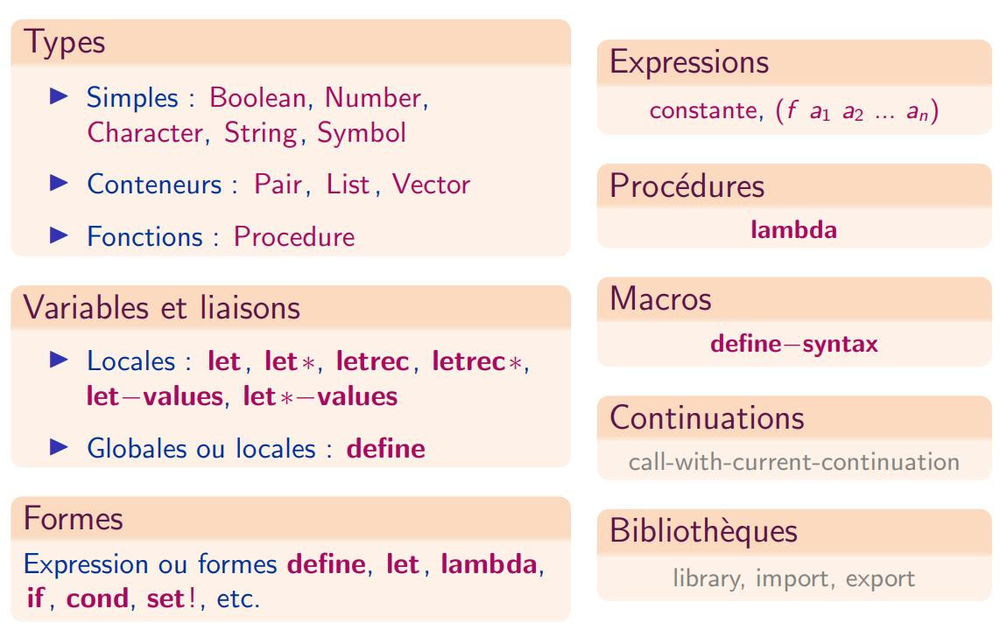
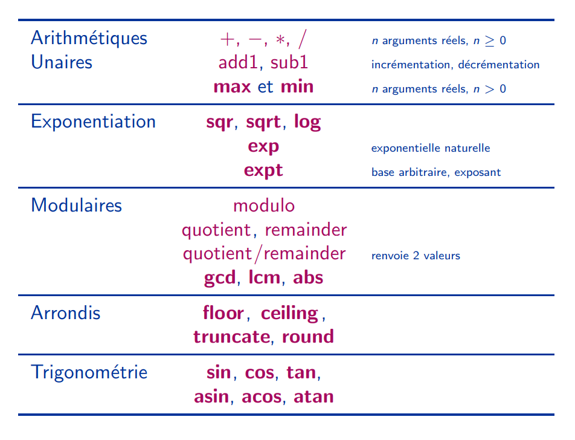

Résumé des constructions syntaxiques du langage

Résumé des opérations numériques

## <i class="fas fa-code-branch"></i> Les caractères et les chaînes de caractères

* Caractère : ̀#\a`
* Chaîne : "de caracteres"
* Type : ̀char?` `string?`
* Comparaisons `char=?, char<?, char>?, string=?, string<?, string>?`
* Constructeurs : `make-string, string`
* Accesseurs : `string-ref`
* Longueur : `string-length`
* Conversion : `number->string, string->number`

## <i class="fas fa-code-branch"></i> Les expressions conditionnelles

`(if <condition> <alors> <sinon>)`

`(when <condition> <e1> ... <en>)`

Cette forme évalue les expression `<ei>` et renvoie le résultat de la dernière quand l'expression `<condition>` vaut vrai.

`(cond [<condition> <e1> ... <en>] ... [<condition> <e1> ... <en>])`

Les crochets définissant les clauses peuvent être remplaccés par des parenthèses, conformément à la norme R6RS du langage Scheme
