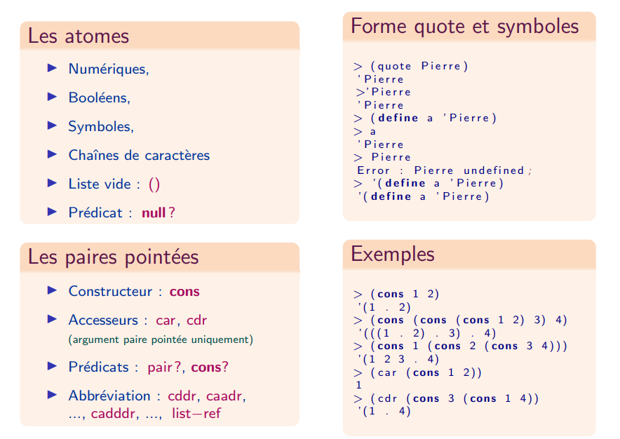

Résumé des différents objets en Scheme

## <i class="fas fa-code-branch"></i>  Les listes

### Définition récursive des listes

* Liste vide : `'()` ou `null`
* Une paire pointée dont le `car` est un élément de la liste, et le `cdr` est une liste
* **Liste impropre** : une liste qui ne se termine pas par la liste vide
* **Liste circulaire** : une chaîne de `cons` sans fin

### Fonctions de base sur les listes

* **Prédicat** : `list? empty? null?`
* **Prédicats d'égalité** : `eq? equal?`
* **Fonction de construction** : `list list* make-list`
* **Fonctions prédéfinies** : `length append reverse membre remove first...tenth nth rest last`
* **Fonctions de a-listes** : `assq assoc`

## <i class="fas fa-code-branch"></i> Fonction `append` : Concaténation de listes

* Fonction n-aire
* Les arguments sont des listes, sauf le dernier qui est un objet quelconque
* La dernière paire pointée de l'argument $$n$$ est remplacée par la première de l'argument $$n+1$$
* Sans effets de bord : recopie des paires pointées de toutes les listes en argument, sauf le dernier argument qui est partagé

## <i class="fas fa-code-branch"></i> Fonction `remove` : Filtrage de listes

La fonction `remove` prend en argument un élément et une liste et elle renvoie la liste privée de la première occurence de l'élément. Elle admet un troisième argument optionnel, qui est le prédicat de test de l'égalité. Par défaut c'est ̀equal?` qui est utilisé.

## <i class="fas fa-code-branch"></i> Fonction `member` : Appartenance à une liste

La fonction `member` prend en arguments un élément `e` et une liste `l` et elle renvoie `#f` si `e` n'appartient pas à `l`, et la liste `l` privée de ses éléments jusqu'à l'occurence de `e` si celui-ci apparaît dans la liste. Le prédicat d'égalité utilisé est `equal?`

## <i class="fas fa-code-branch"></i> Les listes d'association : a-listes

C'est une liste de paires pointées. Le `car` de chaque paire est également une clef et ces listes servent à représenter des tables (indexées), des dictionnaires, des environnements

La fonction `assoc` admet deux paramètres : une clef et une a-liste. Elle parcourt la liste et renvoie la première paire pointée dont le `car` est égal au sens de ̀equal?` à la clef, et `#f` sinon.

La fonction `assq` réalise le même travail avec `eq?` (`assv` pour eqv)
