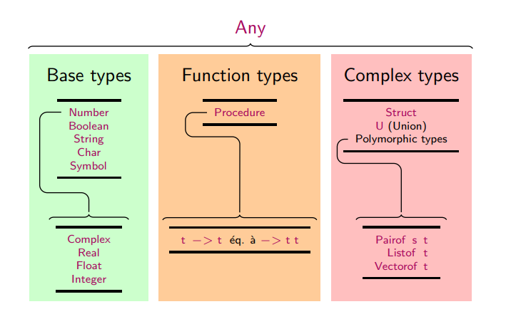

Classification des valeurs en ensembles appelés **types** de manière à garantir la correction de certains programmes



## <i class="fas fa-code-branch"></i> Styles de typage

* Le typage **dynamique** : déterminé pendant l'exécution par le runtime, il ne nécessite aucune intervention du programmeur
* Le typage **statique** : fixé avant l'exécution par le compilateur, il est soit inféré automatiquement, soit indiqué par des annotations dans le code

Afin d'annoter une valeur `<val>` par un type `<typ>`, il suffit d'écrire avant la définition de `<val>`

```lisp
(: <val> <typ>)
```

Les types primitifs contiennent en particulier : `Number Integer Float Char String`

Le typage possède plusieurs intérêts

* Détection d'erreurs de type : passer une valeur de type String à une fonction Int -> Int est incohérent
* Compatibilités de type : passer une valeur de type Integer à une fonction Number -> Number est cohérent car un Integer est aussi un Number
* Optimisations : le compilateur peut écrire du code dédié à des types particuliers

## <i class="fas fa-code-branch"></i> Définir ses propres types

Le code suivant définit un `Struct` représentant des points du plan

```
(struct : point ([x : Real] [y : Real]))

(: distance (point point -> Real))
(define (distance p1 p2)
    (sqrt (+ (sqr (- (point-x p2) (point-x p1)))
             (sqr (- (point-y p2) (point-y p1))))))
```

Cette construction définit en même temps les fonctions suivantes

* Un constructeur point permettant de construire des instances comme par exemple `(point 3 4)`
* Deux accesseurs `point-x` et `point-y` permettant d'accéder aux champs de la structure

## <i class="fas fa-code-branch"></i> Reconnaissance de motif

La reconnaissance de motif ou `pattern-matching` s'effectue avec la forme `match`

```
(match t 
    [<pat1> res1]
    [<pat2> res2]
    ...
    [<patn> resn]
    [- default])
```

* Compare l'expression `t` à chacun des motifs `<patk>`
* renvoie le résultat associé au premier indice pour lequel `t` correspond

Les motifs peuvent introduire des liaisons utilisées dans le résultat
