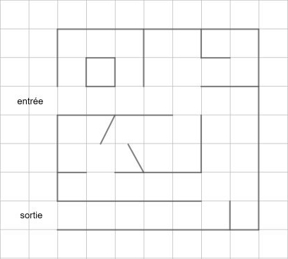
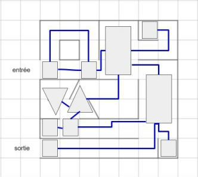
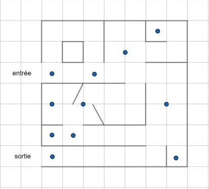
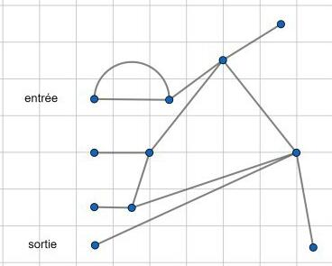

## <i class="fas fa-project-diagram"></i> Quelques exercices

> Une k-coloration d'un graphe $G$ est une fonction $V(G) \rightarrow [1,k]$
> telle que toute paire de sommets adjacents (et distincts) sont coloriés
> différemment (c'est à dire associé par $f$ deux entiers distincts). Un
> graphe est biparti si il admet une 2-coloration. Ecrire un algorithme qui
> décide si un graphe non orienté connexe est biparti.

Principe de résolution : Colorier avec une couleur le sommet de départ $s$,
lorsqu on marque un sommet, sa couleur est différente de celle de son père. Si
on tombe sur un sommet déjà marqué, on teste si sa couleur est différente de son
sommet voisin. L'idée d'une implémentation réside sur un parcours en largeur.

## <i class="fas fa-project-diagram"></i> Problème du Labyrinthe

### Modélisation

|             Labyrinthe initial              |
|:-------------------------------------------:|
|  |

L'idée est de trouver une modélisation simple pour pouvoir se déplacer sur le
graphe le modélisation se base sur les chemins possibles

| Modélisation des différents chemins |    Modélisation des sommets     |            Modèle final             |
|:-----------------------------------:|:-------------------------------:|:-----------------------------------:|
|   ![modélisation du labyrinthe 1]   | ![modélisation du labyrinthe 2] | ![modélisation du labyrinthe final] |

### Résolution du problème

On peut trouver la sortie d’un labyrinthe avec 2 couleurs en "simulant" un
parcours en profondeur (**DFS**): Au lieu d’utiliser une mémoire globale de taille `n`
(la pile), on va utiliser un marquage local, à chaque nœud/arête, avec
uniquement 2 marqueurs/craies/cailloux de couleur.

* Au lieu d’empiler un sommet, on va le marquer de la couleur 1
* Au lieu de dépiler un sommet, on doit vérifier que
    1. tous les sommets voisins ont été visités
    2. revenir au sommet "père" La première opération est facile. La deuxième
       l’est moins avec une mémoire locale.

1. En effet, il faut détecter facilement qu’un voisin a déjà été visité : il
   suffit d’y aller et si c’est le cas faire demi-tour … mais on veut éviter de
   visiter de manière plusieurs fois la même arête. Nommons par commodité la salle
   "courante" U. Je visite un voisin V de U et il se trouve que V a déjà été
   visité. Je reviens donc en U. Je n’ai pas la mémoire des autres voisins de U.
   Les ai-je visité ? Il se pourrait que cela soit le cas. Pour éviter cet écueil,
   il suffit de marquer les arêtes. Une arête marquée indique que j’ai déjà suivi
   le couloir correspondant. Cette opération est donc facile.

2. Il faut pouvoir remonter au père donc distinguer 2 types de marquage : les
   arêtes retour et les arêtes père. En résumé, la méthode est la suivante :

* Chaque nouvelle arête parcourue ou tout nouveau sommet traversé est marqué par
  la couleur 1 (correspond à l’empilement d’un sommet dans le DFS)
* Si on arrive à un sommet marqué, on fait demi-tour en marquant l’arête avec la
  couleur 2. Une arête "retour" est donc marqué par les couleurs 1 et 2 (aller
  et retour)
* Si toutes les arêtes incidentes sont doublement marquées sauf une, on sait
  qu’on a visité tous les voisins. Ainsi, l’arête restante simplement marqué est
  l’arête "père". Cela correspond à l’opération de dépilement de sommet du DFS.
  Il faut remonter au père en marquant l’arête père 2.

La résolution se fait via l'algorithme de
[Trémaux](https://en.wikipedia.org/wiki/Maze_solving_algorithm#Tr%C3%A9maux's_algorithm)
dont le fonctionnement est disponible sur la vidéo suivante.

<iframe width="1013" height="760" src="https://www.youtube.com/embed/gVSEJdSQZVQ" frameborder="0" allow="accelerometer; autoplay; encrypted-media; gyroscope; picture-in-picture" allowfullscreen></iframe>
