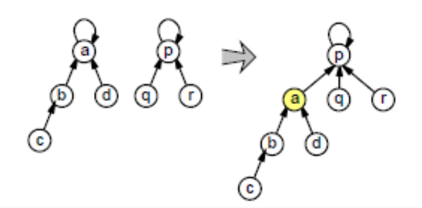

--- 
layout: page
hide: true
title: Graphe - Abres
---

## <i class="fas fa-project-diagram"></i> Union Find

<iframe src="./img/UnionFindenoncés.pdf" height="600" width="60%"></iframe>

On dispose d'ensembles disjoints sur $n$ éléments, on veut

+ Tester si 2 éléments $x,y$ appartiennent au même ensemble ? `Find(x)=Find(y)`
+ Fusionner 2 ensembles disjoints contenant $x$ et $y$ `Union(x,y)`

### Une première structure naïve

#### Question 1.

Test si $x$ et $y$ appartient au même ensemble en temps $O(1)$

#### Question 2.

UNION : Tous les éléments $z$ de l'ensemble de $x$ doivent mettre à jour leur indice `z.indice = y.indice` en temps linéaire en fonction de $n$

#### Question 3. Complexité totale $O(k^2)$

### Vers une version efficace

#### Question 4.

#### Question 5.

La complexité de la séquence `Union(1,2)...Union(1,n)` est $\Theta (n^2)$

#### Question 6.

On a $rang(p)>rang(q)$

#### Question 7.

On va utiliser le principe de récurrence forte: Soit $P(n)$ une propriété définie
sur $N$, si

* $P(0)$.
* $[\forall k\leq n P(k)] \Rightarrow P(n + 1)$ (pour tout $n \in N$)

alors $P(n)$ pour tout entier $n ∈ N$.

Soit $P(r)$ la proposition: “Tout ensemble dont la racine est de rang r possède au moins $2^r$ éléments”.
Supposons que $P(0),...,P(r)$ soit vérifiés. Soient 2 ensembles $S_1$ et $S_2$ de rang $r_1 \leq r$ et $r_2 \leq r$.
Si $r_1 \leq r_2 < r$, le rang de l’union est inférieur à $r$, hypothèse vérifiée.
Si $r1<r2=r$, le rang de l’union est $r$. l’ensemble possède au moins $2^r1+2^r \geq 2^r$.
Si $r1=r2=r$, le rang de l’union est $r+1$, l’ensemble possède au moins $2^r+2^r \geq 2^{r+1}$. On a $P(r+1)$ vérifiée. Il s’agit de l’unique cas où le rang dépasse $r$.
Dans tous les cas, on a que $P(0),...,P(r)$ implique $P(r+1)$.

#### Question 8.

Par récurrence, on sait que si une racine est de rang $r$ alors son ensemble possède au moins $2^r$ éléments (question 7). Or $2^r \leq n$ donc $r \leq \log_2(n)$. Comme il y a croissance du rang dans un chemin qui va vers la racine, on a que la hauteur maximale de l’arbre est donc $\lceil \log_2(n) \rceil$. Toute opération FIND et UNION prend un temps $O(\log(n))$. Chaque opération MakeSet prend un temps $O(1)$. Ainsi la complexité est $O(m+n \log n)$.

Notons qu’on peut encore améliorer la structure avec une opération simple de compressions de chemins pour diminuer encore la profondeur de l’arbre.
