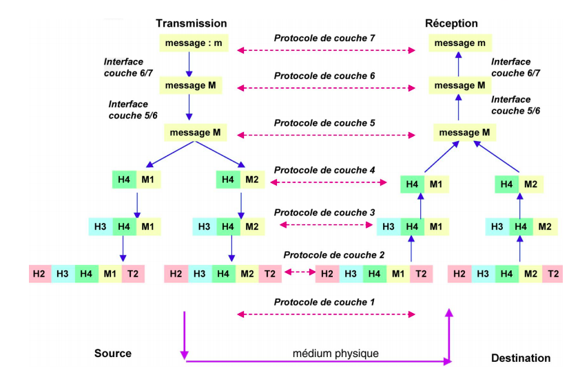
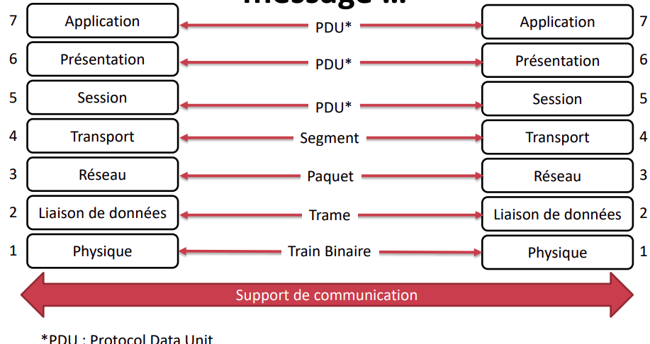
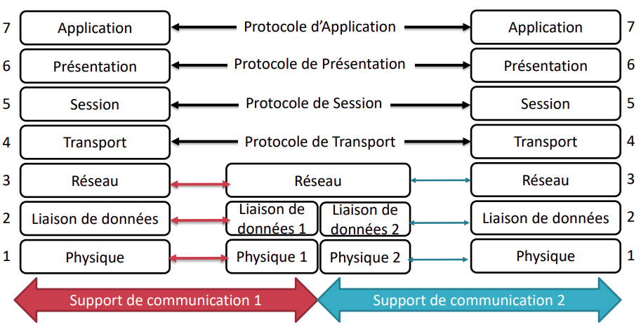
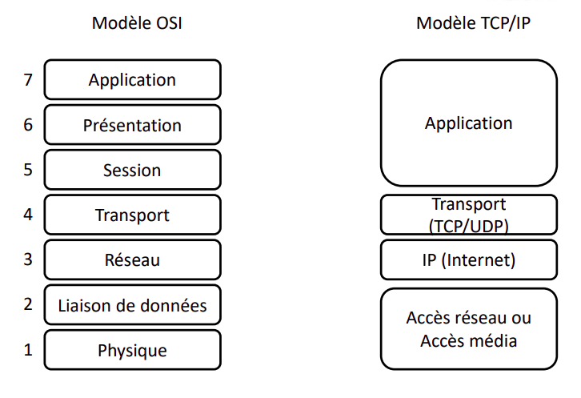
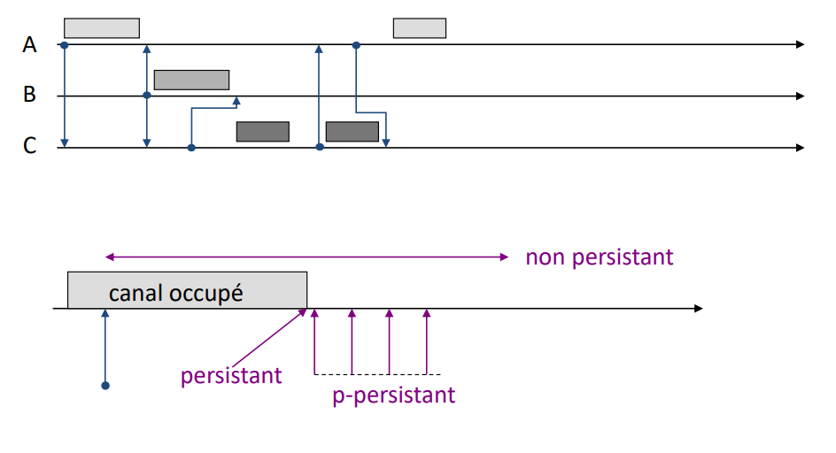
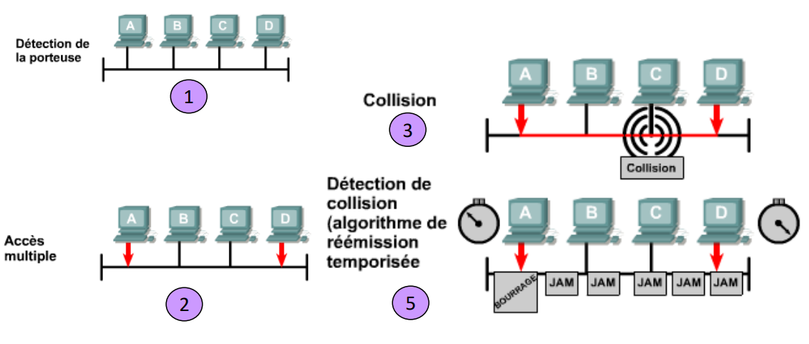
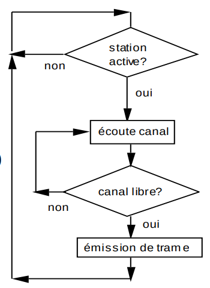
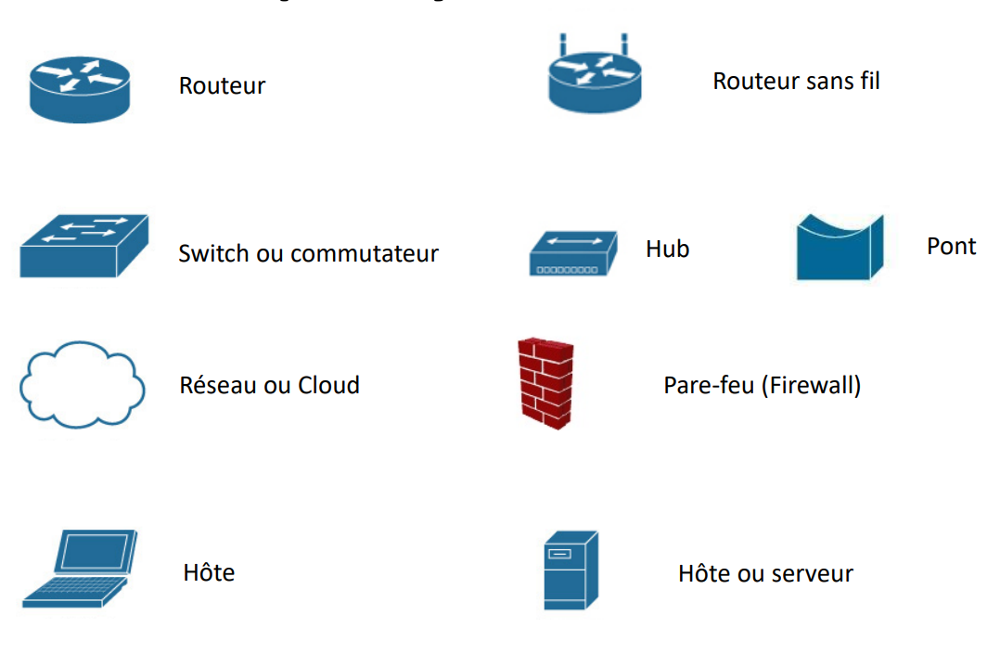

Le principe de base est la représentation des réseaux sous la forme de couche de
fonctions superposées les unes aux autres. Leur nombre, leur nom et leur
fonction varient selon les réseaux.

## <i class="fas fa-server"></i> Principe du protocole

`Protocole :` Ensemble des règles définisant le mode de communication entre deux
ordinateurs.

Les 7 couches du modèle ISO/OSI sont à connaitre par coeur.

### Fonctionnement des couches

| Nom de la couche | Rôle                                         |
|:-----------------|:---------------------------------------------|
| Application      | Quelles sont les données à envoyer ?         |
| Presentation     | Sous quelle forme ?                          |
| Session          | Qui est le destinataire ?                    |
| Transport        | Où est le destinataire ?                     |
| Réseau           | Quel route faut-il prendre ?                 |
| Liaison          | Quelles sont les caractérisation du réseau ? |
| Physique         | Quel est le support physique ?               |

#### Couche Physique

La couche pysique fournit les moyens (logiciels, matériels, électroniques,
mécaniques ...) nécessaire à la transmission des données binaires (train
binaire). Elle implémente des fonctionnalités telles que codage, modulation ou
multiplexage. La conception de la couche physique relève du domaine d'ingénieur
en électronique.

#### Couche Liaison

La couche liaison fournit les moyens nécessaires à l'établissement, le maintient
et la libération des connexions de liaison de données entre les entités
communicantes. Elle détecte et corrige les erreurs pouvant se produire dans la
couche physique. Les fonctions essentielles de la couche de liaison sont

+ établissement et libération de la liaison
+ délimitation et synchronisation des PDU
+ contrôle de séquence
+ Détection d'erreurs
+ Reprise sur erreurs
  Pour les réseaux locaux, cette couche peut être décomposée en deux sous-couches
+ Sous-couche MAC : gère l'accès au canal
+ Sous-couche LLC : gère la détection des erreurs et la gestion de trames et
  liaison logique

#### Couche réseau

La couche réseau assure les fonctionnalité

+ Routage : recherche de chemin ou d'une route selon des critères de
  performances
+ Interconnexion des réseaux
+ Adressage : nommage des entités
+ Contrôle de flux
+ Gestion de la qualité de service
+ Fragmentation et adaptation des unités de données aux contraintes du support
  sous-jacent
+ Deux modes de fonctionnement : connecté / non-connecté

#### Couche transport

La couche transport assure les fonctionnalités

+ Transport de bout en bout des données
+ Découpage des flux de données reçus des couches supérieures
+ Assemblage des données : remise dans l'ordre des données
+ Contrôle de flux et contrôle de congestion
+ Fiabilité par acquittement et retransmission des données
+ Multiplexage des messages (appelés segments de donnée)

#### Couche session

La couche session assure les fonctionnalités

+ Gestion du dialogue entre entités communicantes : gestion de tour de parole,
  transaction
+ Synchronisation : sauvegarde de contexte et reprise après échec
+ Orchestration des communication

#### Couche présentation

La couche présentation assure les fonctionnalités

+ Structuration des donnés pour assurer leurs vérifications

#### Couche application

La couche application assure les fonctionnalité de communications à travers
l'environnement OI en offrant des applications (ou des services) de Web,
messagerie électronique, transfert de fichier, IPTV, téléponique ...

### Principe de l'encapsulation



### Terminologie : Trame, paquet, message



### Principe du relais



### Comparaison du modèle OSI et TCP/IP

![comparaison]

+ TCP/ip intègre la couche présentation et la couche session dans sa couche
  application
+ TCP/IP regroupe la couche physique et la couche liaison de données du modèle
  OSI dans la couche d'accès réseau
+ TCP/IP regroupe la couche physique et la couche liaison de donnés du modèle
  OSI dans la couche d'accès réseau
+ TCP/IP paraît plus simple, car il compote moins de couches
+ Les protocoles TCP/IP constituent la norme sur laquelle s'est développé Internet



## <i class="fas fa-server"></i> Explication de la couche physique

### La bande passante

La largeur de bande est la mesure de la quantité d'information pouvant circuler
d'un endroiit à un autre en une période d'un endroit à un autre en une période
de temps donné, l'unité est le `bit/s`. Le **débit effectif** d'une connexion
est inférieur à la bande passante du câble ou du support physique.

### La couche physique

Fournit les procédure et les fonctions mécaniques, électriques ou électroniques

+ pour établir maintenir et libérer les connexions physiques entre équipements
+ représente tout ce qui constitue le support physique de l'information

Assure la transmission de données sous forme de signaux électriques

+ Selon une connexion permanente ou dynamique
+ En l'alternat ou en bidirectionnel (flux duplex, simplex, half duplex)
+ En série ou en parallèle
+ Entre une ou plusieurs extrémités : point à point ou multipoint

Assure la compatibilité des interfaces

+ pour le codage de la bande de base ou modulation
+ pour l'amplification du signal
+ pour le multiplexage de plusieurs signaux provenant de sources différentes

### Transmission de données

La transmission consiste à faire transiter des informations sur le support
physique de communication sous forme de signau numériques ou analogiques. Pour
que la transmission soit optimale, ilest nécessaire que le signal soit codé de
façon à faciliter sa transmission sur le support physique.

1. Données numériques, signaux numériques

+ Comment représenter des bits ?
+ Exemple : réseaux locaux (LAN), connexion entre PCs
+ Codage NRZ (non return to zero), NRZI, Manchester . Le principe du NRZ repose sur le codage de 1 par $$+V$$ volt et le 0 par $$-V$$
  volt. En revanche pour le NRZi le codage du bit courant dépend du bit
  précédemment émis. Le codage Manchester duplique la quantité d'information pour assurer une
  transition de front il est utilisé dans l'Ethernet 10base-t.

2. Données analogiques, signaux numériques

+ Comment représenter un voltage (échantillonnage)
+ Exemple : Transmission de la voix sur un canal numériques
+ Codage PCM à 8KH

3. Données numériques, signaux analogiques

+ Comment représenter des bits
+ Exemple : Transmission de données numériques sur un canal téléphonique
+ Exemple : modulation d'amplitude (ASK), de fréquence (FSK) et de phase (PSK).

4. Données analogiques, signaux analogiques

+ Comment représenter un voltage
+ Exemple : modulation d'amplitude, de fréquence et de phase

### Exemple de l'ADSL

1. Utilisation

+ Mode asymétrique
+ Mode de connexion permanente
+ Communications simultanées voix et données

2. Caractéristiques

+ Spectre divisé en 3 régions (Téléphone 4Khz, Canal data montant 100Khz, Canal
  data descendant 1Mhz)
+ Codage DMT, divisé en 256 canaux de 4kHz

### Les spécifications des câbles

1. A quelles vitesses la transmission de données peut-elle être réalisée ?

+ La vitesse de transmission des bits dans un câble est extrêmement important
+ Le type de conduit utilisé influence la vitesse de transmission

2. Les transmissions doivent-elles être numériques ou analogiques ?

+ La transmission numérique (ou à bande de base) nécessiste des types de câble
  différents de ceux utilisés pour la transmission analogique

3. Quelle distance un signal peut-il parcourir avant que l'atténuation n'affecte
   la transmission ?

+ Si le signal est dégradé, les équipements réseau ne peuvent ni recevoir ni
  l'interpréter
+ La dégradation est directement liée à la distance parcourue par le signal et
  au type de câble utilisé

### Ethernet

Il existe plusieurs variantes d'Ethernet, ils diffèrent par leurs **type de
support**, leurs **topologie** et leurs **débit**

+ Ethernet 802.3 1-10 Mbps
+ Ethernet 802.3a - 10 base 2 (Thinnet ou Cheapernet)
+ Ethernet 802.3 - 10 base T

### Câbles à paires torsadées

Le câble est constitué de deux paires (émission & réception), lune distance est
maintenant entre les deux paires pour diminuer la diaphonie, plus il y a de
torsades, moins il y a de diaphonie

### Câble à paires torsadées blindées (STP)

Chaque paire de fils est enveloppée dans une feuille métallique et lles deux
paires sont enveloppées ensemble dans un revêtement tressé ou un film
métallique. Il s'agit généralement d'un câble de 150 ohms. Comme l'indiquent les
instructions d'installation de réseau Token Ring, les paires torsadées blindées
réduisent le bruit électrique à l'intérieur du câble (couplage paire à paire ou
diaphonie), ainsi qu'à l'extérieur du câble (interférences électromagniques et
radio).

### Câble à paire torsadées non blindées

Le câble à paires torsadées non blindées (UTP) est un média constitué de quatre
paires de fils, présent dans divers types de réseau. Chacun des huit fils de
cuivre du câble est protégé par un matériau isolant. De plus les paires de fil
sont tressées entre elles. Ce type de câble repose uniquement sur l'effet
d'annulation produit par les paires torsadées pour limiter la dégradation du
signal due aux interférences électromagnétiques et radio.

## <i class="fas fa-server"></i> Explication de la couche liaison de données et notion d'Ethernet

### Protocoles d'accès au support

Suivant la façon dont les sollicitations d'accès au support de communications
sont gérées on distingue essentiellement deux approches

+ Allocation aléatoire : le délai d'accès n'est pas borné (Aloha, Carrier Sense
  Multiple access)
+ Allocation déterministe : il est possible de borner le delai d'accès (polling,
  jeton)

L'ethernet exploite la technique d'accès aléatoire au support

### L'Ethernet

Aujourd'hui l'ethernet est la technologie de réseau local dominante sur le plan
mondial. L'Ethernet est une famille de technologies de réseau local que le
modèle de référence OSI rend plus facile à appréhender. Tous les réseaux locaux
doivent traiter le problème de base qui est l'attribution des noms à chaque
station au noeud. Les spécifications Ethernet prennent en charge différents
médias, bandes passantes et autres variantes des couches 1 et 2. Le format de
trame de base et le système d'adressage sont les mêmes pour toutes les variantes
d'Ethernet.

### L'ancêtre d'Ethernet : Alohanet

L'idée était de permettre à deux hôtes au moins d'utiliser le même média sans
aucune interférence entre les signaux. Ce problème d'accès multiple de
l'utilisateur à un média partagé a été étudié au début des années 70 à
l'Université d'Hawaï. Un système nommé Alohanet a été développé pour donner à
plusieurs stations des îles Hawaï un accès structuré à la fréquence radio
partagée dans l'atmospère. Ce travail a par la suite constitué la base de la
méthode d'accès Ethernet connue sous l'acronyme CSMA/CD. Le principe est qu'une
station émet dès lors qu'elle souhaite, en cas de collision, la station
réémettra sa trame au terme d'un délai aléatoire, au bout de $$N$$ collisions
successives, la station abandonne. L'efficacité est très faible $$18 \%$$
(définit par le rapport du débit utile sur le débit brut).

### Slotted aloha

Le principe est que le temps est discrétisé et découpé en tranches de temps
appelées slots (temps de propagation aller-retour maximum). Les stations sont
synchronisées et une station ne tramet un paquet uniquement au début d'un slot.
Le système est amélioré puisque 2 trames qui se superposent ne le font que sur
un slot au maximum, au lieu de 2 slots (car ils commencent au début du même
slot). Le nouveau problème est la mauvaise utilisation du canal.

### Technique de CSMA/CD

Accès aléatoire avec écoute de la porteuse : CSMA

+ Une satiation qui désire émettre se met à l'écoute du canal
+ Si elle détecte un signal en ligne, elle diffère l'émission de sa trame

Les variantes selon le type de décision prile lorsque le canal est détecté
occupé

+ CSMA non persistant: lorsque la station détecte un signal, elle attend un
  délai aléatoire avant de réitérer la procédure (écoute de la porteuse)
+ CSMA persistant la station persisste à écouter le canal jusqu'à ce que
  celui-ci devienne libre, puis émet
+ CSMA p-persistant lorsque le canal devient libre, la station émet avec une
  probabilité $$p$$, et diffère son emission avec une probabilité $$(1-p)$$.
  Ceci permet de diminuer la probabilité de collision par rapport au CSMA persistant.

On a l'apparition d'une période de vulnérabilité : le temps de propagation entre
le couple de stations les plus éloignées. Si la durée des trames est
considérablement supérieur à la période de vulnérabilité alors le débit peut
s'approcher de $$100\%$$
C'est la technique la plus utilisée parmi les disciplines d'accès aléatoire.
Elle est normalisée par l'ISO. A l'écoute préalable du canal s'ajoute l'écoute
pendant la transmission un coupleur prêt à emettre, ayant détecté le canal
libre, transmet et continue à écouter le canal. S'il se produit une collision,
il interrompt immédiatement sa transmission et il envoie des signaux spéciaux
appelés bits de bourrage que tous les coupleurs soient prévenus de la collision,
il tentera la réémission ultérieurement.


### Le succès d'Ethernet

Le succès d'Ethernet est dû aux facteurs suivants :

+ Simplicité et facilité de maintenance
+ Capacité à incorporer de nouvelles technologies
+ Fiabilité
+ Faible coût d'installation et de mise à niveau

### Adresse Universelle MAC 802

+ Adresse sur 6 octets
+ Unique pour chaque carte réseau
+ @MAC = partie Constructeur + Numéro Séquentiel

## <i class="fas fa-server"></i> Bilan sur l'Ethernet

### Trame Ethernet

|         Type          |   Taille   | Role                              |
|:---------------------:|:----------:|:----------------------------------|
|       Preamble        |     7o     | pour la synchronisation           |
|          SoF          |     1o     | délimiteur début de la trame      |
| @Ethernet Destination |     6o     | @MAC de destination               |
|   @Ethernet Source    |     6o     | @MAC source                       |
|      Length/Type      |     2o     | indique longueur type de la trame |
|         Data          | 46 à 1500o | les données                       |
|          FCS          |     4o     | contrôle d'intégrité de la trame  |

### CSMA/CD

+ Toute station d'un réseau Ethernet qui souhaite transmettre un message "écoute" d'abord pour s'assurer qu'aucune autre station n'est en cours de transmission
+ Si le câble est silencieux, elle entame immédiatement la transmission
+ Le signal électrique met un certain temps à parcourir le câble, et chaque répéteur introduit un bref temps de latence lors de la transmission de la trame entre deux ports
+ En raison du délai et du temps de latence, il est possible pour plusieurs stations de commencer la transmission au même moment ou quasiment au même moment, ce qui engendre une collision

### Fonctionnement

+ La station émettrice transmet 64 bits d'informations de synchronisation appelées ppréambule. LA station émettrice transmet alors les informations suivant

1. Informations sur les adresses MAC destination et source
1. Certainnes autres informations d'en tête
1. Charge utile réelle de données
1. Somme de contrôle : FCS(CRC) utilisée pour s'assurer que le message n'ap as été corrompu en cours de route

+ Les stations qui reçoivent la trame recalculent le CRC pour déterminer si les messages entrant est valide, puis transmettent les messages valides à la couche supérieure suivante de la pile de protocoles.
+ Remarque : La taille maximale d'une trame de niveau liaison de données (niveau 2) est appelée MTU (Maximum Transmission Unit)

### Détection et prévention de collision sur un réseau CSMA/CD





#### Principe

![principe]

```
Emetteur
- Ecoute du canal
- Si le canal est libre alors
  transmission de l'information et écoute simultanée du canal pour détecter une éventuelle collision
  si collision détectée
      arrête immédiat de la transmission et notification de la collision à toutes les stations
      gestion de la collision (procédure du Backoff)
  sinon reporter la transmission
```

### Algortihme backoff (BEB)

La procédure Backoff utilise 3 fonctions

+ `random()` tire un nombre réel aléatoire entre 0 et 1
+ ̀int()` rend la partie entière d'un réel
+ `délai()` calcul le délai d'attente multiple d'un slot_time (51.2 microsec) et est compris entre $$[0,2^k[$$. Avec $$k=\min(n,10)$$, où $$n$$ est le nombre de ré-émission déjà faites

```
procédure BACKOFF(no_tentative:entier, VAR maxbackoff:entier)
Const : slot_time=51.2 (microsecondes); limite_tentative=16
var : delai : entier
BEGIN
    Si (no_tentative=1)
    Alors maxbackoff=2 (borne de temps d'attente maximale)
    Sinon
        Si (tentative < limite_tentative)
        Alors maxbackoff=2 maxbackoff
        Sinon maxbackoff=2^10 (au dela de 10 essais la borne devient constante)
    délai = int(random()*maxbackoff)
    attendre(delai*slot_time)
END
```

### Tranche de temps Ethernet

Pour tous les débits de transmission Ethernet égales ou inférieures à 1000Mbits/S, la norme stipule qu'une transmission ne peut pas être inférieure à une tranche de temps. La tranche de temps pour l'Ethenet 10 à 100 Mbits/s est de 512 temps de bit, soit 64 octets. Pour l'éthernet 1000 Mbits/s est de 512 octets. La tranche de temps est calculée en se basant sur des longueurs de câble maximale dans l'architecture de réseau légale la plus étendue. Tous les délais de propagation sont au maximum légal et le signal de bourrage 32 bits est utilisé lorsque des collisions sont détectées.

## <i class="fas fa-server"></i> Equipements d'interconnexion

+ Interconnexion de niveau 1 : répéteur, concentrateur : amplification du signal
+ Interconnexion de niveau 2 : pont, commutateur : amplificateur de signal et traitement de niveau 2
+ Interconnexion de niveau 3 : routeur
+ Interconnexion de niveau 4 à 7 : passerelle



### Les équipements de couche 1

Les équipements de couche 1 : les répéteurs et les concentrateur (HUB), sont principalement utiisés pour étendre les segments de câble Ethernet. Ils permettent d'ajouter d'avantage d'hôtes. Cependant, chaque hôte ajouté augmente la quantité de trafic potentiel sur le réseau. Les équipements de couche 1 transmettent la totalité des données qui sont reçues sur le média. Plus le trafic est dense dans un domaine de collision, plus les risques de collisions sont importants. Les équipements de couche 1 peuvent être à l'origine de collisions en raison d'une augmentation trop important du réseau LAN.

### Commutation Ethernet

Un réseau Ethernet partagé fonctionne parfaitement dans des conditions optimales d'utilisation. Lorsque le nombre des équipements qui tentent d'accéder au réseau est peu élevé, le nombre de collisions se maintient à un niveau acceptable. En revanche, lorsque le nombre des utilisateurs augmente, le nombre croissant de collisions peut considérablement réduire les performanes du réseau. Les problèmes de broadcas et de collision sont des événements connus dans les réseaux modernes. Afin d'en limiter les effets, des domaines de collision et de broadcast doivent être créés en installant des points ou encore des commutateurs.

### Définition

On appelle domaines de collisions des segments du réseau physique dans lesquels des collisions peuvent se produire. Les collisions rendent le réseau inefficace. Chaque fois qu'une collision survient sur un réseau, les transmissions s'interrompent momentanément. La durée de cette interruption est variable et est fonction d'un algorithme de réémission temporisée pour chaque équipement du réseau. Les types d'équipements assurant l'interconnexion des segments de médias définissent les domaines de collision.

### Fonctionnement d'un pont

Plus le nombre de noeuds situés sur un segment Ethernet augmente, plus le média est utilisé. Ethernet étant un média partagé, un seul noeud à la fois peut transmettre des données. L'ajout de noeuds entraîne un besoin croissant de bande passante et occasionne des charges supplémentaires sur le média. En outre, la probabilité de collisions est plus forte, ce qui entraîne d'avantage de retransmissions. L'une des solutions consiste à fragmenter le segment principal en plusieurs parties et à le diviser en domaine de collision distincts.

Lorsqu'un pont vient d'être installé, sa table est vide. Le pont attend le transfert de données sur le segment. Dés qu'une transmission est détectée, le pont la traite. L'hôte A émet une requête vers l'hôte B. Les données étant transmises sur l'ensemble du segment de domaine de collision, le pont et l'hôte B traitent le paquet. Le pont ajoute l'adresse source de la trame à sa table de pontage. Sachant que l'adresse se trouve dans le champ d'adresse source et que la trame est reçue sur le port 1, la trame doit être associée au port 1 dans la table. L'adresse de destination de la trame est comparée à toutes les adresses de la table de pontage. Bien que les deux adresses se trouvent dans le même domaine de collision, si l'adresse de destination ne se trouve pas dans la table, la trame est transférée vers le segment suivant. L'adresse de l'hôte B n'est pas encore enregistrée. Et ainsi de suite jusqu'à l'apprentissage total des machines dans le segments Ethernet.

### Pont et commutateur

En règle générale, un pont comprend deux ports et subdivise un domaine de collision en deux segments. Les décisions prises par un pont dépendent uniquement des adresses MAC et n'affectent pas les adresses de la couche 3. Un commutateur est en fait un pont multiport très rapide qui peut contenir des douzaines de ports. Chaque port crée son propre domaine de collision. Lorsqu'un réseau comporte 20 noeuds, 20 domaines de collision doivent exister si chaque noeud est connecté à son propre port de commutation. Un commutateur crée et gère de façon dynamique une table de mémoire associative, qui contient toutes les informations MAC nécessaires aux ports

#### Principe d'un commutateur Ethernet

+ Réduire les collisions pour accroître les débits
+ Remplacer le noeud central passif par un commutateur
+ Mettre à peu de frais des réseaux virtuels

### Modes de commutation

La commutation d'une trame vers un port de destination est fonction du niveau de latence et de fiabilité. Un commutateur peut commencer à transférer la trame dès que l'adresse MAC est reçue. Ce mode de commutation des paquets est appelé "Cut-through". Avec le mode de commutation "Cut-through", les débits des ports source et de destination doivent être identiques pour ne pas endommager la trame.

Un commutateur peut également attendre de recevoir la trame entière avant de la transférer vers le port de destination. Cela permet au logiciel de commutation de vérifier la séquence de contrôle de trame. Si la trame n'est pas correcte, elle est rejetée au niveau du commutateur. Étant donné que la trame entière est stockée avant d'être transmise, ce mode de commutation des paquets est appelé "Store and Forward".

Une solution intermédiaire de commutation des paquets est le mode "Fragment-Free". Ce mode lit les 64 premiers octets, incluant l'en-tête de la trame, puis il commence à transmettre le paquet avant même d'avoir terminé la lecture du champ de données et de la somme de contrôle. Ce mode vérifie la fiabilité des adresses et des informations relatives au protocole de niveau supérieur afin de garantir que les données sont correctement traitées et qu'elles sont acheminées vers la destination appropriée. Permet la détection des collisions (détectée pendant les 64 premiers octets selon la norme Ethernet. Cette taille correspond en nombre d'octets nécessaire à l'occupation du bus pendant la durée aller/retour entre stations les plus éloignées)

### Les équipements de couche 2

+ Les équipements de couche 2 segmentent ou divisent les domaines
  de collision.
+ Ils utilisent les adresses MAC affectées à chaque équipement
  Ethernet pour effectuer le contrôle de propagation de la trame.
+ Les équipements de couche 2 sont des ponts et des commutateurs
  qui permettent d'effectuer le suivi des adresses MAC et de leurs
  segments.
+ Les équipements peuvent contrôler le flux de trafic au niveau de la
  couche 2.
+ Grâce à cette caractéristique, les réseaux s'avèrent plus efficaces.
+ Cela permet au réseau de transporter des données simultanément
  sur différents segments sans collisions.
+ Les ponts et les commutateurs subdivisent les domaines de collision
  en éléments plus petits.
+ Chaque élément devient alors son propre domaine de collision.

### Boucles de commutation

En cas de présence de boucles entre équipements de couche 2, les trames risquent de boucler avant d'atteindre leur destination

+ Perte d'efficacité
+ Congestion sur le support
+ Retard de transmission

Plusieurs solution possible

+ Elimination logique des boucles en désactivant certains ports
+ Trouver un arbre couvrant : Spanning Tree Protocole
+ Idée du STP : les équipements d'interconnexion communiquent entre eux pour déterminer un arbre couvrant, et ainsi supprimer les boucles de commutation
