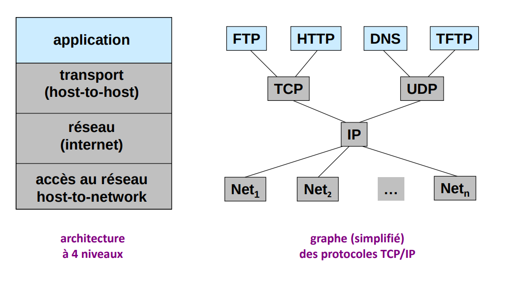
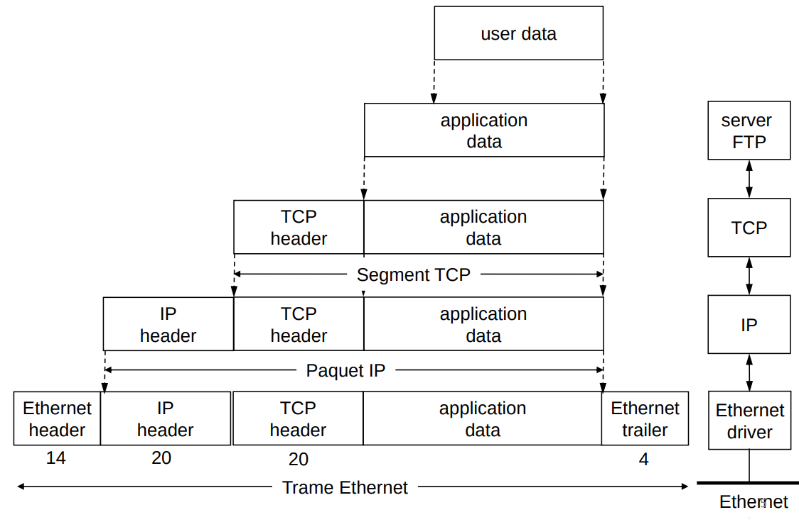
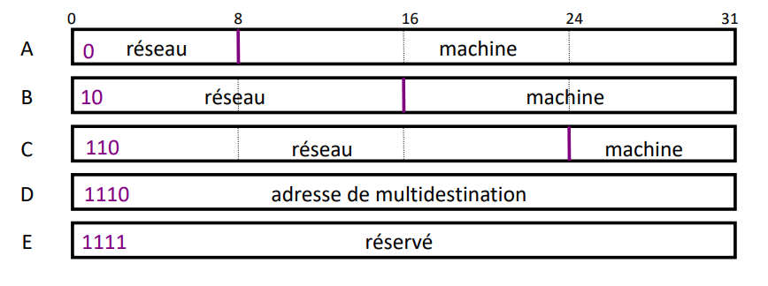
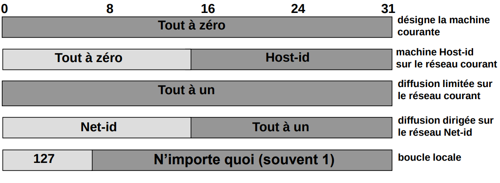

TCP/IP est considérée comme une simplification de OSI. Il y a deux visions différentes

- Le modèle OSI plus générique, des spécifications globales et des fonctionnalités définies au niveau de chaque couche
- TCP/IP utilise des protocoles bien définis, avec un modèle simplifié

## <i class="fas fa-server"></i> L'architecture TCP/IP

### Encapsulation TCP/IP : exemple

### Les rôles des 4 couches

* Couche accès au réseau (MAC)
    + Délimitation des trames
    + Accès au canal
* Couche réseau
    + Adressage
    + Routage
    + Fragmentation et réassemblage
* Couche transport
    + Multiplexage démultiplexage
    + Transfert de bout en bout
* Couche application
    + Interface avec l'utilisateur
    + Applications

## <i class="fas fa-server"></i> Adressage TCP/IPtv

Permet d'identifier chaque machine du réseau de façon unique. C'est le point de départ de toute communication sur Internet. Dans le réseau Internet chaque machine est identifiée par une adresse IP. Une machine possède aussi d'autres adresses.

### Le modèle IP

Le modèle IP est la glue qui lie l'internet. Plusieurs protocoles d'accès existent mais un seul de la couche réseau. On parle d'adressage physque et logique.

### Adressages physique et logique

L'adresse de la couche accès est une adresse physique, elle est fixée par le constructeur, non modifiable. Elle est utilisée seulement sur les réseaux physique (Ethernet), c'est une adresse plate et elle identifie physiquement un équipement.

L'adresse IP est l'adresse logique choisie par l'administrateur du réseau.

### Adressage IPv4

* Adressage : pour l'identification d'un équipement réseau, pour le routage
* Plant d'adressage homogène : format : 4 octets => 4.3 milliards d'adresses, notation décimale pointée
* Adresse globalement unique et hiérarchique
* Format : `<réseau><machine>`

### Classes d'adresses

* Classe A = 0.0.0.0 à 127.255.255.255
* Classe B = 128.0.0.0 à 191.255.255.255
* Classe C = 192.0.0.0 à 223.255.255.255
* Classe D = 224.0.0.0 à 239.255.255.255
* Classe E = 240.0.0.0 à 255.255.255.255

### Adresses publiques et privées

* Parmi les adresses IP disponibles, certaines ne peuvent être utilisées que
  pour un usage local
* Ces adresses ne permettent pas un accès à Internet
* Utile pour mettre en place les réseaux 
