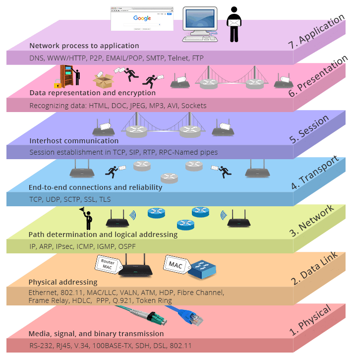
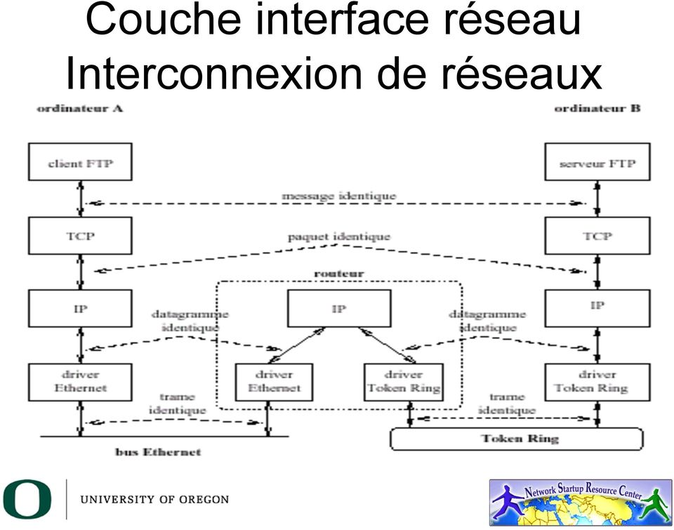
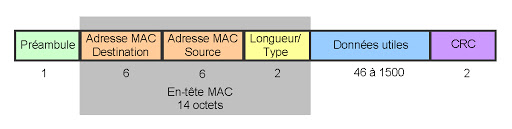

## Historique et définition de l'internet

### 3 définitions pour Internet

1. Une famille de protocoles de communication, appelée :
    + TCP/IP : Transmission Control Protocol / Internetworking Protocol
    + ou Internet Protocol Suite
2. Un réseaum mondial constituéé de milliers de réseaux hétérogènes
   interconnectés au moyen des protocoles TCP/IP
    + Réseaux locaux d'agences gouvernementales, institutions d'éducation,
      hôpitaux, des commerciaux ...
    + Réseaux fédérateur de Campus
    + Réseaux Régionaux, Nationaux, Intercontinentaux
3. Une communauté de personnes utilisant différents services
    + Courrier électronique, Web, Transfert de fichiers FTP ...

### Gouvernance d'Internet

La gouvernance d'internet se base sur trois axes, la gestion des adresses IP
(IANA attribue les blocs d'adresses, RIR distribue les adresses aux
fournisseurs). Ensuite vient la gestion des noms de domaine (ICANN) et la
spécification de nouveaux standards (IEEE, IETF).

## <i class="fas fa-server"></i> Rappel : Principe de fonctionnement

## <i class="fas fa-server"></i> Interconnexion niveau réseau

Plusieurs question sont alors soulevées sur l'interconnexion des réseaux :

1. Comment traiter la diversité et variété des supports de communication (couche
   1 et 2) à cause des
    + évolutions technologiques
    + besoins différents et débit, distance, fiabilité ...
    + coûts différents
2. Comment gérer les communications entre entités raccordées à des supports
   différents et assurer l'interopérabilité des applications fonctionnant dans
   ce contexte

Certains moyens d'interconnexions sont alors mit en place

+ L'interconnexion permet de fédérer plusieurs réseaux présentant des
  différences physiques ou protocolaires afin de permettre la communications
  entre leurs entités
+ Diviser pour régner : segmenter un réseau en plusieurs parties en plusieurs
  parties à des fins de performances, d'administration ou de sécurité

Le rôle de l'interconnexion de niveau 3 (couche réseau du modèle OSI) est triple

+ masque l'hétérogénéité des supports en les fédérant
+ permettre un service de communication unifié
+ protocole de la couche réseau adapté à de nombreux support

L'IP (Internet protocole) fonctionne sur des supports variés (filaire et sans
fil) et offre des supports variés (filaire et sans fil) et offre des services à
la couche 4 (UDP, TCP, etc)

### Commutation de paquets vs Commutation de circuits

#### Commutation de paquets.

Un message à transmettre est découpé en paquets comportant, outre la portion du
message découpé, des informations d'adresses (source et destination) et autre
informations de contrôle. Chaque paquet est ensuite envoyé vers sa destination
en utilisant une route d'acheminement

#### commutation de circuits.

La commutation de circuits est fondée sur la négociation et la construction d'un
chemin unique exclusif d'une machine A à une machine B, lors de
l'établissement du dialogue entre ces deux machines. Le chemin ainsi crée
perdure jusqu'à la clôture du dialogue.

### Mode connecté vs non connecté

La transmission de messages entre deux éléments d'un réseau peut se faire
selon deux modes

+ mode connecté
+ mode non connecté

En commutation de paquets, on parle aussi des deux modes :

+ la transmission s'effectue en mode connecté, et tous les paquets du message
  vont suivre le même chemin
+ la transmission s'effectue en mode "non-connecté" aussi appelé mode datagramme
  dans dans lequel les paquets ne vont pas tous suivre le même chemin, et la
  station réceptrice devra remettre les paquets dans le bon ordre pour
  reconstituer le message.

### Rappel : structure d'une trame Ethernet 802.3

### Adressage IP :

+ Identification d'une entité sur un réseau TCP/IP (unique sur le rseau
  considéré, indépendante des couches inférieures, une adresse par point d'accès
  au réseau)
+ 32 bits
+ Une adresse se décompose en deux champs : numéro de réseau (bits de poids fort
  ), numéro d'entité sur ce réseau, valeurs 0 et 255 spéciales

### Cinq classes d'adresse

1. Classe A de 1.x.x.x à 127.x.x.x
2. Classe B de 128.0.x.x à 191.255.x.x
3. Classe C de 192.0.0.x à 223.255.255.x
4. Classe D de 224.0.0.0 à 239.255.255.255 (multicast)
5. Classe E de 240.0.0.0 à 255.255.255.255 (expérimentale)

## <i class="fas fa-server"></i> Résolutions d'adresses

Les entités réseau sont désignées par leur adresse de niveau 3 (IP),
l'utilisation d'un réseau physique pour l'acheminement d'un datatagrame.
Identification des entités sur le réseau physique par leur adresse de niveau 2.

Le but est donc de trouver une manière d'obtenir l'adresse de niveau 2
(physique) d'une entité à partir de son adresse de niveau 3.

### Méthode de résolution

1. fonction de traduction simple, sur un réseau physique donnée, quelque fois
   possible.
2. table de traduction statique
3. mécanisme de découverte à l'aide d'un protocole réseau
4. solution hybrides : le protocole ARP

### Protocole ARP

Pour Address Resolution Protocol, initialement prévu pour le support Ethernet.
Les mécanismes sont similaires pour d'autres support.

La problématique est la suivante : nous avons des adresses internet (32 bits
affectées par l'InterNic pour l'internet) et une adresse Ethernet (48 bits,
affectées par l'IEEE et, souvent associés aux cartes d'interfaces).

- pas de fonction de résolution simple
- table de résolution statique extrêmement contraignante
- utilisation d'un mécanisme de découverte, ARP, associé à une table dynamique

Principe de la résolution d'adresses par ARP :

1. vérification de l'existence de la correspondance entre addresse IP et adresse
   Ethernet dans la table dynamique
2. en cas d'absence dans la table dynamique
    + envoie d'une requête ARP (who has) en diffusion générale sur le réseau
      Ethernet : **ARP Request**
    + réception et traitement de la requête par toutes les entités du réseau
    + en fonctionnement normal, seule l'entité cible est autorisée à répondre à
      la requête et le fait : **ARP reply**

Gestion de la table dynamique de résolution :

+ collecter des informations sur le réseau pour éviter les requêtes inutiles
+ conserver les correspondances acquises suffisamment longtemps pour éviter de
  surcharger le réseau
+ ne pas conserver les correspondances acquises trop longtemps pour limiter la
  taille de la table et éviter les entrées obsolètes 
  
  
