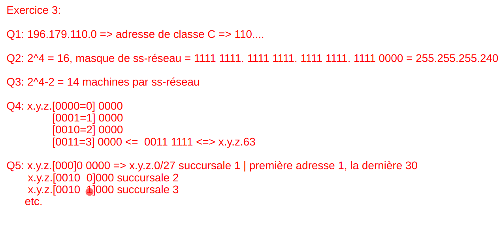
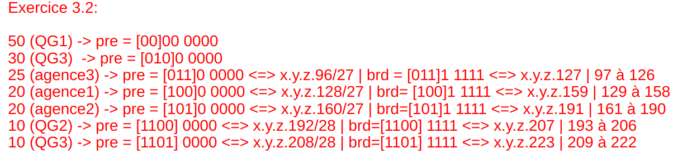

## Exercices en vrac

### Exercice p40

TODO

### Exercice p51

+ *En utilisant les formats de trame donnés, décoder les trames MAC Ethernet
  suivantes (ces trames sont données sans l'en tête)*
+ *Pour chaque trame déterminer les valeurs detous les champs présents et e
  qu'ils signifient*

Destination : `FF FF FF FF FF FF`
Source : `08 00 20 02 45 9E = 129.104.254.6`
Longueur / Type : `08 06` (dans le cas présent type qui indique l'ARP en
suivant)
Hardware type : `00 01`
Protocole Type : `08 00`
Hardware Address Length / Protocol Address Length : `06 04`
Operation Code : `0001`
Sender Hardware Address : `08 00 20`
Sender Protocol Adress : `20 02`
Target Hardware Address : `45 9E 81`
Target Protocol Address : `68 FE`

Destination : `08 00 20 02 45 9E`
Source : `08 00 20 07 0B 94 = 129.104.254.5`
Longueur / Type : `08 06` (dans le cas présent type qui indique l'ARP en
suivant)
Hardware type : `00 01`
Protocole Type : `08 00`
Hardware Address Length / Protocol Address Length : `06 04`
Operation Code : `0002`
Sender Hardware Address : `08 00 20`
Sender Protocol Adress : `07 0B`
Target Hardware Address : `94 81 68`
Target Protocol Address : `FE 05`

### Exercice p52

#### Réseau 1

`192.168.1.1` effectue un who has en cherchant `192.168.1.2`, celui là répond
is-at.

#### Réseau 2

`192.168.1.1` broadcast un who as `192.168.1.254`. Le routeur répond is-at puis
effectue un who has `192.168.2.1`. Finalement `192.168.2.1` répond un is-at.

### Exercice p14

#### Énoncé

+ Soit un datagramme IP :
  + Data = 4000 octets
  + Options copiées = 9 octets
  + Options non copiées = 26 octets
  + MTU = 512 octets

+ Étudier la fragmentation du datagramme IP
+ Écrire un algorithme (pseudo - code) permettant de fragmenter un datagramme IP
+ Étudier le ré-assemblage des fragments
+ Pourquoi la fragmentation est considérée comme mécanisme inefficace dans IP
+ Trouver une solution permettant d'éviter la fragmentation

```
MTU <-512
data <-4000
offset<-0

//Premier fragment
header_size <- 20B + "nb d'options copiées" + "nb d'options non copiées"
ip_data_size <- partie_entiere((MTU - header_size)/8) * 8

data_rest <- data - ip_data_size
offset <- partie_entiere((MTU - header_size)/8)

header_size <- header_size - "nb d'options non copiées"
nb_trames <- partie_entiere(data_rest /partie_entiere((MTU - header_size) / 8) *
8)
```

## TD 1 - Adressage et subdivision de réseau

*La subdivision de réseau est un procédé qui permet de découper logiquement des
réseaux de grande taille en sous-réseaux de plus petites tailles. Pour ce faire,
on applique, grâce à une formule mathématique, à partir d'une adresse de base,
un masque de sous-réseau. Le résultat est une plage d'adresses de machines
continues mais de taille réduite par rapport à la plage d'adresses initiales.*

### Exercice 1

*L'adresse de la machine A est 193.55.28.152. De quelle classe est cette
adresse ? Quel est le masque du réseau ? Définir l'adresse de diffusion
restreinte sur tout le sous réseau.*

Adresse de classe C, masque : `255.255.255.0`, broadcast : `193.55.28.255`

### Exercice 2

*Une entreprise a obtenu l'adresse réseau suivante par l'AFNIC :
194.57.242.0*

Adresse de classe C.

1 bit pour le sous réseau

0000 0000 -> 194.57.242.0/25 -> [1->126] -> bc = 194.57.242.127

1000 0000 -> 194.57.242.128/25 -> [129->254] -> bc = 194.57.242.255

### Exercice 3

On a un réseau de classe B : `129.178.0.0`.

On peut faire ce que l'on veut sur les deux derniers octets soit 16 bits.

`**** **-- . ---- ----` les bits * sont réservés pour les réseaux ($$2^6=64$$
réseaux possible).

Il reste $$16-6 = 10$$ bits pour les hôtes. soit $$2^10$$ possibilité c'est à
dire 1024 .

Sauf que dans les 1024 il y a deux adresses réservées, l'adresse du réseau et
l'adresse de broadcast . Au final il y a 1022 hôtes possibles.

### Exercice 4

On connait le masque de sous-réseau : `255.255.248.0`. Si on écrit le masque en
binaire : `(1111 1111)(1111 1111)(1111 1000)(0000 0000)`

```
129.148.208.x => 129.148.(1101 0000)2.x => réseau A
129.148.216.y => 129.148.(1101 1000)2.y => réseau B
129.148.210.z => 129.148.(1101 0010)2.z => réseau A
```

L'adresse du réseau $$A$$ est donc `129.148.(1101 0000)2.0 => 129.148.208.0`

Calcul de la plage d'adresse `{129.148.1101 0}[000.0000 0001 - 111.1111 1110]` équivalent `129.148.208.0` à `129.148.215.254`

Adresse de broadcast => `129.148.215.255`

### Exercice 5

Une entrée dans la table de routage est de la forme :

| Réseau destinataire | Passerelle = ip d'un routeur |
| 10.0.0.0 | 20.0.0.10(B)                 |
| 20.0.0.0 | *(C)                        |
| 30.0.0.0 |* (C)                        |
| 40.0.0.0 | 30.0.0.10 (D)                |

### Exercice 6

+ Combien de données IP au total ?

$$data_{ip} = 1500 - 26 - 20 = 1454$$ hors ce n'est pas un multiple de 8 donc
c'est 1448 qui est le multiple de 8 le plus proche de 1454 mais en dessous.

+ Combien de données IP au total peuvent être transmises dans une trame ethernet
  sur le réseau 20 ?

$$MTU_{IP} = 492$$, Le DataIP vaut $$492 - 20 = 472$$ octets.

+ Combien y aura t'il de fragment ?

$$1448 / 472 = 3.06$$ il y aura 4 fragments

+ Combien de données IP par fragment ?

Les 3 premiers auront 446 octets et le dernier 128 octets

### Exercice 7

1. Nous avons 8 bits pour notre découpage et nous avons 5 établissement (3 bits
   nécessaire), il nous reste donc 5 bits pour les hôtes c'est à dire 30 hôtes
   ($$2^5 -2$$). Nous pouvons donc le réaliser.

2.

| réseaux | @réseau | masque réseau | @diffusion | adresses des machines |
| Centro | 220.156.10.0 | 255.255.255.0 | 220.156.10.255 | * |
| A1 | 220.156.10.32 | 255.255.255.224 | 220.156.10.63 | 33->62 |
| B1 | 220.156.10.64 | 255.255.255.224 | 220.156.10.95 | 65->94 |
| C1 | 220.156.10.96 | 255.255.255.224 | 220.156.10.127 | 97->126 |
| D1 | 220.156.10.128 | 255.255.255.224 | 220.156.10.159 | 129->158 |
| E1 | 220.156.10.160 | 255.255.255.224 | 220.156.10.191 | 161->190 |

## TD 3 - Sous adressage VLSM

### Exercice 1




