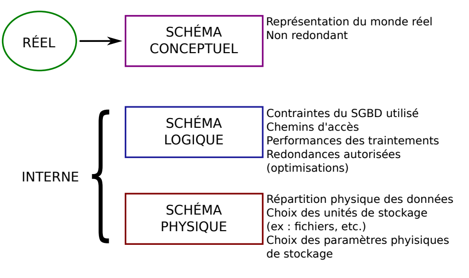
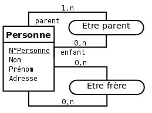
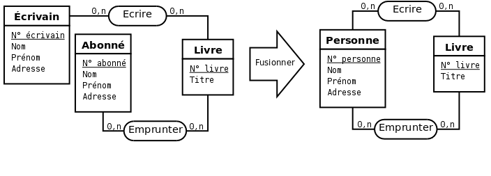
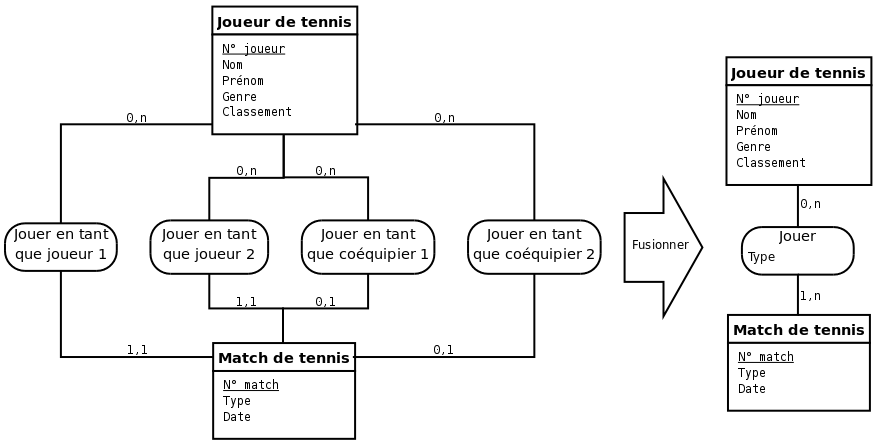
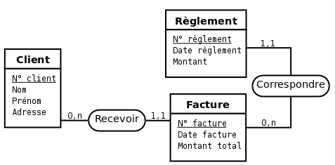
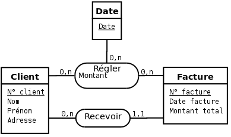

## Introduction

L'informatique permet de construire des systèmes pour effectuer des calculs
(équations différentielles, calcul matriciel, etc). Aujourd'hui on s'appuie de
plus en plus sur des données ce qui implique une gestion de grandes quantités
d'informations (ie stocjer des données et manipuler ces données). De plus les
données peuvent être de natures diverses, les opérations peuvent être plus ou
moins compliquées.

### Objectifs

C'est dans ce contexte qu'intervient les SGBD, leurs objectifs sont les suivants

+ Stocker, centraliser des données (BD) et les mettre à disposition des
  utilisateurs
+ Manipuler (de manière transparente pour l'utilisateur) des données (SGBD)

### Fonctionnalités

Pour répondre à ces objectifs les systèmes de SGBD sont munis des
fonctionnalités suivantes :

+ Gestion du stockage (tailles importantes de données, éviter les redondances)
+ Persistance (les données survivent aux programmes qui les créent)
+ Fiabilité (mécanismes de reprise sur pannes, logiciel ou matériel)
+ Sécurité / confidentialité (Contrôle des utilisateurs et des droits d'accès
  aux données)
+ Interfaces homme-machine (ergonomie, profils utilisateurs)
+ Distribution (données stockées sur différents sites)
+ Optimisation
+ Contrôle de concurrence : propriétés ACID , transactions
  + Atomicité (soit toutes les opérations de la transaction sont validées, soit
      aucune ne l'est)
  + Cohérence (préservation de la cohérence de la base)
  + Isolation (quelle que soit la manière dont les transactions concurrentes
      sont exécutées, on doit pouvoir les ordonner de sorte à ce que l'état final
      de la base soti le même qu'après une exécution séquentielle des différentes
      transactions)
  + Durabilité (Si une transaction est validée, tous les changements qu'elle a
      effectués sur la base sont persistants)

### Architecture fonctionnelle d'une SGBD

### Utilisateurs d'un SGBD

1. Administrateur
    + Définition du schéma logique
    + définition des structures de stockage et des méthodes d'accès
    + Gestion des autorisations
    + Spécification des contraintes
    + Maintenance de la performance
2. Concepteur et programmeur
    + Est informaticien
    + Connaît au moins le LMD
    + Connaît bien le SGBD
    + Connaît un ou plusieurs langages de programmation
3. Utilisateurs

### Niveau d'abstraction des données

### Principe de base

+ Indépendance physique (les applications manipulant la base au niveau logique
  ne doivent pas être réécrites si la structure physique est modifiée)
+ Indépendant logique (une modification au niveau logique n'implique aucune
  modification des applications utilisant le niveau externe)
+ Deux types de langages (description des données et manipulation des données)

### Schéma et instance

+ Analogues à la notion de variable et de type dans les langages de
  programmation
+ Schéma : structure logique de la base de données
+ Instance : le contenu effectif de la base de données à un instant donné

### Modèles de données

+ Ensemble d'outils permettant de définir les chéma et les instances ainsi que
  les opérations possibles sur les instances
+ Modèle conceptuel de données : entité - association (diagramme de classes UML)
+ Modèle logique des données : modèle relationnel
+ Modèle physique de données : implémentation particulière du modèle logique de
  données par le logiciel

### Conception d'une base de données

La conception d'une base de données se découpe en 4 étapes

1. Analyse des besoins
2. Descrption conceptuelle
3. Conception logique
4. Conception physique

Les 2 premières phases sont indépendantes du SGBD

Le passage de la 2 à la 3 peut être en partie automatisée

## <i class="fas fa-database"></i> Modèle conceptuel

### Entité

Une `entité` correspond à un ensemble homogène d’informations qui correspondent
au même « objet » à informatiser. Cette entité a un nom unique afin de la
manipuler facilement.
Les entités ne sont généralement pas représentes graphiquement.

Un `type d'entité` désigne un ensemble d'entités qui possèdent une sémantique et
des propriétés communes.
Une entité est souvent nommée occurrence ou instance de son type entité.

### Attribut ou propriété, valeur

Un `attribut` (ou une propriété) est une caractéristique associée à un type
entité ou à un type association.
Au niveau du type entité ou du type association, chaque attribut possède un
domaine qui définit l'ensemble des valeurs possible qui peuvent être choisies
pour lui (entier, chaine de caractères, booléen ...). Au niveau de l'entité,
chaque attribut possède une valeur compatible avec son domaine.

**Règle 5** : Un attribut ne peut en aucun cas être partagé par plusieurs par plusieurs type
entité ou type association.

**Règle 6** : Un attribut est une donné élémentaire, ce qui exclut des données calculées ou
dérivées.

**Règle 7** : Un type entité et ses attributs doivent être cohérents entre eux.

### Identifiant ou clé

Un `identifiant` (ou clé) d'un type entité ou d'un type association est
constitué par un ou plusieurs de ses attributs qui doivent avoir une valeur
unique pour chaque entité ou association de ce type.
Il est donc impossible que les attributs constituant l'identifiant d'un type
entité (respectivement type association) prennent la même valeur pour deux
entités (respectivement deux associations) distinctes.

**Règle 9**Chaque type entité possède au moins un identifiant, éventuellement formé de
plusieurs attributs.
Ainsi, chaque type entité possède au moins un attribut qui, s'il est seul, est donc forcément l'identifiant

### Association ou relation

Une `association` (ou une relation) est un lien entre plusieurs entités, les
associations ne sont généralement pas représentées graphiquement.

Un `type association` (ou un type relation) désigne un ensemble de relations qui
possèdent les mêmes caractéristiques. Le type association décrit un lien entre
plusieurs type entité. Les associations de ce type association lient des entités
de ces type entité.
Comme les types entités, les types association sont définis à l'aide d'attributs
qui prennent leur valeur dans les associations.

**Règle 10** Un attribut peut être placé dans un type association uniquement lorsqu'il dépend
de toutes les entités liées par le type association.

Un attribut peut être placé dans un type association uniquement lorsqu'il
dépend de toutes les entités liées par le type association.
Un type association peut ne pas posséder d'attribut explicite et cela est
relativement fréquent, mais on verra qu'il possède au moins des attributs
implicites.
Une association est souvent nommée occurence ou instance de son type
association.

Les types entité intervenant dans un type association sont appelés les
`participants` de ce type association

L'ensemble des participants d'un type association est appelé la `collection` de
ce type association
Cette collection comporte au moins un type entité mais elle peut en contenir
plus, on parle alors de type association $n-aire$

La `dimension`, ou l'arité d'un type association est le nombre de type
association est le nombre de type entité contenu dans la collection

Comme un entité, un type association possède forcément un identifiant qu'il soit
explicite ou non.

**Règle 16** La concaténation des identifiant des types entités liés à un type association
constitue un identifiant de ce type association et cet identifiant n'est pas
mentionné sur le modèle
Cette règle implique que deux instances d'un même type association ne peuvent
lier un même ensemble d'entités.
Souvent, un sous-ensemble de la concaténation des identifiants des types entité
liés suffit à identifier le type association
On admet également un identifiant plus naturel et explicite, à condition qu'il
ne soit qu'un moyen d'exprimer plus simplement cette concaténation.

### Cardinalité

La `cardinalité` d'une patte reliant un type association et un type entité
précise le nombre de fois minimal et maximal d'interventions d'une entité du
type entité dans une association du type association. La cardinalité minimale
doit être inférieure ou égale à la cardinalité maximale.

Exemple de cardinalité : une personne peut être l'auteur de 0 à $n$ livre,
mais un livre ne peut être écrit que par une personne.

**Règle 18** L'expression de la cardinalité est obligatoire pour chaque patte d'un type
association.
Une cardinalité minimale est toujours 0 ou 1 et une cardinalité maximale est
toujours 1 ou n.
Ainsi si une cardinalité maximale est connue et vaut 2,3 ou plus, alros nous
considérons qu'elle est interderminée et vaut $n$. En effet, si nous
connaissons $n$ au moment de la conception, il se peut que cette valeur évolue
au cours du temps. Il vaut donc mieux considérer $n$ comme inconnue dès le
départ. De la même manière, on e modélise pas de cardinalités minimales qui
valent plus de 1, car ces valeurs sont également susceptibles d'évoluer. Enfin,
une cardinalité maximale de 0 n'a pas de sens, car elle rendrait le type
association inutile.

## Compléments sur les associations

### Associations plurielles

### Association réflexive

Un type association est qualifié de réflexif quand il matérialise une relation
entre un type entité et lui-même.

Une occurrence de ce type association (ie une association) associe généralement
une occurence du type association (ie une entité) à une autre entité du même
type. Cette relation peut être symétrique, c'est le cas du type association
*Être frère* sur la figure ci dessus, ou ne pas l'être comme le type association
*Être parent* sur cette même figure. Dans le cas où la relation n'est pas
symétrique, on peut préciser les rôles sur les pattes du type association comme
pour la relation *Être parent* sur cette même figure. L'ambiguïté posée par la
non-symétrie d'un type association réflexif sera levée lors du passage au modèle
relationnel.

### Association $n$-aire

Précédemment nous avons introduit la notion de type association $n$-aire. Ce
type association met en relation $n$ type entité. Même s'il n'y a, en
principe, pas de limite sur l'arité d'un type association, dans la pratique on
ne va rarement au-delà de trois. Les associations de degré supérieur à deux sont
plus difficiles à manipuler et à interpréter, notamment au niveau des
cardinalité.

## <i class="fas fa-database"></i> Règles de bonne formation d'un modèle entités-associations

La bonne formation d'un modèle entités-associations permet d'éviter une grande
partie des sources d'incohérences et de redondance. Pour être bien formé, un
modèle entités-associations doit respecter certaines règles et les types entité
et type association doivent être normalisés. Un bon principe de conception peut
être formulé ainsi "une seule place pour chaque fait".

Bien que l'objectif des principes exposés dans cette section soit d'aider le
concepteur à obtenir un diagramme entités-associations bien formé, ces principes
ne doivent pas être interprétés comme des lois. Qu'il s'agisse des règles de
bonne formation ou des règles de normalisation, il peut exister, très
occasionnellement, de bonnes raisons pour ne pas les appliquer.

### Règles portant sur les noms

Dans un modèle entités-associations, le nom d'un type entité, d'un type
association ou d'un attribut doit être unique.

La présence des deux type entité Enseignant et Étudiant est symptomatique d'une
modélisation inchevée. À terme, ces deux type enttié doivent être fusionnés en
un unique type entité Personne.

Ici, les attributs Adresse de facturation sont redondants. Cette situation doit
être évitée à tout prix, car elle entraîne un gaspillage d'espace mémoire, mais
aussi et surtout un grand risque d'incohérence. En effet, que faire si, dans le
cadre d'une occurence du type association Correspondre, les valeurs des deux
attributs Adresse de facturation diffèrent ?

Dans cette situation, les deux attributs Adresse doivent simplement être renomés
en Adresse client et Adresse fournisseur. Il en va de même pour les deux
attributs Nom.

Lorsque des attributs portent le même nom, c'est parfois le signe d'une
modélisation inachevée ou d'une redondance. Sinon, il faut simplement ajouter au
nom de l'attribut le nom du type entité ou du type association dans lequel il se
trouve. Il faut toutefois remarque que le dernier cas décrit n'est pas
rédhibitoire et que les SGBD relationnel s'accommodent très bien de relations
comportant des attributs de même nom. L'écriture des requêtes sera tout de même
plus lisible si les attributs ont tous des noms différents.

### Règle de normalisation des attributs

**Règle 22** : Il faut remplacer un attribut multiple en un type association et un type entité supplémentaires.

Remplacement des attributs multiples en un type association et un type entité et
décomposition des attributs composites.

En effet, les attributs multiples posent régulièrement des problèmes d'évoluvité
du modèle. Par exemple, sur le modèle de gauche de la figure ci dessus, comment
faire si un employé possède deux adresses secondaires ou plusieurs numéros de
portable ?

Il est également intéressant de décomposer les attributs composites comme
l'attribut Adresse par exemple. Il est en effet difficile d'écrire une requête
portant sur la ville où les habitent les employés si cette information est noyée
dans un unique attribut Adresse.

**Règle 23** : Il ne faut jamais ajouter un attribut dérivé d'autres attributs, que ces autres
attributs se trouvent dans le même entité ou pas.

Il faut supprimer l'attribut Montant total du type entité Commande car on peut
le calculer à partir des attributs Quantité du type association Contenir et Prix
unitaire du type entité Article.

En effet, les attributs dérivés induisent un risue d'incohérence entre les
valeurs des attributs de base et celles des attributs dérivés. La figure ci
dessus illustre le cas d'un attribut Montant total dans un type entité Commande
qui peut être calculé à partir des attributs Quantité du type association
Contenir et Prix unitaire du type entité Article. Il faut donc supprimer
l'attribut Montant total dans le type entité Commande. D'autres attributs
dérivés sont également à éviter comme l'âge, que l'on peut déduire de la date de
naissance et de la date courante. Il faut cependant faire attention aux pièges :
par exemple , le code postal ne détermine ni le numéro de département ni la
Ville.

Comme nous l'avons déjà dit, les attributs d'un type association doivent
dépendre directement des identifiants de tous les types entité de la collection
du type association.

Comme la cardinalité maximale du type association Livrer est 1 du côté de type
entité Livraison, l'attribut Nom livreur de Livrer doit être déplacé dans
Livraison.

Par exemple, sur la figure 2.19 , l'attribut Quantité du type association
Contenir dépend bien à la fois de l'identifiant N° de commande et de n° article
des types entité de la collection de Contenir. Inversement, sur cette même
figure, l'attribut Prix-unitaire ne dépend que de N°Article du type entité
Article, il ne pourrait donc pas être un attribut du type association Contenir.
Une conséquence immédiate de cette règle est qu'un type association dont la
cardinalité maximalee de l'une des pattes est 1 ne peut pas posséder d'attribut.
Si elle en possédait, ce serait une erreur de modélisation et il faudrait les
déplacer dans le type entité connecté à la patte portant la cardinalité maximale
de 1.

Un attribut correspondant à un type énuméré est généralement avantageusement
remplacé par un type entité.

Par exemple sur la figure ci dessous, l'attribut Type caractérise le type d'une
émission et peut prendre des valeurs comme : actualité, culturelle, reportage,
diversement, etc. Remplacer cet attribut par un type entité, permet d'une part,
d'augmenter la cohérence (en s'affranchissant, par exemple, des variations du
genre culturelle, culture, Culture ...) et d'autre part, si les cardinalités le
permettent, de pouvoir affecter plusieurs types à une même entité (ex :
actualité et culturelle)

### Règles de fusion/suppression d'entités/associations

**Règle 25 :** Il faut factoriser les types entité quand c'est possible.

La spécialisation du type entité obtenu peut se traduire par l'introduction d'un
attribut supplémentaire dont l'ensemble des valeurs possibles est l'ensemble des
noms des types entité factorisés

Il faut factoriser les types entité quand c'est possible, éventuellement en
introduisant un nouvel attribut.

Mais l'introduction d'un attribut supplémentaire n'est pas forcément nécessaire
ou souhaitable. Ne pas introduire d'attribut permet en outre de permettre à une
personne d'être à la fois un Abonné et Écrivain

Il faut factoriser les types entité quand c'est possible, mais l'introduction
d'un attribut supplémentaire n'est pas toujours nécessaire. Remarque : ce
diagramme est intentionnellement simplifié à outrance.

Il faut factoriser les types association quand c'est possible.

La spécialisation du type association obtenu peut se traduire par l'introduction
d'un attribut supplémentaire dont l'ensemble des valeurs possibles est
l'ensemble des noms des types association factorisés.

Un seul type association suffit pour remplacer les quatre type association Jouer
en tant que ...

La figure ci dessus montre un exemple de multiplication inutile de type
association.

**Règle 27** Un type entité remplaçable par un type association doit être
remplacé.

**Règle 28** Lorsque les cardinalités d'un type association sont toute 1,1 c'est
que le type association n'a pas lieu d'être.

Il faut aussi se poser la question de l'intérêt du type association quand les
cardinalités maximales sont toutes de 1.

Lorsque les cardinalités d'un type association sont toutes 1,1 c'est qu'il
s'agit d'un type association fantôme.

Lorsque les cardinalités d'un type association sont toutes 1,1, le type
association doit généralement être supprimé et les types entité correspodants
fusionnés comme l'illustre la figure ci dessus. Néanmoins, même si toutes ces
cardinalités maximales sont de 1, il est parfois préférable de ne pas supprimer
le type association, comme dans l'exemple de la figure ci dessous

Il faut veiller à éviter les types association redondants. En effet, s'il existe
deux chemins pour se rendre d'un type entité à un autre, alors ces deux chemins
doivent avoir deux significations ou deux durées de vie distinctes. Dans le cas
contraire, il faut supprimer le chemin le plus court puisqu'il est déductible
des autres chemins.

Si un client ne peut pas régler la facture d'un autre client, alors le type
association Payer est inutile.

Solution au problème de la redondance du type association

Dans ce cas, si un client peut régler la facture d'un autre client, alors c'est
la **règle 27** qu'il faut applique : on remplace le type entité Règlement par
un type association Régler.

### Normalisation des types entité et type association

#### Introduction

Les formes normales sont différents sont différents stades de qualité qui
permettent d'éviter la redondance, source d'anomalies. La normalisation peut
être aussi bien effectuée sur un modèle entités-associations, où elle s'applique
sur les types entité et type association, que sur un modèle relationnel.

Il existe 5 formes normales principales et deux extensions. Plus le niveau de
normalisation est élevé, plus le modèle est exempt de redondances. Un type
entité ou un type association en forme normale de niveau $n$ est
automatiquement en forme normale de niveau $n-1$. Une modélisation rigoureuse
permet généralement d'aboutir directement à des types entité et types
association en forme normale de Boyce-Codd.

Nous avons décidé de présenter deux fois cette théorie de la normalisation

+ Une première fois, dans le cadre du modèle entités-associations, en
  privilégiant une approche plus intuive qui n'introduit pas explicitement la
  notion de dépendance fonctionnelle (et encore moins les notions de dépendance
  multivaluée et de jointure). Nous nous arrêterons, dans cette section, à la
  forme normale de Boyce-Codd.

+ Puis une seconde fois, dans le cadre de modèle relationnel, en privilégiant
  une approche plus formelle s'appuyant sur la définition des dépendances
  fonctionnelle, multivaluée et de jointure. Nous irons alors jusqu'à la
  cinquième forme normale.

#### Première forme normale (1FN)

Exemple de normalisation en première forme normale.

Un type entité ou un type association est en première forme normale si tous ses
attributs sont élémentaires, c'est à dire non décomposables.

Un attribut composite doit être décomposé en attributs élémentaires ou faire
l'objet d'une entité supplémentaire (comme l'attribut Occupants sur la figure ci
dessous).

L'élémentarité d'un attribut est toutefois fonction des choix de gestion. Par
exemple, la propriété Adresse peut être considérée comme élémentaire si la
gestion de ces adresses est globale. Par contre, s'il faut pouvoir considérer
les codes postaux, les noms de rues ..., il convient d'éclater la propriété
Adresse en Adresse (au sens numéro d'appartement, numéro et nom de rue), Code
postal et Ville. En cas de doute, il est préférable (car plus général) d'éclater
une propriété que d'effectuer un regroupement.

#### Deuxième forme normale (2FN)

Un type entité ou un type association est en deuxième forme normale si, et
seulement si, il est en première forme normale et si tout attribut
n'appartenant pas à la clé dépend de la totalité de cette clé.

Autrement dit, les attributs doivent dépendre de l'ensemble des attributs
participant à la clé. Ainsi, si la clé est réduite à un seul attribut, ou si
elle contient tous les attributs, le type entité ou le type association est, par
définition, forcément en deuxième forme normale.

La figure ci dessus montre un type entité Article décrivant des produits
provenant de différents fournisseurs. On suppose qu'un même fournisseur peut
fournir plusieurs produits et qu'un même produit peut être fourni par différents
fournisseurs. Dans ce cas, les attributs Produit ou Fournisseur ne peuvent
constituer un identifiant du type entité Article. Cependant l'attribut Adresse
fournisseur ne dépend maintenant que d'une partie de la clé (Fournisseur). Opter
pour une nouvelle clé arbitraire à un seul attribut N° article permet d'obtenir
un type entité Article en deuxième forme normale. On va voir dans ce qui suit
que cette solution n'a fait que déplacer le problème.

#### Troisième forme normale (3FN)

Un type entité ou un type association est en troisième forme normale si, et
seulement si, il est en deuxième forme normale et si tous ses attributs
dépendent directement de sa clé et pas d'autres attributs.

Cette normalisation peut amener à désimbriquer des types entités cachés comme le
montre la figure ci dessus.

Un type entité ou un type association en deuxième forme normale avec au plus un
attribut qui n'appartient pas à la clé est, par définition, forcément en
troisième forme normale.

#### Forme normale de Boyce-Codd (BCNF)

Un type entité ou un type association est en forme normale de Boyce-Codd si, et
seulement si, il est en troisième forme normale et si aucun attribut faisant
partie de la clé dépend d'un attribut ne faisant pas partie de la clé.

Intéressons-nous par exemple à la figure au dessus, à un type entité Diplômé
modélisant des personnes (Nom et Prénom) possédant un diplôme (Diplôme) d'une
institution (Institution). On suppose qu'il n'y a pas d'homonyme, qu'une même
personne ne possède pas deux fois le même diplôme, mais qu'elle peut posséder
plusieurs diplômes différents. Une institution ne délivre qu'un type de diplôme,
mais qu'elle peut posséder plusieurs diplôme peut être délivré par plusieurs
institutions (par exemple, plusieurs écoles d'ingénieurs délivrent des diplômes
d'ingénieur). Une clé possible pour le type entité Diplômé est donc Nom, Prénom,
Diplome. Le type entité obtenu est en troisième forme normale, mais une
redondance subsiste, car l'attribut Institution détermine l'attribut Diplôme. Le
type entité Diplômé n'est donc pas en forme normale de Boyce-Codd.

Un modèle en forme normale de Boyce-Codd est considéré comme étant de qualité
suffisante pour une implantation.

#### Autre formes normales

Il existe d'autres formes normales.

## Élaboration d'un modèle entités associations

### Étapes de conceptions d'un modèle entités-associations

Pour concevoir un modèle entités-associations vous devrez certainement passer
par une succession d'étapes. Nous les décrivons ci-dessous dans l'ordre
chronologique. Sachez cependant que la conception d'un modèle
entités-associations est un travail non linéaire. Vous devrez régulièrement
revenir à une étape précédente et vous n'avez pas besoin d'en avoir terminé avec
une étape pour commencer l'étape suivante.

#### Recueil des besoins

C'est une étape primordiale. Inventoriez l'ensemble des données à partir des
documents de l'entreprise d'un éventuel cahier des charges et plus généralement
de tous les supports de l'information. N'hésitez pas à poser des questions.

#### Tri de l'information

Faites le tri dans les données recueillies. Il faut faire attention, à ce
niveau, aux problèmes de synonymie / polysémie. En effet, les attributs ne
doivent pas être redondants. Par exemple, si dans un langage de l'entreprise on
peut parler indifféremment de référence d'article ou de n° de produit pour
désigner la même chose, cette caractéristique ne devra se concrétiser que par un
unique attribut dans le modèle. Inversement, on peut parler d'adresse pour
désigner l'adresse du fournisseur et l'adresse du client, le contexte permettant
de lever l'ambiguïté. Par contre, dans le modèle, il faudra veiller à bien
distinguer ces deux caractéristiques par deux attributs distincts.

Un autre exemple est celui d'une entreprise de production fabricant des produits
à destination d'une autre société du même groupe. Il se peut que dans ce cas, le
prix de production (ie le coût de revient industriel) soit le même que le prix de
vente (aucune marge n'est réalisée). Même dans ce cas où les deux
caractéristiques sont identiques pour chaque entité (prix de production égale au
prix de vente), il faut impérativement les scinder en deux attributs au niveau
du type entité Produit. Sinon, cette égalité factuelle deviendrait une
contrainte imposée par le modèle, obligeant alors l'entreprise de production à
revoir son système le jour où elle décidera de réaliser une marge (prix de
production inférieure au prix de vente).

#### Identification des types entité

Le repérage d'attributs pouvant servir d'identifiant permet souvent de repérer
un type entité. Les attributs de ce type entité sont alors les attributs qui
dépendant des attributs pouvant servir d'identifiant. Lorsqu'on ne parvient pas
à trouver d'identifiant pour un type entité, il faut se demander s'il ne s'agit
pas en fait d'un type association. Si ce n'est pas le cas, un identifiant
arbitraire numérique entier peut faire l'affaire.

#### Identification des types association

Identifiez les types association reliant les types entité du modèle. Le cas
échéant, leur affecter les attributs correspondants.

Il est parfois difficile de faire un choi entre un type entité et un type
association. Par exemple, un mariage peut être considéré comme un type
association entre deux personnes ou comme un type entité pour lequel on veut
conserver un numéro, une date, un lieu ... et que l'on souhaite manipuler en
tant que tel.

Étudier également les cardinalités des types association retenus. Lorsque toutes
les pattes d'un type association portent la cardinalité 1,1, il faut se demander
si ce type association et les types entités liés ne décrivent pas en fait un
seul type entité.

#### Vérification du modèle

Vérifiez que le modèle respecte bien les règles que nous avons énoncées et les
définitions concernant la normalisation des types entité et des types
association. Le cas échéant, opérez les modifications nécessaires pour que le
modèle soit bien formé.
