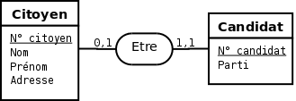
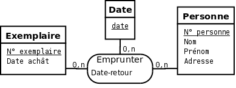
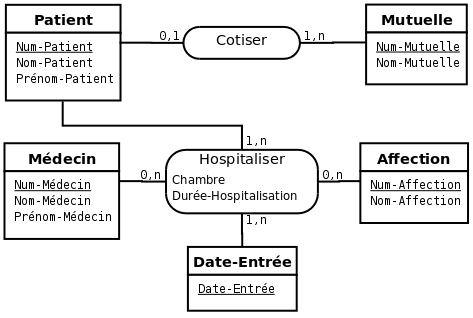

## Introduction au modèle relationnel

### Présentation

Dans ce modèle, les données sont représentées par des tables, sans préjuger de
la façon dont les informations sont stockées dans la machine. Les tables
constituent donc la structure logique du modèle relationnel. Au niveau physique,
le système est libre d'utiliser n'importe quelle technique de stockage (fichiers
séquentiels, indexage, adressage dispersé, series de pointeurs, compression ...)
dès lors qu'il est possible de relier ces structures à des tables au niveau
logique. Les tables ne représentent donc pas qu'une abstraction de
l'enregistrement physique des données en mémoire.

Le succès du modèle relationnel auprès des chercheurs, concepteurs et
utilisateurs est dû à la puissance et à la simplicité de ses concepts. En outre,
contrairement à certains autres modèles, il repose sur des bases théoriques
solides, notamment la théorie des ensembles et la logique des prédicats du
premier ordre.

Les objectifs du modèle relationnel sont

+ proposer des schémas de données faciles à utiliser
+ améliorer l'indépendance logique et physique
+ mettre à la disposition des utilisateurs des langages de haut niveau
+ optimiser les accès à la base de données
+ améliorer l'intégrité et la confidentialité
+ fournir une approche méthodologique dans la construction des schémas.

De façon informelle, on peut définir la modèle relationnel de la manière
suivante

+ les données sont organisées sous forme de tables à deux dimensions, encore
  appelées relations, dont les lignes sont appelées $n$-uplet ou tuple en
  anglais
+ les données sont manipulées par des opérateurs de l'algèbre relationnelle
+ l'état cohérent de la base est défini par un ensemble de contraintes
  d'intégrité

  Au modèle relationnel est associée a la théorie de la normalisation des
  relations qui permet de se débarasser des incohérences au moment de la
  conception d'une base de données relationnelle.

### Éléments du modèle relationnel

Un **attribut** est un identificateur (un nom) décrivant une information stockée
dans une base.

Le **domaine** d'un attribut est l'ensemble, fini ou infini, de ses valeurs
possibles.

Une **relation** est un sous-ensemble du produit cartésien de $n$ domaines
d'attributs ($n >0$).

Un **schéma de relation** précise le nom de la relation ainsi que la liste des
attributs avec leurs domaines.

Le **degré** d'une relation est son nombre d'attributs

Une **occurence**, ou $n$-uplets, ou tuples, est une élément de l'ensemble
figuré par une relation. Autrement dit, une occurence est une ligne du tableau
qui représente la relation.

La **Cardinalité** d'une relation est son nombre d'occurences.

Une **clé candidate** est donc distince pour tous les tuples de la relation. La
notion de clé candidate est essentielle dans le modèle relationnel.

**Règle 9** Toute relation a au moins une clé candidate et peut en avoir
plusieurs.

Ainsi, il ne peut jamais y avoir deux tuples identiques au sein d'une relation.
Les clés candidates d'une relation n'ont pas forcément le même nombre
d'attributs. Une clé candidate peut être formée d'un attribut arbitraire,
utilisé à cette seule fin.

La **clé primaire** d'une relation est une de ses clés candidate. Pour signaler
la clé primaire, ses attributs sont généralement soulignés.

Une **clé étrangère** dan une relation est formée d'un ou plusieurs attributs
qui consistent une clé primaire dans une autre relation.

Un **schéma relationnel** est constitué par l'ensemble des schémas de relation

Une **base de données relationnelle** est constituée par l'ensemble des
$n$-uplets des différents relations du schéma relationnel.

### Passage du modèle entités-associations au modèle relationnel

#### Règles de passage

Pour traduire un schéma du modèle entités-associations vers le modèle
relationnel, on peut appliquer les règles suivantes :

1. La normalisation devrait toujours être effectué avant le passage au modèle
   relationnel. Dans les faits, elle est parfois faite a posteriori ce qui impose
   toujours une surcharge de travail importante.
2. Chaque type entité donne naissance à une relation. Chaque attribut de ce
   type entité devient un attribut de la relation. L'identifiant est conservé en
   tant que clé de la relation.
3. Chaque type association dont aucune patte n'a pour cardinalité maximale 1
   donne naissance à une relation. Chaque attribut de ce type association devient
   un attribut de la relation. L'identifiant, s'il est précisé, est conservé en
   tant que clé de la relation, sinon cette clé est formée par la concaténation des
   identifiant des types entité qui interviennent dans le type association.
4. Un type association dont au moins une patte a une cardinalité maximale à 1
   (ce type association devrait être binaire et n'a généralement pas d'attribut)
   ne devient pas une relation. Il décrit en effet une dépendance fonctionnelle.
   La relation correspondant au type entité dont la patte vers le type
   association a une cardinalité maximale valant 1, se voit simplement ajouter
   comme attribut (et donc comme clé étrangère l'identifant de l'autre type
   entité).

#### Cas particulier d'un type association du type 1 vers 1

Dans l'exemple ci dessus toutes les cardinalités maximales du type association
*Etre* sont de 1. L'application des règles de passage du modèle
entités-associations au modèle relationnel énoncées ci dessus nous donnerait :

+ Citoyen(*Num-citoyen*, Num-candidat, Nom, Prénom, Adresse)
+ Candidat(*Num-candidat*, Num-citoyen, Parti)

L'attribut *Num-candidat* dans la relation Citoyen est une clé étrangère de la
relation *Candidat*. L'attribut *Num-citoyen* dans la relation *Candidat* est
une clé étrangère de la relation Citoyen.

Le type association *Etre* étant du type 1 vers 1, il est entièrement
matérialisé dans la relation *Candidat*. L'attribut *Num-candidat* dans la
relation *Citoyen* doit donc être supprimé. D'autre part, dans la relation
*Candidat*, l'attribut *Num-Citoyen*, en plus d'être une clé étrangère,
constitue une clé candidate. On peut donc se passer de la clé *Num-candidat*.

Le schéma relationnel adéquat correspondant au mmodèle ci dessus devient donc

+ Citoyen(*Num-citoyen*,Nom,Prénom,Adresse)
+ Candidat(*Num-citoyen*,Parti)

où *Num-Citoyen*, en plus d'être la clé de la relation Candidat, est une clé
étrangère de la relation Citoyen.

#### Cas partiulier d'un type entité sans attribut autre que sa clé

Lorsqu'un type entité ne possède pas d'attribut en dehors de sa clé, il ne faut
pas nécessairement en faire une relation.

Par exemple, le type entité Date de la figure ci dessus ne doit pas se traduire
par une relation. Le schéma relationnel adéquat correspondant au modèle
entités-associations de la figure est donc

+ Exemplaire(Num-Exemplaire, date-achat) ;
+ Personne(Num-Personne, nom, prénom, adresse) ;
+ Emprunter(Num-Exemplaire, Num-Personne, Date, date-retour).

#### Exemple complet

Comme exemple d'application, voici les relations déduites du schéma
entités-associations de la figure ci dessus

+ Patient(Num-Patient, Nom-Patient, Num-Mutuelle) ;
+ Mutuelle(Num-Mutuelle, Nom-Mutuelle) ;
+ Médecin(Num-Médecin, Nom-Médecin, Prénom-Médecin) ;
+ Affection(Num-Affection, Nom-Affection) ;
+ Hospitaliser(Num-Patient, Num-Affection, Num-Médecin, Date-Entrée, Chambre, Durée-Hospitalisation).

## Normalisation

### Introduction

Les formes normales sont différents stades de qualité qui permettent d'éviter la
redondances dans les bases de données relationnelles afin d'éviter ou de
limiter : les pertes de données, les incohérences au sein des données,
l'effondrement des performances des traitements.

Le processus de normailisation consiste à remplacer une relation donnée par
certaines porjets afin que la jointure de ces projections permette de retrouver
la relation initiale. En d'autres termes, le processus est réversible (ie snas
perte d'information). Les notions de projection seront définies plus tard.

Il existe une hiérarchie dans les règles de normalisation : une relation en
5ième forme normale est forcément en 4ième forme normale est forcément en forme
normale de Boyce-Codd, etc. Il existe des méthodes systématiques pour normaliser
une relation dans chacune des formes normales. Ces algorithmes de décomposition,
associés à chacune des formes normales, sortent du cadre du cours.

La normalisation peut être effectuée, et c'est préférable, pendant la phase de
conception sur le modèle entités-associations. Dans le cas où la normalisation
est faite en amont, lors de la conception, il n'est pas nécessaire de la
recommencer sur le modèle relationnel. On peut tout de même vérifier que les
relations obtenues par le passage du modèle entités-associations au modèle
relationnel sont toujours obtenues par le passage du modèle entité-associations
au modèle relationnel sont toujours en forme normale, mais, sauf erreur, il ne
devrait pas y avoir de problème. Il en va tout autrement lorque l'on ne connaît
pas bien, ou maîtrise pas bien, l'origine d'un modèle relationnel. Dans ce cas,
vérifier la normalisation des relations, et, le cas échéant, les normaliser, est
une phase primordiale. C'est également le cas lorsque le modèle relationnel est
le modèle de conception (ie on ne passe pas par un modèle entités-associations).

Nous abordons ici la normalisation en nous appuyant sur les notions de dépendance
fonctionnelle, dépendant multivaluée et dépendance de jointure. Il est important
de prendre conscience que la dépendance multivaluée et dépendance de jointure.
Il est important de prendre conscience que la dépendance fonctionnelle, la
dépendance multivaluée et la dépendance de jointure sont des notions
sémantiques. Elles tirent leurs origines dans les contraintes du monde réel.
Comme ces contraintes participent à la sémantique de la situation, elles doivent
avoir une manifestation dans la base de données. Les dépendances doivent donc
être spécifiées dnas la définition de la base de données afin que le SGBD puisse
les appliquer. Les concepts de normalisation fournissent en fait un moyen
indirect de déclarer ces dépendances. Autrement dit, la normalisation d'une base
de données est une manifestation observables des dépendances observées dans le
monde réel. La dépendance fonctionnelle permet de définir les premières formes
normales jusqu'à la forme normale de Boyce-Codd (1FN, 2FN, 3FN et BCNF). La
dépendance multivaluée permet de définir la quatrième forme normale (4FN) et la
dépendance de jointure la cinquième forme normale (5FN)

### Dépendance fonctionnelle (DF)

`Dépendance fonctionnelle :` Soit $R(A_1,A_2,...,A_n)$ un schéma de relation, et $X$ et $Y$ des sous
ensembles de $A_1, A_2, ... ,A_n$. On dit que $X$ détermine $Y$ ou que
$Y$ dépend fonctionnellement de $X$ si et seulement si des valeurs
identiques de $X$ impliquent des valeurs identiques de $Y$. On le note $X
\rightarrow Y$.

Autrement dit, il existe une dépendance fonctionnelle entre un ensemble
d'attributs $X$ et un ensemble d'attributs $Y$, que l'on note $X
\rightarrow Y$, si connaissant une occurence de $X$ on ne peut lui associer
qu'une seule occurence de $Y$.

Il est essentiel de noter qu'une dépendance fonctionnelle est une assertion sur
toutes les valeurs possibles et non sur les valeurs actuelles : elle caractérise
une intention et non une extension de la relation.

`Dépendance fonctionnelle élémentaire :` Une dépendance fonctionnelle
élémentaire est une dépendance fonctionnelle de la forme $X \rightarrow A$, où
$A$ est un attribut unique n'appartenant pas à $X$ et où il n'existe pas
$X'$ inclus au sens strict dans $X$ (ie $X' \subset X$) tel que $X'
\rightarrow A$ .

Autrement dit, une dépendance fonctionnelle est élémentaire si la cible est un
attribut unique et si la source ne comporte pas d'attributs superflux. La
question sur l'élémentarité d'une dépendance fonctionnelle ne doit donc se poser
que lorsque la partie gauche de la dépendance fonctionnelle comporte plusieurs
attributs.

`Dépendance fonctionnelle directe :` Une dépendance fonctionnelle $X
\rightarrow A$ est une dépendance fonctionnelle directe s'il existe aucun
attribut $B$ tel que l'on puisse avoir $X \rightarrow B$ et $B \rightarrow
A$.

En d'autres termes, cela signifie que la dépendance entre $X$ et $A$ ne
peut pas être obtenue par transitivité.

### Première et deuxième forme normale

#### Première forme normale

`Première forme normale (1FN) :` Une relation est en première forme normale si,
et seulement si, tout attribut contient une valeur atomique (non multiples, non
composées). Par exemple, le pseudo schéma de relation `Personne(num-personne,
nom, prénom, rue et ville, prénoms-enfants)` n'est pas en première forme
normale. Il faut le décomposer en

+ Personne(num-personne, nom, prénom, rue, ville)
+ Prénoms-enfants(num-personne, num-prénom)
+ Prénoms(num-prénom, prénom)

#### Remarque sur la première forme normale

La première forme normale impose que chaque ligne d'une relation ait une seule
valeur pour chaque colonne (ie attribut), ce qui est justement la définition
d'une table. Donc, une table est nécessairement en première forme normale au
sens du modèle relationnel. Cependant, il faut noter que le modèle relationnel
peut être étendu de manière à permettre des colonnes à valeur complexe. On parle
alors de modèle relationnel étendu (NF2 pour Non First Normal Form en anglais).

#### Deuxième forme normale

`Deuxième forme normale (2FN) :` Une relation est en deuxième forme normale si,
et seulement si, elle est en première forme normale et si toutes les
dépendances fonctionnelles entre la clé et les autres attributs sont
élémentaires. Une relation peut être en deuxième forme normale par rapport à une
de ses clés candidates et ne pas l'être par rapport à une autre. Une relation
avec une clé primaire réduite à un seul attribut est, par définition, forcément
en deuxième forme normale.

### Troisième forme normale

`Troisième forme normale (3FN) :` Une relation est en troisième forme normale si
et seulement si elle est en deuxième forme normale et tout attribut
n'appartenant pas à la clé n'est pas en dépendance fonctionnelle directe avec un
ensemble d'attributs non clé.

Une relation peut être en troisième forme normale par rapport à une de ses clé
candidates et ne pas l'être par rapport à une autre. Une relation en deuxième
forme normale avec au plus un attribut qui n'appartient pas à la clé primaire
est, par définition, forcément en troisième forme normale.

### Forme normale de Boyce-codd

`Forme normale de Boyce Codd (BCNF) :` Une relation est en forme normale de
Boyce-Codd (BCNF) si et seulement si les seules dépendances fonctionnelles
élémentaires sont celles dans lesquelles une clé détermine un attribut non-clé.

Cette forme normale permet de renforcer certaines lacunes de la troisième forme
normale. Dans la pratique, la plupart des problèmes de conception peuvent être
résolus en appliquant les concepts de troisième forme normale et de forme
normale de Boyce Codd. Les quatrième et cinquième formes normales traitent
envore d'autres cas de redondance, mais qui ne sont pas expliqués par des
dépendances fonctionnelles.

### Quatrième et cinquième forme normale

#### Dépendance multivaluée (DM)

`Dépendance multivaluée (DM) :` Soit $R(A_1,A_2,..,A_n)$ un schéma de relation
contenant $n$ propriétés, soit $X,Y$ et $Z$ des sous-ensembles de
$A_1,A_2,...A_n$ et soit $X_i, Y_i$ et $Z_i$ des instances de ces
sous-ensembles (ie une affectation de valeur à chacune des propriétés de ces
sous ensembles). Il existe une dépendance multivaluée (DM) entre les ensembles
de propriétés $X,Y$ lorsque

$(X_1,Y_1,Z_1) \in R$ et $ (X_1,Y_2,Z_2) \in R \Rightarrow (X_1, Y_1,
Z_2) \in R \text{et} (X_1, Y_2, Z_1) \in R$

Comme illustration, supposons une situation où un employé d'un garage est
qualifié pour effectuer un certain type d'intervention sur certaines marques de
voiture. Cette situation est modélisée par le schéma relationnel suivant :

+ Employé(Nom-Employé)
+ Intervention(Type-intervention)
+ Constructeur(Marque)
+ Intervenir(Nom-Employé, Type-Intervention,Marque)

Supposons maintenant qu'un employé qui effectue un ensemble de types
d'interventions pour un ensemble de marques de voiture est capable d'effectuer
chacun de ces types d'interventions sur chacune de ces marques de voitures. Dans
ce cas, il existe des dépendances multivaluées dans la relation Intervenir :
Nom-Employée $↠$ Type-intervention et Nom-Employé $↠$
Marque.

#### Quatrième forme normale

`Quatrième forme normale :` Une relation est en quatrièeme forme normale (4FN)
si, et seulement si, elle est en forme normale de BOYCE-CODD et si elle ne
possède pas de dépendance multivaluée ou si, $X ↠ Y$ étant la dépendance
multivaluée, il existe une propriété $A$ telle que $X \rightarrow A$.

Dans la section précédente, nous avons présenté un schéma relationnel qui
n'était pas en quatrième forme normale en raison du schéma de relation
Intervenir.

#### Dépendance de jointure (DJ)

Jusqu'ici, nous avons pu résoudre une redondance dans une relation en la
remplaçant par deux de ses projets. Il existe cependant des relations que ne
peuvent pas être décomposées sans perte d'information en deux projections, mais
qui peuvent l'être en trois ou plus (ces cas sont assez rares en pratique).
C'est ce que permet la normalisation en cinquième forme normale.

Les dépendances de jointures font appel à des notions (projection et jointure)
qui seront définies plus loin.

`Dépendance de jointure (DJ) :` Soit $X_1, X_2,...,X_n$ des sous-ensembles
d'un schéma de relation $R$. Il y a une dépendance de jointure, notée $\ast
\{X_1,X_2,...,X_n\}$ dans la relation $R$, si

$R = \Pi (X_1) R \rhd \lhd \Pi (X_2) R \rhd \lhd ... \rhd \lhd \Pi (X_n) R$

`Dépendance de jointure triviale :` Une dépendance de jointure est triviale si
une des parties, $X_i$, est l'ensemble de tous les attributs de $R$.

#### Cinquième forme normale (5FN)

`Cinquième forme normale (5FN) :` Une relation $R$ est un cinquième forme
normale (5FN) si, pour toute dépendance de jointure non triviale
$\ast\{X_1,X_2,...,X_n\}$ dans $R$ chacun des $X_i$ contient une clé
candidate de $R$. En d'autres termes, les seules décompositions qui préservent
le contenu sont celles où chacune des tables de la décomposition contient une
clé candidate de la table. Il est donc superflu de décomposer ce point de vue.
Cette forme normale est finale vis à vis de la projection et de la jointure :
elle garantit qu'une relation en cinquième forme normale ne contient aucune
anomalie pouvant être supprimée en effectuant des projections (ie des
décompositions).

### Remarques au sujet de la normalisation

Il existe d'autres formes normales comme la forme normale domaine-clé (FNDC), la
forme normale de restriction-union ou la sixième forme normale (6NF).

Bien que l'objectif de la normalisation soit d'amener le concepteur a obtenir
des relations en forme normale finale (ie en cinquième forme normale), cet
objectif ne doit pas être interprété comme une loi. Il peut exister, très
occasionnellement, de bonnes raisons de passer outre les principes de la
normalisation. De plus, un schéma en cinquième forme normale n'est pas
nécessairement un schéma pleinement satisfaisant. D'autres facteurs sont à
considérer dans le processus de conception d'une base de données et l'expérience
et l'intuition jouent un rôle important.
