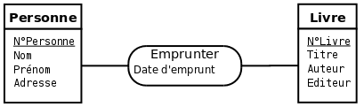
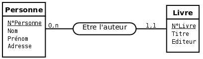
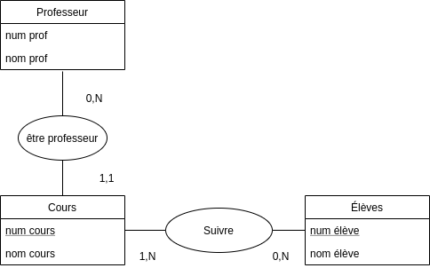
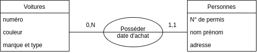
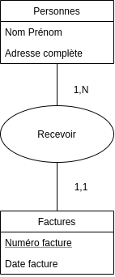
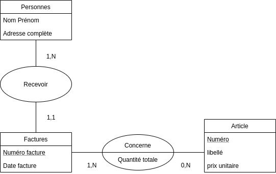
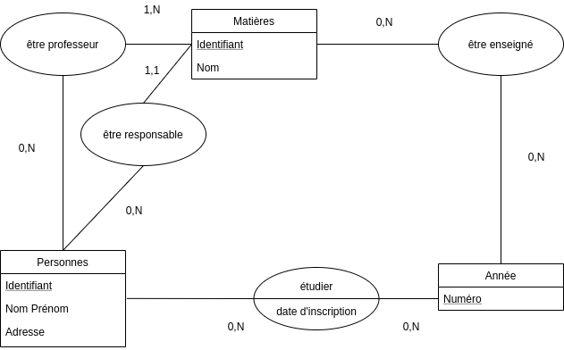
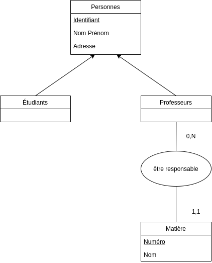
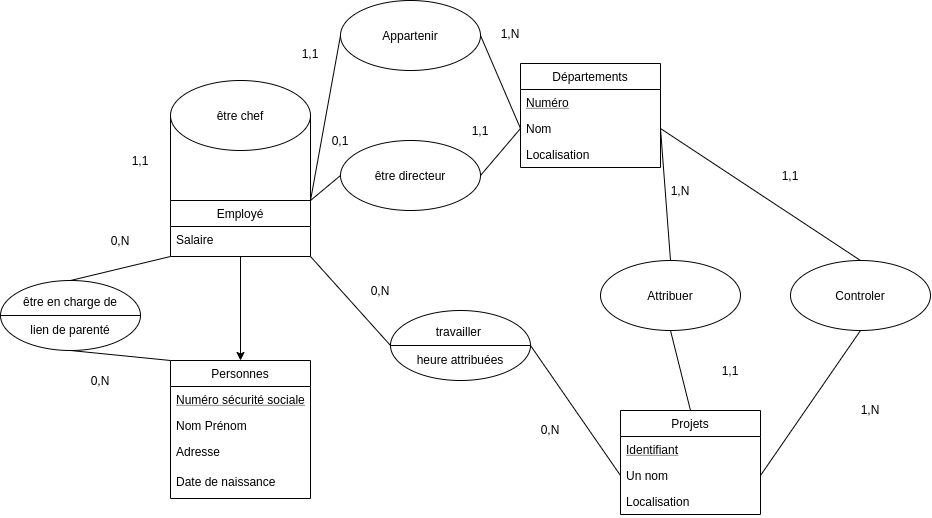

## Cours - élèves

### Rappel

**Entité :** un population d'individus homogène

**Association :** liaison significative entre entités

**Cardinalités :
** la cardinalité d'une patte reliant un type association et un type entité précise le nombre de fois minimal et maximal d’interventions d’une entité du type entité dans une association du type association. La cardinalité minimale doit être inférieure ou égale à la cardinalité maximale.

*Donner un schéma conceptuel d'une base de données gérant les cours et les
élèves avec les attributs suivants : numéro du cours, nom du cours, professeur
responsable du cours, numéro d'élève, nom d'élève. Commencer par mettre
professeur responsable du cours comme attribut, puis le transformer en entité.*

## Voitures

*On désire créer une base de données géérant les voitures en circulation. Elle
pourra permettre de donner les informations suivantes. À propos du
propriétaire : n° de permis, nom prénom et adresses. À propos du véhicule :
numéro, couleur, date d'achat, marque et type. Donner un schéma entité-association pour cette base de données*

## Facturation

1. *Créez un modèle conceptuel qui permet de modéliser correctement le système d’information nécessaire sachant
   que :
   — Un client peut bien sûr recevoir plusieurs factures, mais il est uniquement considéré comme tel à partir
   du moment ou il reçoit sa première facture.
   — Une facture concerne un et un seul client.*
2. *Le responsable de la facturation de la société désire rendre les factures plus informatives. Comme un client
   peut acheter plusieurs articles différents en même temps, la facture devrait indiquer pour chaque article le
   numéro, un libellé, le prix unitaire, la quantité vendue et le prix total pour ce type d’article.
   Proposez un nouveau modèle.*

## Gestion de classes

*On veut créer une base de données gérant les classes d'une école. elle sera
composée des rubriques nom, prénom, adresse, n° d'étudiant pour chaque étudiant
et identifiant pour chaque professeur : n° année, date d'inscription, professeur
responsable, matière etc. Concevoir le modèle entité association correspondant.*

## Gestion du personnel

On vous demande de concevoir un système d’informations traitant de gestion de personnel sur le plan de
l’affectation administrative (appartenance à un département, relations hiérarchiques), sur le plan de la charge de
travail (répartition du travail sur différents projets) et sur le plan social (personnes à charge).
Chaque employé a un numéro de sécurité sociale (attribut clé), un salaire, un nom, prénom, une adresse et des
heures attribuées à un projet. Un employé peut avoir des personnes à charge, représentée chacune par un nom, une
date de naissance et un lien de parenté.
Un département a un numéro, un nom, une localisation et un nombre d’employés.
Un projet a un numéro, un nom (l’un ou l’autre jouant le rôle de clé), et une localisation géographique. Au plus
six personnes peuvent travailler sur le même projet, mais un employé peut être impliqué dans plusieurs projets.
Un employé travaille dans un département et un seul, alors qu’un département emploie au moins un employé. Un
département a un directeur et un seul alors qu’un employé est directeur d’au plus un département. Il est demandé
de garder la date de début de prise de fonction de chaque direction. Chaque employé a un chef direct. Un projet
est contrôlé par un département et un seul alors qu’un département contrôle au moins un projet.
Donner un schéma entité-association pour cette base de données.
Méthodologie conseillée : trouver les entités puis les associations et enfin les cardinalités.

