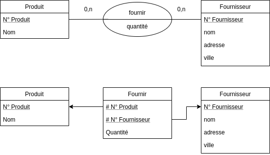

## Produit fournisseur

*On considère la base de données suivante :*

```
Produit : numprod, nomprod, quantité
Fournisseur : numfour, nomfour, adresse, ville
```

1. *Donner un schéma conceptuel et un schéma relationnel*
2. *Donner une expression algébrique et un arbre algébrique pour chacune des
   requêtes suivantes :*
    + *Les produits disponibles sur Bordeaux*
    + *Les fournisseurs qui vendent tous les produits (cf. division)*



$\rhd \lhd (\text{Fournir},\text{Fournisseur})$

Nous cherchons les fournisseurs qui vendent tous les produits

$ \Pi_{\text{Nom Fournisseur}} [(\text{Fournisseurs} \rhd \lhd \text{Fournir}
\div \text{Produit})]$

Nous cherchons les produits disponibles sur Bordeaux

$\Pi_{\text{Nom Produit}}
(\sigma_{\text{ville='Bordeaux'}})(\text{Produit} \rhd \lhd \text{Fournir } \rhd
\lhd {\text{Fournisseur}})$

## Élèves-matières

*Soit le schéma relationnel suivant (les clés primaires sont en gras, les clé
étrangères sont précédées du symbole #) qui représente des élèves, des maturées
et le fait que des élèves suivent des matières.*

+ Élève(**Numéro Élève**,Nom élève, Prénom élève)
+ Matière(**Numéro Matière**,Nom Matière)
+ Suivre(#Numéro Élève, #Numéro Matière)

*Écrire en algèbre relationnelle les requêtes suivantes :*

+ *Donner la liste des matières suivies par un étudiant qui s'appelle Jean
  Dupont*

$\Pi_{\text{Nom Matière}}(\sigma_{\text{Jean Dupon}} (\text{Eleve} \rhd
\lhd \text{Suivre} \rhd \lhd \text{Matiere}))$

+ *Donner le nom et prénom des élèves qui suivent le cours de Base de Données*

$\Pi_{\text{Nom de l'élève}}(\sigma_{\text{SGBD}}(\text{Eleves} \rhd \lhd
\text{Suivre} \rhd \lhd \text{Matiere}))$

+ *Donner la liste des élèves qui ont le même nom, mais pas le même prénom*

$\Pi_{E_1 \text{Nom}, E_1 \text{Prénom}} (E_1 \rhd
\lhd_{E_1.\text{NomEleve}=E_2.\text{NomEleve AND }
E_1.\text{PrenomEleve} \neq E_2.\text{PrenomEleve}} E_2)$

+ *Donner la liste des élèves qui suivent tous les cours*

$\Pi_{\text{Prénom Nom}}((\text{Eleve}\rhd \lhd \text{Suivre} \rhd \lhd
\text{Matiere}) \div \text{Matiere})$
