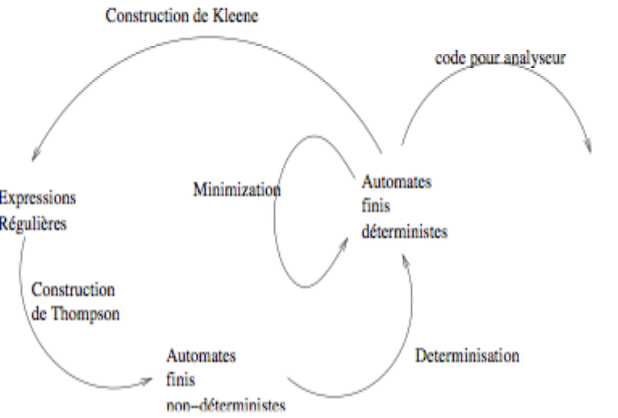
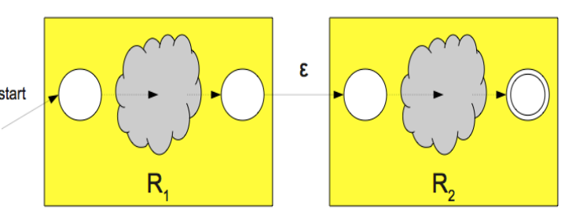
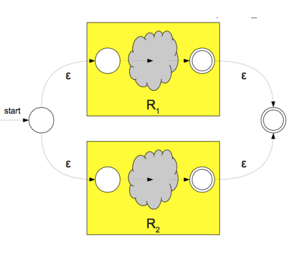
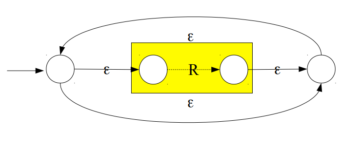

Notes inspirées du cours de JANIN David

L'objectif de l'analyse lexicale est de lire le programme d'entrée et de
reconnaître des lexèmes (tokens). Ce sont des éléments constitutifs du langage,
mots clés, noms de variable, symboles de ponctuation ...

## Langages réguliers

L'analyse lexicale repose sur le cadre théorique des langages réguliers. Pour
rappel un langage régulier est défini par :

- un Alphabet : ensemble fini de symboles
- des mots : suite finie de lettres, opération : concaténation.
- un langage : ensemble des mots
- des expressions régulières (décrivent les langages réguliers, formées avec les
  opérateurs $\ast, \vert$, la concaténation et $\varepsilon$)

  Des langages réguliers découlent les automates réguliers, ils reconnaissent
  les expressions régulières, les automates déterministes et non déterministes
  possèdent plusieurs distinctions, importantes durant ce cours.

## Rappel : construction de Thompson

### R1.R2

### R1 | R2

### R*

## Algorithme de déterminisation

- On part d'un automate $(N,\Sigma,\Delta,n_0,N_f)$
- On construit un automate $(Q,\Sigma,\delta,q_0,Q_F)$
- Les états du nouvel automate sont des ensembles d'état de l'ancien
- Algorithme par calcul de point fixe
- Complexité exponentielle au pire

## Algorithme de minimisation

- On part d'une partition des état (finaux / non finaux )
- Raffine la partition en séparant les états qui n'ont pas le même comportement
- Algorithme par calcul de point fixe

## Génération de lexèmes

L'objectif de l'analyseur lexical est de reconnaitre tous les lexèmes du
langage. Un lexème est un type (analyse syntaxique) ou une valeur (analyse
sémantique). A chaque reconnaissance de lexème, l'analyseur lexical transmet
à l'analyser syntaxique et sémantique.

Il y a cependant certainnes difficultés, lorsqu'un lexème préfixes d'autres, on
prend les plus longs. De plus lorsqu'il y a une ambiguité entre lexème on
porcède par résolution contextuelle (ou préférence donnée à un type de lexème)
