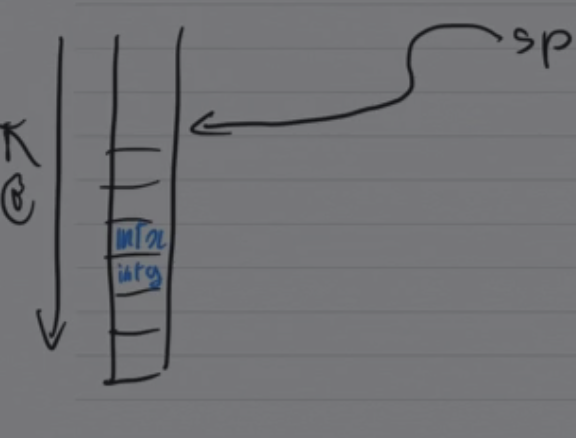

## Production pour les appels de fonction. Production pour les sous-bloc (variables locales)

Question : où et comment stocker / adresser les variables locales à un sous bloc
?

Première solution, renommer les variables locales pour les traiter "comme" des
variables globales. Cette solution fonction cependant la profondeur
d'implication des blocs doit être bornée (à l'exécution). Cela interdit la
compilation de fonctions récursives.

Une deuxième solution est d'utiliser la pile. On stocker les variables locales
dans la pile


La question est comment accéder (en lecture ou écriture) à $x$ ou $g$ ?

LA solution est d'utiliser un pointeur d'environnement (frame pointer) fp qui
désigne, dans la pile un emplacement fixe pendant toute la durée de vie du sous
bloc. À partir de là, on peut coder $x \rightarrow *(fp+4)$ et $g \rightarrow
*(fp+8)$. Comme la valeur de fp ne change pas pendant la durée de vie du bloc,
on a bien un codage de $x$ et $g$.

Entrée dans le bloc :

```c
empiler g (sp = sp - 4)
empiler x (sp = sp - 4)
fp = sp 
```

Cependant cela provoque un problème, on perd la valeur précédente du fp. Pour
pallier ce problème il faut sauvegarder le fp dans la pile

```c
empiler g (sp = sp - 4)
empiler x (sp = sp - 4)
empiler fp (*sp = fp, sp = sp -4)
fp = sp 
```

À la sortie du bloc

```c
//dépiler les variables locales
fp = *fp
//eventuellement une valeur de retour
```

On généralise ce principe pour les appels de fonctions. Les ingrédients d'une
fonction

```c
int inc(int x){
    int y = 1;
    if (x < 0) return x;
    else return (x - y);
}
```

C'est les types qui indiquent la nécessite de définir des emplacements, mémoire
et leur taille. Idée : stocker ces éléments sur la pile. Où ? Prendre une
convention de position par rapport au fp. fp a une adresse sur la pile fixe
pendant toute l'exécution à un appel de fonction.

La position, relative au fp, de chaque des éléments est fixée à la compilation.

Le contexte contient, a minima, une sauvegarde du fp lors de l'appel.
L'adressage des variables, locales, des arguments, et de la valeur de retour se
fait relativement au fp courant.

### Appel d'une fonction :

```
Sauvegarde du contexte courant fp
Empilement des arguments 
Réserver la place du résultat
Positionner le fp
Empilement des variables locales
goto à l'adresse du code de la fonction
```

Question : comment finir l'appel de fonction ? On a besoin d'un branchement à
l'endroit de l'appel. Cela implique la nécessité de stocker lors de l'appel un
autre pointeur : le compteur ordinal (co) qui désigne l'adresse courante de
l'instructeur a execoté. On finit l'appel par un goto co après avoir "retrouvé"
ce compteur ordinal. En code 3 adresses (et dans la plupart des assembleurs) on
ne fera pas des goto mais on utilisera une paire d'instruction particulière
(jump et return). En général, jump et return seront chargé respectivement

+ des branchements
+ de la sauvegarde / restauration du fp et du co.

