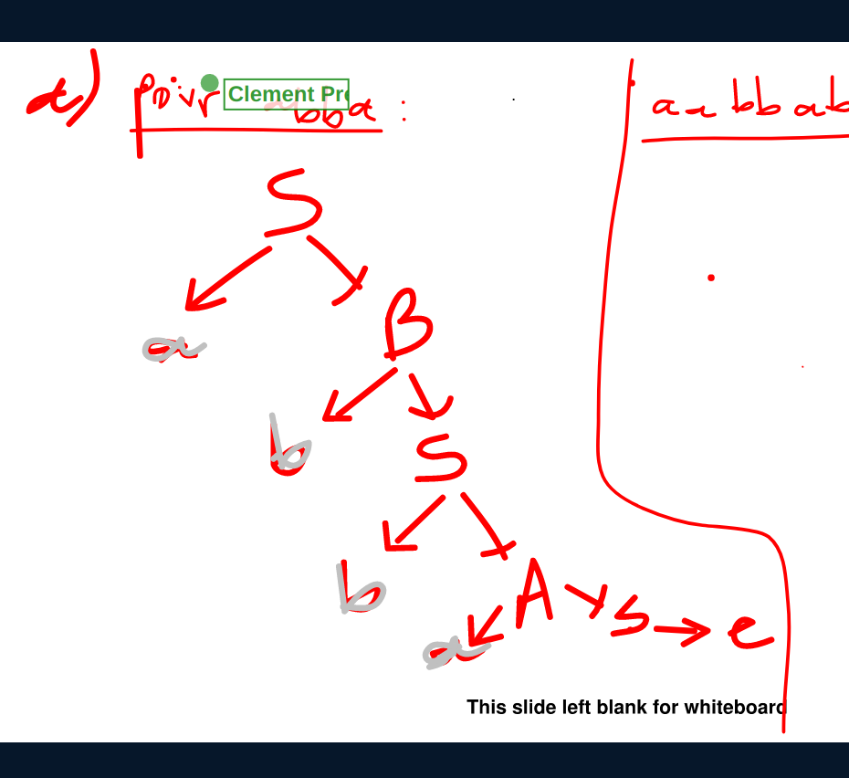
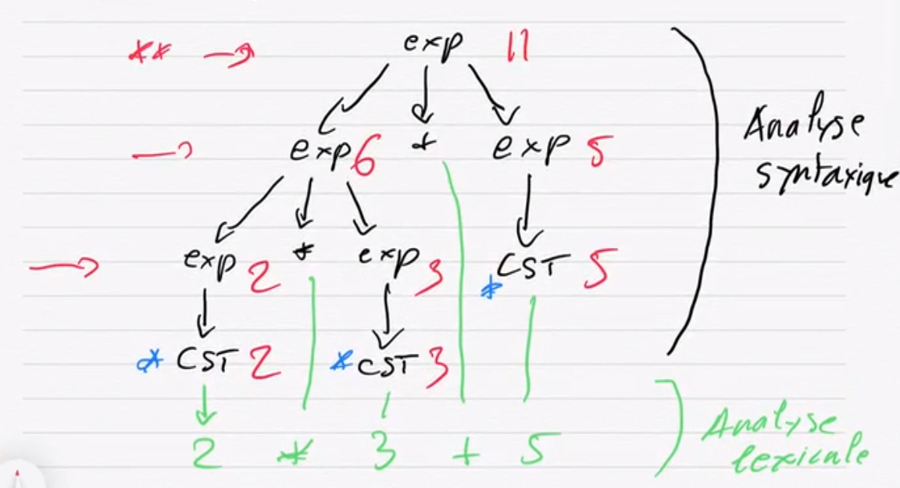
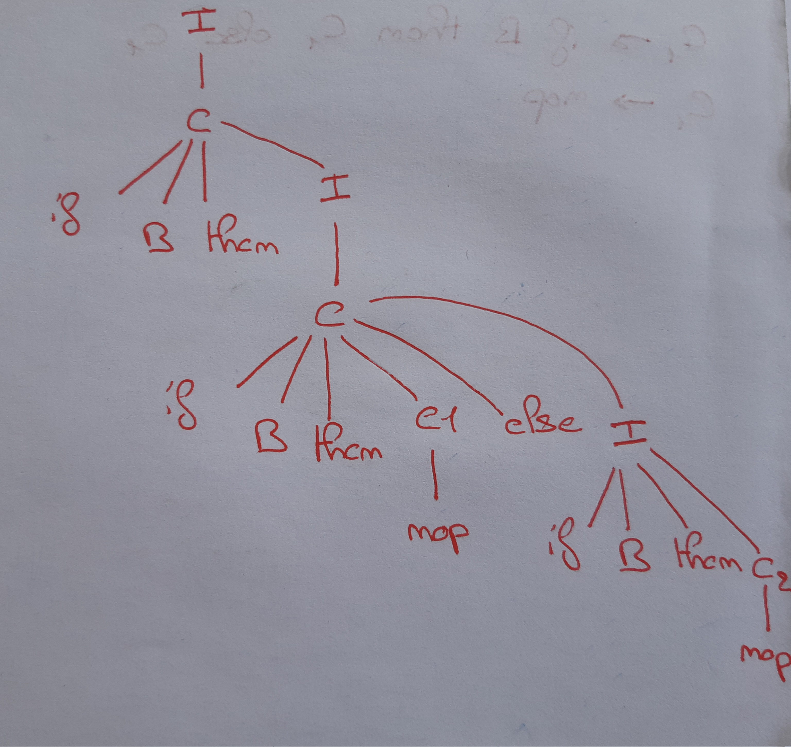
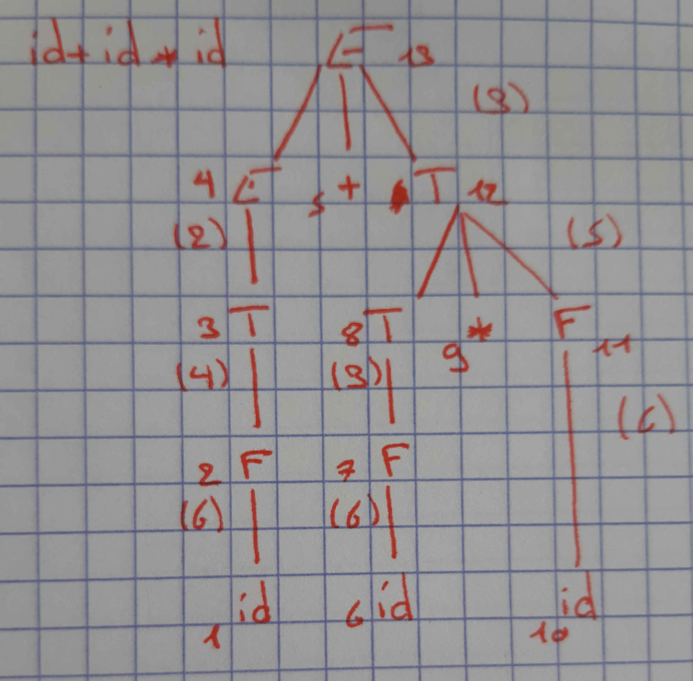
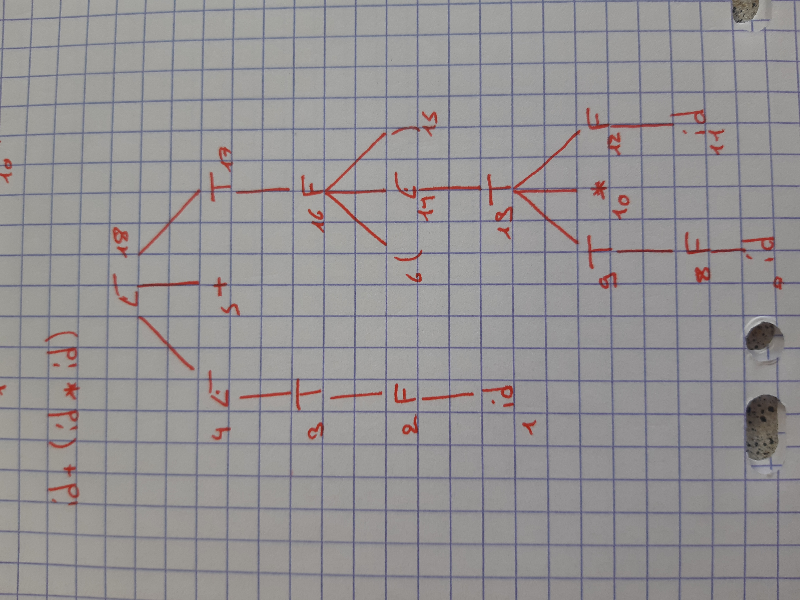

Notes inspirées du cours de JANIN David et du [TD2](https://moodle.bordeaux-inp.fr/pluginfile.php/151721/mod_resource/content/1/td2.pdf) de Myriam Desainte-Catherine

## Grammaires

*Étant donné une grammaire $G$ de non terminal initial $S$ (start symbol) et
d'alphabet terminal $T$, on appelle langage défini par $S$ le langage*

$$L(G)=\{w \in T^\ast \vert S \rightarrow^\ast w\}$$

*c'est à dire l'ensemble des mots de terminaux qui décrivent du non terminal
initial*.

### Exerice 1

*Proposer une grammaire qui permet, sur l'alphabet de terminaux $\{a,b\}$ de
définir le langage des mots de la forme $a^n b^n$ avec $n \in \mathbb{N}$.
Votre grammaire est-elle ambigüe ?*

```c
S -> aSb
S -> eps
```

### Exercice 2

*Soit la grammaire*

```
(0) S -> e //mot vide
(1) S -> aB          (2) S -> bA
(3) A -> aS          (4) A -> bAA
(5) B -> bS          (6) B -> aBB
```

*définie avec les terminaux $\{a,b\}$, les non-terminaux $\{S,A,B\}$ et le
start symbol $S$*

+ *Construire les arbres de dérivation de abba et aabb*



+ *Cette grammaire est elle ambigüe ?*

Elle n'est pas ambigüe

+ *Quel langage définit-elle ?*

$$(S) = \{ab,ba,\varepsilon,...\}$$
$$(A) = \{a, aab, aba, ...\}$$
$$(B) = \{b,bab,bba,...\}$$

## Conditionnelles

On considère la grammaire COND définie par :

```c
I -> nop | C
C -> if B then I | if B then I else I
B -> id | true | false
```

avec les non-terminaux $I$ (instructions), $C$ (instructions
conditionnelles), $B$ (booléens) et les terminaux `id, true, false, nop, if,
then` et `else`.

### Exercice 3.

*Quel est le langage défini par cette grammaire ? Construire un arbre de
dérivation pour `if id then if id then nop else nop`. En existe-t-il un autre ?
Qu'en déduire ?*

Nous pouvons soupçonner que la grammaire est ambigüe, en effet nous avons deux
arbres de dérivations possibles





### Exercice 4.

*Proposer une grammaire non ambigüe permettant de définir le même langage. Votre grammaire
devra, comme dans le langage C, “forcer” l’association du “else” avec le “if-then” qui précède le plus proche qui
n’est pas déjà “fermé” par un “else”.*

Pour éliminer l'ambiguïté il faut réecrire la grammaire :

```c
C1 -> if B then C1 else C1
C1 -> nop
```

## Expressions arithmétiques

### Exercice 5

```c
A -> id = E
E -> T
E -> E + T
T -> F 
T -> T * F
F -> id
F -> cst
F -> (E)
```

+ *Dessiner les arbres de dérivaitions ainsi que numéroter les noeuds de l'arbre
  de dérivation dans l'ordre du parcours de l'analyseseur (postfixe)*





+ *Écrire les actions sémantiques associées à chaque règle qui permettent de
  traduire une expression arithmétique en code 3 adresses*

```
1. {$$=newreg();printf("r%d=%s\n";$$,$0);}
2. $$=$1
3. {$$=newreg();print("r%d= r%d + r%d \n", $$, $1, $3);}
4. $$=$1
5. {$$=newreg(); printf("r%d = r%d * r%d",$$,$1,$2);}
6. {$$=newreg();printf("r%d=%s\n";$$,$1);}
7. {$$=newreg();printf("r%d=cte\n";$,$1);}
8. $$=$2
```
