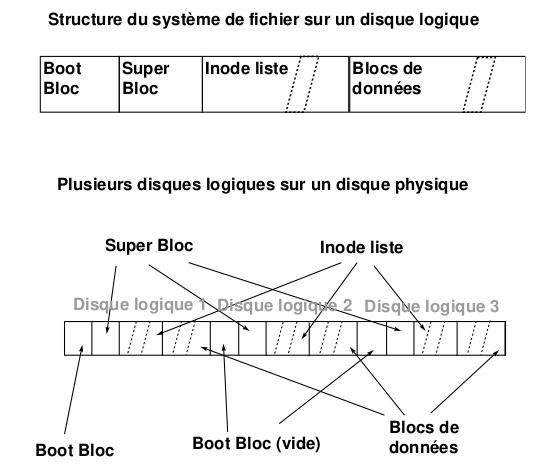
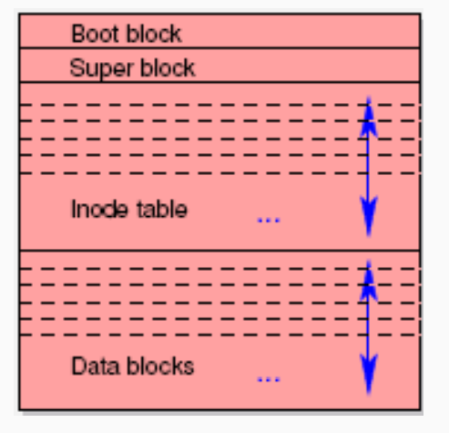
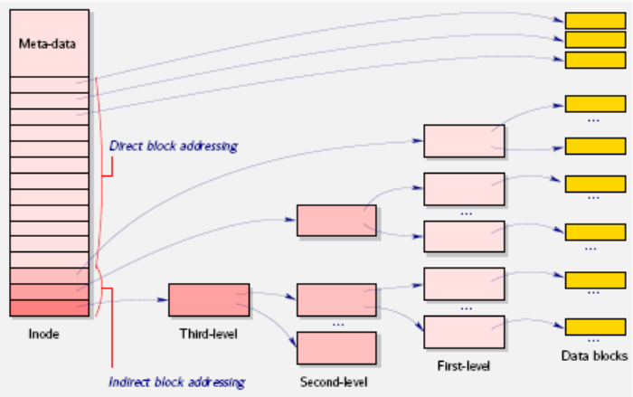
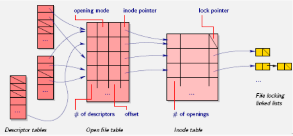
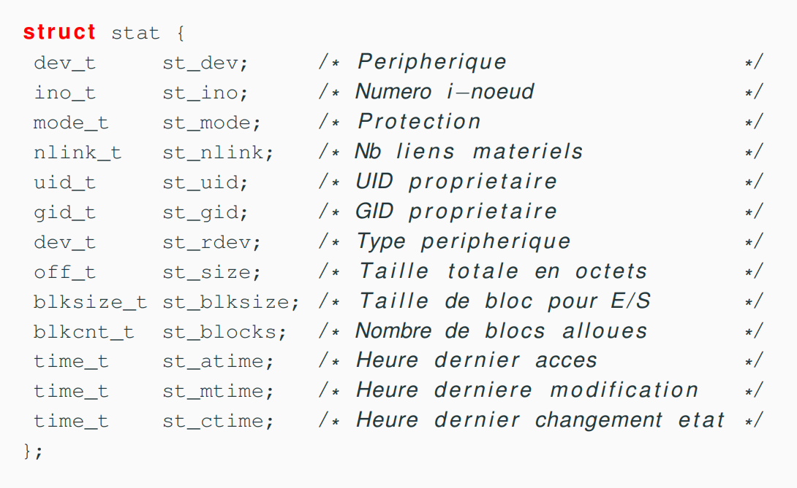

Le système de gestion de fichiers est un outil de manipulation des fichiers et
de la structure d'arborescence des fichiers sur disque et a aussi le rôle sous
UNIX de conserver toutes les informations dont la pérennité est importante pour
le système (et pour les utilisateurs biensur). Ainsi tous les objets importants
du système sont référencés dans le système de fichiers (mémoire, terminaux,
périphériques variés etc). Le système de gestion de fichier permet une
manipulation simple des fichiers et gère de façon transparente les différents
problèmes d'accès aux supports de masse

+ partage : utilisation d'un même fichier / disque par plusieurs utilisateurs
+ efficacité : utilisation de cache, uniformisation des accès
+ droits : protection des éléments important du système et protection
  interutilisateurs
+ alignement : transtypage entre la mémoire et les supports magnétiques

## Le concept de fichier

L'unité logique de base de l'interface du Système de Gestion de Fichiers : `le
fichier`. Un fichier UNIX est une suite finie de bytes matérialisée par des
blocs disques, et une inode qui contient les propriétés du fichier. Le contenu
est entièrement défini par le créateur, la gestion de l'allocation des
ressources nécessaires est a la seule responsabilité du système. Sur UNIX les
fichiers ne sont pas typés du point de vue utilisateur, le concept de fichier
permet de proposer un type générique (polymorphe) aux programmeurs le système
gérant la multiplicité des formats effectifs (différentes marques et conceptions
de disques dur par exemple). L'inode définit le fichier, soit principalement les
information :

+ la localisation sur disque
+ le propriétaire et le groupe propriétaire
+ les droits d'accès des différents utilisateurs
+ la taille
+ la date de création

On trouvera sur d'autre systèmes d'autres structures d'information pour décrire
les fichiers, par exemple NT utiliser des "objets files records".
*Un nom est lié à un fichier (une référence indique un fichier) mais un fichier
n'est pas lié à une référence, un fichier peut exister sans avoir le nom dans
l'arborescence.*

## Fichiers ordinaires / Fichiers spéciaux

Le système est un utilisateur du système de gestion de fichier et en temps que
créateur il définit quelques contenus structurés ces fichiers auront de ce fait
des accès réglementés. Pour le système les fichiers sont donc organisés en deux
grandes familles :

+ **les fichiers standars** que sont par exemple les fichiers texte, les
  exécutables, etc. C'est à dire tout ce qui est manipulé et structuré par les
  utilisateurs.
+ **les fichiers spéciaux** périphériques, mémoire, et autre fichiers "physique"
  ou logique. Ces fichiers ont une structure interne définie (par les
  développeurs du système) qui doit être respecté c'est pourquoi leur
  manipulation n'est pas possible que par l'intermédiaire du système

  Les fichiers physiques sont dans le répertoire `/dev`.

  Cette distinction entre fichier ordinaire et spéciaux et tout simplement le
  fait que le système est un utilisateur comme les autres des fichiers. Pour
  certains fichier le système utilise une structure interne spéciale (d'où le
  nom) qui ne doit pas être modifié sous peine de comportement indéfini. Pour se
  protéger le système ne permet pas l'accès direct aux informations c'est lui
  qui fait toutes les entrées sortie sur les fichiers spéciaux de façon a en
  assurer l'intégrité. Ceci est indépendant du système de droits d'accès, la
  structure du code du noyau ne permet pas d'autres accès que les accès
  "spéciaux".

## Organisation utilisateur des Disques

Comment permettre aux utilisateurs d'identifier les données sur les supports de
masse ? Le système le plus répandu aujourd'hui est un système arborescent avec
des fichiers utilisés comme noeud de l'arbre qui permet de lister les fichiers
et les sous arbres qu'il coïtent, d'autres organisations "plates" existe ou l'on
organise les fichiers en utilisant des types et des extensions de nom de fichier
pour "organiser". Les arborescences de fichiers et de catalogues, organisés
comme un graphe acyclique, apparaissent avec le projet MULTICS. Cette
organisation logique du disque a les avantages suivants : Une racine, un accès
absolu aisé, une structure dynamique, une grande puissance d'expression et un
graphe acyclique.

L'organisation est arborescente avec quelques connections supplémentaires (liens
multiples sur un même fichier) qui en font un graphe. Mais ce graphe doit rester
acyclique, pour les raisons suivantes.

1. L'ensemble des algorithmes simples utilisables sur des graphes acycliques
   comme le parcours, la vérification des fichiers libres, etc. Deviennent
   beaucoup plus difficile à écrire pour les graphes admettant des cycles
2. Des algorithmes de ramasse-miettes doivent être utilisés pour savoir si
   certains objets sont utilisés ou non et pour récupérer les inodes ou blocs
   perdus après un crash.
3. Tous les algorithmes de détection dans un graphe quelconque ont une
   complexité beaucoup plus grande que ceux qui peuvent profiter de l'acyclité
   du graphe
4. Sous unix nous comme assurés que le graphe est acyclique car il est interdit
   d'avoir plusieurs références pour un même catalogue

## Les inodes

L'inode est le passage obligé de tous les échanges entre les systèmes de fichier
et la mémoire. L'inode est la structure qui contient toutes les informations sur
un fichier donné à l'exception de sa référence dans l'arborescence (son nom),
l'arborescence n'étant qu'un outil de référencèrent des fichiers. Les
informations stockées dans une inode disque sont :

+ utilisateur propriétaire
+ groupe propriétaire
+ type de fichier
+ droit d'accès
+ date de dernier accès
+ date de dernière modification
+ date de dernière modification de l'inode
+ taille du fichier
+ adresses des blocs-disque contenant le fichier

## Organisation des disques System V

L'organisation disque décrite sur la figure ci dessous est la plus simple que
l'on peut trouver de nos jours sous UNIX, il en exite d'autre où l'on peut en
particulier placer un même disque logique sur plusieurs disques physiques,
certaines où les blocs sont fragmentables etc

+ **Boot bloc** utilisé au chargement du système
+ **Super Bloc** il contient toutes les informations générales sur le disque
  logique
+ **Inode list** table des inodes
+ **blocs** mes blocs de données chaines à la création du disque (mkfs)

<center>

</center>

## Adressage des blocs dans les inodes

Le système d'adressage des blocs dans les inodes (système V) consiste en 13
adresses de blocs. Les dix premières adresses sont des adresses qui pointent
directement sur les blocs de données du fichier. Les autres sont des adresses
indirectes vers des blocs de données contenant des adresses. L'intérêt de cette
représentation est d'économiser sur la taille des inodes tout en permettant un
accès rapide au petits fichiers (la majorité des fichiers sont petits). Mais en
laissant la possibilité de créer de très gros fichiers.

## Allocation des inodes d'un disque

L’allocation des inodes est réalisée en recherchant dans la zone des inodes du disque une inode
libre. Pour accélérer cette recherche : un tampon d’inodes libres est géré dans le SuperBloc, de
plus l’indice de la première inode libre est gardé en référence dans le SuperBloc afin de redémarrer
la recherche qu’à partir de la première inode réellement libre.

## Allocation des blocs disques

L’algorithme utilisé pour gérer l’allocation des inodes s’appuie sur le fait que l’on peut tester si
une inode est libre ou non en regardant son contenu. Ceci n’est plus vrai pour les blocs. La solution
est de chaı̂ner les blocs. Ce chaı̂nage est réalisé par blocs d’adresses pour accélérer les accès et
profiter au maximum du buffer cache. Il existe donc un bloc d’adresses dans le super bloc qui sert
de zone de travail pour l’allocateur de blocs.
<!-- ## Comment accéder aux fichiers ? -->

<!-- Il existe plsuieurs niveaux de gestion des fichiers  -->
<!-- + stockage mémoire (structure du système de fichier, structure des fichiers, -->
<!--   inodes) -->
<!-- + stockage du système (table des descripteurs (processus), table des fichiers -->
<!--   ouverts, tables des inodes) -->

<!-- ## Stockage : structure du système de fichiers -->
<!-- + Boot bloc : block de données qui permet de booter la machine. Flag *bootable* -->
<!-- + Superbloc : point de montage du système de fichiers, nombre de noeuds alloués -->
<!--   / libres, liste des noeuds alloués / libres  -->
<!-- + Table des inodes -->
<!-- + Blocs de données : contient les données des fichiers, pour un répertoire, -->
<!--   liste des noms des fichiers -->
<!--  <center> -->
<!--  -->
<!-- </center> -->

<!-- ## Fichiers / inodes -->

<!-- Il y a deux structure en Unix :  -->
<!-- + le contenu du fichier  -->
<!-- + les informations sur le fichier (metadata) : inode -->

<!-- Et les informations d'un inode : -->
<!-- + Type de fichier  -->
<!-- + Nombre de liens dur (hard link) partageant l'inode -->
<!-- + Longueur du fichier en octets -->
<!-- + Identifiant de device -->
<!-- + Identifiant de l'utilisateur (UID) propriétaire, et son groupe  -->
<!-- + Date de création, modification -->
<!-- + Droits d'accès -->
<!-- <center> -->
<!--  -->
<!-- </center> -->

<!-- ## Gestion des fichiers par le système  -->

<!-- + Une table des descripteurs de fichiers ouverts/accédés **par processus** -->
<!-- + Une table des fichiers ouverts pour chaque `open` appelé. Il peut y avoir le -->
<!--   même fichier plusieurs fois dans cette table. Il en existe une seule pour le -->
<!--   système.  -->
<!-- + Une seule table des inodes. Elle gère le nombre d'ouvertures de chaque -->
<!--   fichier, et stocke les informations des fichiers en mémoire.  -->
<!-- <center> -->
<!--  -->
<!-- </center> -->

<!-- ## Quelques fonctions de base  -->
<!-- + Manipulation des inodes `stat(), unlink(), chown(), chmod(), mknod(), -->
<!--   access(), link(), ...` -->
<!-- + Manipulation des descripteurs de fichier `read(), write(), creat(), open(), -->
<!--   lseek(), fcntl(), ...` -->
<!-- + Fonctions de bibliothèque C `fopen(), fclose(), fread(),...` -->

<!-- ## Informations sur les fichiers -->

<!-- ``` -->
<!-- int stat(const char* path, struct stat* buf) -->
<!-- ``` -->

<!-- Cette fonction retourne 0 si il n'y a pas d'erreur, -1 sinon.  -->
<!-- <center> -->
<!--  -->
<!-- </center> -->

<!-- ## Les droits d'accès -->

<!-- Comment tester les droits d'accès à un fichier avec le champ `st_mode` ? -->
<!-- + `S_ISREG(m)` vrai si c'est un fichier normal -->
<!-- + `S_ISDIR(m)` vrai si c'est un répertoire -->
<!-- + `S_ISCHR(m)` vrai si c'est un device de type caractère -->
<!-- + `S_ISBLK(m)` vrai si c'est un device de type bloc -->
<!-- + `S_ISFIFO(m)` vrai si c'est une fifo -->
<!-- + `S_ISLNK(m)` vrai si c'est un lien symbolique -->
<!-- + `S_ISSOCK(m)` vrai si c'est une socket -->

<!-- Pour tester les autorisations d'accès on peut utiliser `int access(const char* -->
<!-- pathname, int mode);`, les modes disponibles sont `R_OK,W_OK,X_OK,F_OK`. Cela -->
<!-- retourne `-1` en cas d'erreur ou si la demande est interdite, `0` sinon.  -->

<!-- ## Créer un fichier -->

<!-- Pour créer un fichier `int mknod(const char *pathname, mode_t mode, dev_t -->
<!-- dev);`. `Mode` est l'un des modes possibles de fichier, avec un ou logique les -->
<!-- permissions. Par exemple `S_IFREG|S_IRUSR|S_IXUSR` pour un fichier normal -->

<!-- ## Créer / Détruire des liens  -->

<!-- Pour créer un nouveau lien vers un fichier `int link(const char *oldpath, const -->
<!-- char *newpath);`. Il nest pas possible de faire de nouveaux liens vers des -->
<!-- répertoires. Pour détruire un lien en dur (et le fichier si c'est le seul lien), -->
<!-- `int unlink(const char *pathname);`.  -->

<!-- ## Ouvrir/Créer un fichier  -->

<!-- Pour ouvrir et créer un nouveau fichier `int open(const char* pathname, int -->
<!-- flags ...); int creat(const char* pastname, mode_t mode);` -->

<!-- ## Fermer un fichier  -->

<!-- Pour fermer un fichier `int close(int fd);` -->

<!-- Ferme un descripteur de fichier, lorsqu'il s'agit du dernier descripteur de -->
<!-- fichier pointant sur un fichier donné  -->
