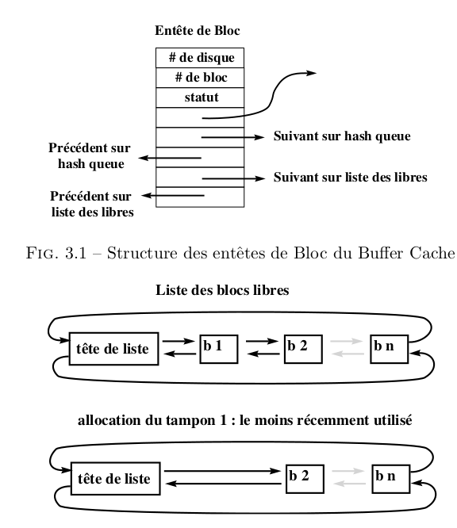
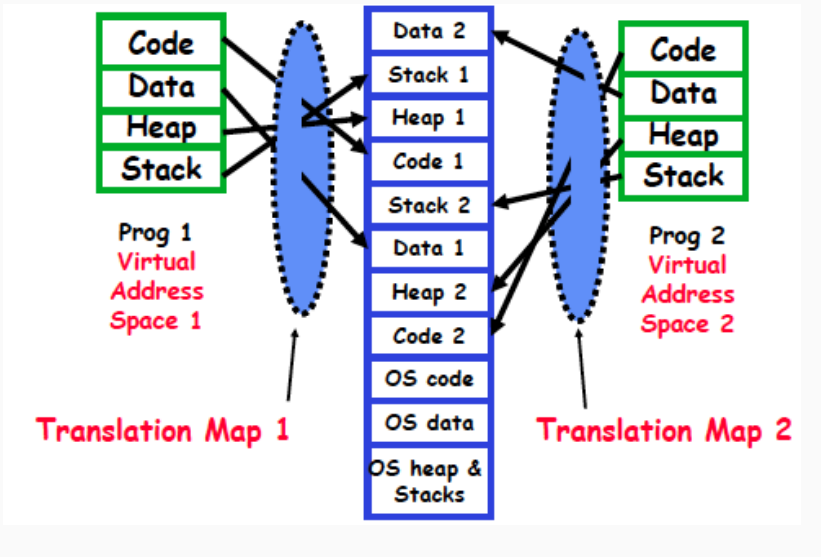

## Introduction au buffer cache

Le buffer cache est un ensemble de structures de données et d'algorithme qui
permettent de minimiser le nombre des accès disque. Ce qui est très important
car les disque sont très lents relativement au CPU et un noyau qui se chargerait
de toutes les entrées/sorties serait d'une grande lenteur et l'unité de
traitement ne serait effectivement utilisé qu'à un faible pourcentage. Deux
idées pour réduire le nombre des accès disques :

1. bufferiser les différentes commandes d'écriture et de lecture de façon à
   faire un accès disque uniquement pour une quantité de données de taille
   raisonnable
2. Éviter des écritures inutiles quand les données peuvent encore être changées

### Avantages et désavantages du buffer cache

+ Un accès uniforme au disque. Le noyau n'a pas à connaître la raison de
  l'entrée-sortie. Il copie les données depuis et vers des tampons (que ce
  soient des données, des inodes ou le superbloc). Ce mécanisme est modulaire et
  s'intègre facilement à l'ensemble du système qu'il rend plus facile à écrire.
+ Rend l'utilisation des entrées-sorties plus simple pour l'utilisateur qui n'ap
  as à se soucier des problèmes d'alignement, il rend les programmes portables
  sur d'autres UNIX.
+ Il réduit le trafic disque et de ce fait augmente la capacité du système.
+ L'implémentation du buffer cache rotège contre certaines écritures
  concurrentes
+ L'écriture différée pose un problème dans le cas d'un crash système. En effet
  si votre machine s'arrête et que un blocs est marqué "à écrire" il n'ont pas
  pas étés sauvegardes physiquement. L'intégrité des données n'est donc pas
  assurée en cas de crash.
+ Le buffer cache nécessite que l'on effectue une recopie pour toute
  entrée-sortie. Dans le cas de transferts nombreux ceci ralentit les entrées
  sorties.

## Le buffer cache, structures de données

Le statu d'un bloc cache est une combinaison des états suivants :

+ **verrouillé** l'accès est réservé à un processus
+ **valide** (les données contenues dans le bloc sont valides)
+ **à écire** les données du bloc doivent être écrites sur disque avant de
  réallouer le bloc
+ **actif** le noyau est en train d'écrire/lire le bloc sur le disque
+ **attendu** un processus attend la libération du bloc

### La liste doublement chaînes des blocs libres

Les tampons libres appartiennent simultanément à deux lites doublement
chaînées : la liste des blocs libres et la hash-liste correspondant au dernier
bloc ayant été contenu dans ce tampon. L'insertion dans la liste des tampons
libres se fait en fin de liste, la suppression se fait en début de liste, ainsi
le tampon alloué est le plus vieux tampon libéré. Ceci permet une réponse
immédiate si le bloc correspondant est réutilisé avant que le tampon ne soit
alloué à un autre bloc.

<center>

</center>

<!-- ## Abstraction pour le processus et la mémoire  -->

<!-- Le **Processus** est un programme qui s'execute ainsi que son contexte (mémoire, -->
<!-- état des descripteurs de fichiers) -->

<!-- Dans les systèmes d'exploitation :  -->
<!-- + Support pour de multiples processus  -->
<!-- + Chaque processus a un espace d'adressage privé ce qui garenti le cloisonnement -->
<!--   entre processus (sécurité et protection), cela permet d'avoir une abstraction -->
<!--   de la mémoire et surtout cela cache le noyau et les autres processus. -->
<!--    <center> -->
<!--  -->
<!-- </center> -->

<!-- + Stack : pile où sont stockées les variables locales  -->
<!-- + Heap (tas) : allocation dynamique, par malloc -->
<!-- + Data : zone de données globales ou statiques -->
<!-- + Texte : zone de code, des instructions du programme -->

<!-- ## Gestion mémoire par l'OS -->

<!-- ### Lien entre mémoire virtuelle et mémoire réelle  -->

<!-- La traduction de la mémoire virtuelle en mémoire réelle est réalisée par le CPU -->
<!-- (MMU/TLB) via un mécanisme de pages. La mémoire est gérée par blocs de 2ko de -->
<!-- mémoire ce sont les **pages**. Chaque page virtuelle correspondà une page -->
<!-- réelle.  -->

<!-- La traduction s'appuie sur un **mapping** des pages (traduction par -->
<!-- dictionnaire). L'adresse virtuelle est composée de différents champs permettant -->
<!-- de construire l'adresse réelle. -->
<!--  <center> -->
<!--  -->
<!-- </center> -->

<!-- ### Allocation mémoire -->

<!-- Un ensemble de pages physiques sont allouée à un processus (pour les différentes -->
<!-- zones). L'allocation est une allocation paresseuse  -->
<!-- + L'allocation de la page est réellement faite que lorsqu'elle est réellement -->
<!--   accédée -->
<!-- + Permet une gestion plus économique de la mémoire (plutôt qu'une allocation -->
<!--   gloutonne) -->
<!-- + Rôle du swap : si plus de pages physiques, stocke sur disque les pages de -->
<!--   processus en attente -->

<!-- ## Interface de programmation pour la gestion mémoire -->

<!-- ```c -->
<!-- int brk(void *end_segment); -->
<!-- int skrb(intptr_t displacement); -->
<!-- ``` -->

<!-- Définit l'adresse virtuelle de la fin du tas  -->
<!-- + Soit directement avec brk -->
<!-- + Soit avec un déplacement avec sbrk  -->

<!-- Ces fonctions ne sont pas à utiliser directement, utiliser `malloc` plutôt -->

<!-- ```c -->
<!-- void *malloc(size_t size); -->
<!-- void *calloc(size_t count, size_t size); -->
<!-- void *realloc(void *p, size_t size); -->
<!-- ``` -->

<!-- Cela retourne un pointeur sur une nouvelle zone libre de size octets sur le cas, -->
<!-- NULL si erreur. Beaucoup d'OS font de l'allocation paresseuse. L'OS peut être -->
<!-- amené à terminer certains processus pour libérer de la place. -->

<!-- ### Libérer une zonne mémoire allouée sur le tas  -->

<!-- ```c -->
<!-- void free(void *ptr) -->
<!-- ``` -->

<!-- Libère une zone allouée avec `malloc`. Le comportement est indéfini si déjà -->
<!-- libéré ou si pas alloué avec `malloc`. Si `ptr` est NULL, aucune opération n'est effectuée -->
