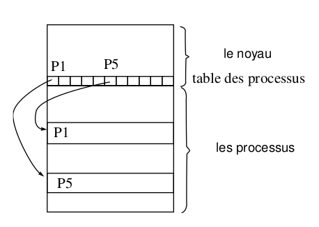

## Introduction aux processus

Un processus est un ensemble d'octets (en langage machine) en cours d'exécution,
en d'autres termes, c'est l'exécution d'un programme. Un processus UNIX se
décompose en :

1. un espace d'adressage (visible par l'utilisateur / programmeur)
2. Le bloc de contrôle du processus (BCP) lui-même décomposé en :
    + une entrée dans la table des processus du noyau `struc proc` définie dans
      `<sys/proc.h>`
    + une structure `struct user` appelée `zone u` définie dans `<sys/user.h>`

Le processus sous UNIX apportent :

+ La multiplicité des exécutions, plusieurs processus peuvent être l'exécution
  d'un même programme
+ La protection des exécutions, un processus ne peut exécuter que ses
  instructions propres et ce de façon séquentielle; il ne peut pas exécuter des
  instructions appartenant à un autre processus. Les processus sous UNIX
  communiquent entre eux et avec le reste du monde grâce aux appels système.

### Création d'un processus - `fork()`

Sous UNIX la création de processus est réalisée par l'appel système `int
fork(void);`. tous les processus sauf le processus d'identification 0, sont
créés par un appel à fork. Le processus qui appelle le `fork` est appelé
processus père. Le nouveau processus est appelé processus fils. Tout processus a
un seul processus père. Tout processus peut avoir zéro ou plusieurs processus
fils. Chaque processus est identifié par un numéro unique, son **PID**.

Le processus de PID 0 est créé "manuellement" au démarrage de la machine, ce
processus a toujours un rôle spécial pour le système, de plus pour le bon
fonctionnement des programmes utilisant `fork()` il faut que le PID zéro reste
toujours utilisé. Le processus zéro crée, grâce à un appel de `fork`, le
processus init de PID 1.

Le processus de PID 1 de nom `init` est l'ancêtre de tous les autres processus
(le processus 0 ne réalisant plus de `fork()`), c'est lui qui accueille tous les
processus orphelins de père (ceci a fin de collecter les informations à la mort
de chaque processus).

## Format d'un fichier exécutable

Les compilateurs nous permettent de créer des fichiers exécutables. Ces fichiers
ont le format suivant qui permet au noyau de les transformer en processus :

+ Une en-tête qui décrit l'ensemble du fichier, ses attributs et sa carte des
  sections
+ La taille à allouer pour les variables non initialisées
+ Une section TEXT qui contient le code (en langage machine)
+ Une section données (DATA) codée en langage machine qui contient les données
  initialisées
+ Eventuellement d'autres sections : Table des symboles pour le débugger,
  Images, ICONS, Table des chaînes, etc

## Chargement / changement d'un exécutable

L'appel système `execve` change l'exécutable du processus courant en chargeant
un nouvel exécutable. Les régions associée au processus sont préalablement
libérées : `int execve(...);`

Pour chaque section de l'exécutable une région en mémoire est allouée. Soit au
moins les régions :

+ le code
+ les données initialisées
+ des piles
+ du tas

La région de la pile : C'est une pile de structure de pile qui sont empilées et
dépilées lors de l'appel ou le retour de fonction. Le pointeur de pile, un des
registres de l'unité centrale, indique la profondeur courante de la pile. Un
processus UNIX pouvant s'exécuter en deux modes (noyau, utilisateur), une pile
privée sera utilisée dans chaque mode. La pile noyau sera vide quand le
processus est en mode utilisateur. Le tas est une zone où est réalisée
l'allocation dynamique avec les fonctions `Xalloc()`.

## `zone u` et table des processus

Tous les processus sont associés à une entrée dans la table des processus qui
est interne au noyau. De plus, le noyau alloue pour chaque processus une
structure appelée `zone u`, qui contient des données privées du processus,
uniquement manipulables par le noyau. La table des processus nous permet
d'accéder à la table des régions par processus qui permet d'accéder à la table
des régions. Ce double niveau d'indirection permet de faire partager des
régions. Dans l'organisation avec une mémoire virtuelle, la table des régions
est matérialisée logiquement dans la table de pages. Les structures de régions
de la table des régions contiennent des informations sur le type, les droits
d'accès et la localisation (adresses en mémoire ou adresses sur disque) de la
région. Seule la `zone u` du processus courant est manipulable par le noyau, les
autres sont `inaccessibles`. L'adresse de la zone `u` est placée dans le mot
d'état du processus.

## `fork` et `exec`

Quand un processus réalise un `fork`, le contenu de l'entrée de la table des
régions est dupliqué, chaque région est ensuite, en fonction de son type,
partagée ou copiée. Quand un processus réalise un `exec`, il y a libération des
régions et réallocation de nouvelles régions en fonction des valeurs définies
dans le nouvel exécutable

## Le contexte d'un processus

Le contexte d'un processus est l'ensemble des données qui permettent de
reprendre l'exécution d'un processus qui a été interrompu. Le contexte d'un
processus est l'ensemble de :

1. son état
2. son mot d'état
3. les valeurs des variables globales statiques ou dynamiques
4. son entrée dans la table des processus
5. sa zone u
6. les piles user et system
7. les zones de code et de données

Le noyau et ses variables ne font partie du contexte d'aucun processus !
L'exécution d'un processus se fait dans son contexte. Quand il y a un changement
de processus courant, il y a réalisation d'une commutation de mode d'état et
d'un changement de contexte. Le noyau s'exécute alors dans le nouveau contexte.

## Commutation de mot d'état et interruptions

Ces fonctions de très bas niveau sont fondamentales pour pouvoir programmer un
système d'exploitation. Pour être exécuté et donner naissance à un processus, un
programme et ses données doivent être chargés en mémoire centrale. Les
instructions du programme sont transférées une à une de la mémoire centrale sur
l'unité centrale où elles sont exécutées. L'unité centrale comprend des circuits
logiques et arithmétiques qui effectuent les instructions mais aussi des mémoire
appelées registres. Certains de ces registres sont spécialisés directement par
les constructeurs de l'unité centrale, d'autre le sont par les programmeur du
noyau. Quelques registres spécialisés :

+ **L'accumulateur** qui reçoit le résultat d'une instruction, sur les machines
  à registres multiples, le jeu d'instructions permet souvent d'utiliser
  n'importe lequel des registres comme accumulateur
+ **le registre d'instruction**
+ **le compteur ordinal**, ce compteur change au cours de la réalisation d'une
  instruction pour pointer sur la prochaine instruction à exécuter, la majorité
  des instructions ne font qu'incrémenter ce compteur, les instructions de
  branchement réalisent des opérations plus complexes sur ce compteur :
  affectation, incrémentation ou décrémentation plus importantes
+ **le registre d'adresse**
+ **les registres de données** qui sont utilisés pour lire ou écrire une donnée
  à une adresse spécifiée en mémoire
+ **les registres d'état** du processeur
+ **les registres d'état du processus** droits, adresses, priorités etc

Ce registres forment le contexte d'unité centrale d'un processus. A tout moment,
un processus est caractérisé par ces deux contextes : le contexte d'unité
centrale qui est composé des mêmes données pour tous les processus et le
contexte qui dépend du code du programme exécuté. Pour pouvoir exécuter un
nouveau processus, il faut pouvoir sauvegarder le contexte d'unité centrale du
processus courant (mot d'état), puis charger le nouveau mot d'état du processus
à exécuter. Cette opération délicate réalisée de façon matérielle est appelée
commutation de mot d'état. Elle doit se faire de façon non interruptible ! Cette
"Super instruction" utilise 2 adresses qui sont respectivement : l'adresse de
sauvegarde du mot d'état et l'adresse de lecture du nouveau mot d'état. Le
compteur ordinal faisant partie du mot d'état, ce changement provoque
l'exécution dans le nouveau processus. C'est le nouveau processus qui devra
réaliser la sauvegarde du contexte global. En général c'est le noyau qui réalise
cette sauvegarde, le noyau n'ayant pas un contexte du même type. Le processus
interrompu pourra ainsi reprendre exactement où il avait abandonnés.

## Les interruptions

Une interruption est une commutation de mot d'état provoquée par un signal
produit par le matériel. Ce signal étant la conséquence d'un événement extérieur
ou intérieur, il modifie l'état d'un indicateur qui est régulièrement testé par
l'unité centrale. Une fois que le signal est détecté, il faut déterminer la
cause de l'interruption. Pour cela on utilise un indicateur, pour les
différentes causes, on parle alors du vecteur d'interruptions. Trois grands
types d'interruptions :

+ **externes** (indépendantes du processus) interventions de l'opérateur,
  pannes, etc
+ **déroutements** erreur interne du processeur, débordement, division par zéro,
  page fault etc
+ **appels systèmes** demande d'entrée-sortie par exemple.

Suivant les machines et les systèmes un nombre de variable de niveaux
d'interruption est utilisé. Ces différentes interruptions ne réalisent pas
nécessairement un changement de contexte complet du processus courant. Il est
possible que plusieurs niveaux d'interruption soient positionnées quand le
système les consulte. C'est le niveau des différentes interruptions qui va
permettre au système de sélectionner l'interruption à traiter en priorité.
L'horloge est l'interruption la plus prioritaire sur un système Unix.

## Le problème des cascades d'interruptions

Si pendant le traitement d'une interruption, une autre interruption se produit,
et qeu ceci se répète pendant le traitement de la nouvelle interruption, le
système ne fait plus progresser les processus ni les interruption en cours de
traitement. Il est donc nécessaire de pouvoir retarder ou annuler la prise en
compte d'un ou plusieurs signaux d'interruption. C'est le rôle des deux
mécanismes de **masquage** et de **désarmement** d'un niveau d'interruption.
Masquer, c'est ignorer temporairement un niveau d'interruption. Si ce masquage
est fait dans le mot d'état d'un traitement d'interruption, à la nouvelle
commutation d'état, le masquage disparaît; les interruptions peuvent de nouveau
être prises en compte. Désarmer, c'est rendre le positionnement de
l'interruption caduque.

## Accès aux structures `proc` et `user` du processus courant

Les informations de la table des processus peuvent être lues grâce à la commande
shell `ps`. Ou par des appels système. Par contre, les informations contenues
dans la zone `u` ne sont pas accessibles que par une réponse du processus
lui-même (en programmation objet, on dit que ce sont des variables d'instances
privées), d'où les appels systèmes suivants : `times, chroot, chdir, fchdir,
getuid, getgid ...`

