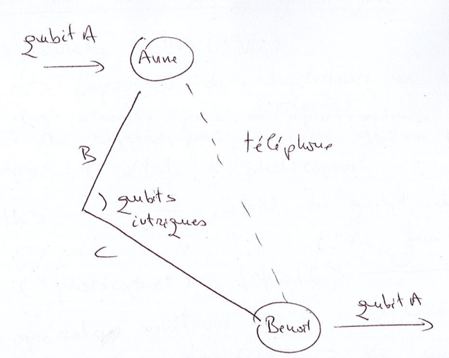

## Rappels : produit tensoriel de qubits

### Produit tensoriel et qubits

#### Représentation matricielle des qubits

$\vert \psi \rangle = \alpha \vert 0 \rangle + \beta \vert 1 \rangle, | \alpha
|^2 + | \beta |^2 = 1$

$\vert \psi \rangle \rightarrow \begin{pmatrix} \alpha \\ \beta \end{pmatrix}$

#### Cas particuliers

$\vert 0 \rangle \rightarrow \begin{pmatrix} 1 \\ 0 \end{pmatrix}$ et $\vert
1 \rangle \rightarrow \begin{pmatrix} 0 \\ 1 \end{pmatrix}$

#### Produit tensoriel de matrices

$A \otimes B := \begin{pmatrix}a_{11} B & a_{12} B & \cdots & a_{1n} B \\ a_{21}
B & a_{22} B & \cdots & a_{2n} B \\ \vdots & \vdots & \vdots & \vdots \\ a_{n1}
B & a_{n2} B & \cdots & a_{nn} B \end{pmatrix}$

#### Produit tensoriel de qubits - Exercice

Calculer les produits tensoriels des états $\vert 0 \rangle$ et $\vert 1
\rangle$.

$ \vert 00 \rangle \equiv \vert 0 \rangle \otimes \vert 0 \rangle =
\begin{pmatrix} 1 \\ 0 \end{pmatrix} \otimes \begin{pmatrix} 1 \\ 0
\end{pmatrix} = \begin{pmatrix} 1 \\ 0 \\ 0 \\ 0 \end{pmatrix}$

$ \vert 01 \rangle \equiv \vert 0 \rangle \otimes \vert 1 \rangle =
\begin{pmatrix} 1 \\ 0 \end{pmatrix} \otimes \begin{pmatrix} 0 \\ 1
\end{pmatrix} = \begin{pmatrix} 0 \\ 1 \\ 0 \\ 0 \end{pmatrix}$

$ \vert 10 \rangle \equiv \vert 1 \rangle \otimes \vert 0 \rangle =
\begin{pmatrix} 0 \\ 1 \end{pmatrix} \otimes \begin{pmatrix} 1 \\ 0
\end{pmatrix} = \begin{pmatrix} 0 \\ 0 \\ 1 \\ 0 \end{pmatrix}$

$ \vert 11 \rangle \equiv \vert 1 \rangle \otimes \vert 1 \rangle =
\begin{pmatrix} 0 \\ 1 \end{pmatrix} \otimes \begin{pmatrix} 0 \\ 1
\end{pmatrix} = \begin{pmatrix} 0 \\ 0 \\ 0 \\ 1 \end{pmatrix}$

## L'intrication quantique

L'intrication quantique est un caractère subtile et paradoxal de la mécanique
quantique (paradoxe EPR)

### États à 2 qubits

Soit le qubit $A : \vert 0_A \rangle$ et $\vert 1_A \rangle$ et soit le
qubit $B : \vert 0_B \rangle$ et $\vert 1_B \rangle$ états du système $AB :
\underbrace{\vert 0_A \rangle \vert 0_B \rangle, \vert 0_A \rangle \vert 1_B
\rangle, \vert 1_A 0_B \rangle, \vert 1_A 1_B \rangle}_{\text{base}}$ chaque
qubit se trouve dans un état de superposition :

+ qubit $A : \vert \Psi_A \rangle = \alpha \vert 0_A \rangle + \beta \vert 1_A
  \rangle$
+ qubit $B : \vert \Psi_B \rangle = \gamma \vert 0_B \rangle + \delta \vert 1_B
  \rangle$

Système $AB : \vert \Psi_A \rangle \vert \Psi_B \rangle = \alpha \gamma \vert
0_A \rangle \vert 0_B \rangle + \alpha \delta \vert 0_A \rangle \vert 1_B
\rangle + \beta \gamma \vert 1_A \rangle \vert 0_B \rangle + \beta \delta \vert
1_A \rangle \vert 1_B \rangle$. Notation les états $\vert 0_A 0_B \rangle
\equiv \vert 00 \rangle, \vert 0_A 1_B \rangle \equiv \vert 0 1 \rangle, \vert
1_A 0_B \rangle \equiv \vert 10 \rangle, \vert 1_A 1_B \rangle \equiv 11
\rangle$

La mécanique quantique nous dit (1 er postulat) que tout état à 2 qubits se
décompose

$ \vert \psi \rangle = \alpha_{00} \vert 00 \rangle + \alpha_{01}\vert 01
\rangle + \alpha_{10} \vert 10 \rangle + \alpha_{11} \vert 11 \rangle (2)$

avec $| \alpha_{00} |^2 + |\alpha_{10} |^2 + |\alpha_{11}|^2 + |\alpha_{01}|^2
= 1 = \sum \limits_{i,j=0}^1 |\alpha_{ij}^2$

L'état $\vert \Psi_A \rangle \vert \Psi_B \rangle$ est un état factorisé

$ (\vert \Psi_A \rangle \vert \Psi_B \rangle = \vert \Psi_A \rangle \otimes
\vert \Psi_B \rangle)$ Il existe des états qui ne se factorisent pas a un
produit d'états à 1 qubit **états intriqués**. Ce sont des états spécifiques de
la description quantique, ils engendrent entre les particules des corrélations
fortes qui sont à la base des différents protocoles et algorithmes de
l'informatique quantique.

**Important :** dans ces états, l'état individuel d'un qubit n'est pas défini,
c'est le système qui est dans un état défini.

### Les états intriqué - 1er état de Bell :

$ \vert \beta_{00} = \dfrac{1}{\sqrt{2}}(\vert 00 \rangle + \vert 1 1 \rangle)
$

Tant qu'aucune mesure n'est eeffectuée sur le système, l'état de chaque qubit
n'est pas défini. Si nous mesurions le 1er qubit etn ous trouvons l'état $\vert
0 \rangle$, alors l'état $\vert \beta 00 \rangle$ est projeté sur l'état
$\vert 00 \rangle$ ce qui entraîne que le 2ième qubit est forcément lui aussi
dans l'état $\vert 0 \rangle$.

$\vert \beta_{00} \rangle = \dfrac{1}{\sqrt{2}} \vert 00 \rangle +
\dfrac{1}{\sqrt{2}} \vert 1 1 \rangle$

On suppose qu'il existe $\alpha_i, \beta_i, i = 0,1$ tel que

$\begin{align} \vert \beta_{00} \rangle &= (\alpha_0 \vert 0 \rangle + \alpha_1 \vert 1
\rangle )(\beta_0 \vert 0 \rangle + \beta_1 \vert 1 \rangle) \\ &\Leftrightarrow
\dfrac{1}{\sqrt{2}} \vert 00 \rangle + \dfrac{1}{\sqrt{2}} \vert 1 1 \rangle =
\alpha_0 \beta_0 \vert 00 \rangle + \alpha_0 \beta_1 \vert 01 \rangle + \alpha_1
\beta_0 \vert 10 \rangle + \alpha_1 \beta_1 \vert 11 \rangle \\
&\Rightarrow \alpha_0 \beta_0 = \dfrac{1}{\sqrt{2}} = \alpha_1 \beta_1
\Rightarrow \alpha_0, \beta_0, \alpha_1, \beta_1 \neq 0 \\ &\Rightarrow \alpha_0
\beta_1 = 0 = \alpha_1 \beta_0 \end{align}$

Cela conduit à une contradiction donc en somme l'état de Belle ne se factorise
pas, l'état de Belle est un état intriqué.

### Mesure d'un état à 2 qubits

D'après la mécanique quantique (d'après le postulat de la mesure), si on mesure
l'état de 2 qubits, le système est projeté dans l'un des états de base $\vert
00 \rangle, \vert 01 \rangle, \vert 10 \rangle$ ou $\vert 11 \rangle$ avec
une probabilité $| \alpha_{ij} |^2$.

#### Mesure partielle.

On mesure uniquement un des 2 qubits, la mesure va fixer l'état du qubit mesure.
L'état du système sera une superposition des états de base compatibles, et dans
laquelle le qubit mesuré aura une valeur fixée.

Par exemple, si on mesure le 1er qubit du système de l'état (2) et on trouve
$\vert 0 \rangle$, le système est projeté dans l'état

$\vert \tilde{\Psi} \rangle = \dfrac{\alpha_{00}}{\sqrt{|\alpha_{00} |^2 +
|\alpha_{01}|^2}} \vert 00 \rangle + \dfrac{\alpha_{01}}{\sqrt{|\alpha_{00}|^2+|\alpha_{01}|^2}} \vert 01 \rangle$

## Téléportation quantique

On parle ici de la téléportation d'état quantique et pas de la téléportation de
système physique porteur de l'état. Pour réaliser la téléportation quantique il
faut une paire de particules intriqués. En revanche l'état initial, qui est
téléporté, est détruit ! Cela est une différence avec le clonage quantique.

### Illustration

Comment transmettre d'un point $A$ à un point $B$ le contenu inconnu d'un
qubit (ie d'un état quantique) ? (le système physique porteur du qubit n'est pas
transporté !).

- A et B se sont offert antérieurement un des 2 qubits d'un état intriqué de
  Bell $\vert \beta_{00} \rangle$
- A veut transmettre à B le contenu d'un qubit dans un état $\vert \Psi \rangle
  = \alpha \vert 0 \rangle + \beta \vert 1 \rangle$ que A ne connait pas.
- système à 3 qubits : $\vert \Psi_0 \rangle = \vert \Psi \rangle \vert
  \beta_{00} \rangle = \dfrac{1}{\sqrt{2}}(\alpha \vert 0 \rangle + \beta \vert
  1 \rangle) (\vert 00 \rangle + \vert 11 \rangle) =
  \dfrac{1}{\sqrt{2}}(\alpha(\vert 000 \rangle) + \vert 011 \rangle) + \beta
  (\vert 100 \rangle + \vert 111 \rangle)$

Ordre de qubits :

1. A le qubit inconnu
2. B le le 1er qubit de la paire intriqué (détenu par Anne)
3. C le 2nd qubit de la paire intriqué (détenu par Benoît)

A réalise les opérations suivantes

1. A réalise un CNOT sur la paire (A,B), A obtient $\vert \Psi_1 \rangle =
   \dfrac{1}{\sqrt{2}} [\alpha \vert 1000 \rangle + \vert 011 \rangle) +
   \beta(\vert 110 \rangle + \vert 101 \rangle)]$
2. A envoie le 1er qubit sur une porte de Hadamard, l'état du système devient

$\begin{align} \vert \Psi_2 \rangle &= \dfrac{1}{2} [\alpha (\vert 1000 \rangle +
\vert 011 \rangle + \vert 111 \rangle) + \beta (\vert 010 \rangle - \vert 110
\rangle + \vert 1001 \rangle - \vert 101 \rangle)] \\
&= \dfrac{1}{2}(\vert 00 \rangle (\alpha \vert 0 \rangle + \beta \vert 1
\rangle) \\ &+ \vert 01 \rangle (\alpha \vert 1 \rangle + \beta \vert 0 \rangle)
\\ &+ \vert 10 \rangle (\alpha \vert 0 \rangle ( \beta \vert 1 \rangle )
\\ &+ \vert 11 \rangle (\alpha \vert 1 \rangle - \beta \vert 0 \rangle))) \end{align}$

L'état du qubit $C$ est complètement déterminé par celui de la paire
$(A,B)$, détenu pour A, c'est un effet de la corrélation quantique due à
l'intrication de la paire $BC$.

3. A lit (mesure) la paire (A,B) et transmet le résultat à B par téléphone
   (informatique classique), la téléportation ne viole par la relativité
   restreinte d'Einstein (aucune info ne peut être transmise plus vite que la
   lumière !)
4. Benoît reçoit le résultat de A, B réalise sur un qubit C l'opération
   $Z^{b_1} X^{b_2}$ On peut vérifier que l'état résultant du qubit C est
   l'état $\vert \Psi \rangle$ !
   

## Théorème de non-clonage quantique

(Wooters, Zurek, Nature)

Il est impossible de dupliquer un état quantique

On suppose par l'absurde, qu'une telle "machine" existe. Soit $\vert \Psi
\rangle$ l'état à photocopier et $\vert b \rangle$ l'état initial du qubit de
copie. Le clonage consiste à réaliser l'opération suivante $\vert \Psi \rangle
\vert b \rangle \stackrel{\rightarrow}{\mathcal{U}} \vert \Psi \rangle \vert \Psi \rangle$

Soit $\vert \phi \rangle$ un autre état à cloner, $\vert \phi \rangle \neq
\vert \psi \rangle$

$\begin{align}
&\Rightarrow \vert \phi \rangle \vert \phi \rangle = \cup \vert \phi \rangle
\vert b \rangle \equiv \langle \phi \vert \langle \phi \rangle = \langle b \vert
\langle \phi \vert \cup^+ \\
&\Rightarrow \langle \phi \vert \langle \phi \vert \vert \psi \rangle \vert \psi
\rangle = \langle b \vert \langle \phi \vert \cup^+ \cup \vert \psi
\rangle \vert b \rangle \\
(\langle \phi \vert \psi \rangle)^2 &= \langle b \vert b \rangle \langle \phi
\vert \psi \rangle \\
&\Rightarrow (\langle \phi \vert \psi \rangle)^2 = \langle \phi \vert \psi
\rangle, \forall \vert \phi \rangle, \vert \psi \rangle \\
&\Rightarrow \langle \phi \vert \psi \rangle = 1, \forall \vert \psi \rangle,
\vert \psi \rangle \text{contradiction}\\
&\Rightarrow \langle \phi \vert \psi \rangle = 0, \forall \vert \psi \rangle,
\vert \psi \rangle \text{états orthogonaux -> contradiction}
\end{align}$

Il est donc impossible de cloner des états quantiques

## Manipulation d'état à 2 qubits - Calcul quantique

Les opérateurs sur 1 ou plusieurs qubits correspondent à l'action d'opérateurs
unitaires -- évolutions réversibles (différence fondamentale avec les
ordinateurs classiques -- évolutions irréversibles). Dans le monde classique,
nous avons le théorème de la logique classique : toute porte logique peut être
construire à partir de NAND et COPY. NAND et COPY ne peuvent pas être transposé
dans le quantique à cause de l'irréversibilité et du théorème de non clonage
quantique). Cependant, il est possible de transformer les algorithmes classiques
irreversibles en algorithme réversibles.

Cependant cela a un cout

- Augmentation du volume d'information traitée
- Introduction d'un nouvelle porte à 3 bits, TOF (porte de Toffoli)

$(x,y,z) \longrigtharrow (x,y, z \oplus x y)$

On dit qu'une fonction $f : \mathbb{B}^n \rightarrow \mathb{B}^n$ est
calculable, "avec variables auxiliaire" sur l'ensemble de portes (réversibles)
$\mathcal{G}$ si et seulement si il existe un circuit $\mathcal{C}$ à
$(n+m)$ entrée tel que

$ \mathcal{C}(\vec{x},0^m) = (f(\vec{x}),0^m)$

c'est à dire le circuit $\mathcl{C}$ se sert des dernière places pour
calculer, mais ne prend aucune donnée, ni ne retourne aucun résultat, dans ces
places.

$f_{\oplus}(\vec{x},y) := (\vec{x},y \oplus f(\vec{x}))$

On peut montrer que tout circuit irréversible calculant une fonction $f$ peut
être transformé en circuit réversible, avec variable auxiliaires calculant
$f_{\oplus}$. À travers cette équivalence, on pourra associer un algorithme
quantique réversible à tout algorithme classique irréversible.

## Théorème de Bennet-Landoueur - Toffoli

Soit $N \geq 2$. Toute application booléenne inversible

$ f : \mathbb{B}^n \rightarrow \mathbb{B}^n$

est calculable par un circuit (avec variables auxiliaire sur l'ensemble des
portes NOT,SWAP,TOFF). La porte NOT peut être remplacée par la porte cNOT

| entrée | sortie |
| 00 | 00 |
| 01 | 01 |
| 10 | 11 |
| 11 | 10 |

1er bite de controle la valeur est inchangée. Le deuxième bit est le bit cible,
sa valeur est inchangée si le bit de contrôle vaut 0 et il est inversé si le bit
de controle vaut 1.

Le cNOT quantique est représentée par une matrice dans la base $\vert 00
\rangle, \vert 01 \rangle, \vert 11 \rangle$.

## Théorème de Kitaev-Shen-Vialyi

Soit $n \geq 2, N = 2^n$. Toute matrice unitaire $U_N \in \mathbb{M}_{N
\times N}(\mathbb{C})$, vue comme une porte à $n$-qubits, est calculée par un
circuit sur l'ensemble de portes

$ \{NOT, SWAP, TOF\} \cup \{\Lambda (u) \vert \cup \text{de taille} z\}$

Les portes reversibles de bases (traduits en transformations unitaires) ainsi
que toutes les portes à 1 qubit, contrôlés par un autre qubit, suffisant pour
calculer n'importe qu'elle transformation unitaire sur $N$ qubits

