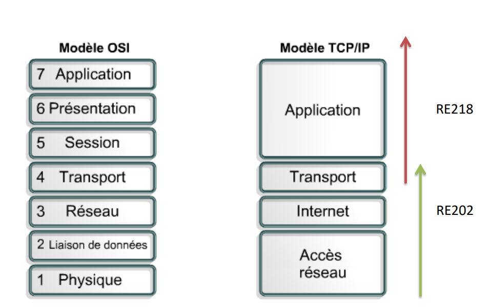
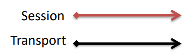
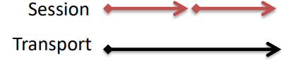
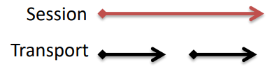

Rappel du modèle OSI et TCP/IP

## Couche session

La couche session est la première couche ne so'ccupant pas de la communication
entre entités. Son objectif est l'organisation du dialogue entre les entités

+ gestion des connexions
+ gestion du tour de parole
+ synchronisation : sauvegarde du contexte de travail
+ reprise de dialogue (en cas d'incident)
+ gestion des activités de la session
+ gestion de la qualité de service
+ gestion du transfert des données

La correspondance entre la couche de session et la couche transport se fait via
3 cas possibles

+ Correspondance **biunivoque** : la session et la connexion de transport sont de même durée et superposables

+ Plusieurs sessions **successives** sont établies sur une même connexion de transport

+ Un même session s'étend sur plusieurs connexions de transport (arrêt /
  reprise)

Attention, le multiplexage de plusieurs sessions sur une même connexion de
transport est impossible. La fonction de multiplexage est réservée à la couche
transport.

Plusieurs services sont proposés par la couche session, le service principal de
la couche session est l'établissement et la libération de la connexion et
transfert de données en trois phases (établissement de la session, transfert des
données, libération de la session). Le deuxième service est la gestion du
dialogue par jeton où seul le processeur du jeton peut transmettre des données,
l'autre reste silencieux.

### Synchronisation par la couche session

La **synchronisation** permet de gérer les incidents et de retrouver la session
dans un état connu des deux interlocuteurs en cas d'erreur. Le but de ce service
*n'est pas de corriger les erreurs* de transmission de données (c'est le travail
de la couche transport), mais **de proposer des outils de reprise** sur erreur
(erreurs liées aux couches supérieures). Il existe deux types de synchronisation
la majeure et la mineure.

## Couche présentation

La couche présentation s'intéresse **à la syntaxe** et à la **sémantique** des
informations :

+ **Représentation** des données transférées entre entités d'application
+ **Représentation** de la structure des données et représentation de l'ensemble
  des actions effectuées sur cette structure
+ **Encodage** dans une norme agrée permettant à des équipements de communiquer

Le rôle de la couche présentation est **d'assurer le codage** et **décodage**
des données. La représentation des données (chaîne de caractères, nombre
entiers, nombres flottants) à l'intérieur d'un système **réel dépend de son
architecture** (en particulier de la nature du processeur). L'objectif est de
définir des règles de codage communes permettant en particulier de représenter
des nombres dont la taille n'est pas limitée. Le destinataire doit connaître la
**signification** des données en définissant un certain nombre de types de
données et en faisant précéder le codage d'une données par une étiquette qui en
précise la nature.

La couche présentation utilise les notions suivantes

+ **la syntaxe abstraite** : elle définit la structure générique des données
  (les différents types de données traitées) et elle est utilisée pour dialoguer
  avec la couche application
+ **la syntaxe concrète locale** : elle définit la représentation des données
  sur le système local
+ **la syntaxe de transfert** : elle définit la représentation des données
  échangées entre les couches présentation de deux systèmes par l'intermédiaire
  de la couche session
+ **les règles de codage** qui permettent de passer de la syntaxe concrète
  locale à la syntaxe de transfert et réciproquement

La combinaison d'une syntaxe abstraite et d'une syntaxe de transfert constitue
**un contexte de présentation**.

La couche de présentation comporte **trois unités fonctionnelles** spécifiques :

+ le **noyau de présentation** : il permet d'utiliser le contexte par défaut ou
  les contextes négociés lors de l'ouverture de la connexion. Cette unité
  fonctionnelle est toujours utilisée
+ la **gestion de contextes** : elle permet d'ajouter ou de supprimer des
  contextes de représentation durant la connexion
+ la **restauration de contextes** : elle permet lors d'une resynchronisation de
  présentation, de reprendre les contextes antérieurs. L'unité fonctionnelle de
  gestion de contextes modifie également le fonctionnement des activités.

### Notation de syntaxe abstraite ASN.1

L'ASN.1 permet de décrire les types de données qui peuvent être codées et
transmises au travers de la couche présentation.

- SNMP (Simple Network Management Protocol), protocole de la famille internet
  permettant la gestion de réseaux
- MIB (Management information base), ensemble des objets gérés par SNMP, objets
  de la MIB référencés grâce par des identificateurs ASN.1

## Couche Application

Elle offre aux processus d'application **le moyen d'accéder** à l'environnement
OSI. Les processus d'application échangent leurs informations par
l'intermédiaire des entités d'applications
