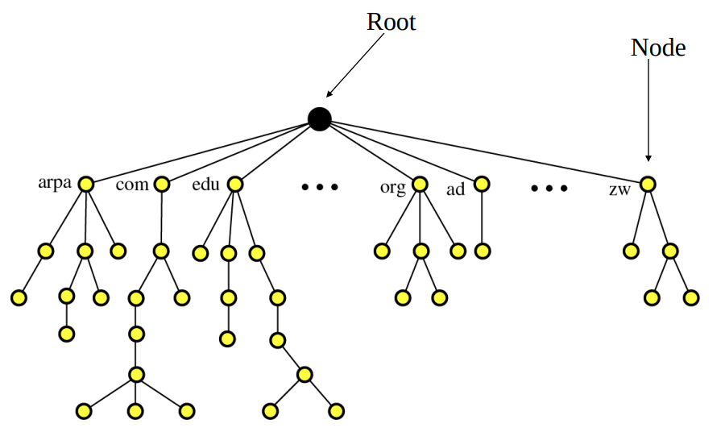
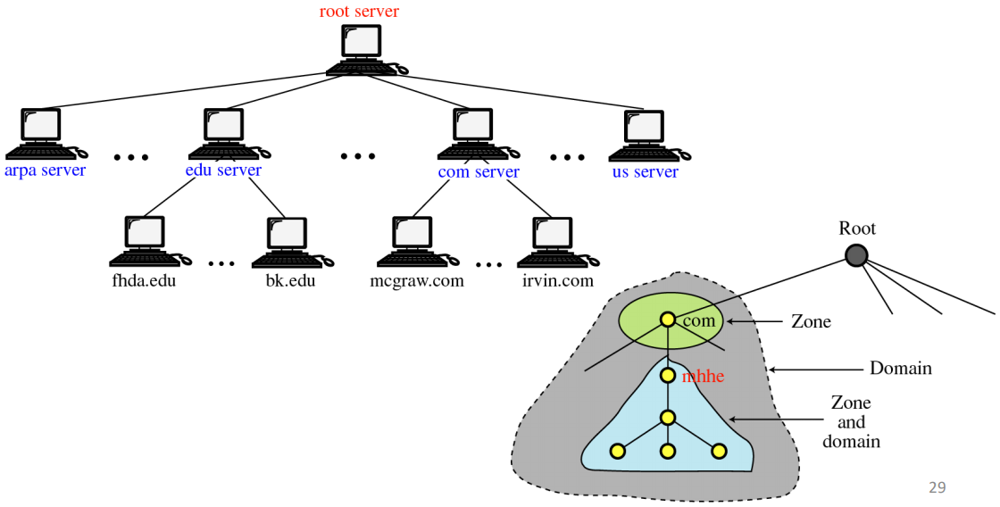
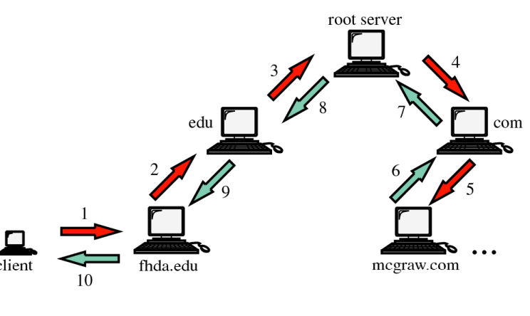

Les DNS sont utilisés pour la résolution de nom, c'est une **adresse de haut
niveau** utilisant

+ identifcateur utile au traitement des informations (datagrammes IP) par le
  réseau
+ peu pratique à manipuler pour les utilisateurs 32 bits pour IPv4, 128 bits
  (IPv6)
+ correspondant à la structure logique du réseau (adressage, sous-adressage,
  etc) mais rarement à la structure humaine de l'organisation utilisant ce
  réseau

Le **nom d'une entité réseau** est définie par

+ une chaîne de caractères significative pour les utilisateurs
+ pouvant / devant respecter des conventions pour le bon fonctionnement d'un
  réseau particulier voir de l'Internet

L'utilisation d'adresse de haut niveau et d'un nom d'une entité réseau forment
ce que l'on appelle la **résolution de nom**.

Le nommage des hîtes réseaux est géré par une organisation mondiale de gestion
des noms, elle est indispensable pour les hôtes participant à
l'Internet.(Internet Corporation for Assigned Names and Numbers (ICANN)). ICANN
est chargée d'allouer l'espace des adresses de protocole internet (IP),
d'attribuer les identificateurs de protocole, de gérer le système de nom de
domaine de premier niveau ...

Le système de noms de dommaine DNS exploite le mode de nommage hiérarchique des
entités réseau internet.

## Noms de domaine

On utilise un niveau hiérarchique des étiquettes croissant, le label à droite du
point le plus à droite est appelé domaine de premier niveau. Le suffixe d'un
label est appelé **nom de domaine**.

Les noms de domaines sont pris en charge sur les caractères Unicode pour des noms
de domaine internationalisés **Internatiolized domain name** (IDN). La syntaxe
des noms de domaine ne permet pas de distinguer un hôte particulier d'un
ensemble d'hôtes, la structure hiérarchique est organisée en arbre correspondant
au schéma de la délégation des responsabilités d'administration des noms. Le nom
de domaine peut donc être associé à

+ un hôte (une adresse ip)
+ une zone de courrier électronique, c'est à dire un serveur de courier
  électronique
+ zone de responsabilité d'administration

## Hiérarchie du DNS et de sa structure arborescente

## Principe de la résolution de noms

Le but de la résolution de noms associé est d'obtenir l'adresse IP associée à un
nom de domaine. Pour ce faire on utilise un système client serveur distribué

+ client : solveur de noms
+ serveur : serveur de noms

Cela est possible via l'utilisation d'un ensemble hiérarchisé de serveurs de
noms communiquant par un réseau TCP/IP.

Les solveurs et serveurs de noms peuvent gérer des caches contenant des entrées
à dure de vie limitée. La fraicheur des réponses est indiquée au client. En
principe, un solveur s'adresse au serveur de noms de son domaine. Un seveur de
noms qui n'est pas capable de répondre à une requête s'adresse à

+ un autre serveur de noms
+ ou au serveur racine

C'est la résolution **itérative** ou **récursive**

## Ressources DNS

+ Chaque noeud de l'arbre contient une ou plusieurs ressources
+ Une ressource est principalement constituée
  + un type qui indique comment interpréter les données associées
  + une durée de validité (TTL)
  + un objet associé au nom pointé dans l'arbre
+ Type ou enregistrement DNS
  + A : adresse IPv4
  + AAAA : adresse IPv6
  + CNAME : nom canonique, il permet de faire correspondre un alias au nom
    canonique
  + MX : liste des serveurs de courrier électronique et préférences
  + NS : nom du serveur de noms responsable du domaine
  + SOA : zones de responsabilité gérées par le serveur de noms du domaine. Ce
    champs permet de décrire le serveur de nom ayant autorité sur la zone
  + PTR : Pointeur du nom de domaine
  + SRV : Service mapping (nom machine + numéro port)
  + TXT : Zone de texte libre

### Zone d'autorité

Un serveur de noms définit une zone, c'est à dire un ensemble de domaines sur
lequel le serveur a autorité. Par exemple, le serveur DNS de l'ENSEIRB a
autorité sur le domaine enseirb-matmeca.fr. Plusieurs serveurs peuvent partager
cette autorité, sans faire partie de ce domaine forcément.

## Résolution inverse

Le DNS permet la conversion inverse : objet vers noms. Il s'agit par exemple de
résoudre le nom pour IP = 209.85.229.104 la réponse est <www.google.com>. Le DNS
maintient un sous-arbre particulier sous la zone IN-ADDR.ARPA (penser à
retourner l'adresse).

## Configuration des indications de racine

Lorsque le serveur dNS n'est pas configuré pour utiliser des redirecteurs, il se
sert des **indications de racine** pour résoudre les noms d'hôtes ou les adresse
IP appartenant à des zones qu'il n'héberge pas. Les indications de racine sont
un ensemble de serveurs hébergeant la zone contenant les enregistrement **du
domaine racine** ou domaine .. Les "serveurs DNS racines" sont au nombre de 13 à
travers le nomde. Il appartiennet tous à un même domaine nommé
*root-servers.net*.

## Configuration des redirecteurs

Lorsque le serveur DNS n'est pas capable de résoudre un nom en adresse IP, il va
essayer de contacter un autre serveur DNS, le DNS redirecteur. Il est possible
de configurer un ou plusieurs redirecteurs pour un domaine précis. L'utilisation
des redirecteurs permet d'utiliser des serveurs DNS locaux pour résoudre les
enregistrements de ressources des domaines locaux et des serveurs DNS extérieurs
pour résoudre les enregistrements de ressources des domaines internet.
