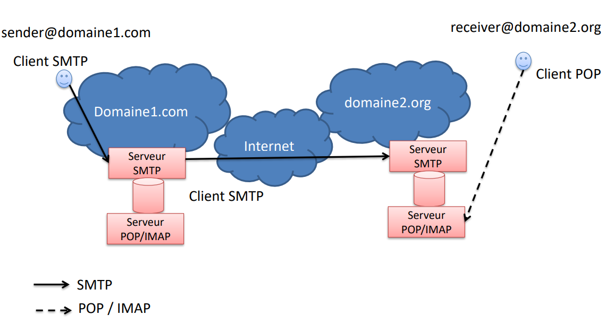

## Le protocole HTTP 

HTTP (Hypertext Transfer Protocol) est un protocole de transfert de différents
formats de données entre serveur et client : texte, images, vidéo, ... 

Le protocole HTTP est basé sur le principe de requête réponse. Le client HTTP
réalise les opérations suivantes : 
+ Établissement d'une connexion TCP vers un serveur identifié par une adresse IP
  et un numéro de port (par défaut 80)
+ Transmission d'une requête sous la forme d'une méthode suivi d'une URI du
  numéro de version, d'indicateur de la nature et du format du document (MIME
  type), des informations sur le client, et éventuellement un corps. 
  
Le serveur répond par une ligne d'état, incluant la version de protocole et un
message de succès ou d'erreur, suivi de méta données (type MIME, taille de la
réponse, ...) et éventuellement le corps de la réponse.

## Le courrier électronique

Les protocoles de messagerie électronique sont répartis en deux catégories :
l'émission (SMTP) et la réception (POP, IMAP).

### Le protocole SMTP 

Le protocole SMTP fonctionne en mode client / serveur avec des requêtes envoyées
par le client auxquelles le serveur doit y répondre. Une **requête** est une
commande texte suivi de l'unicode `<CRLF>`. La **réponse** est un code numérique
sur 3 caractères et un message de description. 

Les différentes requêtes SMTP : 
+ HELO pour s'identifier auprès du serveur SMTP. Depuis avril 2001 la commande
  HELO doit être remplacée par la commande EHLO
+ MAIL FROM est l'adresse de l'émetteur du message 
+ RCPT TO est l'adresse du destinataire
+ DATA est le corps du message et les fichiers attachés codés en ASCII 7 bits
+ QUIT termine la session en cours

### Le protocole POP3 

Le protocole POP permet de récupérer un courrier sur un serveur POP. Les emails
sont généralement reçus hors connexion et sont enregistrés sur le système de
fichier du serveur POP. La version la plus utilisée est POP3. 

Le protocole POP fonctionne ne mode client / serveur avec des requêtes envoyées
par le client auxquelles le serveur doit y répondre.

Les différentes commandes POP3 : 

+ USER identifiant : pour s'authentifier. Elle doit être suivie du nom de
  l'utlisateur, c'est à dire une chaîne de caractères identifiant l'utilisateur
  sur le serveur. 
+ PASS mot\_de\_passe : permet d'indiquer le mot de passe de l'utilisateur
  identifiant 
+ STAT : information sur les messages contenus sur le serveur 
+ RETR : Numéro du message à récupérer 
+ DELE : Numéro de message à supprimer
