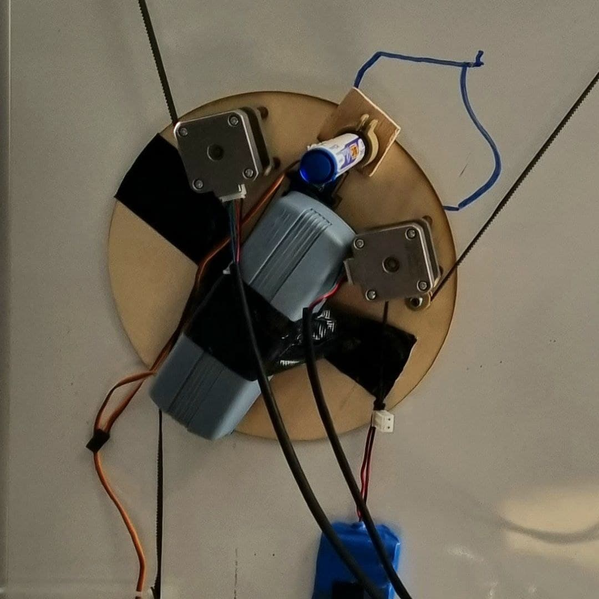
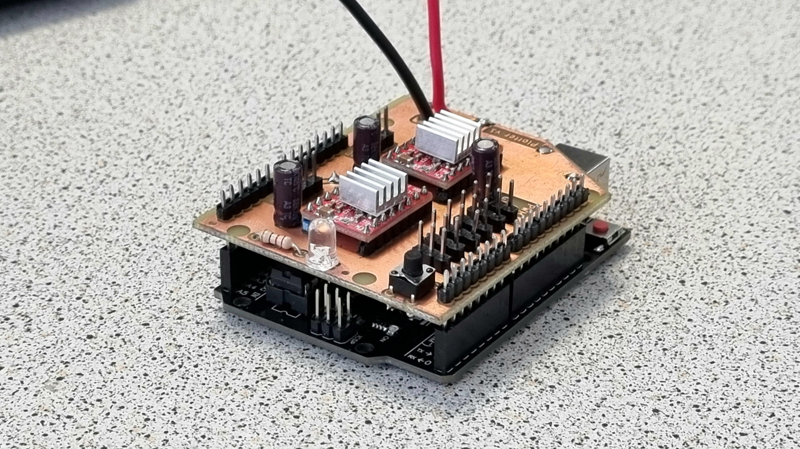
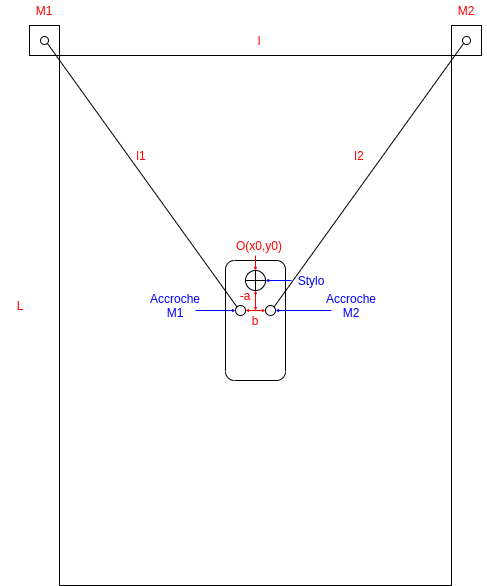
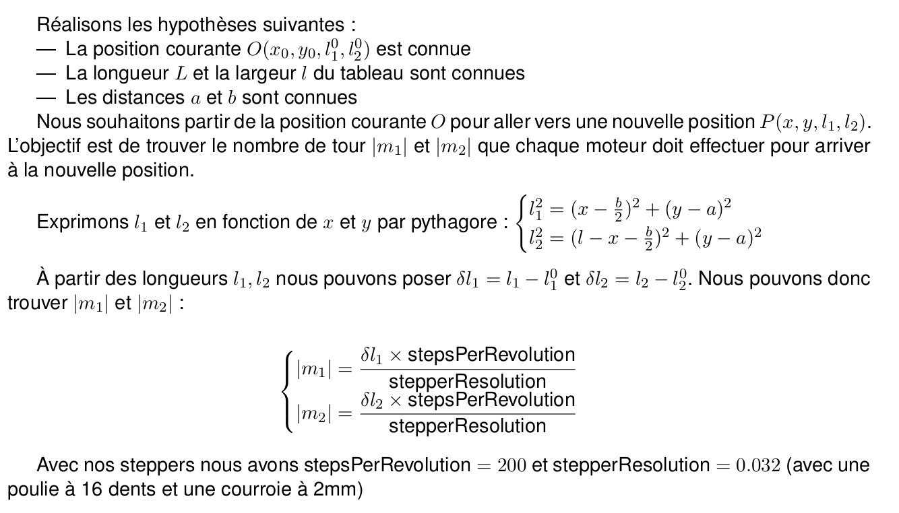
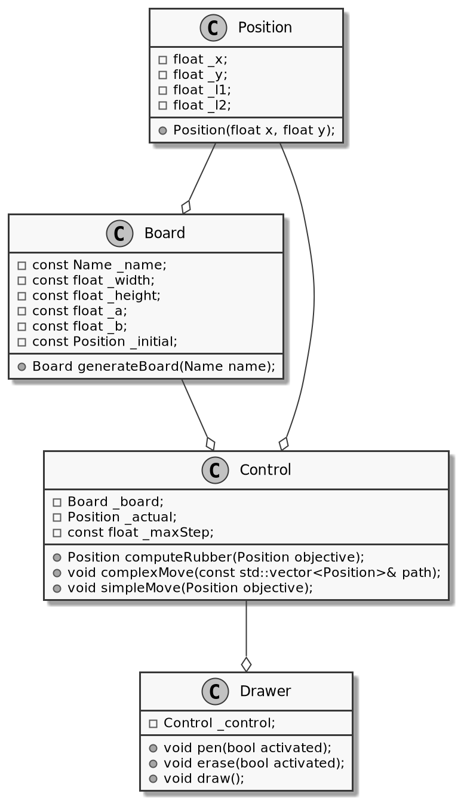

# 1. Présentation du projet

Un plotter est un mécanisme d'impression permettant d'effectuer des tracés sur un support à partir d'un fichier (.svg par exemple). L'objectif de ce projet est de réaliser un plotter vertical sur l'un des tableaux blancs d'EirLab permettant de dessiner et d'effacer ses dessins en boucle.

[Slides de présentation du projet](http://www.eirlab.fr/tiki-download_file.php?fileId=285&display=y)

[Slides de présentation de mi-parcours](http://www.eirlab.fr/tiki-download_file.php?fileId=287&display=y)

[Slides de présentation de fin de projet](http://www.eirlab.fr/tiki-download_file.php?fileId=350&display=y)

## État de l'art

Des centaines de projets de plotter existent sur thingiverse / instructables ... Nous pouvons citer parmi les différents projets deux qui ont retenu notre attention et qui nous ont permis de nous familiariser avec les différentes technologies pouvant être utilisées pour réaliser un plotter vertical :

1. [Thingiverse](https://www.thingiverse.com/thing:2349232)
2. [Instructable](https://www.instructables.com/ARDUINO-POLAR-V-PLOTTER/)

## Matériel nécessaire

* Arduino board (uno )
* Motor driver controller ([A4988](https://components101.com/modules/a4988-stepper-motor-driver-module#:~:text=The%20A4988%20is%20a%20complete,%2C%20and%20sixteenth%2Dstep%20modes))
* Steppers ([42SHD0034-20B](https://www.geeetech.com/hybrid-stepper-motor-42shd003420b-for-3d-printer-p-1011.html|42SHD0034-20B)) x2
* Pulley 16 teeth x2
* Mini Servo Motor MG90S x1
* Rubber Belt (2mm)
* Stylo tableau

# 2. Mécanique

Pour la mécanique du projet nous avons opté pour deux versions. Nous nous sommes rendus compte que la première possédait des défauts intrinsèques qui rendaient son utilisation impossible, nous avons donc changé complètement la mécanique à mi-projet pour une version moins esthétique mais fonctionnelle.

## Première version : centralisation

Jusqu'à la moitié du projet, nous avons cherché à centraliser toute l'électronique dans le cœur de la machine. Nous voulions que le shield, les steppers, et les mécanismes de levé du stylo ou de la brosse se trouvent au même endroit, dans la partie mobile. L'idée était de n'avoir qu'un câble d'alimentation apparent en mettant tous les composants électroniques au centre.

Nous avons donc commencé par modéliser notre plotter en 3D, sur Solidworks.

Une fois le modèle réalisé, nous avons imprimé les pièces 3d complexes (la pièce serrant le stylo en place et les roues pour la courroie en caoutchouc) et découpé les autres pièces à la laser.

Entre temps, l'électronique avait bien avancé et nous pouvions lancer nos premiers tests. Voici une vidéo d'un des tests réalisé sur la version 1 de notre plotter :

[Vidéo de démonstration](http://www.eirlab.fr/tiki-download_file.php?fileId=329&display=y)

On se rend compte que le centre de gravité de la partie mobile est bien trop en arrière ce qui fait pencher considérablement notre tête et empêche le stylo d'écrire.

On a réfléchi aux solutions qui se présentaient à nous.

* Descendre les steppers n'allait pas résoudre notre problème, juste changer l'angle d'inclinaison. Mais pas suffisamment pour que la pointe du stylo touche le tableau.
* Utiliser des câbles pouvoir les plaquer plus facilement contre le tableau comme le montre une des [vidéo](https://youtu.be/QYwWyuI_DsA?t=109) review de Scribit, un vertical plotter commercialisé. Nous avions des craintes concernant la précision des déplacements avec l'utilisation des câbles. Un tour de stepper de correspond pas à la même longueur de câble tirée si on a un axe vide ou si le câble a déjà une trentaine de tours enroulés.
* Refaire totalement la mécanique et enlever les steppers du cœur de la machine. C'est la solution pour laquelle nous avons opté.

## La deuxième

Nous avons enlevé les steppers du coeur de la machine mais aussi le shield. Nous n'avons donc que les mécanismes de lever de stylo et de brosse qui restent au centre du plotter.

Voici le nouveau modèle 3d : [video](http://www.eirlab.fr/tiki-download_file.php?fileId=323&display=y)

Une fois les pièces imprimées et découpées, nous avons fait l'assemblage et avons bien observé que notre problème de centre de gravité n'apparaissait plus.

Voici une liste des différents avantages et inconvénients de ce nouveau modèle :

### Avantages:

- Pas de bascule à cause d'un poids trop important
- Plus esthétique avec un cœur en forme du logo d'Eirlab

### Inconvénients :

- Une partie de l'élec se trouve hors du cœur, il y a donc des câbles qui vont se balader.

Nous avons ensuite rajouté un petit boîtier pour intégrer la carte Arduino.

Les différents fichiers permettant de reproduire la mécanique du projet sont disponible [ici](https://github.com/Sdelpeuch/MakerPlotter) (utilisation d'une découpeuse laser et d'une imprimante 3D)

# 3. Électronique

Notre projet implique le contrôle de différents modules à différentes tensions. Nous devons principalement contrôler les deux steppers qui permettent de faire bouger notre module sur le tableau. Ces steppers sont contrôlés par deux drivers ([A4988](https://components101.com/modules/a4988-stepper-motor-driver-module#:~:text=The%20A4988%20is%20a%20complete,%2C%20and%20sixteenth%2Dstep%20modes)). Chaque driver nécessite une entrée 5V, une masse, deux connexions avec des pins "DIGITAL" de l'arduino (pour contrôler la direction et le nombre de pas). Chaque driver nécessite de plus une alimentation comprise entre 8V et 12V pour alimenter les steppers.

De plus pour monter / descendre le stylo et la brosse, nous allons utiliser des servo moteurs, il est donc nécessaire d'avoir plusieurs sorties 5V, GND et PWM pour contrôler ces derniers.

Pour éviter l'utilisation abusive de dupont partant de l'arduino nous avons opté pour la création d'un shield sur mesure. Ce shield comprend 6 sorties pour servo moteurs (5V + GND + PWM). Des emplacements pour les drivers ainsi que des connecteurs mâles pour accueillir les connecteurs des steppers. Nous avons rajouté une led et un bouton au cas où.

Concernant l'alimentatslion de l'ensemble se fera via le shield grâce à un transformateur 220V vers 9V. Sur la photo ci dessous, le connecteur n'est pas installé sur la photo.

---
### __===NE JAMAIS BRANCHER LE PORT USB ET L'ALIMENTATION VIA LE SHIELD EN MÊME TEMPS===__
---
Lorsque l'on alimente une Arduino par l'extérieur (utilisation du pin Vin) le régulateur de tension s'assure que l'arduino n'est pas alimentée en plus de 5V. Cela nous permet d'alimenter en 10V l'ensemble tout en sachant que l'arduino sera alimentée en 5V. Si l'arduino est alimentée à la fois via son port USB type B et par son pin Vin le régulateur de tension assure le fonctionnement.

Cependant, nous n’utilisons pas une arduino uno mais une copie (Joy-it R3DIP). Le régulateur de tension n'est pas le même que sur arduino uno. Ainsi si la carte est alimentée à la fois par le shield et par son port USB type B, le régulateur de tension n'assurera plus la régulation à 5V sur la carte et celle-ci sera parcourue par une tension égale à Vin (soit 10V dans notre cas, ce qui a pour effet de rendre hors service l'ATMEGA)

L'alimentation se fait via la shield grâce à un transformateur que nous avons trouvé à Eirlab, ce dernier se branche sur une prise conventionnelle et délivre du courant 12V en sortie.

Les éléments pour reproduire le shield sont disponibles
[ici](http://www.eirlab.fr/tiki-download_file.php?fileId=290)

# 4. Logiciel

## 4.1. Mathématiques

Pour réussir à dessiner la première étape est de trouver les équations mathématiques permettant de convertir un déplacement en un nombre de tour pour le moteur. Pour ce faire commençons par définir le problème.

## 4.2 Programme

Maintenant que nous avons à notre disposition tous les éléments physiques et mathématiques permettant de mettre en place le vertical plotter nous allons nous attarder sur la réalisation du contrôle et du logiciel permettant de dessiner.

Pour réaliser le logiciel nous utilisons le langage C++, le logiciel se décompose en 3 parties. D'une part la définition d'un tableau (classe __board__), le contrôle de "bas niveau" (classe __control
__) c'est à dire la transformation entre un ordre de déplacement et un nombre de tour à appliquer aux moteurs. Enfin nous avons le contrôle "haut niveau" (classe __drawer
__) permettant de transformer un dessin en une succession de mouvement. Une classe __position
__ a été mise en place pour simplifier les manipulations mathématiques sur les couples (x,y). Ce découpage est résumé dans le diagramme de classe suivant. Le diagramme ne représente pas les constructeurs et destructeurs ni les accesseurs et mutateurs.

La classe __board__ définit physiquement un tableau principalement par sa taille et la position initiale du module sur le tableau (classiquement au centre). Les champs ___a__ et ___b
__ sont des artéfacts de la première version mécanique, il convient de les mettre à 0 dorénavant. Les tableaux d'eirlab sont préprogrammés, il suffit d'utiliser la méthode __generateBoard(Little)
__ pour obtenir un objet de classe tableau correspondant l'un des petits tableaux d'Eirlab.

La classe __control__ met en œuvre les équations mathématiques vues en 4.1 elle est composée de deux fonctions principales : __simpleMove(Position objective)
__ qui permet de réaliser un déplacement unitaire. Et __complexMove
__ qui permet de réaliser une chemin (c'est à dire une succession de point qui seront transformé en succession de déplacement unitaire par interpolation)

La classe __drawer__  est la classe qui permet de transformer un dessin en une succession de chemin tout en prenant en compte les moments où il faut relever et baisser le stylo.

Concrètement le fonctionnement est relativement simple, un fichier (**aDraw.cpp
**) décrit un dessin, ce dessin est composé de plusieurs tableaux de chemin. Chaque tableau de chemin va être analysé par la classe Drawer qui va le décomposer en chemin et demander à la classe Control de l'analyser. La classe Control va décomposer ce chemin en succession de position et utiliser la fonction simpleMove pour comparer la position actuelle et la position objectif et ainsi se déplacer. Entre chaque chemin le stylo est levé et rebaissé au début du nouveau chemin.

C'est trois classes permettent de contrôler le tableau mais n'ont pas vocation à être utilisée directement par l'utilisateur.

## 4.3 Principale difficulté : la mémoire

Maintenant que nous pouvons contrôler le module physique comme l'on veut nous
allons chercher à transformer une image en succession de chemin c'est à dire en
un tableau de tableau de points. Pour réaliser cela nous utilisons [ce site](https://shinao.github.io/PathToPoints/) qui transforme une image vectorielle en un tableau de points.

Cependant étant donné que nous travaillons sur un arduino uno nous avons 32 Ko de mémoire Flash et 2 Ko de mémoire SRAM autrement dit nous ne pouvons pas stocker une grande quantité de points (en allocation uniquement automatique nous étions limité à 200 points par dessin). Pour nous affranchir de cette contrainte nous allouons dynamiquement les tableaux de points et nous les désallouons au fur et à mesure. Pour éviter à l'utilisateur de devoir transformer un tableau (en format python) en une allocation dynamique de tableau en C++ un script python permet de générer du code C++ à partir d'un fichier .txt contenant le tableau de position.

Le script permet de simplifier la vie de l'utilisateur (il a juste à remplir un .txt) et nous permet de faire des dessins plus grands, nous pouvons avoir une infinité de chemin comportant chacun au maximum 50 points.

## 4.4 Tutoriel pour dessiner une image

0. Récupérer les sources de notre projet disponible [ici](https://github.com/Sdelpeuch/MakerPlotter)
1. Commencer par choisir une image au format svg, les meilleurs résultats sont obtenus avec des images polygonales (low poly)
2. Téléverser l'image sur [ce site](https://shinao.github.io/PathToPoints/|ce site) choisissez "Point every x length" et cliquez sur "Apply" : le nombre de path est illimité mais chaque path doit avoir moins de 50 points
3. Le site génère alors un tableau de point, récupérer le tableau qui s'affiche dans "AllPath"
4. Copier ce tableau dans le fichier "drawing.txt" disponible dans le dossier src/ de notre projet
5. Lancer la commande python3 coordinate_to_cpp.py
6. Brancher le cable usb à l'arduino (__EN DÉBRANCHANT L'ALIMENTATION__) et réalisez la commande make upload depuis la racine du projet
7. Débrancher le cable usb, rebrancher l'alimentation et regardez.

# Membres du projet

* Delpeuch Sébastien
* Pringalle Antoine
* [FormationsEirlab](/FormationsEirlab.pdf)
