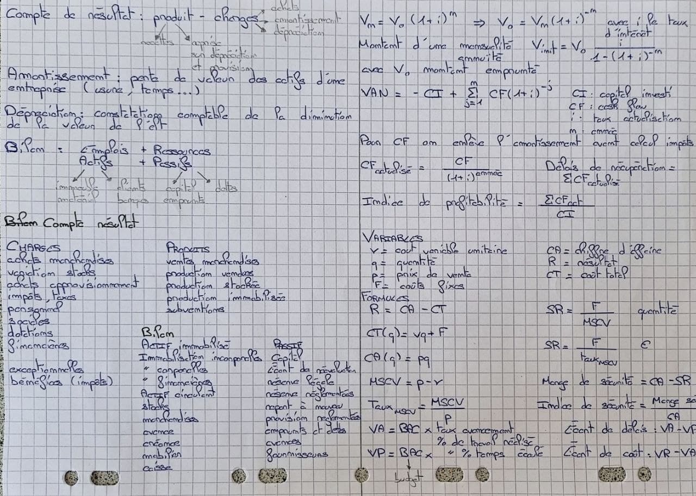
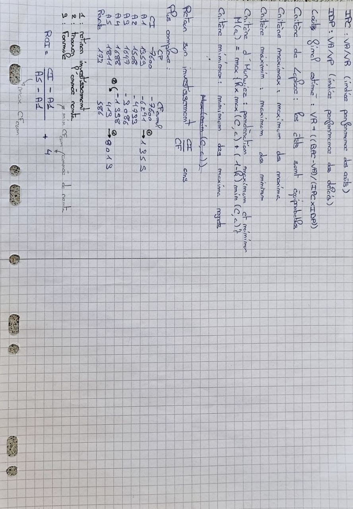

## Ressources pédagogiques

### Cours 1 : Le système d'organisation comptable

+ [Diaporama du
  cours](https://moodle.bordeaux-inp.fr/pluginfile.php/17367/course/section/4412/COURS%201%20LE%20SYSTE%CC%80ME%20DORGANISATION%20COMPTABLE.pdf?time=1614244473916)
+ [Applications du
  cours](https://moodle.bordeaux-inp.fr/pluginfile.php/17367/course/section/4412/document%20eleves%20COURS%201.pdf?time=1614003284193)
+ [Correction du cas
  2](https://moodle.bordeaux-inp.fr/mod/resource/view.php?id=53055)
+ [Correction du cas
  3](https://moodle.bordeaux-inp.fr/mod/resource/view.php?id=53059)

### Cours 2 : Faire le choix de valider le démarage d'un projet

+ [Diaporama du
  cours](https://moodle.bordeaux-inp.fr/pluginfile.php/17367/course/section/20024/COURS%202%20FAIRE%20LE%20CHOIX%20DE%20VALIDER%20LE%20DE%CC%81MARRAGE%20DUN%20PROJET.pdf)
+ [Applications du
  cours](https://moodle.bordeaux-inp.fr/pluginfile.php/17367/course/section/20024/document%20eleves%20COURS%202%202021.pdf)
+ [Correction du cas 1-7, 9, 11,
  12](https://moodle.bordeaux-inp.fr/mod/resource/view.php?id=82614)
+ [Correction du cas
  7](https://moodle.bordeaux-inp.fr/mod/resource/view.php?id=83215)

### Cours 3 : La rentabilité d'exploitation des projets

+ [Diaporama du
  cours](https://moodle.bordeaux-inp.fr/pluginfile.php/17367/course/section/20455/cours%203%20LA%20RENTABILITE%CC%81%20DEXPLOITTION%20DES%20PROJETS.pdf)
+ [Applications du
  cours](https://moodle.bordeaux-inp.fr/pluginfile.php/17367/course/section/20455/document%20e%CC%81le%CC%80ve%20COURS%203.pdf)
+ [Correction du cas 2](https://moodle.bordeaux-inp.fr/mod/resource/view.php?id=83611)
+ [Correction du cas 6](https://moodle.bordeaux-inp.fr/mod/resource/view.php?id=83976)
+ [Correction du cas
  8](https://moodle.bordeaux-inp.fr/mod/resource/view.php?id=83977)

### Cours 4 : Prise de décision et contrôle

+ [Diaporama du
  cours](https://moodle.bordeaux-inp.fr/pluginfile.php/17367/course/section/20540/Cours%204%20Le%20pilotage%20e%CC%81conomique%20des%20projets.pdf?time=1617096195978)
+ [Applications du cours](https://moodle.bordeaux-inp.fr/pluginfile.php/17367/course/section/20540/document%20eleves%20COURS%204%20moodle.pdf)
+ [Correction du cas 2](https://moodle.bordeaux-inp.fr/mod/resource/view.php?id=56126)
+ [Correction du cas 3](https://moodle.bordeaux-inp.fr/mod/resource/view.php?id=85902)
+ [Correction du cas 5](https://moodle.bordeaux-inp.fr/mod/resource/view.php?id=56319)
+ [Correction du cas 6](https://moodle.bordeaux-inp.fr/mod/resource/view.php?id=56327)

<!-- ## Formulaire utile  -->

<!-- $V_n = V_0 (1 + i)^n$ donc $V_0 = V_n(1+i)^{-n}$ où $i$ représente le taux -->
<!-- d'intérêt et $n$ le nombre d'année. -->

<!-- $V_0 = V_{init} \times \dfrac{1-(1-i)^{-n}}{i}$ : emprunt banque avec $V_0$ le -->
<!-- montant empreinté et $V_{init}$ le montant d'une mensualité ou annuité.  -->

<!-- Donc $V_{init} = V_0 \dfrac{i}{1-(1+i)^{-n}}$ : le montant d'une mensualité ou -->
<!-- annuité -->

<!-- TIR (Taux interne de rentabilité) -> VAN = 0  -->

<!-- VAN (Valeur actuelle nette) = $- CI + \sum \limits_{j=1}^n CF(1+i)^{-j}$ où CI -->
<!-- est le capital investi et CF le cashflow  -->

<!-- Pour le calcul du CF on enlève l'amortissement avant le calcul des impôts et on -->
<!-- le rajoute après !  -->

<!-- $CF_{actualise} = \dfrac{CF}{(1+i)^{annee}}$  -->

<!-- Délais de récupération = somme CF actualisé -->

<!-- Indice de profitabilité = $\dfrac{\sum CF_{actualise}}{CI}$ -->

<!-- Soit les variables suivantes :  -->
<!-- + $v$ = cout variable unitaire  -->
<!-- + $q$ = quantité  -->
<!-- + $p$ = prix de vente  -->
<!-- + $F$ = coûts fixes -->
<!-- + $CA$ = chiffre d'affaire -->
<!-- + $R$ = résultat -->
<!-- + $CI$ = coût total -->

<!-- $R = CA - CT$  -->

<!-- $CT(q) = vq + F$ -->

<!-- $CA(q) = pq$ -->

<!-- $SR = \dfrac{F}{MSCV_{unit}}$ en quantité  -->

<!-- $SR = \dfrac{F}{Taux_{MSCV}}$ en euros  -->

<!-- $MSCV = p - v$ -->

<!-- $Taux_{MSCV} = \dfrac{MSCV}{p}$  -->

<!-- Marge de sécurité = $CA-SR$  -->

<!-- Indice de sécurité = $\dfrac{\text{Marge de sécurité}}{CA}$ -->

<!-- Valeur acquise : $VA = BAC \times \text{Taux d'avancement}$ % de travail réalisé  -->

<!-- Valeur planifié : $VP = BAC \times \text{Taux d'avancement}$ % de temps écoulé  -->

<!-- Écart de délais : $VA-VP$ (>0 en avance, <0 en retard) -->

<!-- Écart de coût : $VR-VA$ -->

<!-- IPC (indice de performance des coûts) : $VA / VR$ -->

<!-- IDP (indice de performance des délais) : $VA / VP$ -->

<!-- Coût final estimé : $VR + ((BAC - VA) / (IPC \times IDP))$  -->

<!-- ## Quelques définitions  -->

<!-- Fournir le compte de résultat c'est à dire **produit - charges** -->

<!-- Les produits sont réalisés par l'entreprise et ne donnent pas lieu à -->
<!-- restitution. Les produits sont des sources **d'enrichissement** et peuvent -->
<!-- prendre la forme de recette ou de reprise sur dépréciation et provision. -->

<!-- Les charges sont les consommations correspondant à un appauvrissement de l'entreprise. Elles peuvent prendre la -->
<!-- forme de dépense (achats de matériel par exemple), d'un amortissement -->
<!-- (constatation comptable et annuelle de la perte de valeur des actifs d'une -->
<!-- entreprise subie du fait de l'usure, du temps ou de l'obsolescence), d'une -->
<!-- dépréciation (constatation comptable de la diminution de la valeur de l'élément) -->
<!-- ou d'une provision pour risques et charges. -->

<!-- Les emplois et ressources sont regroupés dans le bilan. -->

<!-- Les emplois subsistent dans l'entreprise et sur lesquels elle a un droit de -->
<!-- propriété (immeubles, matériels) ou de créance (client, disponibilités en caisse -->
<!-- ou en banque etc). Ces emplois sont aussi dénommés "actifs". -->

<!-- Les ressources sont procurées à l'entreprise ou laissées à sa disposition sur -->
<!-- décision et acceptation d'un tiers. Elles sont restituées à un terme plus ou -->
<!-- moins lointain (capital, emprints, dettes fournisseurs, etc). Ces ressources -->
<!-- sont également dénommées "passifs" -->

<!-- ### Cours 1 : le système d'organisation comptable -->

<!-- #### Les obligations comptables et fiscales de l'entreprise  -->

<!-- + Enregistrement chronologique des faits économiques (achats, ventes) -->
<!-- + Contrôler l'existence de la valeur des lééments actifs et passifs par un -->
<!--   inventaire au moins tous les 12 mois -->
<!-- + Établir les comptes annuels (bilan, compte de résultat, annexes) -->
<!-- + Application de la règle de la comptabilité d'engagement  -->
<!-- + Principes de Régularité - sincérité - image fidèle  -->

<!-- #### Synoptique du système d'organisation comptable  -->

<!--  
 -->
<!--  -->
<!-- 
 -->

<!-- #### Nature des engagements  -->

<!-- Fournir le compte de résultat c'est à dire **produit - charges**  -->

<!-- Les produits sont réalisés par l'entreprise et ne donnent pas lieu à -->
<!-- restitution. Les produits sont des sources **d'enrichissement** et peuvent -->
<!-- prendre la forme de recette ou de reprise sur dépréciation et provision. -->

<!-- Les charges sont les consommations correspondant à un appauvrissement de l'entreprise. Elles peuvent prendre la -->
<!-- forme de dépense (achats de matériel par exemple), d'un amortissement -->
<!-- (constatation comptable et annuelle de la perte de valeur des actifs d'une -->
<!-- entreprise subie du fait de l'usure, du temps ou de l'obsolescence), d'une -->
<!-- dépréciation (constatation comptable de la diminution de la valeur de l'élément) -->
<!-- ou d'une provision pour risques et charges. -->

<!-- Les emplois et ressources sont regroupés dans le bilan.  -->

<!-- Les emplois subsistent dans l'entreprise et sur lesquels elle a un droit de -->
<!-- propriété (immeubles, matériels) ou de créance (client, disponibilités en caisse -->
<!-- ou en banque etc). Ces emplois sont aussi dénommés "actifs".  -->

<!-- Les ressources sont procurées à l'entreprise ou laissées à sa disposition sur -->
<!-- décision et acceptation d'un tiers. Elles sont restituées à un terme plus ou -->
<!-- moins lointain (capital, emprints, dettes fournisseurs, etc). Ces ressources -->
<!-- sont également dénommées "passifs" -->

<!-- ### Cours 2 : faire le choix de valider le démarage d'un projet  -->

<!-- Un projet est un ensemble finalisé d’activités et d’actions entreprises -->
<!-- dans le but de répondre à un besoin défini dans des délais fixés et dans la -->
<!-- limite d’une enveloppe budgétaire allouée. -->

<!-- La comptabilité future d'un projet doit se faire avec une neutralisation du -->
<!-- temps écoulé entre la dépense et la recette. C'est le principe de l'**actualisation**. -->

<!-- **Cash Flows prévisionnels d'un projet** : flux de liquidités prévisionnels -->
<!-- (flux de trésorerie) attendus par le projets : **encaissement + décaissements** -->

<!-- **Valeur actuelle nette** = somme des cash flows actualisés retiré des -->
<!-- investissement (prix d'achat + frais accessoires + besoin en fonds de roulement -->
<!-- (ie somme nécessaire que l'entreprise doit posséder pour payer ses charges -->
<!-- courantes en attendant de recevoir le paiement dû par ses clients)). -->

<!-- **TIR*** est le taux interne de rentabilité c'est à dire le taux pour lequel la -->
<!-- VAN du projet est égale à zéro (on choisi le projet qui a le TIR le plus élevé). -->

<!-- **Ip** = cash-flows actualisés / capital investi est l'indice de profitabilité : c'est une mesure du taux de rendement du -->
<!-- capital investi -->

<!-- **Délai de récupération du capital investi** : délai pour que les cash-flows -->
<!-- actualisés couvrent le capital investi (ROI) -->

<!-- **Le critère de Laplace** : selon ce critère, les états de a nature sont -->
<!-- équiprobables -->

<!-- **Le critère maximax** (maximum des maxima) : cette décision, qui néglige le -->
<!-- risque, consiste à choisir celle susceptible, de rapporter le gain maximum. -->

<!-- **Le critère maximin** (maximum des minima) : critère plutôt pessimiste -->

<!-- **Le critère d'hurwicz** : la maximum et le minimum sont pondérés par un -->
<!-- coefficient d'optimisme du décideur -->

<!-- **Le critère minimax** (minimum des maxima regret) : la décision prise sera -->
<!-- celle dont le regret par rapport à l'état réel de la nature est le plus faible. -->

<!-- ### Cours 3 : La rentabilité d'exploitation des projets  -->

<!-- Un coût est une quantification monétaire de la consommation de ressource -->
<!-- encourue pour un objet de coût. Le coût d'un objet de coût est la somme des prix -->
<!-- unitaire d'un facteur fi de production et hors production multiplié par la -->
<!-- quantité de f_i nécessaire à la production et à la vente.  -->

<!-- Le cout total ou cout de revient se -->

<!-- ### Cours 4 : Prise de décision et contrôle  -->
