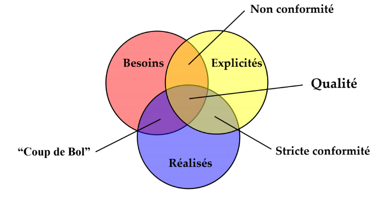
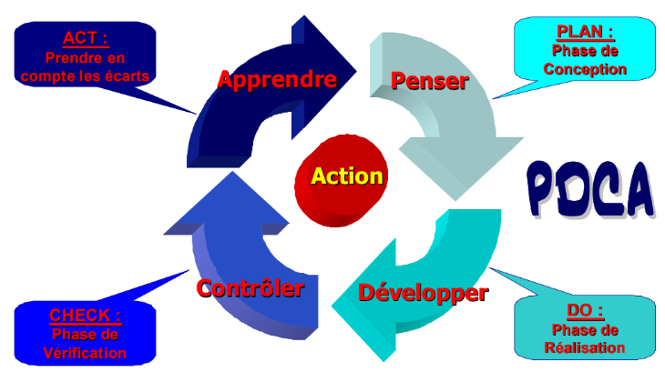
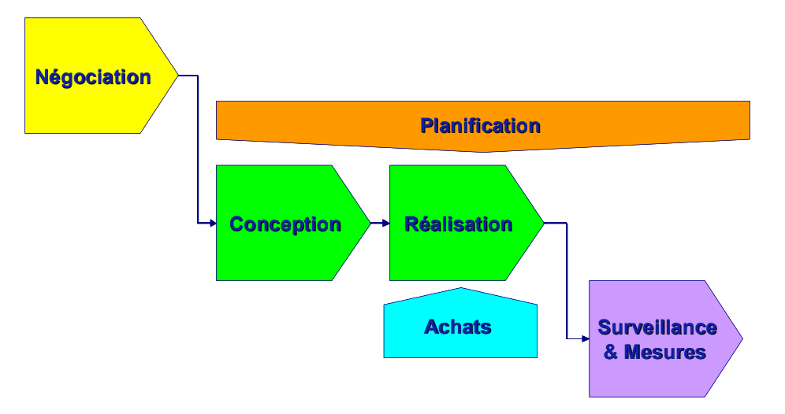
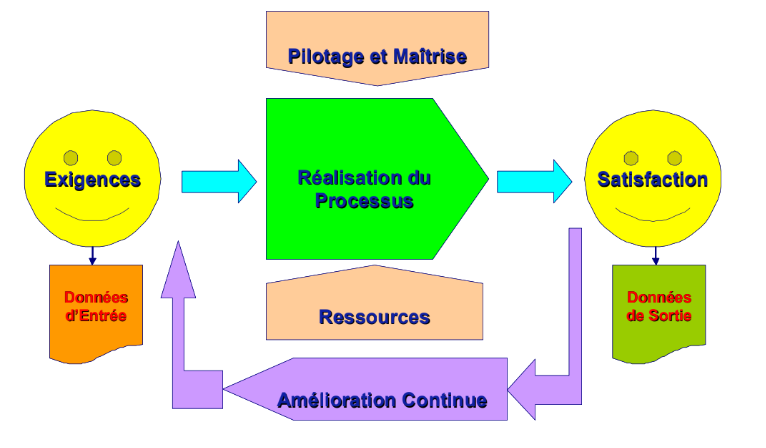

## Définition de la qualité 

La qualité est une notion vaste et floue, quel que soit le domaine abordé, la
**qualité** est une **notion subjective et relative**. **La qualité exprime le
degré de satisfaction du client** lié à une transaction. Tendre vers une
transaction de qualité c'est vouloir atteindre le degré de satisfaction maximal.
La **démarche qualité** vise à **mettre en oeuvre les dispositions** qui
permettent d'**atteindre** la **satisfaction du client**. 

### Fondements : principes de base de qualité la démarche 

"**Fournir un produit qui satisfera le client et permettre ainsi de pérenniser
l'activté de l'entité**"

Comment construire une démarche qualité ? En s'appuyant sur quelques règles
simples : 

1. **Capitaliser les acquis et l'expérience** : cette notion se traduit par la
   formalisation écrite des méthodes et des procédés de travail. Cette phase
   conduit à la rédaction de "procédures". Aujourd'hui, la démarche qualité
   s'est orientée vers les notions d'utilité et d'**efficacité**. La combinaison
   des deux concepts entraîne donc une **gestion maîtrisée** des procédures

2. **Optimiser les dispositions** permettant la réalisation du produit ou de la
   prestation : pour ce faire, les entreprises sont amenées à mieux connaître
   les rouages de leur organisation en les découpant sous forme de
   "**processus**", c'est à dire des fonctions élémentaires nécessaires à la
   constitution du produit.

3. **Avoir la volonté de s'améliorer en permanence** dans tous les domaines

Fort de ces principes, la démarche qualité peut entreprendre d'améliorer le
fonctionnement de l'entité. Une reconnaissance de l'efficacité de cette démarche
sera obtenue par l'obtention de la certification **ISO 9001**. L'un des outils
fondamental préconisé par l'ISO 9001 est le PDCA 
   

- Phase de conception : Idée de conception + Étude de marché + Élaboration d'une
recette et choix des ingrédients + Visuel + Rentabilité + Publicité + Tests du
plat
- Phase de réalisation : Infrastructure, logistique, stockage + Livraison + Main
d'oeuvre + Hygiène + Fabrication 
- Phase de vérification : Vérification du gout + Vérification des normes
d'hygiènes + Coûts + Écoute des consommateurs + Tests sur la chaîne de
fabrication
- Phase d'apprentissage : tests consommateurs pour améliorer le produits

### Synthèse des principaux Termes et Définitions utilisés dans une démarche Qualité 

+ **Qualité** : Aptitude d'un esmelbe de caractéristiques intrinsèques à
  satisfaire des exigens 
+ **Management de la qualité** : activités coordonnées permettant d'orienter et
  de contrôler un organisme en matière de qualité 
+ **Système de Management de la qualité** : système de management permettant
  d'orienter et de contrôler un organisme en matière de qualité 
+ **Processus** : ensemble d'activités corrélées ou interacties qui transforme
  des éléments d'entrée en éléments de sortie
+ **Procédure** : manière spécifiée d'accomplir une activité ou un processus 
+ **Produit** : résultat d'un processus 
+ **Client** : organisme ou personne qui reçoit un produit 
+ **Satisfaction client** : perception du client sur le niveau de satisfaction
  de ses exigences 
+ **Exigence** : besoin ou attente formulés, habituellement implicites, ou
  imposées 
+ **Vérification** : confirmation par des preuves tangibles que les exigences
  spécifiées pour une utilisation spécifique ou une application prévues ont été
  satisfaites 
+ **Document** : support d'information et l'information qu'il contient
+ **Non conformité** : non satisfaction d'une exigence 
+ **Action corrective** : action entreprise pour éliminer la cause d'une
  non-conformité détectée ou d'une autre situation indésirable 
+ **Action préventive** : action entreprise pour éliminer la cause d'une
  non-conformité potentielle ou d'une autre situation potentiellement
  indésirable 

## Management de la qualité

Historiquement la qualité découlait du **contrôle**, de la **maîtrise** et
d'**assurance**. La démarche qualité porte actuellement l'accent sur les
dispositions de **management** de l'organisation. L'ISO 9001 définit des
exigences relatives au **système de management de la qualité**. 

+ La satisfaction du client
+ L'implication de la hiérarchie
+ La maîtrise de la documentation 
+ L'amélioration continue 

La mise en application de ces principes va permettre d'obtenir l'évolution des
ocmportements et de la culture. Ces modifications seront définies et inspirées
par la **politique qualité** et les **objectifs qualité** afférents. 

## Norme ISO 9001

La reconnaissance de la valeur d'un système de management de la qualité est
obtenue par le biais de sa certification selon le référentiel constitué par la
**norme ISO 9001**

### ISO 9001 : un modèle d'efficacité

La norme ISO 9001 définit un ensemble de dispositions et de règles minimales qui
doivent être mises en place par l'organisation pour prétendre au certificat. Ces
dispositions sont censées conduire l'organisme vers l'efficacité de ses
pratiques. 

Durée de certification : **3 ans** 

### 8 principes fondamentaux 

+ Orientation client : comprendre ses besoins présents et futurs
+ Leadership : établir la finalité et les orientations de l'organisme 
+ Implication du personnel : essece de l'organisme, sa totale implication est
  requise 
+ Approche processus : la plus efficace pour gérer activités et ressources 
+ Management par approche système : contribue à l'efficacité de l'organisme 
+ Amélioration continue : objectif permanent de l'organisme 
+ approche factuelle des décisions : pour atteindre plus d'efficacité 
+ Relation mutuellement bénéfiques avec les fournisseurs 

### 8 chapitres

+ 0 Introduction : met l'accent sur les bénéfices attendus de l'approche
  Processus 
+ 1-2-3 : évoquent des généralités sans exigences particulières
+ 4 exigences générales : notamment celle concernant la maitrise de la
  documentation 
+ 5 responsabilité de la direction : engagement de la direction, écoute client,
  politique et objectifs qualité, responsabilité en communication, revue de
  direction 
+ 6 gestion des ressources : humains et infrasturctures, environnement de
  travail 
+ 7 réalisation du produit : différents phases attendues de la réalisation et
  des achats qui peuvent être synthetisées par le schéma suivant
  

+ 8 mesures, analyses et amélioration : surveillance et mesures, maîtrise du
  produit non-conforme, analyse de données et amélioration continue 
  
## Approche Processus 

Selon la norme ISO 9001, cette méthode de management est censée apporter les
bénéfices suivants et permettre 

+ de comprendre et de satisfaire les exigences 
+ de considérer les processus en termes de valeur ajoutée 
+ de mesurer la performance et l'efficacité des processus
+ d'améliorer en permanence des processus sur la base de mesures objectives 

Établir les processus essentiels revient à réaliser une "analyse fonctionnelle"
de l'entreprise : quelles fonctions doit-on remplir pour transformer les donnes
d'entrée en données de sortie, pour convertir les besoins du client en
prestation ? La définition des processus essentiels de l'organisme conduit
généralement à l'élaboration d'une "cartographie" des processus. Plus que la
position relative des processus, la cartographie permet de mettre en évidence
les interfaces, qui sont, comme l'expérience nous l'a appris, les principales
sources de dysfonctionnement dans l'organisation. 

Ne pas oublier que cette représentation doit concourir à l'efficacité du
management et ne pas être réservée au seul but de la certification ! 

## Amélioration continue 

Sous ce terme générique, la démarche qualité englobe l'ensmelbe des actions qui
permettent le progrès du management et des performances, principalement : 
+ le traitement des Non Conformités 
+ le traitement des réclamations clients
+ les actions correctives et les actions préventives 
+ les résultats d'audits 
+ et tout autre initiative

Au fil des évolutions de la qualité, la lutte contre les dysfonctionnements est
restée un dénominateur commun pour toutes les démarches formalisées. elle a été
à l'origine de nombreuses méthodes de résolution de problèmes. Dan un premier
temps, les problèmes techniques (les plus visibles) ont été abordés avec des
méthodes techniques s'appuyant sur des calculs statistiques : le diagramme
d'Ishikawa ("en arête de poisson"), le diagramme de Paretto (règle des 80/20),
les 5M (Matière, Matériel, Main d'oeuvre, Méthodes, Milieu). Puis les principaux
problèmes techniques ayant été généralement résolus, les problèmes
d'organisation et de méthodologie du travail sont alors devenus prééminents. des
méthodes, dites de 2e génération, ont été développées pour résoudre ce type de
problèmes : diagramme d'affinités (KJ), diagramme des relations, maîtrise
statistique des processus ... Cependant, la méthodologie (dérivée du PDCA) est
imposée par la Norme : 
1. Analyser les causes du problèmes
2. Mettre en oeuvre l'Action résultante
3. Vérifier l'efficacité de l'action entreprise 
4. Évaluer les possibilités d'extension de cette action à d'autres domaines et
   capitaliser l'expérience acquise
   
Aujourd'hui, les possibilités d'apparition des problèmes sont évaluées en amont
dans la conduite des projets par la mise en place de plus en plus fréquente de
méthodes d'analyse des risques. Citons la plus connue : l'AMDEC, analyse des
modes de défaillance, de leurs effets et de leur créditiste.

## Qualité - Sécurité - Environnement : des démarches parallèles

D'ailleurs, les normes ISO 14001 et OSHAS 18001 ont été établies en reprennant
le schéma de construction de la Norme ISO 9001. A ce titre, on peut apprécier le
parallèle de ces textes sur les tableaux comparatifs fournis en annexe de chacun
de ces normes. On retrouve pratiquement les mêmes exigences d'engagement de la
Direction, de gestion documentaire, de mise à disposition des ressources et de
traitement des actions d'amélioration au sein de ces 3 normes . 

Seule la finalité du système de management diffère : 
+ ISO 9001 management de la qualité 
+ ISO 14001 management de l'environnement ISO 18001 management de la sécurité au
  travail 
+ ISO 18001 management de la sécurité au travail. 
