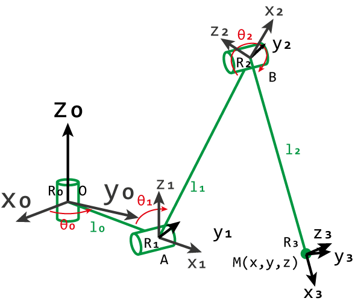
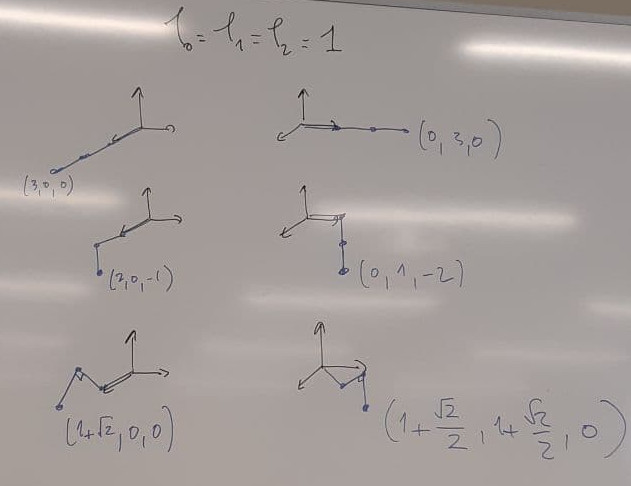

## Définition du problème

On cherche à trouver le modèle direct ie l'expression de $(x,y,z)$ en fonction
de $(\theta_0, \theta_1, \theta_2)$ (modèle direct) puis l'expression de $(\theta_0, \theta_1,
\theta_2)$ en fonction de $(x,y,z)$ (modèle inverse). Nous définissons le repère
$\mathcal{R}$ centré sur la première articulation de la patte (repère 0).

#### Rappel sur la matrice de rotation

En 2D autour de 0 : $rot_{(0,\theta)} = \begin{pmatrix} \cos{\theta} & - \sin{\theta} \\\\
\sin{\theta} & \cos{\theta} \end{pmatrix}$

En 3D autour de 0 : $rot_{(0, (O,z), \theta)} =
\begin{pmatrix}
\cos(\theta) & -\sin(\theta) & 0 \\\\
\sin(\theta) & \cos(\theta) & 0 \\\\
0 & 0 & 1 \\\\
\end{pmatrix}$

## Modèle Direct

Soit la matrice $A$ correspondant à l'origine du repère 1, $A = \begin{pmatrix}
l_0 \times \cos{\theta_0} \\\\ l_0 \times \sin{\theta_0} \\\\ 0 & \end{pmatrix}_\mathcal{R}$

Soit la matrice $B$ correspondant à l'origine du repère 2, $B = \begin{pmatrix}
l_1 \cos{(\pi - \theta_1 )} \\\\ 0 \\\\ l_1 \sin{(\pi - \theta_1)}\end{pmatrix}_{\mathcal{R}_1}$ on a donc

$$
\begin{align*}
rot_{\theta_0, \mathcal{O}_z} &\cdot B_{\mathcal{R}_1} + A_2 \\\\
\begin{pmatrix} \cos{\theta} & -\sin{\theta} & 0 \\\\
\sin{\theta} & \cos{\theta} \\\\
0 & 0 & 1 \end{pmatrix} &\cdot \begin{pmatrix}
l_1 \cos{(\pi - \theta_1)} \\\\
0 \\\\
l_1 \sin{(\pi - \theta_1)}
\end{pmatrix} + \begin{pmatrix} l_0 \cos{\theta_0} \\\\ l_0 \sin{\theta_0} \\\\
0 \end{pmatrix}
\end{align*}
$$

Soit $M$ le point au bout de la patte, nous pouvons donc caractériser $\vec{BM}
= \begin{pmatrix} l_2 \cos{(\pi - \theta_2)} \\\\ 0 \\\\ l_2 \sin{(\pi -
\theta_2)} \end{pmatrix}_{\mathcal{R}_2}$

Au final on a $(x,y,z) = r_{\mathcal{O}_z, \theta_0} \cdot r_{(0,y),
\pi-\theta_1} \cdot \vec{BM}_{\mathcal{R}_2} + B_{\mathcal{R}_0}$

## Modèle Inverse

$$
\theta_0 = \tan^{-1}{(\dfrac{y}{x})}
$$

$$
\begin{align}
\theta_1 &= \tan^{-1}(\dfrac{-z}{\sqrt{x^2+y^2}-l_1^2})\\\\ &-
\cos^{-1}(\dfrac{l_1^2 -
l_2^2 - (z^2 + (\sqrt{x^2+y^2} - l_0^2)^2)}{2 l_1 \sqrt{z^2 +
(\sqrt{x^2+y^2}-l_0)^2}})\\\\
&+\pi
\end{align}
$$

$$
\begin{align*}
\theta_2 &= 2 \pi - \cos^{-1}{(\dfrac{-AM^2+BM^2+AB^2}{2 \times BM \times AB})} \\\\
\theta_2 &= 2 \pi - \cos^{-1}{(\dfrac{-z^2-(\sqrt{x^2+y^2} -l_0)^2+l_2^2+l_1^2}{2 l_1 l_2})}
\end{align*}
$$

## Quelques exemples

2. [Projet](./img/projetRobotique.zip)
